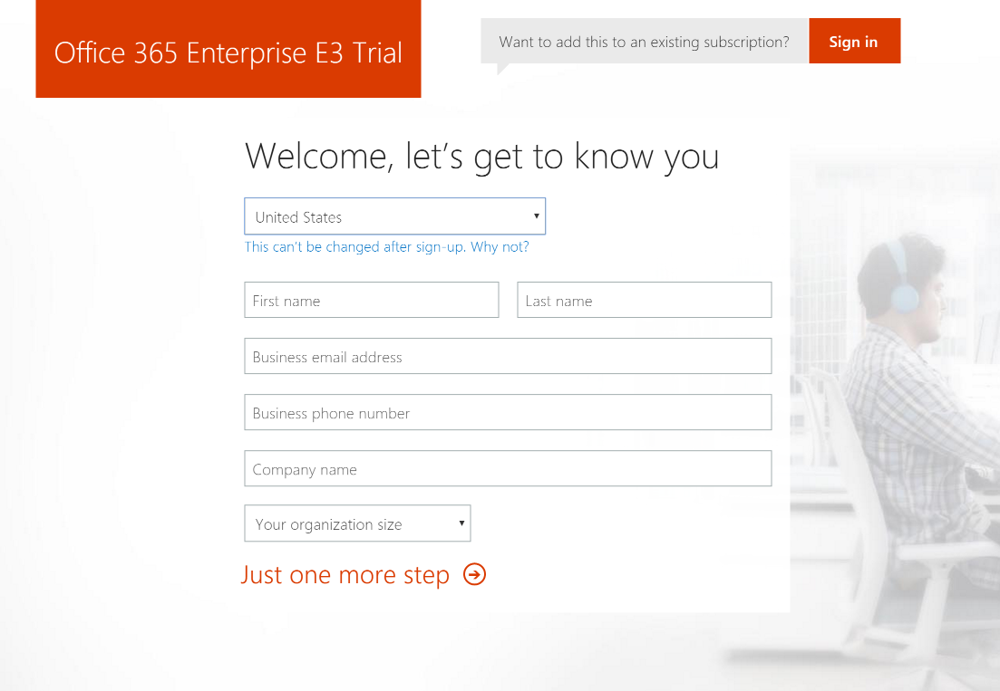
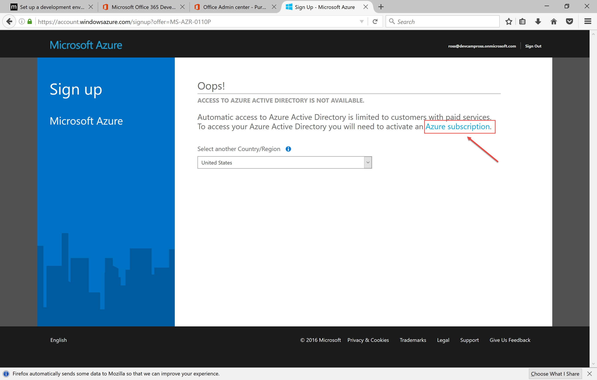

# Developer Environment (Java)

## Overview
In this lab, you will XXX.

## Objectives
In this hands-on lab, you will set up an Office365 developer subscription, and Azure trial subscription, and an Azure-based virutal machine for the development environment for subsequent labs in the DevCamp.  To expedite the process, we've prepared Windows and Linux images that you will copy into your own environment, start the virtual machine and connect to it.  You will then configure the components for Azure development.
* Set up an Office365 developer subscription
* Set up an Azure trial subscription
* Configure your Azure subscription for DevCamp
* Create an Azure Virtual Machine for development
* Connect to the Azure Virtual Machine and configure it for development.

## Prerequisites

The source for the starter app is located in the [TODO:ADD REF](#) folder. 

## Exercises
This hands-on-lab has the following exercises:
* Exercise 1: Set up Office 365 Developer subscription
* Exercise 2: Set up Azure trial subscription
* Exercise 3: Configure your Azure subscription for DevCamp
* Exercise 4: Create an Azure Virtual Machine for development
* Exercise 5: Connect to the Azure Virtual Machine and configure it for development

### Exercise 1: Set up Office 365 Developer subscription

1. In your browser, go to `https://products.office.com/en-us/business/office-365-enterprise-e3-business-software` 
and click the link that says "Free Trial", which will take you to this page:

    

1. Enter the information requested, and click `Just one more step` which 
    will take you to the following page:
    
    

1. Choose a userid and a `tenant name` for your trial.  In this case I chose `devcampross`, but you 
    can choose anything you'd like, as long as it is unique.  You'll also have to choose 
    a password, and click `Create my account`.  Next you will see this page, which asks
    for a phone verification:

    

1. After this process is complete, your O365 trial will be set up.  Once that is done, 
    log on to `http://portal.office.com` with the credentials you created earlier. You 
    should see the following screen.  If you'd like to see the welcome tour click `Next`, 
    or simply close the dialog box.   

    

    >Stay on this page until the next exercise.

### Exercise 2: Set up Azure trial subscription

1.  Next, we want to set up an Azure subscription, which
    can be accessed via the Azure Active Directory.  At the bottom of the screen, 
    click `Admin centers`, and then click `Azure AD`. This will open up a new browser tab
    showing this page:

    

1. Click on `Azure subscription`, that will take you to the page for creating a new 
    trial subscription:

    

1. Enter the information about you, and verify your identity by phone.  Also you'll 
    need to verify via credit card.  Your credit card will not be charged unless you
    remove the spending cap from your subscription.

1. Finally after the verification process, you'll have to agree to the terms of the trial
    subscription: 

    

1. it will take a few moments to set up your azure subscription.  

    

1. When the subscription set up process is done, you can click on `Start managing my service`
to open the Azure portal, which will look like this:

    

### Exercise 3: Configure your Azure subscription for DevCamp

Instructions and screenshots here

### Exercise 4: Create an Azure Virtual Machine for development

Instructions and screenshots here

### Exercise 5: Connect to the Azure Virtual Machine and configure it for development
instructions here
 
Instructions and screenshots here
## Summary

In this hands-on lab, you learned how to:
* Set up an Office365 developer subscription
* Set up an Azure trial subscription
* Configure your Azure subscription for DevCamp
* Create an Azure Virtual Machine for development
* Connect to the Azure Virtual Machine and configure it for development.

Copyright 2016 Microsoft Corporation. All rights reserved. Except where otherwise noted, these materials are licensed under the terms of the MIT License. You may use them according to the license as is most appropriate for your project. The terms of this license can be found at https://opensource.org/licenses/MIT.
