# Modern Apps hands on lab (.NET)

## Overview
City Power & Light is a sample application that allows citizens to report "incidents" that have occurred in their community. It includes a landing screen, a dashboard, and a form for reporting new incidents with an optional photo. The application is implemented with several components:
* Front end web application contains the user interface and business logic. This component has been implemented three times in .NET, NodeJS, and Java.
* WebAPI is shared across the front ends and exposes the backend DocumentDB
* DocumentDB is used as the data persistence layer 

In this lab, you will work with an existing API to connect to the web application front end. This will allow you perform CRUD operations for incidents. You will also configure additional Azure features for Redis Cache, Azure Storage Queues, and Azure Blob Storage.
This guide use Visual Studio on Windows as the IDE. You can use [Visual Studio community Edition](https://www.visualstudio.com/post-download-vs/?sku=community&clcid=0x409&downloadrename=true).


## Objectives
In this hands-on-lab, you will learn how to:
* Use Visual Studio to connect to an API
* Provision an Azure Web App to host the Web site
* Modify a view to add caching
* Modify code to add queuing and blob storage


## Prerequisites

* The source for the starter app is located in the [start](start) folder. 
* The finished project is located in the [end](end) folder.
* Deployed the starter ARM Template in HOL 1

## Exercises

This hands-on-lab has the following exercises:
* Exercise 1: Integrate the API
* Exercise 2: Add a caching layer
* Exercise 3: Write images to Azure Blob storage

### Note
> In the hands-on-labs you will be using Visual Studio Solutions. Please do not update the NuGet packages to the latest available, as we have not tested the labs with every potential combination of packages. 

---
## Exercise 1: Integrate the API

1. You should have performed a `git clone` of the DevCamp repository in the previous hands-on lab.  If you did not, please complete the developer workstation setup in that lab.

1. Open the Visual Studio and navigate to the directory `C:\DevCamp\HOL\dotnet\02-modern-cloud-apps\start`

    

1. Open the DevCamp.SLN solution file
1. Build the solution by right-clicking on the DevCamp.WebApp project and choosing `build`:
    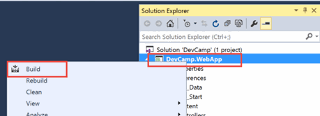

    Then run the solution by typing `F5`.

    Visual Studio should run IIS Express and launch the application. You should see the home page

    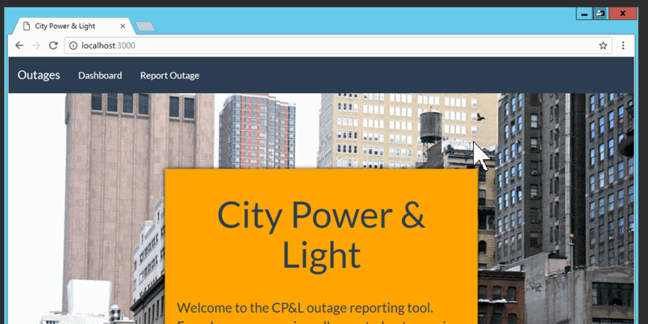

1. Close the browser and stop debugging

1. In the [Azure Portal](https://portal.azure.com) navigate to the resource group that you created with the original ARM template.  Resource Groups can be found on the left hand toolbar -> More Services -> Resource Groups.

    Select the API app that begins with the name **incidentapi** followed by a random string of characters.

    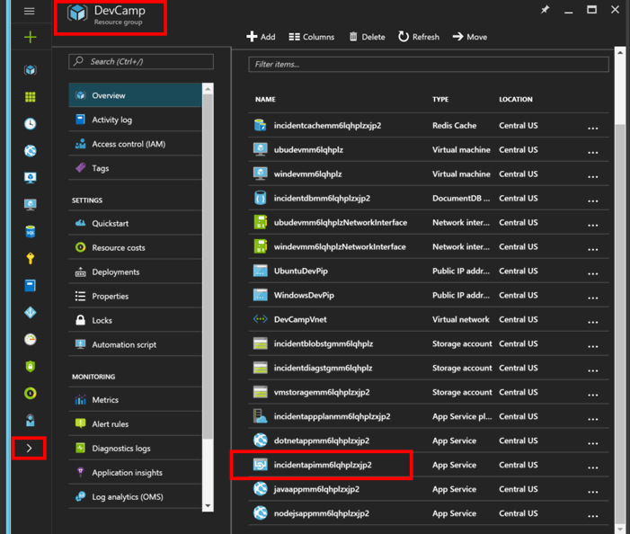

1. The window that slides out is called a **blade** and contains information and configuration options for the resource.  

    On the top toolbar, select **Browse** to open the API in a new browser window.

    

    You should be greeted by the default ASP.NET landing page
    
    

1. Since we provisioned a new instance of DocumentDB, there are no records to use as sample data. To generate sample data, the shared API has a route that can be hit at any time to reset the documents in your collection.  In the browser, add the following to your API URL to generate sample documents.

    >
    > Add `/incidents/sampledata` to the end of your API URL. 
    >
    > The URL should look like the following:
    >  
    > `http://incidentapi[YOUR_RG_NAME].azurewebsites.net/incidents/sampledata`
    >
    >

1. After navigating to the sampledata route, let's verify that the documents were created in DocumentDB. In the Azure Portal, navigate to the Resource Group blade and select the DocumentDB resource.

    

    Select the DocumentDB database. This will open the DocumentDB blade. Scroll to the Collections section.
    
    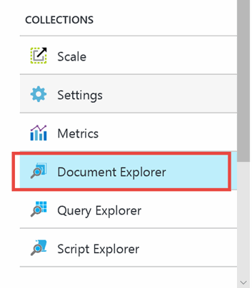

    In the Collections section, select **Document Explorer**.

    

    The Document Explorer is an easy way to view the documents inside of a collection via the browser. Select the first record to see the JSON body of the document.

    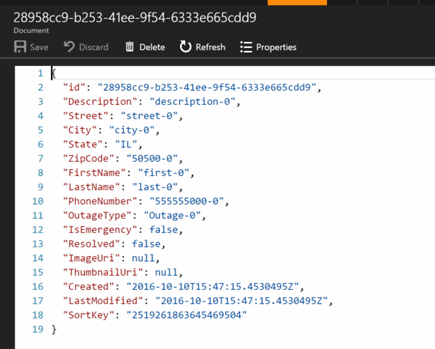

    We can see that several incidents have been created and are now available to the API.

1. Go back to Visual Studio

1. Open the Dashboard view page

    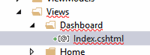

1. On the Dashboard page, notice how the sample incidents are stubbed in between the  `<!--TEMPLATE CODE -->` comment block.   

    

    As part of the original ARM template we deployed an ASP.NET WebAPI that queries a DocumentDB Collection. Let's integrate that API so that the incidents are dynamically pulled from a data store.
1. In Visual Studio, select the code between the `<!--TEMPLATE CODE -->` comment block and delete it.

1. Between the `<!--INSERT VIEW CODE -->` comment block paste the following. This block handles the display of the incident dashboard:

    ```csharp
   <!--VIEW CODE-->
   <div class="row">
        @if (Model.Count > 0)
            {
                foreach (IncidentAPI.Models.Incident item in Model)
                {
                <div class="col-sm-4">
                    <div class="panel panel-default">
                        <div class="panel-heading">Outage: @Html.ActionLink(string.Format("{0}", item.ID), "Details", "Incident", new { ID = item.ID }, new { })</div>
                        <table class="table">
                            <tr>
                                <th>Type</th>
                                <td>@item.OutageType</td>
                            </tr>
                            <tr>
                                <th>Address</th>
                                <td>@item.Street</td>
                            </tr>
                            <tr>
                                <th>Contact</th>
                                <td><a href="tel:@item.PhoneNumber">@string.Format("{0} {1}", item.FirstName, item.LastName)</a></td>
                            </tr>
                            <tr>
                                <th>Reported</th>
                                <td>
                                    @if (item.Created != null)
                                    {
                                        @item.Created.Value.ToString("MM/dd/yyyy, hh:mm");
                                    }
                            </td>
                            </tr>
                        </table>
                    </div>
                </div>
            }
        }
        else
        {
            <div><h2>No incidents reported</h2></div>
        }
    </div>
    <!--VIEW CODE-->
    ```

1. We need to add a reference to the Web API project. Get the URL by navigating to Azure and copying from the settings
    
    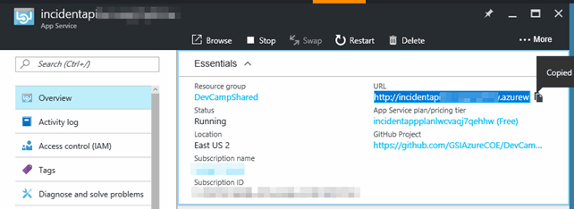

1. Copy the URL of the API app to the clipboard
1. Add the URL to the 'INCIDENT_API_URL' setting in the `web.config`

    ```xml
    <add key="INCIDENT_API_URL" value="PASTE URL HERE" />
    ```

    >the URL should not have a `/` on the end.
1. In Visual Studio, select the project and right-click.

    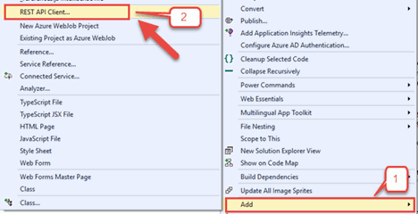

1. Select Add > Rest API client
1. In the Swagger URL field paste the value for the `INCIDENT_API_URL`
1. Append `/swagger/docs/v1` to the URL
1. For the Client Namespace, enter **IncidentAPI** and click OK. This will download the definition for the API and install nuget packages for Microsoft.Rest. It will also create the IncidentAPI client proxy classes and models.

    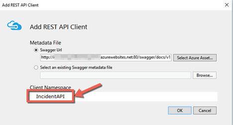

    > DO NOT Update the Nuget package for Microsoft.REST

1. In the Utils folder, open the file called Settings.cs. This will hold our static variables and constants for the application.

1. In the Settings.cs file, paste the following inside the Settings class definition:

    ```csharp
    //####    HOL 2    ######
    public static string INCIDENT_API_URL = ConfigurationManager.AppSettings["INCIDENT_API_URL"];
    public static string AZURE_STORAGE_ACCOUNT = ConfigurationManager.AppSettings["AZURE_STORAGE_ACCOUNT"];
    public static string AZURE_STORAGE_KEY = ConfigurationManager.AppSettings["AZURE_STORAGE_ACCESS_KEY"];
    public static string AZURE_STORAGE_BLOB_CONTAINER = ConfigurationManager.AppSettings["AZURE_STORAGE_BLOB_CONTAINER"];
    public static string AZURE_STORAGE_QUEUE = ConfigurationManager.AppSettings["AZURE_STORAGE_QUEUE"];
    public static string AZURE_STORAGE_CONNECTIONSTRING = String.Format("DefaultEndpointsProtocol=https;AccountName={0};AccountKey={1}", AZURE_STORAGE_ACCOUNT, AZURE_STORAGE_KEY);
    public static string REDISCCACHE_KEY_INCIDENTDATA = "incidentdata";

    public static string REDISCACHE_HOSTNAME = ConfigurationManager.AppSettings["REDISCACHE_HOSTNAME"];
    public static string REDISCACHE_PORT = ConfigurationManager.AppSettings["REDISCACHE_PORT"];
    public static string REDISCACHE_SSLPORT = ConfigurationManager.AppSettings["REDISCACHE_SSLPORT"];
    public static string REDISCACHE_PRIMARY_KEY = ConfigurationManager.AppSettings["REDISCACHE_PRIMARY_KEY"];
    public static string REDISCACHE_CONNECTIONSTRING = $"{REDISCACHE_HOSTNAME}:{REDISCACHE_SSLPORT},password={REDISCACHE_PRIMARY_KEY},abortConnect=false,ssl=true";
    //####    HOL 2   ######
    ```

1. Resolve the reference for `System.Configuration`

    

1. In the `Utils` folder, there is a file named `IncidentApiHelper.cs`. Open this file.

1. Paste the following inside the `IncidentApiHelper` class definition and resolve the reference for `IncidentAPI`.

    ```csharp
    public static IncidentAPIClient GetIncidentAPIClient()
    {
        var client = new IncidentAPIClient(new Uri(Settings.INCIDENT_API_URL));
        return client;
    }
    ```

1. Open the `Controllers/Dashboardcontroller.cs` file

1. Select the current comment block in the Index method and delete it. Also delete the existing return View() code.

1. Paste the following:

    ```csharp
    //##### API DATA HERE #####
    List<Incident> incidents;
    using (var client = IncidentApiHelper.GetIncidentAPIClient())
    {
        var results = await client.Incident.GetAllIncidentsAsync();
        incidents = JsonConvert.DeserializeObject<List<Incident>>(results);
    }
    return View(incidents);
    //##### API DATA HERE #####
    ```

1. Resolve the references for `Newtonsoft.Json, IncidentAPI, IncidentAPI.Models and System.Collections.Generic`. Make sure you have also added the IncidentAPI namespace, as  GetIAllIncidentsAsync() is an extension method which cannot be resolved automatically.

1. Change the method to async. The code should look like the following:

    ```csharp
        using DevCamp.WebApp.Utils;
        using IncidentAPI;
        using IncidentAPI.Models;
        using Newtonsoft.Json;
        using System.Collections.Generic;
        using System.Threading.Tasks;
        using System.Web.Mvc;

        namespace DevCamp.WebApp.Controllers
        {
            public class DashboardController : Controller
            {
                public async Task<ActionResult> Index()
                {
                    //##### API DATA HERE #####
                    List<Incident> incidents;
                    using (var client = IncidentApiHelper.GetIncidentAPIClient())
                    {
                        var results = await client.Incident.GetAllIncidentsAsync();
                        incidents = JsonConvert.DeserializeObject<List<Incident>>(results);
                    }
                    return View(incidents);
                }
            }
        }
    ```

1. Let's add code to view Incidents. Navigate to the `IncidentController.cs` file and open it

1. In between the comment block in the Details method, select the body of this method and delete it.

1. Paste the following:

    ```csharp
        IncidentViewModel incidentView = null;

        using (IncidentAPIClient client = IncidentApiHelper.GetIncidentAPIClient())
        {
            var result = client.Incident.GetById(Id);
            if (!string.IsNullOrEmpty(result))
            {
                Incident incident = JsonConvert.DeserializeObject<Incident>(result);
                incidentView = IncidentMappers.MapIncidentModelToView(incident);
            }
        }

        return View(incidentView);
    ```
1. In the `Mappers` Folder, locate the `IncidentMapper.cs` file. This file will handle the mapping from the data that is returned from the API.

1. Open it and paste the following:
    
    ```csharp
    public class IncidentMappers
    {
        public static Incident MapIncidentViewModel(IncidentViewModel incident)
        {
            Incident newIncident = new Incident();
            newIncident.FirstName = incident.FirstName;
            newIncident.LastName = incident.LastName;
            newIncident.Street = incident.Street;
            newIncident.City = incident.City;
            newIncident.State = incident.State;
            newIncident.ZipCode = incident.ZipCode;
            newIncident.PhoneNumber = incident.PhoneNumber;
            newIncident.Description = incident.Description;
            newIncident.OutageType = incident.OutageType;
            newIncident.IsEmergency = incident.IsEmergency;
            return newIncident;
        }

        public static IncidentViewModel MapIncidentModelToView(Incident incident)
        {
            IncidentViewModel newIncidentView = new IncidentViewModel();
            newIncidentView.Id = incident.ID;
            newIncidentView.FirstName = incident.FirstName;
            newIncidentView.LastName = incident.LastName;
            newIncidentView.Street = incident.Street;
            newIncidentView.City = incident.City;
            newIncidentView.State = incident.State;
            newIncidentView.ZipCode = incident.ZipCode;
            newIncidentView.PhoneNumber = incident.PhoneNumber;
            newIncidentView.Description = incident.Description;
            newIncidentView.OutageType = incident.OutageType;
            newIncidentView.IsEmergency = incident.IsEmergency.Value;
            newIncidentView.Created = incident.Created.Value.UtcDateTime;
            newIncidentView.LastModified = incident.LastModified.Value.UtcDateTime;
            return newIncidentView;
        }
    }
    ```

1. Resolve the references for `DevCamp.WebApp.Mappers, DevCamp.WebApp.Utils, DevCamp.WebApp.ViewModelsIncidentAPI, IncidentAPI.Models and Newtonsoft.Json`.

1. Now let's add code to create an incident. We will add a new `Create` method to the `IncidentController` class that will handle the Create HTTP post method. Add the following code:

    > DO NOT delete the existing `Create` Method. This is the method that handles the default view.

    ```csharp
    [HttpPost]
    public async Task<ActionResult> Create([Bind(Include = "City,Created,Description,FirstName,ImageUri,IsEmergency,LastModified,LastName,OutageType,PhoneNumber,Resolved,State,Street,ZipCode")] IncidentViewModel incident, HttpPostedFileBase imageFile)
    {
        try
        {
            if (ModelState.IsValid)
            {
                Incident incidentToSave = IncidentMappers.MapIncidentViewModel(incident);

                using (IncidentAPIClient client = IncidentApiHelper.GetIncidentAPIClient())
                {
                    var result = client.Incident.CreateIncident(incidentToSave);
                    if (!string.IsNullOrEmpty(result))
                    {
                        incidentToSave = JsonConvert.DeserializeObject<Incident>(result);
                    }
                }

                return RedirectToAction("Index", "Dashboard");
            }
        }
        catch
        {
            return View();
        }

        return View(incident);
    } 
    ```

1. Resolve the references for `system.threading.task and system.web`

1. Build the application and hit F5 to start debugging. On the home page, click on the view dashboard link. You should see a list of the sample incidents you generated in the database.

    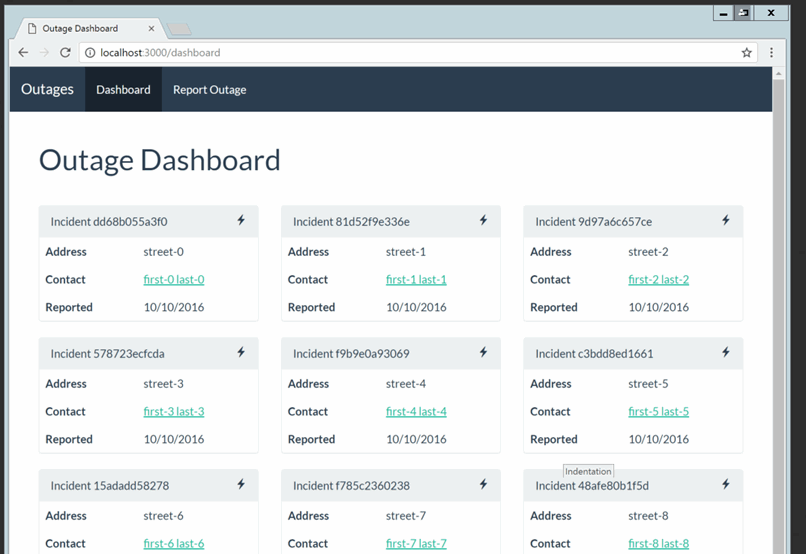

---
## Exercise 2: Add a caching layer
Querying our API is a big step forward, but querying a cache would increase performance and limit the load on our API.  Azure offers a managed (PaaS) service called [Azure Redis Cache](https://azure.microsoft.com/en-us/services/cache/).

We deployed an instance of Azure Redis Cache in the ARM Template, but need to add application logic
* First, check the cache to see if a set of incidents is available
* If not, query the API
* Cache response from API
* Clear the cache when a new incident is created

 First, let's add our Redis information to local environment variables. In the [Azure Portal](https://portal.azure.com) navigate to the Resource Group and select the Redis instance.

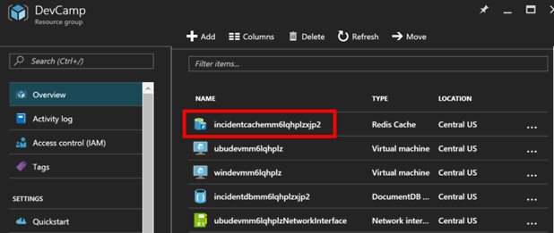

On the Redis blade, note the **Host Name**, then select the **key icon** and note the **Primary Key**.

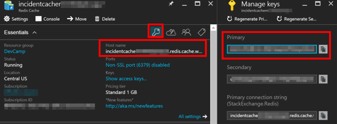

On the Redis blade, expand **Ports* and note the Non-SSL port 6379 and SSL Port of 6380.

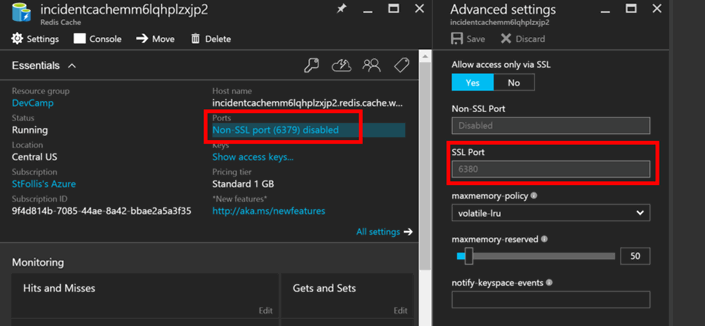

1. In Visual Studio, open `web.config` and locate the four variables for `REDISCACHE_HOSTNAME`, `REDISCACHE_PRIMARY_KEY`, `REDISCACHE_PORT`, and `REDISCACHE_SSLPORT`

    ```xml
    <add key="REDISCACHE_HOSTNAME" value="YOUR VALUE HERE"/>
    <add key="REDISCACHE_PORT" value="YOUR VALUE HERE"/>
    <add key="REDISCACHE_SSLPORT" value="YOUR VALUE HERE"/>
    <add key="REDISCACHE_PRIMARY_KEY" value="YOUR VALUE HERE"/>
    ```

    We will use these variables to configure a Redis client.

1. In Visual Studio, Right click on the project and select Manage Nuget packages

    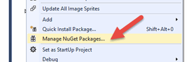

1. Add the Microsoft.Extensions.Caching.Redis package by highlighting the name and selecting install

    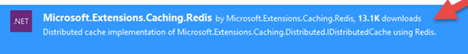

1. Accept the License to complete the install

1. In Azure, navigate to the `dotnet...` web application in your resource group.

    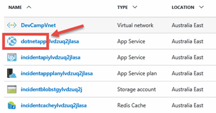

1. Navigate to the application settings

    

1. App Settings Keys have values pre-populated with the values required to consume the Azure services.

    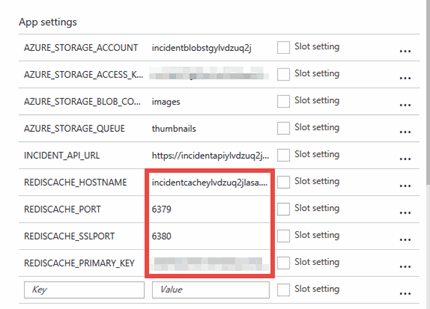

1. In Visual Studio, navigate to the web.config and copy/paste the values from the app settings that match the keys 

    ```xml
    <add key="REDISCACHE_HOSTNAME" value="" />
    <add key="REDISCACHE_PORT" value="" />
    <add key="REDISCACHE_SSLPORT" value="" />
    <add key="REDISCACHE_PRIMARY_KEY" value="" />
    ```

1. In the Utils folder, there is class called `RedisCacheHelper.cs`. Open that file
1. Replace the existing file contents by paste the following:

    ```csharp
    using Newtonsoft.Json;
    using StackExchange.Redis;
    using System;
    using System.Configuration;

    namespace DevCamp.WebApp.Utils
    {
        public class RedisCacheHelper
        {
            private static Lazy<ConnectionMultiplexer> lazyConnection = new Lazy<ConnectionMultiplexer>(() =>
            {
                return ConnectionMultiplexer.Connect(Settings.REDISCACHE_CONNECTIONSTRING);
            });

            static ConnectionMultiplexer CacheConnection
            {
                get
                {
                    return lazyConnection.Value;
                }
            }

            public static string GetDataFromCache(string CacheKey)
            {
                string cachedData = string.Empty;
                IDatabase cache = CacheConnection.GetDatabase();

                cachedData = cache.StringGet(CacheKey);
                return cachedData;
            }

            public static bool UseCachedDataSet(string CacheKey, out string CachedData)
            {
                bool retVal = false;
                CachedData = string.Empty;
                IDatabase cache = CacheConnection.GetDatabase();
                if (cache.Multiplexer.IsConnected)
                {
                    if (cache.KeyExists(CacheKey))
                    {
                        CachedData = GetDataFromCache(CacheKey);
                        retVal = true;
                    }
                }
                return retVal;
            }

            public static void AddtoCache(string CacheKey, object ObjectToCache, int CacheExpiration = 60)
            {
                IDatabase cache = CacheConnection.GetDatabase();
                cache.StringSet(CacheKey, JsonConvert.SerializeObject(ObjectToCache), TimeSpan.FromSeconds(CacheExpiration));
            }

            public static void ClearCache(string CacheKey)
            {
                IDatabase cache = CacheConnection.GetDatabase();
                cache.KeyDelete(CacheKey);
            }
        }
    }
    ````

1. We will now add code to the dashboardcontroller. Open the `dashboardcontroller.cs` file
1. Inside the `using` statement that contains the API call to the client, replace the lines with the following:

    ```csharp
    //##### Add caching here #####
    int CACHE_EXPIRATION_SECONDS = 60;

    //Check Cache
    string cachedData = string.Empty;
    if (RedisCacheHelper.UseCachedDataSet(Settings.REDISCCACHE_KEY_INCIDENTDATA, out cachedData))
    {
        incidents = JsonConvert.DeserializeObject<List<Incident>>(cachedData);
    }
    else
    {
        //If stale refresh
        var results = await client.Incident.GetAllIncidentsAsync();
        incidents = JsonConvert.DeserializeObject<List<Incident>>(results);
        RedisCacheHelper.AddtoCache(Settings.REDISCCACHE_KEY_INCIDENTDATA, incidents, CACHE_EXPIRATION_SECONDS);
    }
    //##### Add caching here #####
    ```
 
1. Set a breakpoint on the declaration of the ***CACHE_EXPIRATION_SECONDS*** variable.
1. Add code to invalidate the cache when a new incident is reported. Open the IncidentController and update the Create method that handles the creation (the method decorated with [HTTPPost]) with the following:

    ```csharp
    //##### CLEAR CACHE ####
    RedisCacheHelper.ClearCache(Settings.REDISCCACHE_KEY_INCIDENTDATA);
    //##### CLEAR CACHE ####

    return RedirectToAction("Index", "Dashboard");
    ``` 
1. Hit F5 to start debugging. Select the dashboard page. You should hit the breakpoint. Hit F10 to step over the call. The cache is empty so it fall to the else condition
1. Hit F5 to continue stepping. The data should be added to the cache
1. Hit refresh in the browser and hit the breakpoint again. This time when you hit F10, you should be getting the data from cache.
1. Create a new incident from the Report Outage page. Enter some details and click `Create`
1. Your new incident should be first in the dashboard.
1. Close the browser and stop debugging

---
## Exercise 3: Write images to Azure Blob Storage

When a new incident is reported, the user can attach a photo.  In this exercise we will process that image and upload it into an Azure Blob Storage Container.

1. To get the necessary values, open the [Azure Portal](https://portal.azrue.com) and open the Resource Group.  Select the Storage Account beginning with `incidentblobstg`.

    > The other storage accounts are used for diagnostics data and virtual machine disks

    

    Select **Access Keys** and note the **key1** for the storage account.

    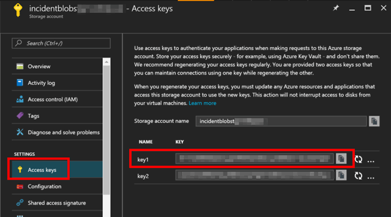

1. Update the web.config with the following values from the Azure storage account:

    ```xml
    <add key="AZURE_STORAGE_ACCOUNT" value="" />
    <add key="AZURE_STORAGE_ACCESS_KEY" value="" />
    <add key="AZURE_STORAGE_BLOB_CONTAINER" value="images" />
    <add key="AZURE_STORAGE_QUEUE" value="thumbnails" />
    ```

1. The web.config appSettings node should now contain the following entries with your values replaced:

    ```xml
    <add key="INCIDENT_API_URL" value=""/>
    <add key="AZURE_STORAGE_ACCOUNT" value=""/>
    <add key="AZURE_STORAGE_ACCESS_KEY" value=""/>
    <add key="AZURE_STORAGE_BLOB_CONTAINER" value="images"/>
    <add key="AZURE_STORAGE_QUEUE" value="thumbnails"/>
    <add key="REDISCACHE_HOSTNAME" value=""/>
    <add key="REDISCACHE_PORT" value=""/>
    <add key="REDISCACHE_SSLPORT" value=""/>
    <add key="REDISCACHE_PRIMARY_KEY" value=""/>
    ```
1. Now that we configured the storage config values, we can add the logic to upload the images. 

1. In Visual Studio, Add the `WindowsAzure.Storage` nuget package to the solution

    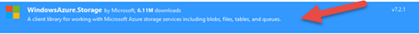

1. Open the `Utils\StorageHelper.cs` file and paste the following:

    ```csharp
    using Microsoft.WindowsAzure.Storage;
    using Microsoft.WindowsAzure.Storage.Blob;
    using Microsoft.WindowsAzure.Storage.Queue;
    using Newtonsoft.Json;
    using Newtonsoft.Json.Linq;
    using System;
    using System.Configuration;
    using System.IO;
    using System.Threading.Tasks;
    using System.Web;

    namespace DevCamp.WebApp.Utils
    {
        public class StorageHelper
        {
            /// <summary>
            /// Adds an incident message to the queue
            /// </summary>
            /// <param name="IncidentId">The incident ID from the service</param>
            /// <param name="ImageFileName">The file name of the image</param>
            /// <returns></returns>
            public static async Task AddMessageToQueue(string IncidentId, string ImageFileName)
            {
                CloudStorageAccount storageAccount = CloudStorageAccount.Parse(Settings.AZURE_STORAGE_CONNECTIONSTRING);
                CloudQueueClient queueClient = storageAccount.CreateCloudQueueClient();
                CloudQueue msgQ = queueClient.GetQueueReference(Settings.AZURE_STORAGE_QUEUE);
                msgQ.CreateIfNotExists();

                JObject qMsgJson = new JObject();
                qMsgJson.Add("IncidentId", IncidentId);
                qMsgJson.Add("BlobContainerName", Settings.AZURE_STORAGE_BLOB_CONTAINER);
                qMsgJson.Add("BlobName", getIncidentBlobFilename(IncidentId, ImageFileName));

                var qMsgPayload = JsonConvert.SerializeObject(qMsgJson);
                CloudQueueMessage qMsg = new CloudQueueMessage(qMsgPayload);

                await msgQ.AddMessageAsync(qMsg);
            }

            /// <summary>
            /// Uploads a blob to the configured storage account
            /// </summary>
            /// <param name="IncidentId">The IncidentId the image is associated with</param>
            /// <param name="imageFile">The File</param>
            /// <returns>The Url to the blob</returns>
            public static async Task<string> UploadFileToBlobStorage(string IncidentId, HttpPostedFileBase imageFile)
            {
                string imgUri = string.Empty;

                try
                {
                    CloudStorageAccount storageAccount = CloudStorageAccount.Parse(Settings.AZURE_STORAGE_CONNECTIONSTRING);

                    CloudBlobClient blobClient = storageAccount.CreateCloudBlobClient();
                    CloudBlobContainer container = blobClient.GetContainerReference(Settings.AZURE_STORAGE_BLOB_CONTAINER);
                    container.CreateIfNotExists();
                    container.SetPermissions(new BlobContainerPermissions { PublicAccess = BlobContainerPublicAccessType.Blob });

                    CloudBlockBlob imgBlob = container.GetBlockBlobReference(getIncidentBlobFilename(IncidentId, imageFile.FileName));
                    imgBlob.Properties.ContentType = imageFile.ContentType;
                    await imgBlob.UploadFromStreamAsync(imageFile.InputStream);

                    var uriBuilder = new UriBuilder(imgBlob.Uri);
                    uriBuilder.Scheme = "https";
                    imgUri = uriBuilder.ToString();
                }
                catch (Exception ex)
                {
                    throw new HttpUnhandledException($"Unable to upload image for incident {IncidentId} to blob storage. Error:: ${ex.ToString()}");
                }
                return imgUri;
            }

            private static string getIncidentBlobFilename(string IncidentId, string FileName)
            {
                string fileExt = Path.GetExtension(FileName);
                //Remove the starting . if exists
                if (fileExt.StartsWith("."))
                {
                    fileExt.TrimStart(new char[] { '.' });
                }
                return $"{IncidentId}{fileExt}";
            }
        }
    }
    ```

1. In the `IncidentController.cs` file, add the following inside the `Create` method, after clearing the cache, to process the image file.

    ```csharp
    //Now upload the file if there is one
    if (imageFile != null && imageFile.ContentLength > 0)
    {
        //### Add Blob Upload code here #####
        //Give the image a unique name based on the incident id
        var imageUrl = await StorageHelper.UploadFileToBlobStorage(incidentToSave.ID, imageFile);
        //### Add Blob Upload code here #####


        //### Add Queue code here #####
        //Add a message to the queue to process this image
        await StorageHelper.AddMessageToQueue(incidentToSave.ID, imageFile.FileName);
        //### Add Queue code here #####

    }
    ```

1. Save the files and hit F5 to debug.
1. Add a new incident with a picture and it will get uploaded to Azure storage.
1. Close the browser and stop debugging.
1. Open the Azure Storage Explorer, connect it to your storage account and verify that your image and a queue entry were uploaded to Azure storage.

---
## Summary

In this hands-on lab, you learned how to:
* Use Visual Studio to connect to an API
* Provision an Azure Web App to host the Web site
* Modify a view to add caching
* Modify code to add queuing and blob storage

Copyright 2016 Microsoft Corporation. All rights reserved. Except where otherwise noted, these materials are licensed under the terms of the MIT License. You may use them according to the license as is most appropriate for your project. The terms of this license can be found at https://opensource.org/licenses/MIT.
