# DevOps with Visual Studio Team Services (.NET)

## Overview
In this lab, you will create a Visual Studio Team Services online account, check in your code, create a Continuous Integration pipeline, and test your cloud-based application.

## Objectives
In this hands-on lab, you will learn how to:
* Create a Visual Studio Team Services online account
* Create a VSTS Git repository
* Add your code to the VSTS Git repository
* Create a Continuous Integration pipeline

## Prerequisites

* The source for the starter app is located in the [start](start) folder. 
* There will be no code changes required so the the [end](end) folder will remain empty. 
* Deployed the starter ARM Template [HOL 1](../developer-environment)
* Completion of the [azuread-ofice365](../azuread-ofice365)  

> Note: If you did not complete the previous labs, the project in the start folder is cumulative.

## Exercises
This hands-on-lab has the following exercises:
* Exercise 1: Create VSTS online account 
* Exercise 2: Create VSTS Git repository
* Exercise 3: Add application to VSTS Git
* Exercise 4: Create a Continuous Integration pipeline
* Exercise 5: Deploy code to an Azure Web App

----
## Exercise 1: Create VSTS online account

1. In your browser, navigate to [https://www.visualstudio.com/]()

    

1. Click `Get started for free`


1. Log in with your Azure AD account 

----
## Exercise 2: Create VSTS Git repository

VSTS gives us the option to use Git or [TFVC](https://www.visualstudio.com/en-us/docs/tfvc/overview) as our project's repository.  For this exercise we will use Git, and then clone the repository to our dev machine. 

> Note that if you acquired these lab materials via a `git clone` of the workshop repo then you should select a folder somewhere else on your dev machine. This will minimize conflicts between the two separate repositories 

1. Starting at your account's landing page, locate the section entitled **Recent projects & teams** and click **New**.

    

1. Enter a project name such as **DevCamp**, ensure **Version Control** is set to **Git** and then click **Create Project**.

    

1. Wait for the project to be created. This process may take up to 60 seconds. When finished select the **Navigate to Project** button

    

1. Exit out of the Congratulations window and explore your pre-built dashboard. Familiarize yourself with the variety of widgets available, and the customization options. 

    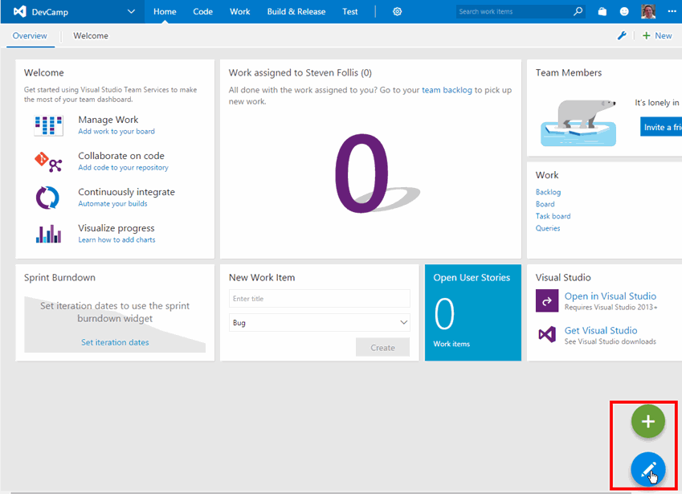

You have now created a project in VSTS with a Git repository, and cloned the repository locally to your developer machine.  Next we'll upload code from our machine to VSTS.

----
## Exercise 3: Add application to VSTS Git ##

1. Click **Code** on the top toolbar to navigate to the Code screen.  Then click the **Clone in Visual Studio** button.

    > **Note** if you are using Chrome, you may receive a pop-up message. The Clone in Visual Studio option uses a custom protocol handler to open in the client. Select `Launch Application`.

    

1. Create a local folder outside of the GIT folder you have been using for the other HOLS. In the example below, the folder was created as `DevCampVSO`

     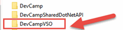

1. Open Windows Explorer and copy the files from the `start` folder into the folder you created above.

      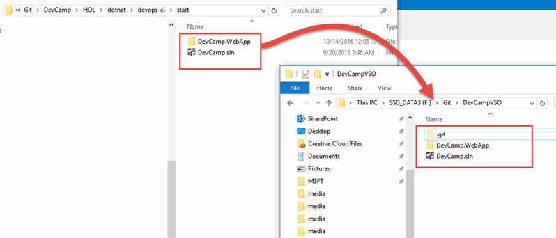

1. Open the solution file in Visual Studio.

1. Ensure the web.config settings are set to the values for your application.

    ```xml
    <!--HOL 2-->
    <add key="INCIDENT_API_URL" value="API URL" />
    <add key="AZURE_STORAGE_ACCOUNT" value="STORAGEACCOUNT" />
    <add key="AZURE_STORAGE_ACCESS_KEY" value="STORAGEKEY" />
    <add key="AZURE_STORAGE_BLOB_CONTAINER" value="images" />
    <add key="AZURE_STORAGE_QUEUE" value="thumbnails" />
    <add key="REDISCACHE_HOSTNAME" value="" />
    <add key="REDISCACHE_PORT" value="6379" />
    <add key="REDISCACHE_SSLPORT" value="6380" />
    <add key="REDISCACHE_PRIMARY_KEY" value="" />
    <!--HOL 3-->
    <add key="AAD_APP_ID" value="" />
    <add key="AAD_APP_SECRET" value="" />
    <add key="AAD_APP_REDIRECTURI" value="" />
    <add key="AAD_INSTANCE" value="https://login.microsoftonline.com/{0}/{1}" />
    <add key="AAD_AUTHORITY" value="https://login.microsoftonline.com/common/" />
    <add key="AAD_LOGOUT_AUTHORITY" value="https://login.microsoftonline.com/common/oauth2/logout?post_logout_redirect_uri=" />
    <add key="AAD_GRAPH_SCOPES" value="openid email profile offline_access Mail.ReadWrite Mail.Send User.Read User.ReadBasic.All" />
    <add key="GRAPH_API_URL" value="https://graph.microsoft.com" />
    ```
1. On the Team Explorer tab, select the `Changes` view and click on Changes

    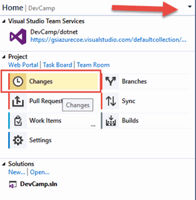

1. In the changes view, you will see a list of changes that are ready to commit to the local repository.

    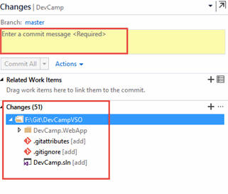

1. Right click on the top level folder and select `Stage`

    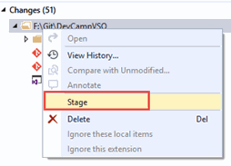

1. Enter a comment for the check-in and click `Commit Staged`

    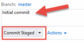

1. Because Git is a distributed source control system, the changes we commit are not visible to anyone else. Making our changes visible will require that we ***synchronize*** the repositories. This is process is both a Git Pull (to receive changes from the remote repo to your local repo) and Git Push to send changes from the local repository. We will perform a sync to pull the changes and push our changes.

     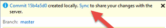

1. On the next screen, we will push our changes to the server. Since this is the first checkin, there are no incoming commits. 

     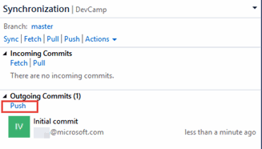

1. Navigate to Visual Studio Team Services and view the files.

     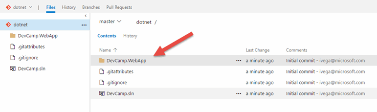

----
## Exercise 4: Create a Continuous Integration pipeline ##

With application code now uploaded to VSTS, we can begin to create builds via a Build Definition.  Navigate to the **Build** tab from he top navigation.  We will use the hosted agent within VSTS to process our builds in this exercise.

1. From the **Build & Release** tab, create a new **Build Definition**

    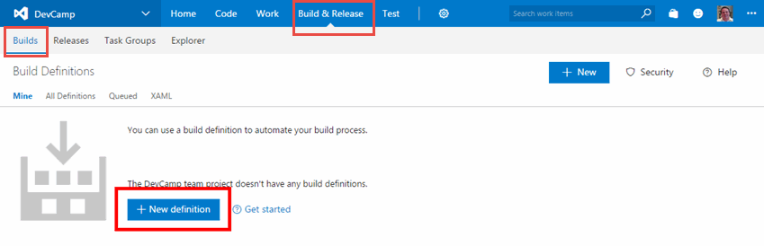

1. There are prebuilt definitions for a variety of programming languages and application stacks. For this exercise select **Visual Studio** and click **Next**

    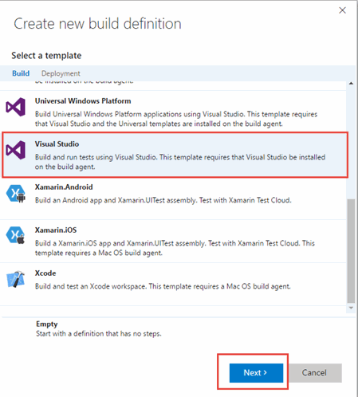

1. Confirm the Repository Source is set to your VSTS Project, that the repository is set the repo that was earlier created, and that the Agent Queue is set to **Hosted**.  

1. Check the box next to **Continuous Integration** to automatically run this build anytime code is checked into the repository.

    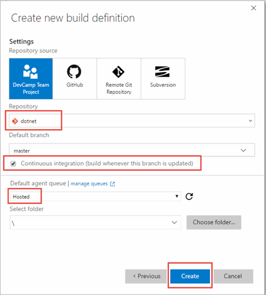

1. The build tasks are created for us as part of the template. Navigate to the ***Build Solution*** step.

    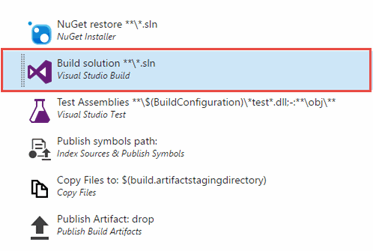

1. Add the following in the ***MSBuild Arguments*** text box to create a web deployment package as part of the build:

    ```xml
    /p:DeployOnBuild=true /p:WebPublishMethod=Package /p:PackageAsSingleFile=true /p:SkipInvalidConfigurations=true /p:PackageLocation="bin\deploymentpackage"    
    ```
    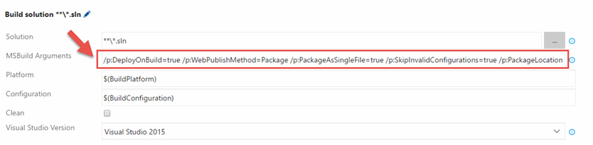

1. In the build step `Copy Files to: $(build.artifactstagingdirectory)`, the default setting uses build definition folders. We are not using custom build configurations so we need to update the contents value.

    ### Previous setting ###
    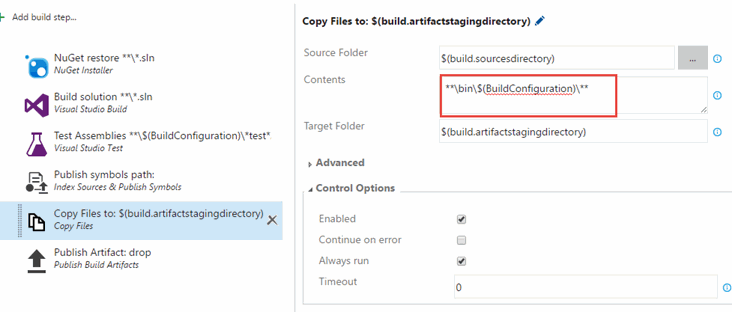

     ```xml
     **\bin\**
     ```
     ### New setting ###
     

1. Save your Build Definition named **DotNet Build**

    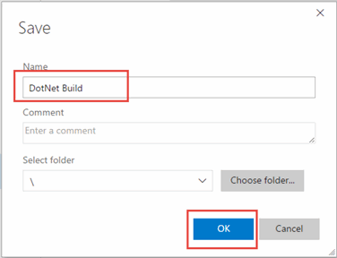

1. Our saved Build Definition is ready to be processed by the Hosted Build Agent.  Click **Queue New Build** to start the build process. 

    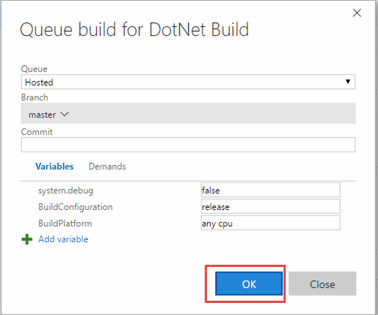

1. Accept the defaults and click **OK**. Your Build will then be queued until the Hosted Build Agent can pick it up for processing.  This typically takes less than 60 seconds to begin.

1. Once your Build completes, click each step on the left navigation bar and inspect the output.

    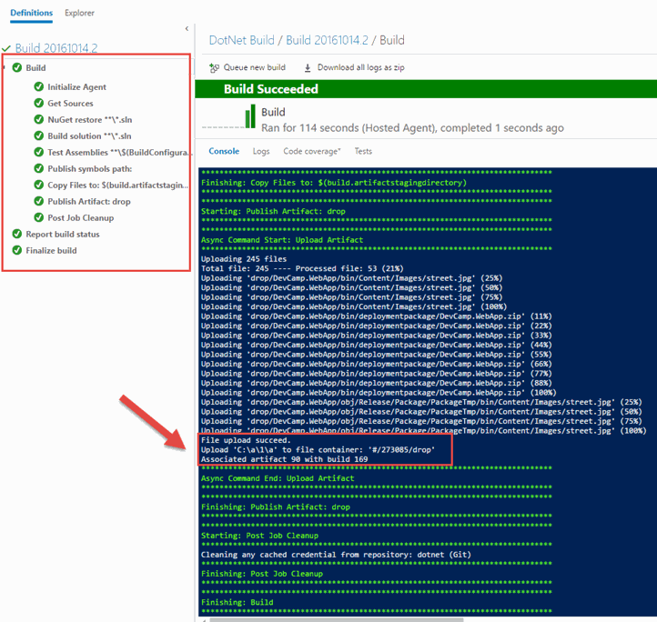

1. Let's inspect the output artifacts that were published.  Click the **Build XXX** header in the left pane to view the build's landing page.  Then select **Artifacts** from the horizontal toolbar, and **Download** the **drop** artifact.

    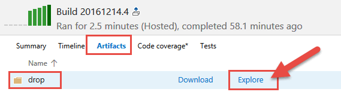

    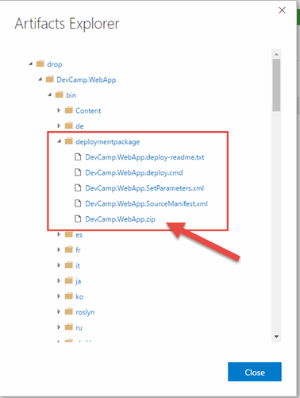

1. Unzip `drop.zip` to see our files.  This artifact will be deployed to an Azure Web App in a later exercise.

We now have a Build Definition that will compile the application and package it for deployment anytime code is checked into the repository, or a manual build is queued. 

----
## Exercise 5: Deploy code to an Azure Web App

In the ARM Template that was originally deployed, a web app was created as a development environment to hold a deployed .NET application. We will use this web app as a deployment target from VSTS. First, we need to prepare this web app for our application code.

1. Visit the Azure Web App by browsing to the [Azure Portal](http://portal.azure.com), opening the Resource Group, and select the Azure Web App resource that beings **dotnetapp** before the random string. 

    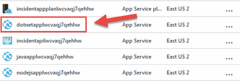

1. Once the blade expands, select **Browse** from the top toolbar

    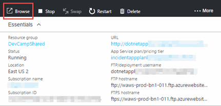

1. A new browser tab will open with a splash screen visible

    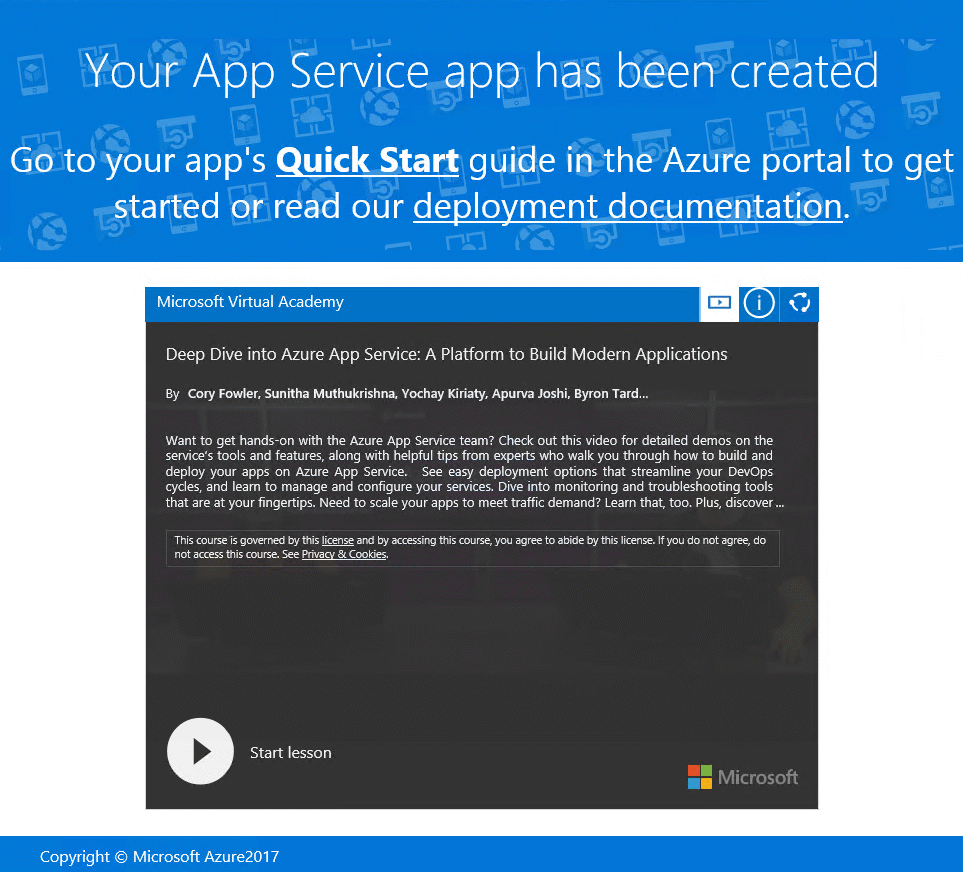

1.  Now that we have a build being created and a website to deploy into, let's connect them. In VSTS, navigate to the release tab.

    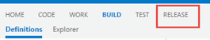

1. Click the `+` sign and Create a new ***Release Definition***

    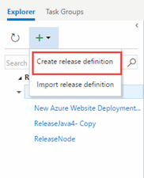

1. Select ***Azure App Service Deployment*** and click Next.

    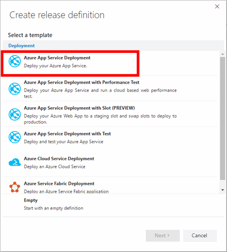

1.  We need to connect your VS agent with your Azure subscription so it can deploy resources. Click on ***Manage***

    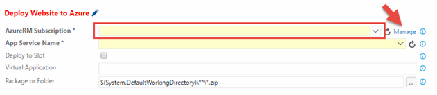

1. This will open a screen where you can connect to the ARM service endpoint. Select ***New Service Endpoint > Azure Resource Manager***

    

1. Provide a connection name and select your subscription then click OK

    

    > If your subscription is not in the dropdown list, click the link at the bottom of the window, and the window 
    > format will change to allow you to enter connection information on your subscription:    

    

    > If you have not created a service principal for the subscription, you will have to follow the 
    > [instructions](https://go.microsoft.com/fwlink/?LinkID=623000&clcid=0x409) to do so.  This process will 
    > provide the information to enter in this dialog:
    >

1. Open [this PowerShell script](https://raw.githubusercontent.com/Microsoft/vso-agent-tasks/master/Tasks/DeployAzureResourceGroup/SPNCreation.ps1) 
    in your browser. Select all the content from the window and copy to the clipboard.
    
1. Open a PowerShell ISE window.  in the text window, paste the PowerShell script from the clipboard.

    

1. Click the green arrow to run the PowerShell script

    

1. The PowerShell script will ask for your **subscription name** and a **password**.  This password is 
    for the service principal only, not the password for your subscription.  So you can use whatever password 
    you would like, just remember it.    

    

1. You will then be asked for your Azure login credentials.  Enter your Azure username and password.  
    The script will print out several values that you will need to enter into the **Add Azure Resource Manager Service Endpoint**
    window.  Copy and paste these values from the PowerShell window:
        Subscription ID
        Subscription Name
        Service Principal Client ID
        Service Principal Key
        Tenant ID

1. Also, enter a user-friendly name to use when referring to this service endpoint connection.
    

1. Click **Verify connection**, and ensure that the window indicates that the connection was verified. 
    Then Click **OK** and **Close**.

    

1. Navigate back to the VSTS build tab in the browser and click the click the **Refresh** icon to refresh the connections. The **Azure** connection that we setup should now appear.  Select it.

1. Next, for **App Service Name** choose the name of the .NET Azure Web App. It may take a moment to populate.

    

1. **Save** the Release Definition, and select **Release > Create Release**

    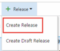

1. Enter the release information and select the build to deploy. Click Create

    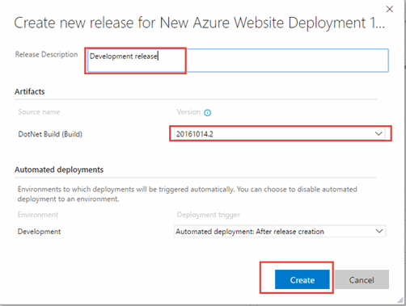

1. Click on the release number in navigation header. This will allow you view the current release information.
    
    

1. After a successful build you should see the application deployed to your web app

    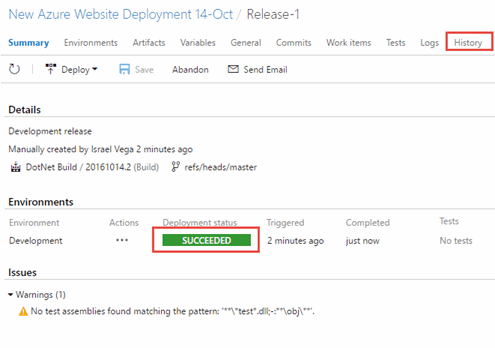

    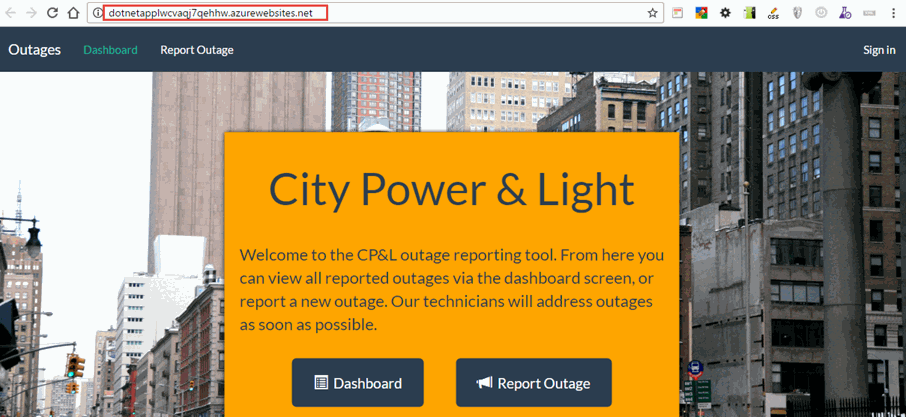

---

## Summary

In this hands-on lab, you learned how to:
* Create a Visual Studio Team Services online account
* Create a VSTS Git repository
* Add your code to the VSTS Git repository
* Create a Continuous Integration pipeline
* Deploy a built application to an Azure Web App from VSTS

Copyright 2016 Microsoft Corporation. All rights reserved. Except where otherwise noted, these materials are licensed under the terms of the MIT License. You may use them according to the license as is most appropriate for your project. The terms of this license can be found at https://opensource.org/licenses/MIT.