# Monitoring with Application Insights (.NET)

## Overview
In this lab, you will create and integrate an instance of Application Insights with your application to provide a 360* view of your app performance. 

> This guide use Visual Studio on Windows as the IDE. You can use [Visual Studio community Edition](https://www.visualstudio.com/post-download-vs/?sku=community&clcid=0x409&downloadrename=true).

## Objectives
In this hands-on lab, you will learn how to:
* Learn to create an Application Insights instance
* Use SDKs to add telemetry to your application
* View performance metrics in the Azure Portal

## Prerequisites

* The source for the starter app is located in the [start](start) folder. 
* The finished project is located in the [end](end) folder. 
* Deployed the starter ARM Template [HOL 1](../developer-environment)
* Completion of the [azuread-ofice365](../azuread-ofice365),  

> Note: If you did not complete the previous labs, the project in the start folder is cumulative.

### Note
> In the hands-on-labs you will be using Visual Studio Solutions. Please do not update the NuGet packages to the latest available, as we have not tested the labs with every potential combination of packages. 

## Exercises
This hands-on-lab has the following exercises:
* Exercise 1: Create an Application Insights resource
* Exercise 2: Add server and client side SDK's 
* Exercise 3: Monitor custom events
* Exercise 4: Create a global web test
* Exercise 5: Interact with your telemetry data

----
### Exercise 1: Create an Application Insights resource

An instance of Application Insights can be created in a variety of ways, including ARM Templates or CLI commands.  For this execise we will use the Azure Portal to create and configure our instance.

1. In a browser, navigate to the [Azure Portal](https://portal.azure.com)

1. Open the Resource Group that was originally deployed.  Click **Add** on the top toolbar to add a new Azure resource to this group.

    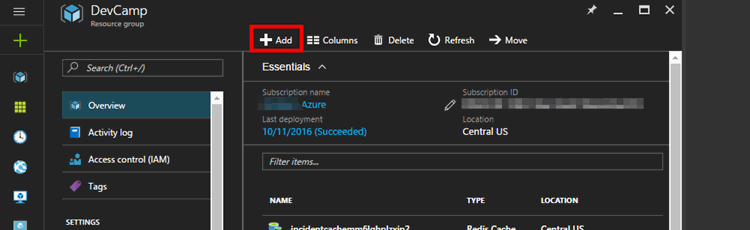

1. Search for `Application Insights` and select the entry from the results list

    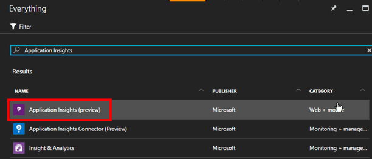

1. In the overview blade that opens, click **Create** to open the creation settings blade. Select a name, configure **Application Type** to `ASP.NET Web Application` and then click the **Create** button. 

    Creation typically takes less than a minute.

    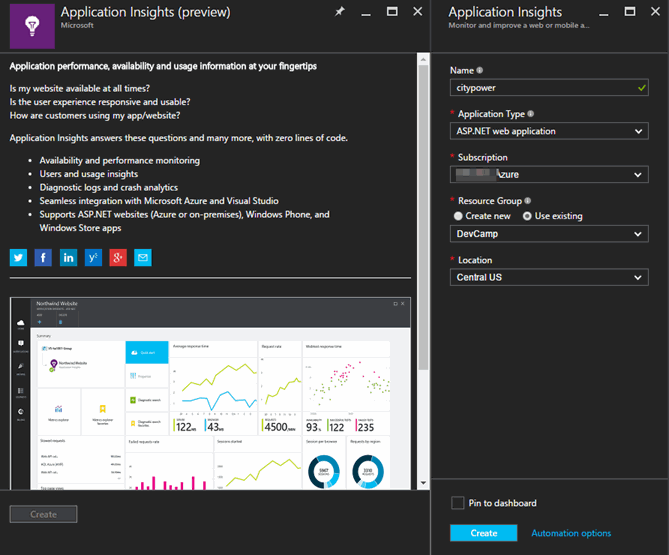

1. Once provisioning completes, return to your Resource Group and open the resource.

    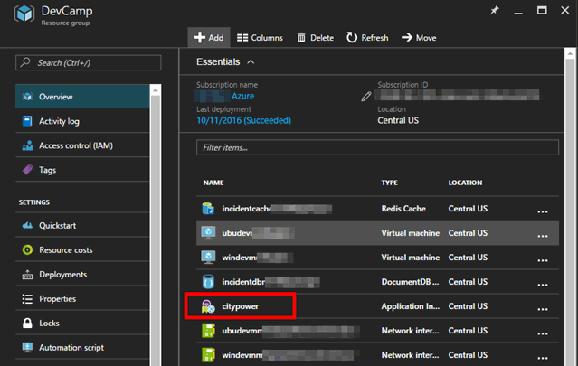

1.  In the **Essentials** section, take note of the **Instrumentation Key**.  We will need that in future exercises.

    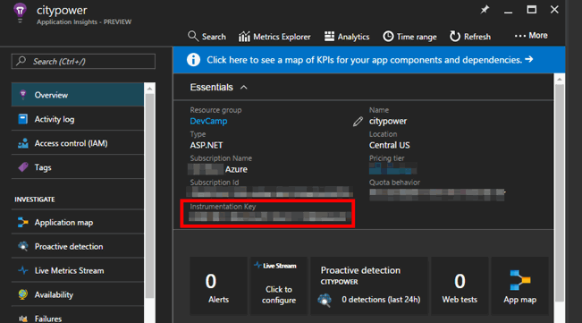

We now have an instance of Application Insights created and ready for data.  The Instrumentation Key is important, as it is the link that ties an application to the AI service. 

----
### Exercise 2: Add server and client side SDK's 

App Insights works with 2 components: 
1. A server side SDK that integrates into the ASP.NET processes
2. A snippet of JavaScript sent down to the client's browser to monitor behavior

We will add both components to our application and enable the sending of telementry into the AppInsights service.

1. Navigate to the `appinsights` folder and open the starter solution in Visual Studio. 

1. Register the Application and add the AppInsights SDK to the solution by right-clicking on the project and clicking `Add Application Insights Telemetry`

    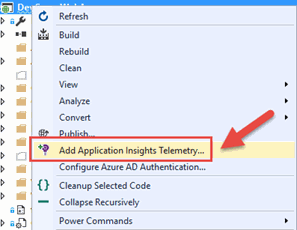

1. The Application Insights page appears. Login to you Azure subscription.

    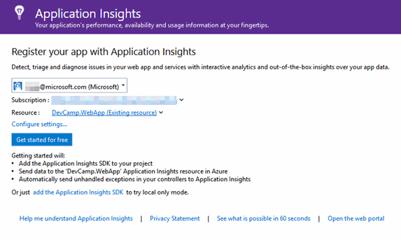

1. Select your AppInsights resource you created above. You can choose from the drop down or click on Configure Settings.

    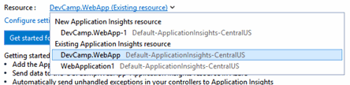

    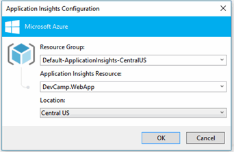

1. Click Get Started for free. This will download the nuget packages and add an applicationtioninsights.config to your solution.

1. Click on Configure Exception collection and configure trace collection. This will enable additional trace listeners.
    
    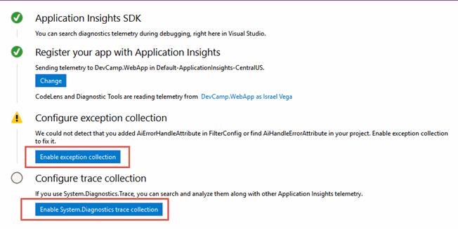
    > The snipet above was taken from the Application Insights Configuration window. You can access it by right-clicking the project in your solution and choosing 'Application Insights > Configure Application Insights...'. If you aren't seing this option, make sure you are using an updated version of the 'Developer Analytics Tools' extension. By the time of this writing, this is 7.12.

1. Your Application Insights page should appear like below.

    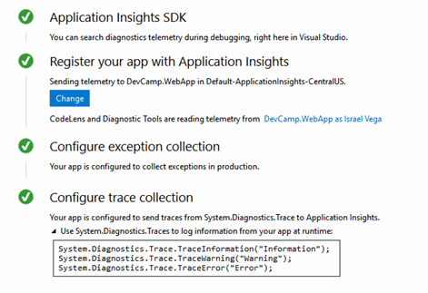

1. By default, the `ApplicationInsights.config` is excluded from source control due to the fact that it contains the Instrumentation key. We will remove this from the config file and inject it at runttime. Remove the following key from the config file:

    

1. Open the Web.config file and add the following entry, below the other keys. Replace the value with your AppInisghts key:

    ```xml
    <!--HOL 5-->
    <add key="APPINSIGHTS_KEY" value="TELEMETRYKEY" />
    ```
1. Open the Setting.cs file and add the following keys below the existing entries:
    
    ```csharp
    //####    HOL 5   ######
    public static string APPINSIGHTS_KEY = ConfigurationManager.AppSettings["APPINSIGHTS_KEY"];
    //####    HOL 5   ######
    ```

1. Open the Global.asax.cs file and add the following to the Application_Start() Method, below the existing code:

    ```csharp
    //Add the telemetry key from config
    TelemetryConfiguration.Active.InstrumentationKey = Settings.APPINSIGHTS_KEY;
    ```
1.  Resolve the references in this file. If you recieve an error related to the FilterConfig class, check to see if a duplicate FilterConfig.cs was created. If so remove it.

    

1. Build and run your application and in the navigate around several pages to generate sample telementry.

1. You can view telemetry in the Azure Portal or directly in Visual Studio from the menu item. 
    
    

    

1. Back in the Azure Portal, refresh the browser tab (or click **Refresh** from the top toolbar) until you see data appear.  

    

    > It may take 3-5 minutes for data to appear even when manually refreshing

1. Our server is now sending data, but what about the client side? Let's add the JavaScript library.  

    In the portal, click the tile that says **Learn how to collect browser page load data**    
    
    

1. The next blade with give you a JavaScript snippet pre-loaded with the Instrumentation Key.  This snippet, when place on an HTML page, will download the full Application Insights JavaScript library and configure itself.  Click the clipboard icon to copy the snippet.

    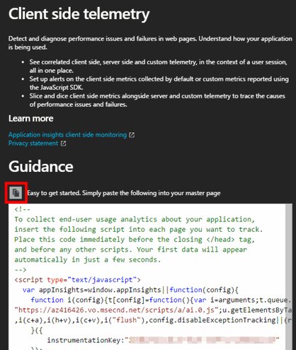

1. Let's integrate the snippet into our views. Open the Views > Shared > _Layout.cshtml file. This file controls the outer layout for all of the pages.

1. Paste the following snippet below the existing script tags. Notice that we replaced the static instrumentaiton key with the constant from our settings.cs class :

    ```html
    <!-- 
    To collect end-user usage analytics about your application, 
    insert the following script into each page you want to track.
    Place this code immediately before the closing </head> tag,
    and before any other scripts. Your first data will appear 
    automatically in just a few seconds.
    -->
    <script type="text/javascript">
    var appInsights=window.appInsights||function(config){
        function i(config){t[config]=function(){var i=arguments;t.queue.push(function(){t[config].apply(t,i)})}}var t={config:config},u=document,e=window,o="script",s="AuthenticatedUserContext",h="start",c="stop",l="Track",a=l+"Event",v=l+"Page",y=u.createElement(o),r,f;y.src=config.url||"https://az416426.vo.msecnd.net/scripts/a/ai.0.js";u.getElementsByTagName(o)[0].parentNode.appendChild(y);try{t.cookie=u.cookie}catch(p){}for(t.queue=[],t.version="1.0",r=["Event","Exception","Metric","PageView","Trace","Dependency"];r.length;)i("track"+r.pop());return i("set"+s),i("clear"+s),i(h+a),i(c+a),i(h+v),i(c+v),i("flush"),config.disableExceptionTracking||(r="onerror",i("_"+r),f=e[r],e[r]=function(config,i,u,e,o){var s=f&&f(config,i,u,e,o);return s!==!0&&t["_"+r](config,i,u,e,o),s}),t
        }({
            instrumentationKey: "@DevCamp.WebApp.Utils.Settings.APPINSIGHTS_KEY"
        });
        
        window.appInsights=appInsights;
        appInsights.trackPageView();
    </script>
    ```
1. Redeploy the application and load several pages to generate more sample telementry. The Azure Portal should now light up data for **Page View Load Time** 

    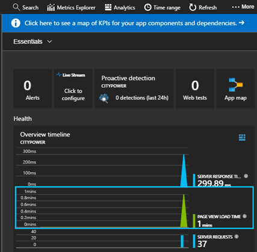

Our application is now providing the Application Insights service telementry data from both the server and client.

----
### Exercise 3: Monitor custom events

Up until this point the telemetry provided has been an automatic, out-of-the-box experience.  For custom events we need to use the SDK. Let's create an event where any time a user views their Profile page, we record their name and AzureAD tenant ID.

1. Open the Profilecontroller.cs file

1. Add the following to the top of the class:

    ```csharp
    //Add telemetry
    private TelemetryClient telemetryClient = new TelemetryClient();
    ```

1. In the SignIn() Method, add the following:
    
    ```csharp
    telemetryClient.TrackEvent("Sign in");
    ```
1. Add the following to the SignOut method()

    ```csharp
    telemetryClient.TrackEvent("Sign out");
    ```
1. In the Index() Method, add the following before the call to the GraphAPI:

    ```csharp
    //#### TRACK A CUSTOM EVENT ####
    var profileProperties = new Dictionary<string, string> {{"userid", userObjId}, {"tenantid", tenantId}};
    telemetryClient.TrackEvent("View Profile", profileProperties);
    //#### TRACK A CUSTOM EVENT ####
    ```
1. Resolve the references in this class and save the open files

1. Hit F5 to begin debugging. Sign in, view your profile and Sign out a few times. Notice the custom events in the portal.

    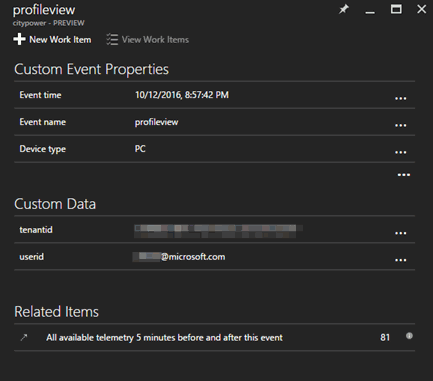
 
These custom events (and the related concept of custom metrics) are a powerful way to integrate telemetry into our application and centralize monitoring across multiple application instances.

----
## Summary

In this hands-on lab, you learned how to:
* Learn to create an Application Insights instance
* Use SDKs to add telemetry to your application
* View performance metrics in the Azure Portal

Copyright 2016 Microsoft Corporation. All rights reserved. Except where otherwise noted, these materials are licensed under the terms of the MIT License. You may use them according to the license as is most appropriate for your project. The terms of this license can be found at https://opensource.org/licenses/MIT.
