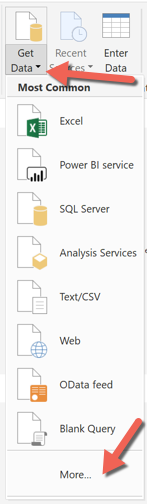
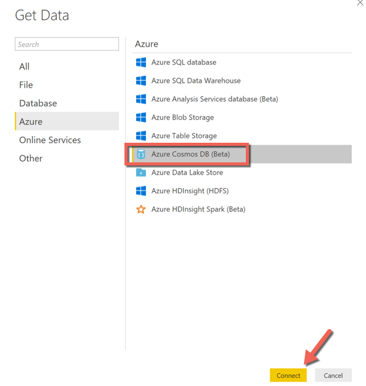
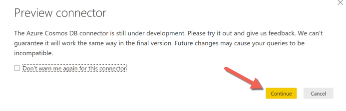
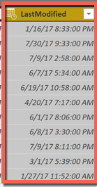
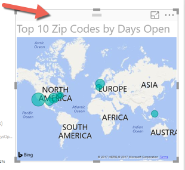
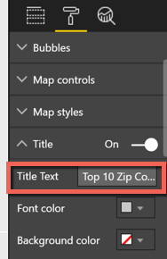

# Visualizing data using PowerBI (.NET)

## Overview
In this lab, you will create a PowerBI report to visualize the Incident data.

## Objectives
In this hands-on lab, you will learn how to:
* Connect to data in Cosmos DB using PowerBI
* Add a calculated column to a PowerBI report
* Publish and view a report to the PowerBI service

## Prerequisites

* Have an Incidents API and Cosmos DB deployed to an Azure subscription
* A Windows machine with a PowerBi Supported Operating System
    - Windows 10 , Windows 7, Windows 8, Windows 8.1, Windows Server 2008 R2, Windows Server 2012, Windows Server 2012 R2
    - Microsoft Power BI Desktop requires Internet Explorer 9 or greater.
    - Microsoft Power BI Desktop is available for 32-bit (x86) and 64-bit (x64) platforms.

## Exercises
This hands-on-lab has the following exercises:
* [Exercise 1: Set up your environment](#ex1)
* [Exercise 2: Connect and prepare the data](#ex2)
* [Exercise 3: Publish to the PowerBI service](#ex3)

---
## Exercise 1: Set up your environment <a name="ex1"></a>

### To download via direct link

1. In a browser, navigate to the [PowerBI service portal](https://powerbi.microsoft.com).

1. Scroll to the bottom of the page to the Downloads section and select `Power BI Desktop`.

    

1. Click the `Download Free` button

    

1. Your download will start. Save the `.MSI` to a local folder.

    


### To download via the PowerBI portal

1. In a browser, navigate to the *PowerBI service portal* https://powerbi.microsoft.com.

1. Click `sign in` and login with your organizational account

    

1. If this is your first time signing in, you may see a Quick tour link. View the tour or click `No thanks`

    

1. From the menu, click the download icon then click  `Power BI Desktop`

    

1. Your download will start. Save the `.MSI` to a local folder.

    


You are now ready to create PowerBI reports and dashboards.

---
## Exercise 2: Connect and prepare the data <a name="ex2"></a>












1. Enter the following formula in the custom query window

```Excel
DaysOpen = if(incidents[Created] = TODAY(), 0, DateDiff(incidents[Created], Today(), DAY))
```







You are now ready to publish your data.

---
## Exercise 3: Publish to the PowerBI service <a name="ex3"></a>


---
## Summary
Combining Azure data and PowerBI for visualization is a powerful combination that you can leverage within your applicaiton.

In this hands-on lab, you learned how to:
* Set up your environment
* Connect and prepare the data
* Publish to the PowerBI service

---
Copyright 2016 Microsoft Corporation. All rights reserved. Except where otherwise noted, these materials are licensed under the terms of the MIT License. You may use them according to the license as is most appropriate for your project. The terms of this license can be found at https://opensource.org/licenses/MIT.