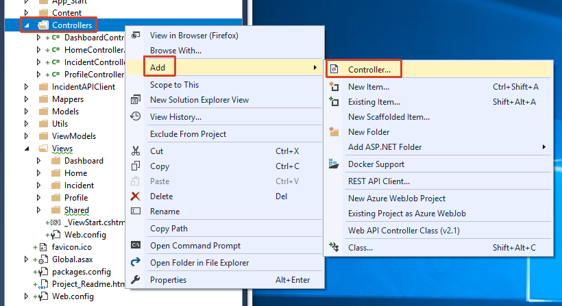
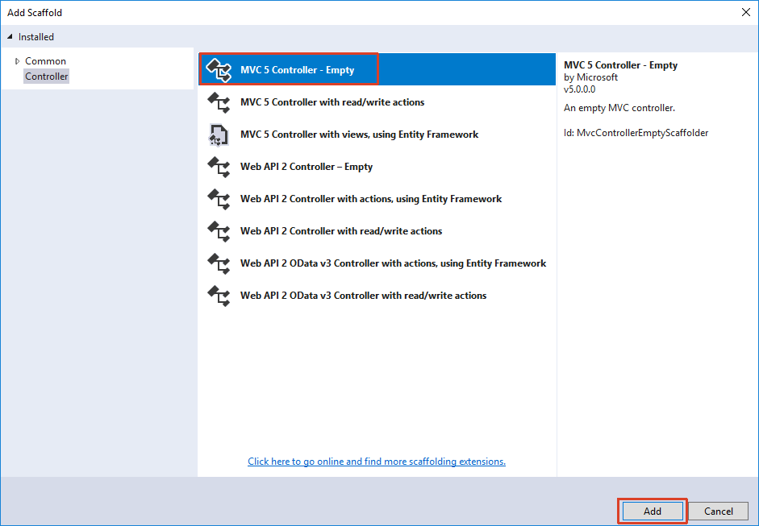
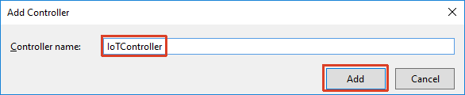
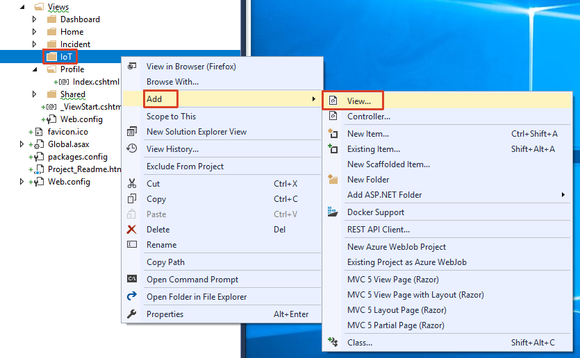
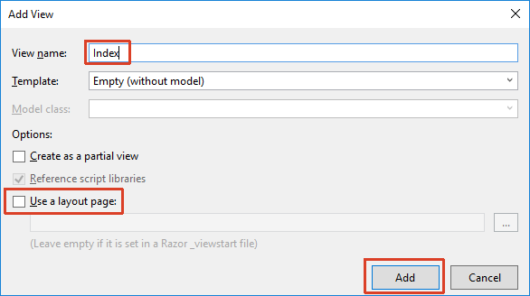
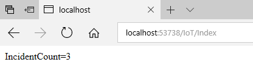
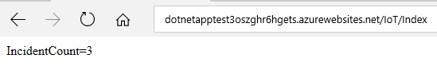

# IoT (.NET)

## Overview
City Power & Light is a sample application that allows citizens to report "incidents" that have occurred in their community. It includes a landing screen, a dashboard, and a form for reporting new incidents with an optional photo. The application is implemented with several components:

* Front end web application contains the user interface and business logic. This component has been implemented three times in .NET, NodeJS, and Java.
* WebAPI is shared across the front ends and exposes the backend DocumentDB.
* DocumentDB is used as the data persistence layer.

In this lab, you will combine the web app with an IoT device based on an Arduino-compatible board that will query the app for the number of incidents and display the refreshed number every minute.

## Objectives
In this hands-on lab, you will learn how to:
* Set up the developing environment to support the programming of Arduino chips.
* Create your own IoT software from scratch.

## Prerequisites
* The source for the starter app is located in the [start](start) folder. 
* The finished project is located in the [end](end) folder. 
* Deployed the starter ARM Template [HOL 1](../01-developer-environment).
* Completion of the [HOL 5](../05-arm-cd).

## Exercises
This hands-on-lab has the following exercises:
* [Exercise 1: Set up your environment](#ex1)
* [Exercise 2: Create output that will be consumed by the device](#ex2)
* [Exercise 3: Program the device](#ex3)

---
## Exercise 1: Set up your environment<a name="ex1"></a>

To program an Arduino device on your machine you need the Arduino IDE and Visual Studio. You will now install the Arduino IDE and setup the board manager.

1. Download the Arduino IDE package from the Arduino download page. Go to [www.arduino.cc/en/Main/Software](https://www.arduino.cc/en/Main/Software) and select the `Windows installer`.
The Windows installer sets up everything you need to use the Arduino IDE. If you use the ZIP file you need to install the drivers manually. The drivers are located here: [https://github.com/nodemcu/nodemcu-devkit/tree/master/Drivers](https://github.com/nodemcu/nodemcu-devkit/tree/master/Drivers).

    

1. Run the installer and accept the license agreement.

1. Select the components to install. Keep at least `Install USB driver` selected.

    

1. Select the installation folder. You should keep the default destination folder.

    

1. After setup completed close the window and run Arduino.

    

1. Arduino should look like this:

    

1. Select `File` -> `Preferences`.

    
    
1. Locate the `Additional Boards Manager URLs` property and enter the URL `http://arduino.esp8266.com/stable/package_esp8266com_index.json` and click `OK`.

    

1. Select `Tools` -> `Board` -> `Boards Manager...`.

    

1.  In the `Boards Manager` dialog enter `esp8266` into the search field. The Arduino package `esp8266` will appear. Select the latest version and click `Install` to download and install the package.

    

1. After the installation completed, click `Close`.

    

1. Select the board from the list of boards by clicking `Tools` -> `Board` -> `NodeMCU 1.0 (ESP-12E Module)`.

    

1. Set the port by selecting the correct COM port from `Tools` -> `Port` -> `Serial ports`. Also make sure `Upload Speed: "115200"` is selected.

    

You have now installed all the necessary components to start programming an Arduino device on your machine.

---

## Exercise 2: Create output that will be consumed by the device<a name="ex2"></a>

The device will regularly call an URL to fetch the current incident count. We will add a page to our existing web application as an easy way to provide this data.

1. Create a new controller. Right-click on `Controllers` and select `Add` -> `Controller...`.

    

1. In the `Add Scaffold` dialog select `MVC 5 Controller - Empty` and click `Add`.

    

1. Name the new controller `IoTController` and click `Add`.

    

1. The controller will just emulate the behavior of the `DashboardController`. Add the following code to the newly created file:

    ```csharp
    using DevCamp.WebApp.Utils;
    using IncidentAPI;
    using IncidentAPI.Models;
    using Newtonsoft.Json;
    using System.Collections.Generic;
    using System.Threading.Tasks;
    using System.Web.Mvc;
    
    namespace DevCamp.WebApp.Controllers
    {
        public class IoTController : Controller
        {
            // GET: IoT
            public async Task<ActionResult> Index()
            {
                List<Incident> incidents;
                using (var client = IncidentApiHelper.GetIncidentAPIClient())
                {
                    int CACHE_EXPIRATION_SECONDS = 60;
    
                    //Check Cache
                    string cachedData = string.Empty;
                    if (RedisCacheHelper.UseCachedDataSet(Settings.REDISCCACHE_KEY_INCIDENTDATA, out cachedData))
                    {
                        incidents = JsonConvert.DeserializeObject<List<Incident>>(cachedData);
                    }
                    else
                    {
                        //If stale refresh
                        var results = await client.IncidentOperations.GetAllIncidentsAsync();
                        Newtonsoft.Json.Linq.JArray ja = (Newtonsoft.Json.Linq.JArray)results;
                        incidents = ja.ToObject<List<Incident>>();
                        RedisCacheHelper.AddtoCache(Settings.REDISCCACHE_KEY_INCIDENTDATA, incidents, CACHE_EXPIRATION_SECONDS);
                    }
                }
                return View(incidents);
            }
        }
    }

1. Now create a view for the new controller by right-clicking on `Views` -> `IoT` and selecting `Add` -> `View`.

    

1. In the `Add View` dialog set the name to `Index` and make sure that no layout page will be created before you click `Add`.

    

1. Since we don't need a whole HTML page remove the content of the `Views` -> `IoT` -> `Index.cshtml` file and replace it with:

    ```csharp
    @{
        Layout = null;
    }
    IncidentCount=@Model.Count

1. Start the debugger and add `/IoT` to the URL to test the new view. It will contain just the number of incidents.

    

1. Publish the changes to your Azure web app and make sure the `/IoT` URL is reachable (see [HOL 5](../05-arm-cd)).
 
    

You have now created the data feed for your device.

---
## Exercise 3: Program the device<a name="ex3"></a>

The Arduino-compatible device can handle data exchange with web applications. At first we will connect the device to a Wi-Fi, and then we will add an HTTP request to retrieve the amount of incidents from the web application.

It is important to develop projects in small chunks and to understand and test each function. Try to develop code with small functions that clearly separate the functionalities of your device and combine them step by step.

1. Open Arduino and create a new sketch.

1. Replace the sketch content with the following code which will connect the device to a specified wireless network. Replace the SSID and the password with proper values.

    ```cpp
    #include <ESP8266WiFi.h>

    // Pins
    #define LED_PIN   D4 // build-in LED in NodeMCU

    // Wifi
    char* ssid = "***";
    char* password = "***";

    void setup() {
      Serial.begin(115200); // sets up serial data transmission for status information
      
      pinMode(LED_PIN, OUTPUT);
      
      connectWifi(ssid, password);
    }

    void loop() {
      if (WiFi.status() != WL_CONNECTED) {
        digitalWrite(LED_PIN, HIGH); // turn the LED off
      } else {
        delay(250);
        digitalWrite(LED_PIN, LOW);
        delay(50);
        digitalWrite(LED_PIN, HIGH);
      }
    }

    void connectWifi(char* ssid, char* password) {
      Serial.print("Connecting to Wi-Fi");
      
      WiFi.hostname("NodeMCU@DevCamp");
      WiFi.begin(ssid, password);
      
      uint8_t i = 0;
      while (WiFi.status() != WL_CONNECTED && i++ < 50) {
        Serial.print(".");
        delay(500);
      }
      Serial.println(".");
      
      if (WiFi.status() != WL_CONNECTED) {
        Serial.println("Could not connect to Wi-Fi");
      } else {
        Serial.print("Connected to Wi-Fi: ");
        Serial.println(ssid);
        Serial.print("IP address: ");
        Serial.println(WiFi.localIP());
      }
    }

1. When it comes to debugging code in Arduino, `Serial.print()` and `Serial.println()` are the best way to go. `Serial.begin(115200);` sets up serial data transmission with 115200 baud. Select `Tools` -> `Serial Monitor` to open the `Serial Monitor` dialog for the selected COM port.

    

1. In the `Serial Monitor` dialog select `115200 baud` from the list and leave the dialog open to see the output from the device.

    

1. Let's test the wireless network connection. Hit `CTRL+U` to compile and upload the sketch to your device. If the connection to your network was established, the LED on your device will start blinking. It will completely turn off if the connection has failed.

    

1. Now we will add an HTTP request to our Arduino code. The new code will also add the method `getIncidentCount()` which will fetch the current incident count from the `IoT` view created in `Exercise 2`. Use the code below to replace or adapt the existing code.

    ```cpp
    #include <ESP8266WiFi.h>

    // Pins
    #define LED_PIN   D4 // build-in LED in NodeMCU

    // Wifi
    char* ssid = "***";
    char* password = "***";

    // Request
    const int port = 80;
    const char* server = "<app_name>.azurewebsites.net/IoT"; // address for request, without http://
    const char* searchString = "IncidentCount="; // search for this property

    void setup() {
      Serial.begin(115200); // sets up serial data transmission for status information
      
      pinMode(LED_PIN, OUTPUT);
      
      connectWifi(ssid, password);
    }

    void loop() {
      if (WiFi.status() != WL_CONNECTED) {
        digitalWrite(LED_PIN, HIGH);
      } else {
        // retrieve the amount of incidents
        int incidentCount = getIncidentCount();
        
        // keep the led blinking for the amount of incidents
        for (int i = 0; i < incidentCount; i++) {
          delay(250);
          digitalWrite(LED_PIN, LOW);
          delay(50);
          digitalWrite(LED_PIN, HIGH);
        }
        // pause between requests
        delay(60000);
      }
    }

    void connectWifi(char* ssid, char* password) {
      Serial.print("Connecting to Wi-Fi");
      
      WiFi.hostname("NodeMCU@DevCamp");
      WiFi.begin(ssid, password);
      
      uint8_t i = 0;
      while (WiFi.status() != WL_CONNECTED && i++ < 50) {
        Serial.print(".");
        delay(500);
      }
      Serial.println(".");
      
      if (WiFi.status() != WL_CONNECTED) {
        Serial.println("Could not connect to Wi-Fi");
      } else {
        Serial.print("Connected to Wi-Fi: ");
        Serial.println(ssid);
        Serial.print("IP address: ");
        Serial.println(WiFi.localIP());
      }
    }

    int getIncidentCount() {
      WiFiClient client;
      if (client.connect(server, port)) {
        Serial.print("Connected to ");
        Serial.println(server);
        Serial.println("Sending request");
        
        client.print("GET /");
        client.println(" HTTP/1.1");
        client.print("Host: ");
        client.print(server);
        client.print(":");
        client.println(port);
        client.println("Connection: close");
        client.println("Accept: text/html");
        client.println();

        // waiting for server response...
        while (client.connected()) {
          // ...until the response is available
          if (client.available()) {
		    // looking for search string in response data
            if (client.findUntil(searchString, "\0")) {
              int result = client.readStringUntil('\n').toInt();
              
              Serial.print(searchString);
              Serial.print("=");
              Serial.println(result);
              
              return result;
            }
          }
        }
        client.stop();

        Serial.println();
        Serial.println("Connection closed");
      } else {
        Serial.print("Connection to ");
        Serial.print(server);
        Serial.println(" failed");
      }
      return 0;
    }

1. Replace the SSID and the password with proper values. Also replace the address in the following line with the address to the `IoT` view:

    ```cpp
    const char* server = "<app_name>.azurewebsites.net/IoT"; // address for request, without http://

1. Select `Sketch` -> `Upload` or use `CTRL+U` to compile and upload the sketch to your device. The device will retrieve the amount of incidents from the `IoT` view and flash the LED for this amount.

    

This example shows how to work with data requests, how to link the device to a data source on the internet and display the state using a simple LED.

---
## Summary

In this hands-on lab, you learned how to:
* Set up the developing environment to support the programming of Arduino chips.
* Create your own IoT software from scratch.

---
Copyright 2017 Microsoft Corporation. All rights reserved. Except where otherwise noted, these materials are licensed under the terms of the MIT License. You may use them according to the license as is most appropriate for your project. The terms of this license can be found at https://opensource.org/licenses/MIT.