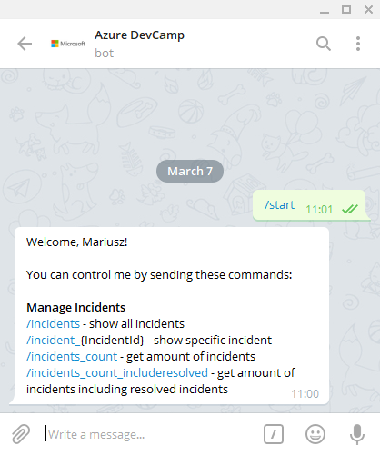
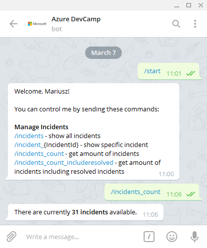

# IoT (.NET)

## Overview
City Power & Light is a sample application that allows citizens to report "incidents" that have occurred in their community. It includes a landing screen, a dashboard, and a form for reporting new incidents with an optional photo. The application is implemented with several components:

* Front end web application contains the user interface and business logic. This component has been implemented three times in .NET, NodeJS, and Java.
* WebAPI is shared across the front ends and exposes the backend CosmosDB.
* CosmosDB is used as the data persistence layer.

In this lab, you will combine the web app with an IoT device based on an Arduino-compatible board that will query the app for the number of incidents and display the refreshed number every minute. You will also learn how to remotely control the device by using the Telegram Bot API.

## Objectives
In this hands-on lab, you will learn how to:
* Set up the developing environment to support the programming of Arduino chips.
* Create your own IoT software from scratch.
* Enable remote control of your device using the Telegram Bot API.

## Prerequisites
* The finished projects are located in the [end](end) folder.
* Deployed the starter ARM Template [HOL 1](../01-developer-environment).
* Completion of the [HOL 5](../05-arm-cd).

## Exercises
This hands-on-lab has the following exercises:
* [Exercise 1: Set up your environment](#ex1)
* [Exercise 2: Program the device](#ex2)
* [Exercise 3: Remote control using the Telegram Bot API](#ex3)

---
## Exercise 1: Set up your environment<a name="ex1"></a>

To program an Arduino device you need the **Arduino IDE** on your machine. Since a hardware connection to the device is required this will not work from a virtual machine. It is possible to use an Arduino emulator for this lab instead of the actual device and work through the exercises in a virtual machine.

You will now install the **Arduino IDE** and set up the boards manager.

1. Download the **Arduino IDE** package from the Arduino download page. Go to [www.arduino.cc/en/Main/Software](https://www.arduino.cc/en/Main/Software) and select the `Windows installer`.
The Windows installer sets up everything you need to use the **Arduino IDE**. If you use the zip file you need to install the drivers manually. The drivers are located here: [https://github.com/nodemcu/nodemcu-devkit/tree/master/Drivers](https://github.com/nodemcu/nodemcu-devkit/tree/master/Drivers).

    

1. Run the installer and accept the license agreement.

1. Select the components to install. Keep at least `Install USB driver` selected.

    

1. Select the installation folder. You should keep the default destination folder.

    

1. After setup completed close the window and run Arduino.

    

1. Arduino should look like this:

    

1. Select `File` -> `Preferences`.

    

1. Locate the `Additional Boards Manager URLs` property and enter the URL `http://arduino.esp8266.com/stable/package_esp8266com_index.json` and click `OK`.

    

1. Select `Tools` -> `Board` -> `Boards Manager...`.

    

1.  In the `Boards Manager` dialog enter `esp8266` into the search field. The Arduino package `esp8266` will appear. Select the latest version and click `Install` to download and install the package.

    

1. After the installation completed, click `Close`.

    

1. Select the board from the list of boards by clicking `Tools` -> `Board` -> `NodeMCU 1.0 (ESP-12E Module)`.

    

1. Set the port by selecting the correct COM port from `Tools` -> `Port` -> `Serial ports`. Also make sure `Upload Speed: "115200"` is selected.

    

You have now installed all the necessary components to start programming an Arduino device on your machine.

---
## Exercise 2: Program the device<a name="ex2"></a>

The Arduino-compatible device can handle data exchange with web applications. At first we will connect the device to a Wi-Fi, and then we will add an HTTP request using the incident REST API to retrieve the amount of incidents from the incident web application.

### Note:
> It is important to develop projects in small chunks and to understand and test each function. Try to develop code with small functions that clearly separate the functionalities of your device and combine them step by step.
>
> Do not declare too many variables. The device has very limited memory, that’s why it is better to use function calls, for example, instead of saving the returned values for later use.

1. Make sure the device is connected to your USB port. Open Arduino and create a new sketch.

1. Replace the sketch content with the following code which will connect the device to a specified wireless network. Replace the **SSID** and the **password** with proper values.

    ```cpp
    #include <ESP8266WiFi.h>

    // Pins
    #define LED_PIN D4 // build-in LED in NodeMCU

    // Wifi
    const char ssid[] = "***";
    const char password[] = "***";

    void setup() {
      Serial.begin(115200); // sets up serial data transmission for status information

      pinMode(LED_PIN, OUTPUT);

      connectWifi(ssid, password);
    }

    void loop() {
      if (WiFi.status() != WL_CONNECTED) {
        digitalWrite(LED_PIN, HIGH); // turn the LED off
      } else {
        delay(250);
        digitalWrite(LED_PIN, LOW);
        delay(50);
        digitalWrite(LED_PIN, HIGH);
      }
    }

    void connectWifi(const char ssid[], const char password[]) {
      Serial.print("Connecting to Wi-Fi");

      WiFi.hostname("NodeMCU@DevCamp");
      WiFi.begin(ssid, password);

      uint8_t i = 0;
      while (WiFi.status() != WL_CONNECTED && i++ < 50) {
        Serial.print(".");
        delay(500);
      }
      Serial.println(".");

      if (WiFi.status() != WL_CONNECTED) {
        Serial.println("Could not connect to Wi-Fi");
      } else {
        Serial.print("Connected to Wi-Fi: ");
        Serial.println(ssid);
        Serial.print("IP address: ");
        Serial.println(WiFi.localIP());
      }
    }

1. `Serial.begin(115200);` sets up serial data transmission with 115200 baud. Select `Tools` -> `Serial Monitor` to open the `Serial Monitor` dialog for the selected COM port.

    > When it comes to debugging code in Arduino, `Serial.print()` and `Serial.println()` are the best way to go.

    

1. In the `Serial Monitor` dialog select `115200 baud` from the list and leave the dialog open to see the output from the device.

    

1. Let's test the wireless network connection. Hit `CTRL+U` to compile and upload the sketch to your device. Confirm if you are asked to save the code in a local file. You can follow the upload process in the status window at the bottom. If the upload fails and you have multiple COM ports try selecting the other ports.

1. If the connection to your network was established, the LED on your device will start blinking. It will completely turn off if the connection has failed. The serial monitor window will also display the connection attempts made by the device.

    

1. Now we will add an HTTP request to our Arduino code. The new code will also add the method `sendRequest()` which, with the URL in `requestIncidentsCountUri`, will fetch the current incident count. Use the code below to replace or adapt the existing code.

    ```cpp
    #include <ESP8266WiFi.h>

    // Pins
    #define LED_PIN D4 // build-in LED in NodeMCU

    // Wifi
    const char ssid[] = "***";
    const char password[] = "***";

    WiFiClient client;

    // Request
    const int port = 80;
    const char serverUrl[] = "incidentapi[YOUR_RG_NAME].azurewebsites.net"; // address for request, without http://

    const char requestIncidentsCountUri[] = "/incidents/count";

    void setup() {
      Serial.begin(115200); // sets up serial data transmission for status information

      pinMode(LED_PIN, OUTPUT);

      connectWifi(ssid, password);
    }

    void loop() {
      if (WiFi.status() != WL_CONNECTED) {
          digitalWrite(LED_PIN, HIGH);
      } else {
        // retrieve the amount of incidents
        String result = sendRequest(requestIncidentsCountUri);
        if (result != "") {
          Serial.print("The incident count is: ");
          Serial.println(result);

          int incidentsCount = result.toInt();

          // keep the led blinking for the amount of incidents
          for (int i = 0; i < incidentsCount; i++) {
            delay(250);
            digitalWrite(LED_PIN, LOW);
            delay(50);
            digitalWrite(LED_PIN, HIGH);
          }
        } else {
          Serial.println("Result is empty");
        }
        // pause between requests
        delay(60000);
      }
    }

    void connectWifi(const char ssid[], const char password[]) {
      Serial.print("Connecting to Wi-Fi");

      WiFi.hostname("NodeMCU@DevCamp");
      WiFi.begin(ssid, password);

      uint8_t i = 0;
      while (WiFi.status() != WL_CONNECTED && i++ < 50) {
        Serial.print(".");
        delay(500);
      }
      Serial.println(".");

      if (WiFi.status() != WL_CONNECTED) {
          Serial.println("Could not connect to Wi-Fi");
      } else {
        Serial.print("Connected to Wi-Fi: ");
        Serial.println(ssid);
        Serial.print("IP address: ");
        Serial.println(WiFi.localIP());
      }
    }

    String sendRequest(String uri) {
      if (client.connect(serverUrl, port)) {
        Serial.print("Connected to ");
        Serial.println(serverUrl);
        Serial.println("Sending request");

        client.print("GET ");
        client.print(uri);
        client.println(" HTTP/1.1");
        client.print("Host: ");
        client.print(serverUrl);
        client.print(":");
        client.println(port);
        client.println("Connection: close");
        client.println("Accept: text/html");
        client.println();

        // waiting for server response...
        while (client.connected()) {
          // ...until the response is available
          while (client.available()) {
            // looking for the first empty line that indicates the end of the header
            if (client.findUntil("\r\n\r\n", "\0")) {
              // return the payload
              return client.readStringUntil('\n');
            }
          }
        }
        client.stop();

        Serial.println();
        Serial.println("Connection closed");
      } else {
        Serial.print("Connection to ");
        Serial.print(serverUrl);
        Serial.println(" failed");
      }
      return "";
    }

1. Replace the **SSID** and the **password** with proper values. Also replace the address in the following line with the address to your incident API app (without http://):

    ```cpp
    const char server[] = "incidentapi[YOUR_RG_NAME].azurewebsites.net"; // address for request, without http://

1. Select `Sketch` -> `Upload` or use `CTRL+U` to compile and upload the sketch to your device. The device will retrieve the amount of incidents from the incident API and flash the LED for this amount. Again you can use the serial monitor to follow the progress of the code execution on the device.

    

This example shows how to work with data requests, how to link the device to a data source on the internet and display the state using a simple LED.

---
## Exercise 3: Remote control using the Telegram Bot API<a name="ex3"></a>

In this lesson you will create a Telegram bot which runs on our Arduino device. The bot allows you to control the device remotely.

1. Install the Telegram app for your device. Got to https://telegram.org/apps and select the preferred download link. To create an account, you need a valid phone number.

1. Create a new telegram bot using [@BotFather](https://t.me/botfather). Start a conversation with the bot by following the link https://t.me/botfather or search for `BotFather` in your contacts.

    

1. After selecting the start button at the bottom of the chat, you will see the list of available commands for [@BotFather](https://t.me/botfather).

    

1. To create a new bot enter or select `/newbot` from the list of commands.

1. Next [@BotFather](https://t.me/botfather) asks you to choose the name for your bot. Thereafter you need to enter the username, which has to end with the term ‘bot’ and will be used later to communicate with the bot (e.g. [@DevCampBot](https://t.me/devcampbot)).

1. If everything worked well, the bot was successfully created and you will receive a message with a token which is used to access the HTTP API. The token is needed in the following steps.

In the following steps you will add the **Universal Telegram Bot Library** to your Arduino project and extend it with the ability to read the amount of incidents using Telegram. The Arduino device can send the incident count to your Telegram app using the Telegram Bot API and you will create a command which will trigger the bot to send you a message with the desired information.

7. Go to https://github.com/witnessmenow/Universal-Arduino-Telegram-Bot and download the library as zip file.

    

1. Add the **Universal Telegram Bot Library** to your Arduino project. Select `Sketch` -> `Include Library` -> `Add .ZIP Library...` in your Arduino IDE and select the zip file you downloaded before.

    

1. Create a new sketch in Arduino IDE and add the paste the following code:

    ```cpp
    #include <ESP8266WiFi.h>
    #include <UniversalTelegramBot.h>
    #include <WiFiClientSecure.h>

    // Pins
    #define LED_PIN D4 // build-in LED in NodeMCU

    // Wifi
    const char ssid[] = "***";
    const char password[] = "***";

    WiFiClient client;

    // Request
    const int port = 80;
    const char serverUrl[] = "incidentapi[YOUR_RG_NAME].azurewebsites.net"; // address for request, without http://

    const char requestIncidentsUri[] = "/incidents";
    const char requestIncidentUri[] = "/incidents/"; // usage: /incidents/{IncidentId}
    const char requestIncidentsCountUri[] = "/incidents/count";
    const char requestIncidentsCountIncludeResolved[] = "/incidents/count/includeresolved";

    // Telegram bot
    #define BOT_TOKEN "123456789:AaBbCcDdEeFfGgHhIiJjKkLlMmNnOoPpQqR" // bot token to access the HTTP API

    WiFiClientSecure clientSecure;
    UniversalTelegramBot bot(BOT_TOKEN, clientSecure);

    const int maxMessageLength = 1300;  // maximum length of a message defined in UniversalTelegramBot.h
    const int interval = 1000; // mean time between scan messages
    long lastMillis; // last time messages' scan has been done

    void setup() {
      Serial.begin(115200); // sets up serial data transmission for status information

      pinMode(LED_PIN, OUTPUT);

      connectWifi(ssid, password);
    }

    void loop() {
      if (WiFi.status() != WL_CONNECTED) {
        digitalWrite(LED_PIN, HIGH);
      } else {
        if (millis() > lastMillis + interval) { // better approach to pause between each updates
          int messageCount = bot.getUpdates(bot.last_message_received + 1);
          if (messageCount < 35) {
            while (messageCount) {
              handleMessages(messageCount);
              messageCount = bot.getUpdates(bot.last_message_received + 1);
            }
          }
          lastMillis = millis();
        }
      }
    }

    void connectWifi(const char ssid[], const char password[]) {
      Serial.print("Connecting to Wi-Fi");

      WiFi.hostname("NodeMCU@DevCamp");
      WiFi.begin(ssid, password);

      uint8_t i = 0;
      while (WiFi.status() != WL_CONNECTED && i++ < 50) {
        Serial.print(".");
        delay(500);
      }
      Serial.println(".");

      if (WiFi.status() != WL_CONNECTED) {
        Serial.println("Could not connect to Wi-Fi");
      } else {
        Serial.print("Connected to Wi-Fi: ");
        Serial.println(ssid);
        Serial.print("IP address: ");
        Serial.println(WiFi.localIP());
      }
    }

    String getIncidents() {
      String incidents;

      WiFiClient client;
      if (client.connect(serverUrl, port)) {
        Serial.print("Connected to ");
        Serial.println(serverUrl);
        Serial.println("Sending request");

        client.print("GET ");
        client.print(requestIncidentsUri);
        client.println(" HTTP/1.1");
        client.print("Host: ");
        client.print(serverUrl);
        client.print(":");
        client.println(port);
        client.println("Connection: close");
        client.println("Accept: text/html");
        client.println();

        // waiting for server response...
        while (client.connected()) {
          // ...until the response is available
          if (client.available()) {
            while (client.findUntil("{", "\0")) {
              String result = client.readStringUntil('}');

              String id = result.substring(result.indexOf("\"id\":\"") + 6, result.indexOf("\",\"Description\""));
              // removing the hyphens from the id so the command formatting in the Telegram client doesn't break
              id.replace("-", "");

              String description = result.substring(result.indexOf("\"Description\":\"") + 15, result.indexOf("\",\"Street\""));
              if (description == "") {
                continue; // ignore incidents without description
              }
              description.replace("<br />", "\n");

              String incident =
                description + "\n"
                "/incident_" + id + "\n\n";

              if (incident.length() + incidents.length() > maxMessageLength) { // truncate message to avoid a memory leak
                return incidents;
              } else {
                incidents += incident;
              }
            }
          }
        }
        client.stop();

        Serial.println();
        Serial.println("Connection closed");
      } else {
        Serial.print("Connection to ");
        Serial.print(serverUrl);
        Serial.println(" failed");
      }
      return incidents;
    }

    void handleMessages(int messageCount) {
      Serial.println("handleMessages(" + String(messageCount) + ")");
      for (int i = 0; i < messageCount; i++) {
        if (bot.messages[i].chat_id != "") { // chat id may never be empty
          Serial.println("Chat ID: " + bot.messages[i].chat_id);
          Serial.println("From ID: " + bot.messages[i].from_id);
          Serial.println("From name: " + bot.messages[i].from_name);
          Serial.println("Text: " + bot.messages[i].text);

          String fromName = bot.messages[i].from_name;
          if (fromName == "") {
            fromName = "Guest";
          }

          if (bot.messages[i].text == "/start") {
            bot.sendMessage(bot.messages[i].from_id,
              "Welcome, " + fromName + "!\n\n"
              "You can control me by sending these commands:\n\n"
              "<strong>Manage Incidents</strong>\n"
              "/incidents - show all incidents\n"
              "/incident_{IncidentId} - show specific incident\n"
              "/incidents_count - get amount of incidents\n"
              "/incidents_count_includeresolved - get amount of incidents including resolved incidents",
              "HTML");
          } else if (bot.messages[i].text == "/incidents") {
            bot.sendChatAction(bot.messages[i].chat_id, "typing");

            String incidents = getIncidents();

            // send a message with the current incident to bot subscriber
            bot.sendMessage(bot.messages[i].from_id, incidents);
          } else if (bot.messages[i].text.startsWith("/incident_")) {
            bot.sendChatAction(bot.messages[i].chat_id, "typing");

            String incidentId = bot.messages[i].text.substring(10);
            if (incidentId == "") {
              bot.sendMessage(bot.messages[i].from_id, "There was no ID specified. Please use /incidents and select one of the listed commands.");
            } else {
              // adding hyphens to the id to restore the GUID format
              incidentId =
                incidentId.substring(0, 8) + "-" +
                incidentId.substring(8, 12) + "-" +
                incidentId.substring(12, 16) + "-" +
                incidentId.substring(16, 20) + "-" +
                incidentId.substring(20);

              String result = sendRequest(requestIncidentUri + incidentId);

              // parsing the JSON string
              String id = result.substring(result.indexOf("\"id\":\"") + 6, result.indexOf("\",\"Description\""));
              if (id != "" && id == incidentId) { // if an incident with the specified ID exists the IDs will match
                String description = result.substring(result.indexOf("\"Description\":\"") + 15, result.indexOf("\",\"Street\""));
                String street = result.substring(result.indexOf("\"Street\":\"") + 10, result.indexOf("\",\"City\""));
                String city = result.substring(result.indexOf("\"City\":\"") + 8, result.indexOf("\",\"State\""));
                String state = result.substring(result.indexOf("\"State\":\"") + 9, result.indexOf("\",\"ZipCode\""));
                String zipCode = result.substring(result.indexOf("\"ZipCode\":\"") + 11, result.indexOf("\",\"FirstName\""));
                String firstName = result.substring(result.indexOf("\"FirstName\":\"") + 13, result.indexOf("\",\"LastName\""));
                String lastName = result.substring(result.indexOf("\"LastName\":\"") + 12, result.indexOf("\",\"PhoneNumber\""));
                String phoneNumber = result.substring(result.indexOf("\"PhoneNumber\":\"") + 15, result.indexOf("\",\"OutageType\""));

              bot.sendMessage(bot.messages[i].from_id,
                "<strong>" + description + "</strong>\n"
                "Street: " + street + "\n"
                "City: " + city + "\n"
                "State: " + state + "\n"
                "ZIP code: " + zipCode + "\n"
                "Name: " + firstName + " " + lastName + "\n"
                "Phone: " + phoneNumber,
                "HTML");
              } else {
                bot.sendMessage(bot.messages[i].from_id, "There is no incident with the specified ID.");
              }
            }
          } else if (bot.messages[i].text == "/incidents_count") {
            bot.sendChatAction(bot.messages[i].chat_id, "typing");

            // retrieve the amount of incidents
            String result = sendRequest(requestIncidentsCountUri);
            int incidentsCount = result.toInt();

            // send a message with the amount of incidents to all bot subscribers
            bot.sendMessage(bot.messages[i].from_id,
              "There are currently <strong>" + String(incidentsCount) + " incidents</strong> available.", "HTML");

            // keep the led blinking for the amount of incidents
            for (int i = 0; i < incidentsCount; i++) {
              delay(250);
              digitalWrite(LED_PIN, LOW);
              delay(50);
              digitalWrite(LED_PIN, HIGH);
            }
          } else if (bot.messages[i].text == "/incidents_count_includeresolved") {
            bot.sendChatAction(bot.messages[i].chat_id, "typing");

            String result = sendRequest(requestIncidentsCountIncludeResolved);
            int incidentsCountIncludeResolved = result.toInt();

            // send a message with the amount of incidents
            bot.sendMessage(bot.messages[i].from_id,
              "There are currently <strong>" + String(incidentsCountIncludeResolved) + " incidents including resolved incidents</strong> available.", "HTML");

            // keep the led blinking for the amount of incidents
            for (int i = 0; i < incidentsCountIncludeResolved; i++) {
              delay(250);
              digitalWrite(LED_PIN, LOW);
              delay(50);
              digitalWrite(LED_PIN, HIGH);
            }
          }
        }
      }
    }

    String sendRequest(String uri) {
      if (client.connect(serverUrl, port)) {
        Serial.print("Connected to ");
        Serial.println(serverUrl);
        Serial.println("Sending request");

        client.print("GET ");
        client.print(uri);
        client.println(" HTTP/1.1");
        client.print("Host: ");
        client.print(serverUrl);
        client.print(":");
        client.println(port);
        client.println("Connection: close");
        client.println("Accept: text/html");
        client.println();

        // waiting for server response...
        while (client.connected()) {
          // ...until the response is available
          while (client.available()) {
            // looking for search string in response data
            if (client.findUntil("\r\n\r\n", "\0")) {
              return client.readStringUntil('\n');
            }
          }
        }
        client.stop();

        Serial.println();
        Serial.println("Connection closed");
      } else {
        Serial.print("Connection to ");
        Serial.print(serverUrl);
        Serial.println(" failed");
      }
      return "";
    }
    ```

1. Don't forget to replace the **SSID** and the **password** with proper values and the address in the following line with the address to your incident web app:

    ```cpp
    const char server[] = "incidentapi[YOUR_RG_NAME].azurewebsites.net"; // address for request, without http://

1. Replace `123456789:AaBbCcDdEeFfGgHhIiJjKkLlMmNnOoPpQqR` with the token you received in step 6.

    ```cpp
    #define BOT_TOKEN "123456789:AaBbCcDdEeFfGgHhIiJjKkLlMmNnOoPpQqR" // bot token to access the HTTP API

1. Select `Sketch` -> `Upload` or use `CTRL+U` to compile and upload the sketch to your device.

1. Open Telegram and search for the bot you created in the previous steps. In this example we are searching for the [@DevCampBot](https://t.me/devcampbot).

    

1. Start the conversation by selecting `Start` at the bottom of your chat.

    

1. You will receive a message from the bot with the list of available commands.

    

1. Enter or select `/incidents_count` from the list of commands.

    

1. Now we will add the list of commands to the Telegram bot. Open [@BotFather](https://t.me/botfather) and enter `/start` to view all available commands. Enter or select `/setcommands` from the **Edit Bots** section in the menu.

    

1. Select the bot you want to add the command list to.

    

1. Enter the list of commands as described in the Telegram message. You can copy and paste the list below.

    ```
    incidents - show all incidents
    incidents_count - get the amount of incidents
    incidents_count_includeresolved - get the amount of incidents including resolved incidents
    ```

    

1. Delete the old conversation with your previously created bot and start a new one. When you enter `/` the new list of commands will appear.

    

---
## Summary

In this hands-on lab, you learned how to:
* Set up the developing environment to support the programming of Arduino-compatible boards.
* Create your own IoT software from scratch.
* Enable remote control of your device using the Telegram Bot API.

After completing this module, you can continue on to the Stretch Goal.

### View Stretch Goal instructions for [.NET](../10-stretch-goal/)

---
## Additional Links

* [Getting Started with Arduino and Genuino products](https://www.arduino.cc/en/Guide/HomePage)
* [Arduino Language Reference](https://www.arduino.cc/en/Reference/HomePage)
* [Arduino Forum](https://forum.arduino.cc)
* [Telegram Bot API](https://core.telegram.org/bots/api)

---
Copyright 2018 Microsoft Corporation. All rights reserved. Except where otherwise noted, these materials are licensed under the terms of the MIT License. You may use them according to the license as is most appropriate for your project. The terms of this license can be found at https://opensource.org/licenses/MIT.