# Hands on Lab - IoT Hub

## Overview

In this lab you will setup an Azure IOT Hub, Create Devices, Code a .NET Core simulated device application, and deploy it as an Azure Container Instance.

## Objectives
In this hands-on lab, you will learn how to:

* Deploy an IOT HUB and create devices
* Devloper the IoT Hub .NET Applications
* App to create the devices in the IoT Hub
* App to simulated devices sending messages
* App to send cloud to device messages
* App to read device to cloud messages
* Build a docker image of the simulated device
* Deploy device as an Azure Container Instance

## Prerequisites
* You will need ot have docker installed on your work station. Docker can be found here  [here](https://www.docker.com/docker-windows)
* Azure Storage Explorer, which can be found [here](https://azure.microsoft.com/en-us/features/storage-explorer/)
* The source for the starter app is located in the [start](start) folder. 
* The finished project is located in the [end](end) folder. 
* Deployed the starter ARM Template [HOL 12](../01-developer-environment).

# Exercises

This hands-on-lab has the following exercises:

* [Exercise 1: Create the IoT Hub](#ex1)
* [Exercise 2: Create the Apps](#ex2)
* [Exercise 3: Build the Docker image](#ex3)
* [Exercise 4: Deploy the image to Azure](#ex4)

### Note
> ***In the hands-on-labs you will be using Visual Studio Solutions. Please do not update the NuGet packages to the latest available, as we have not tested the labs with every potential combination of packages.*** 

---
# Exercise 1: Create the IoT Hub<a name="ex1"></a>

## IoT Hub Creation
Create an IoT hub for our simulated devices to send messages to. 

1.  Sign in to the Azure Portal and select New > Internet of Things > IoT Hub

    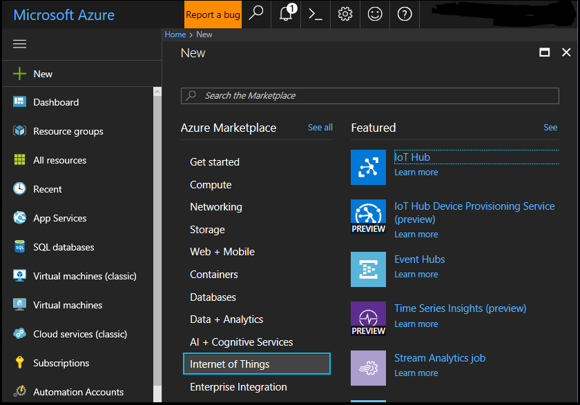
    
1. Choose a name for the IoT Hub, Pricing Tier, IoT Hub Units, Resource Group Name, and Location (e.g. West US) and click 'Create'

    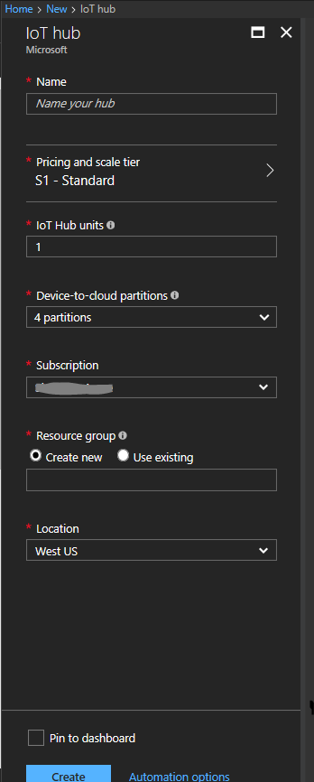

1. Make note of the IoT Hub Hostname.

    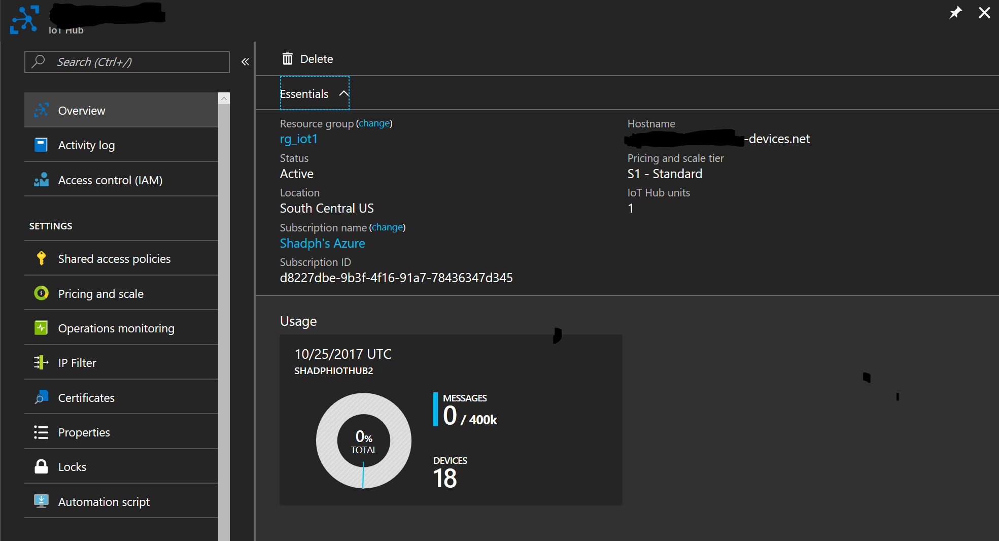    

1. Click on Shared access policies > iothubowner and not the primary key and Connection string.

    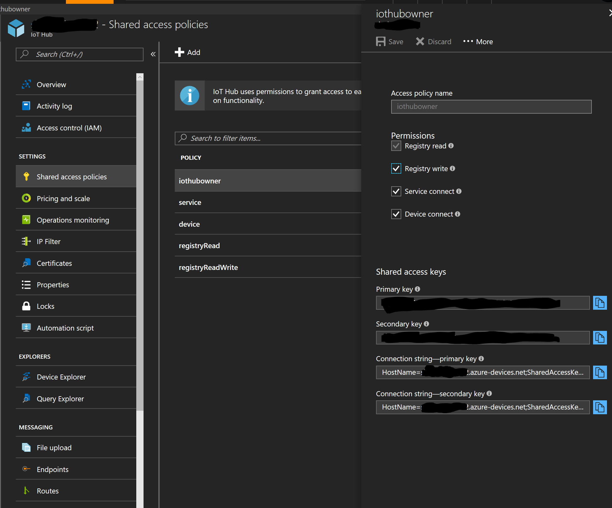

## IoT Cold Path to Storage

Now let's configure the IoT Hub to output messages to an Azure Storage Table Account.

1. In the Azure Portal Create an Azure Storage Account

    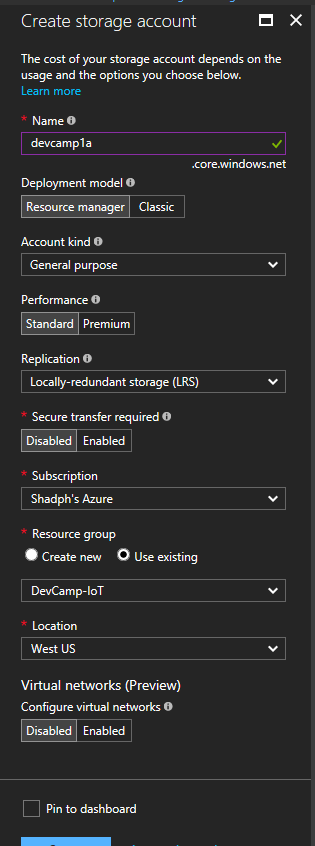

1. In the Azure Portal Create an Azure Function App, make sure to Select Existing for the Storage Account and select the storage account created in the previous step.

    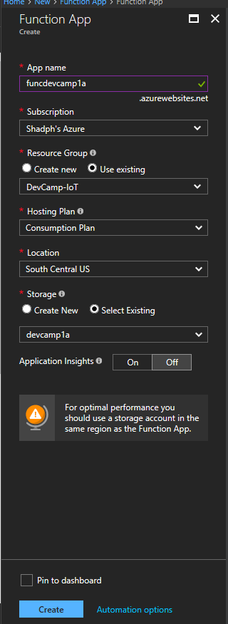

1. Once the function is created click on the Azure Function in the Portal and add a new function.

    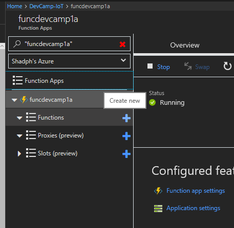

1. Click on "create your own custom function"

    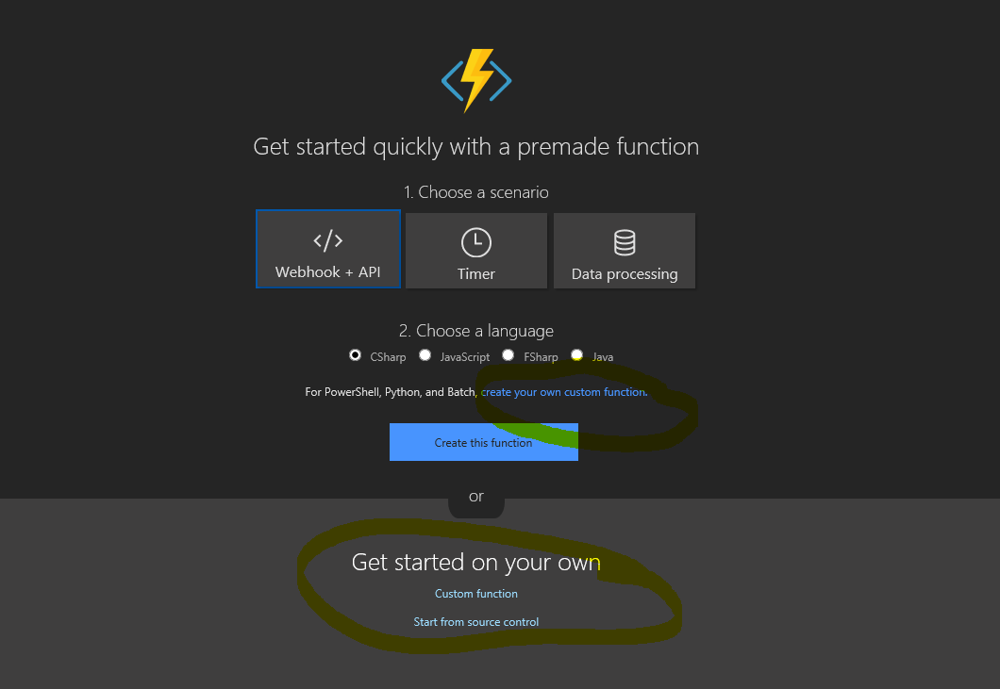

1. Choose JavaScript in the language dropdown, Core in the Scenario dropdown, and select "EventHubTrigger - JavaScript"

    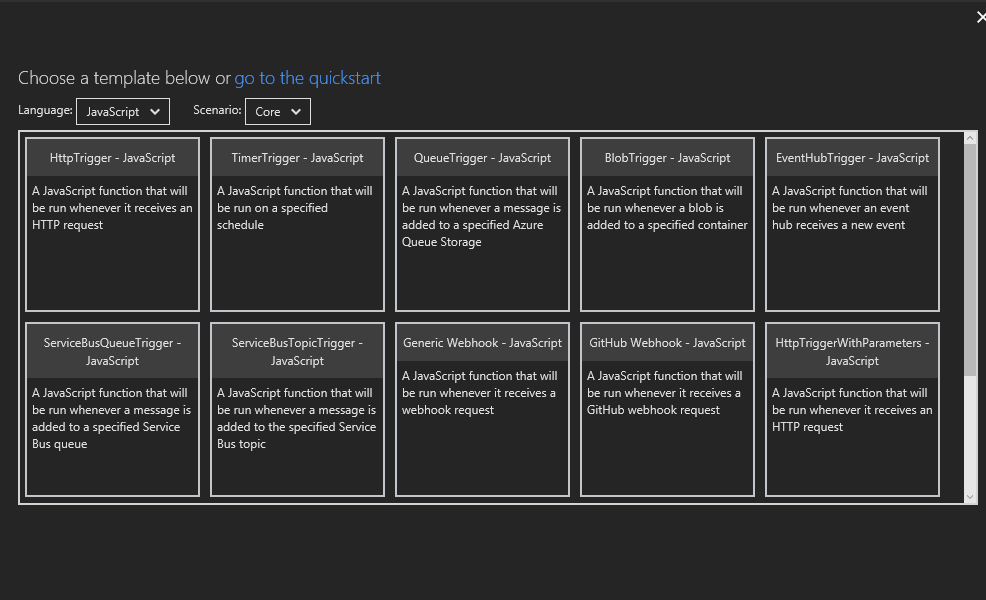

1. Next to the Event Hub connection box, select the new link

    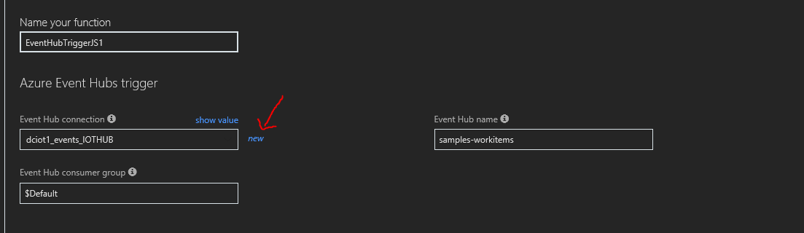

1. In the dialouge box that opens select IoT Hub, your IoT Hub, then Events as the Endpoint.

    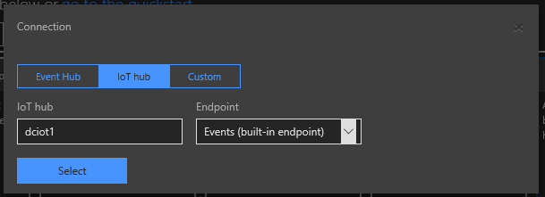

1. Leave the other values with their defaults and click Create It should look something like this.

     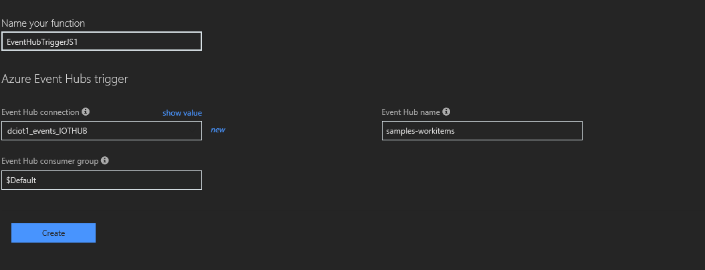
    
1. This will open up the index.js file where you should add the following JavaScript
    ```JavaScript
    'use strict';
    module.exports = function (context, iotHubMessage) {
        context.log('Message received: ' + JSON.stringify(iotHubMessage));
        var date = Date.now();
        var partitionKey = Math.floor(date / (24 * 60 * 60 * 1000)) + '';
        var rowKey = date + '';
        context.bindings.outputTable = {
            "partitionKey": partitionKey,
            "rowKey": rowKey,
            "message": JSON.stringify(iotHubMessage)
        };
        context.done();
    };

1. Now click on the Integrate section of the Function > then click on +New Output > Choose Azure Table Storage > Click Select
    
    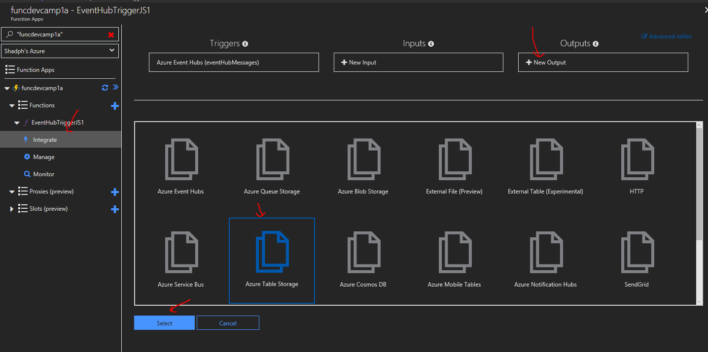

1. Leave the default values click Save

    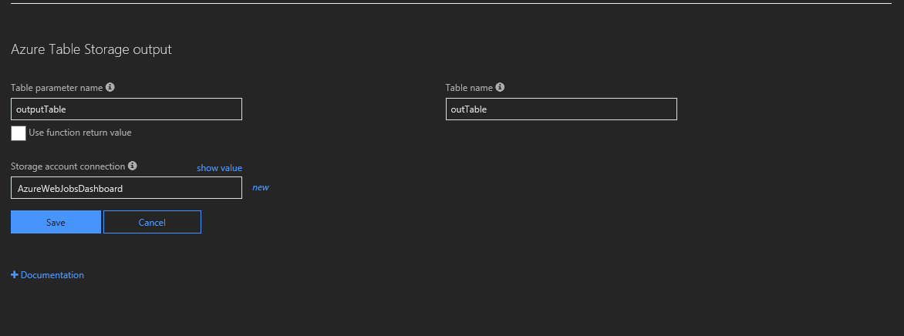

1. Now use the Storage Explorer to connect to the Azure Table Storage so we can see the device messages stored in the Table. You will need to get the Storage Account name and keys from the portal.

    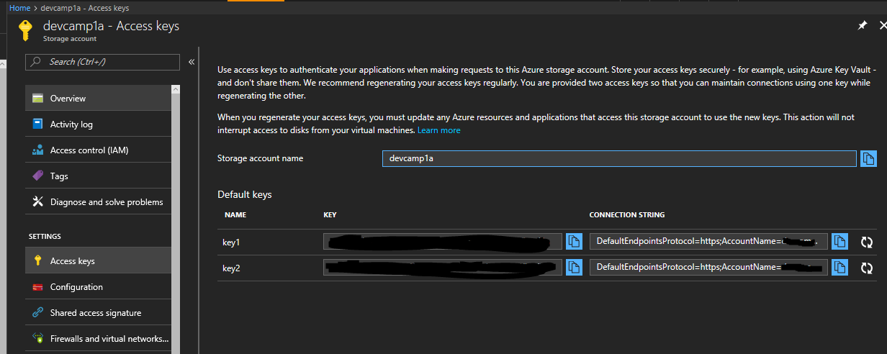

1. Open Stroage Explorer > Connect to Azure Storage > Use Stroage account name and key

    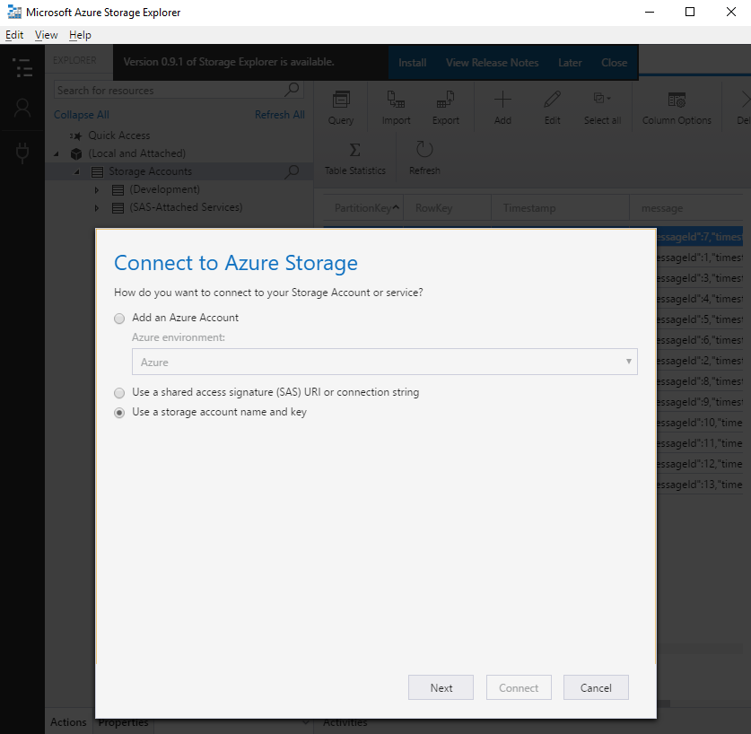

1. Enter your storage account name and key and click next > click Connect.

    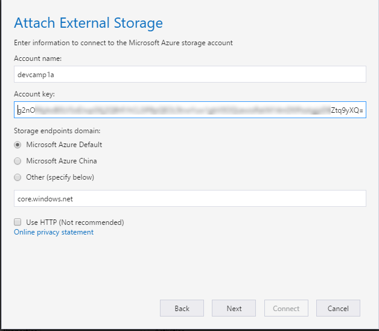

# Exercise 2: Create the Apps<a name="ex2"></a>

Create the apps to create the devices in the IoT Hub and the app to simulate a device sending messages to the IoT Hub.

## Device Creation App

This application will create multiple devices in the IoT Hub

1. Open Visual Studio 2017 and create a new console application. Called Create Devices

    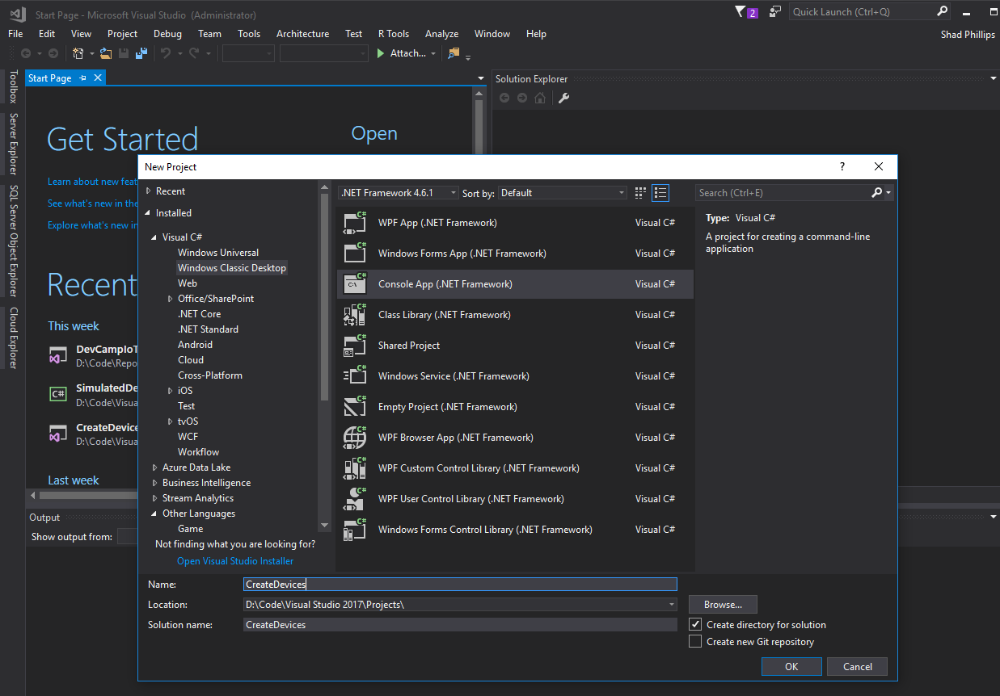
1. Right click on References in the Solution Explorer > Manage Nuget Pacckages > Browse > and search for "Microsoft.Azure.Devices" > Click on Install

    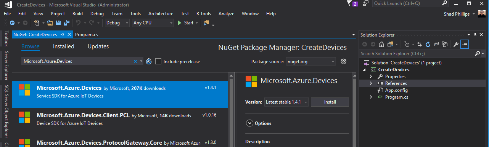

1. Click on OK in the Review Changes dialouge > Then I Accept on the License Acceptance dialouge

    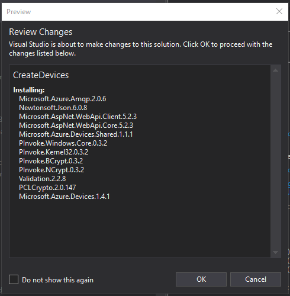 3
    
    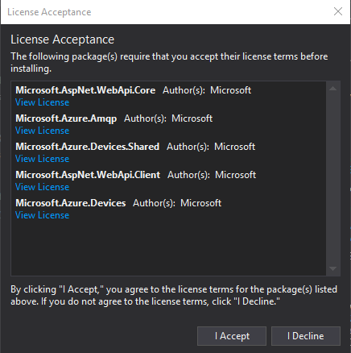 
---
1. Open Program.cs and add the following at the top of the file

    ```csharp
    using Microsoft.Azure.Devices;
    using Microsoft.Azure.Devices.Common.Exceptions;

1. Inside the Program Class add the following:
    ```csharp
    static RegistryManager registryManager;
    static string connectionString = "<IoT Hub Connection String>";

    static string[] deviceName = new string[18] { "k1tx1", "k1tx2", "k1tx3", "k1tx4", "k1tx5", "k1tx6", "k1tx7", "k1tx8", "k1tx9", "sthlk1", "sthlk2", "sthlk3", "sthlk4", "sthlk5", "sthlk6", "sthlk7", "sthlk8", "sthlk9" };
    
    static string[] latitude   = new string[18] { "32.924276", "32.923664", "32.923556", "32.923556", "32.922763", "32.922079", "32.921502", "32.92107", "32.920566", "32.938589", "32.937923", "32.937455", "32.93668", "32.936338", "32.935366", "32.934321", "32.932736", "32.930341" };
    
    static string[] longitude  = new string[18] { "-97.295136", "-97.296081", "-97.29681", "-97.297626", "-97.297668", "-97.297497", "-97.296853", "-97.295866", "-97.294836", "-97.14298", "-97.143431", "-97.143753", "-97.144439", "-97.14474", "-97.144954", "-97.14489", "-97.144654", "-97.142723" };
1. Add the following function to the class. This will add the device into the IoT Hub and write out the device key to the console that we will use later on in the lab.
    ```csharp
        private static async Task AddDeviceAsync(string name, string lat, string lon)
        {
            string deviceId = name;
            Device device;
            try
            {
                device = await registryManager.AddDeviceAsync(new Device(deviceId));
            }
            catch (DeviceAlreadyExistsException)
            {
                device = await registryManager.GetDeviceAsync(deviceId);
            }
            Console.Write("'{0}', ", device.Authentication.SymmetricKey.PrimaryKey);
        }

1. Add the folling code into the Main method.
    ```csharp
    registryManager = RegistryManager.CreateFromConnectionString(connectionString);
    for (int i = 0; i < deviceName.Length; i++)
    {
        AddDeviceAsync(deviceName[i], latitude[i], longitude[i]).Wait();
    }
    Console.ReadLine();
1. Now press F5 or Run to debug the application. It will create all the devices in the IoT Hub and output their keys to the console. Make sure to copy the out put from the console. We will use that later in the lab.

    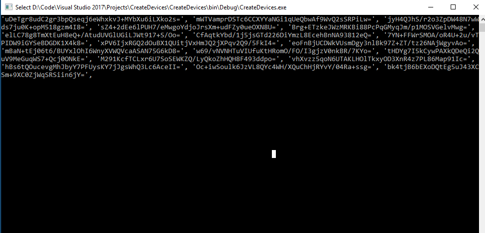 

If you forget to copy the console output, you can also get the device keys from the Azure Portal > Your IoT Hub > Device Explorer > Click on the device.

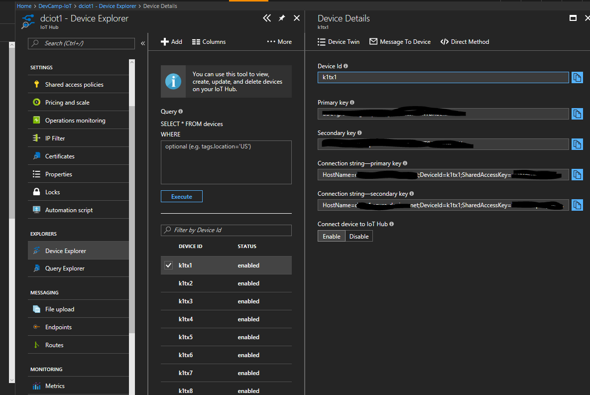 

## Device Simulator Application

1. Add a .NET Core Console project to the current solution in Visual Studio 2017 called CoreSimulatedDevice.

    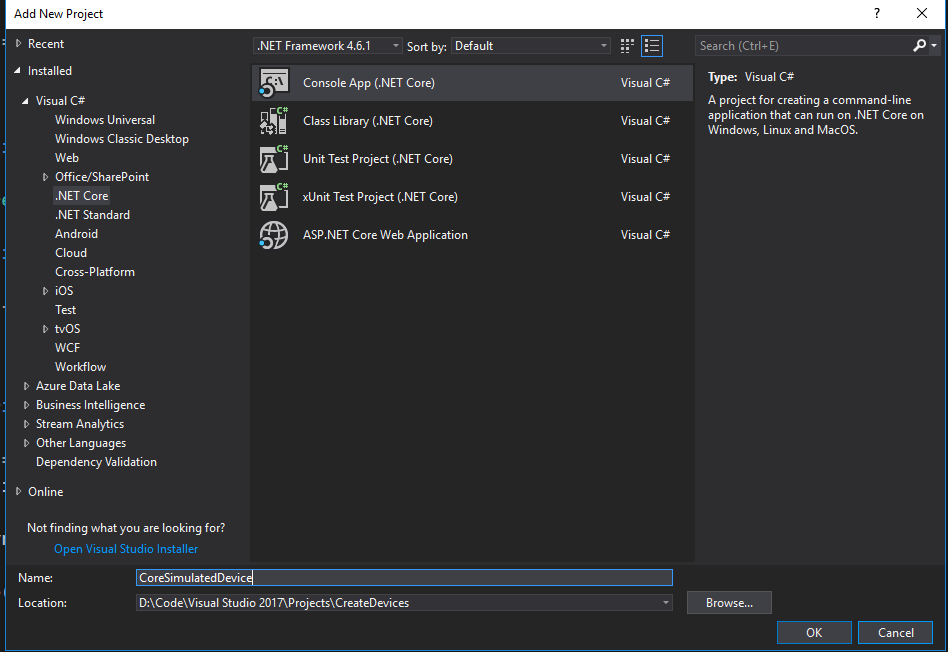

1. Right click on Dependencies in the solution explorer and click on Manage NuGet packages > Browse > and enter 
"Microsoft.Azure.Devices.Client" > and Click Install

    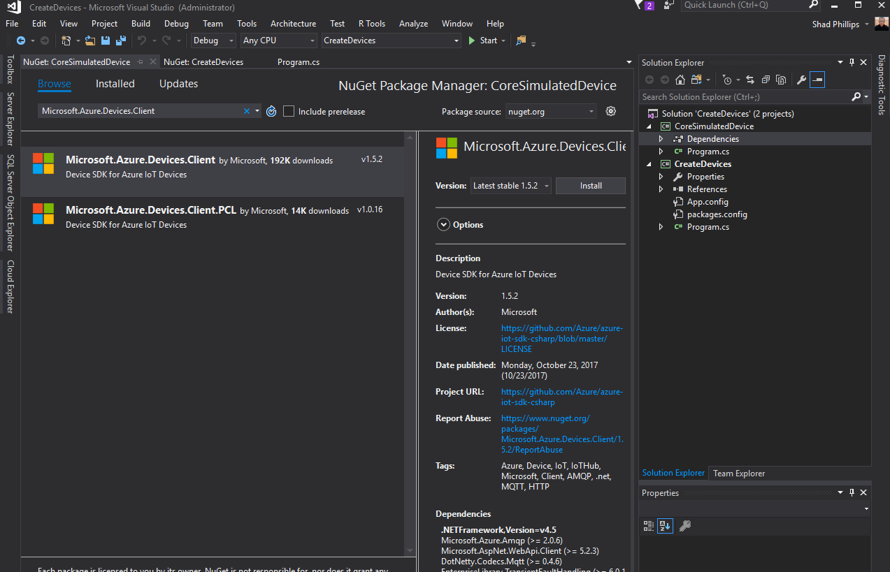

1. Click on Ok on the Review Changes dailouge

    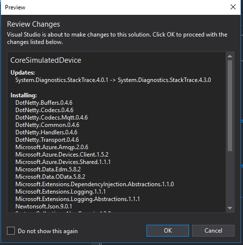

1. Click on 'I Accept' in the Licence Acceptance dialouge

    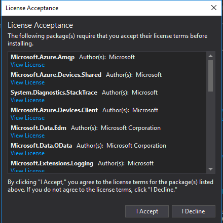

1. Add the following to the Program.cs file

    ```csharp
    using System.Text;
    using Microsoft.Azure.Devices.Client;
    using Newtonsoft.Json;
    using System.Threading.Tasks;

1. Add the folling inside the CoreSimulated class
    ```csharp
    static DeviceClient deviceClient;
    static string iotHubUri = null;
    static string deviceKey = null;
    static string deviceName = null;
    static string deviceLatitude = null;
    static string deviceLongitude = null;

1. Add the following method to the CoreSimulated class
    ```csharp
     private static async Task SendDeviceToCloudMessagesAsync()
        {
            double minTemperature = 20;
            double minHumidity = 60;
            int messageId = 1;
            Random rand = new Random();

            while (true)
            {
                double currentTemperature = minTemperature + rand.NextDouble() * 15;
                double currentHumidity = minHumidity + rand.NextDouble() * 20;

                var telemetryDataPoint = new
                {
                    messageId = messageId++,
                    timestamp = System.DateTime.UtcNow.ToString(),
                    deviceId = deviceName,
                    temperature = currentTemperature,
                    humidity = currentHumidity,
                    longitude = deviceLatitude,
                    latitude = deviceLongitude
                };
                var messageString = JsonConvert.SerializeObject(telemetryDataPoint);
                var message = new Message(Encoding.ASCII.GetBytes(messageString));
                message.Properties.Add("temperatureAlert", (currentTemperature > 30) ? "true" : "false");

                Console.WriteLine("{0} > Sending message: {1}", DateTime.Now, messageString);

                await deviceClient.SendEventAsync(message);
                await Task.Delay(1000);
            }
        }

1. Add the following to the Main method
    ```csharp
    iotHubUri = Environment.GetEnvironmentVariable("IOTHUB_URI");
    deviceName = Environment.GetEnvironmentVariable("DEVICE_NAME");
    deviceKey = Environment.GetEnvironmentVariable("DEVICE_KEY");
    deviceLatitude = Environment.GetEnvironmentVariable("DEVICE_LATITUDE");
    deviceLongitude = Environment.GetEnvironmentVariable("DEVICE_LONGITUDE");

    Console.WriteLine("Device Name: " + deviceName);
    Console.WriteLine("Device Key: " + deviceKey);
    Console.WriteLine("Device Latitude: " + deviceLatitude);
    Console.WriteLine("Device Longitude: " + deviceLongitude);

    deviceClient = DeviceClient.Create(iotHubUri, new DeviceAuthenticationWithRegistrySymmetricKey(deviceName, deviceKey), TransportType.Mqtt);
    SendDeviceToCloudMessagesAsync().Wait();

1. We will need a device id, it's key, latitude, and longitude to test our console application. We can use the first device we have defined in the earlier application.

* IOT Hub URI: Get that from the Azure Portal
* Device Id: k1tx1
* Device Key: Get that from the console output or from the Azure portal in the IoT Hub Device Explorer
* Latitude: "32.924276"
* Longitude: "-97.295136"


Now right click on the CoreSimulatedDevice Project in the Solution Explorer > Properties > Debug > and add Environment Variables and add the following Environment Variables and set the values to what was collected above.

* IOTHUB_URI
* DEVICE_NAME
* DEVICE_KEY
* DEVICE_LATITUDE
* DEVICE_LONGITUDE

    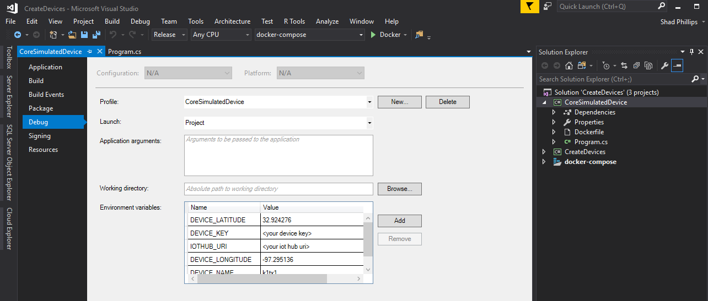

1. Right click on your solution in the Solution Explorer > Properties > Startup Project and slect Single startup project and select CoreSimulatedDevice from the dropdown.

    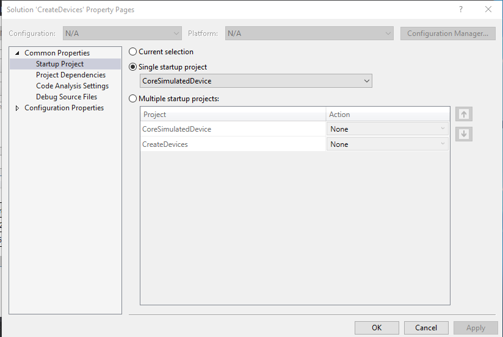

1. Now press F5 or Run to debug the application. We should see messages being sent to the IoT Hub.

    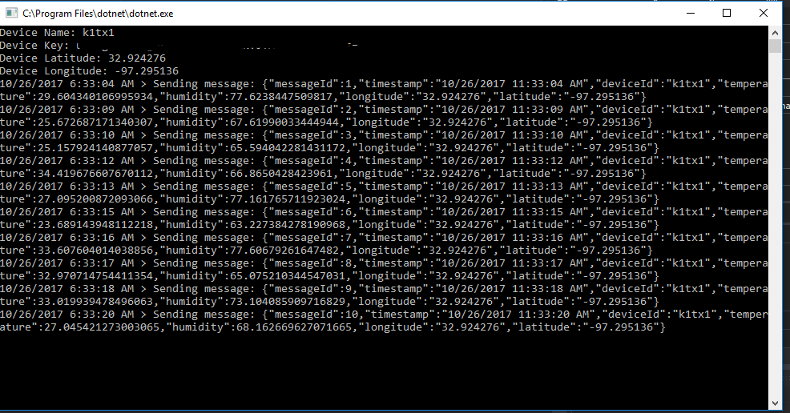

# Exercise 3: Build the Docker Image<a name="ex3"></a>

## Build the Docker Image
Now we will put our CoreSimulatedDevice into a docker image. First we will do it locally to test it then we will deploy

1. In Visual Studio 2017 in the Solution Explorer righ click on the CoreSimulatedDevice project > Add > Docker Support 

    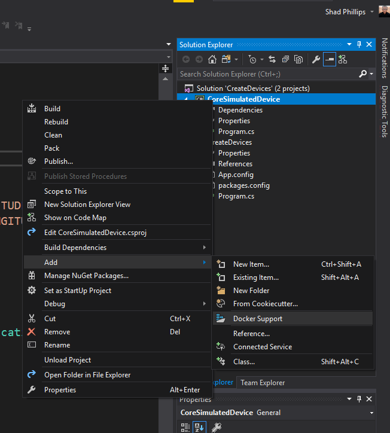

1. Click on Linux > Ok

    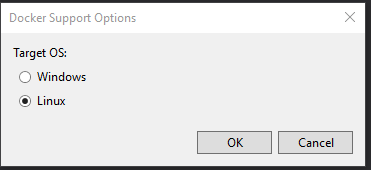

1. This will add a Dockerfile to the CoreSimulatedDevice project and will also add a new project to the solution called "docker-compose"

    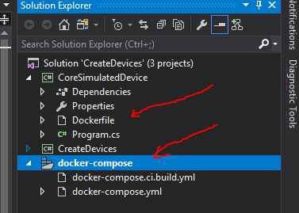

1. To build the image we need to build a release version of the CoreSimulated Device. To do this change the dropdown in the solution configuration dropdown to Release then build the solution.

    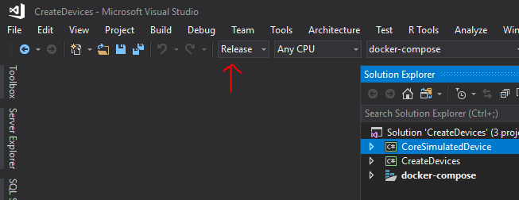


1. Open a command prompt or powershell terminal and change directory to the path of your visual studio solution and into the CoreSimulatedDevice project and run the following command to see what images you have running in your local Docker environment. If you just installed Docker for this lab, you should not see any images.

    ```powershell
    docker images

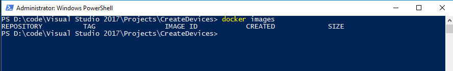

1. Again, make sure you are in the path of your solution and the CoreSimualtedDevice Project( e.g. "D:\Code\Visual Studio 2017\Project\CreatedDevices\CoreSimulatedDevice")

    ```powershell
    docker build -t coresimulateddevice .

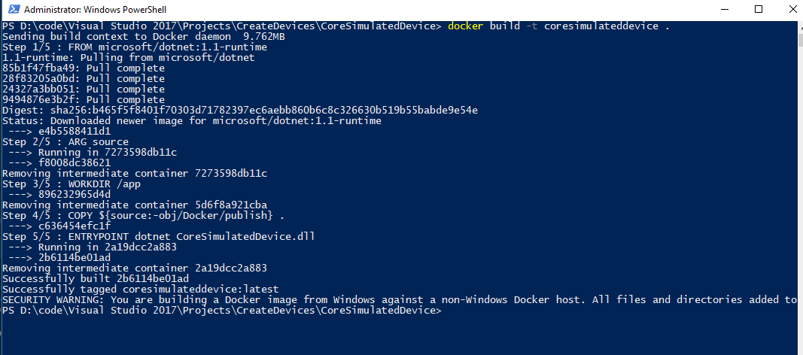

1. Now run the following command again, and you should see our coresimulateddevice and the microsoft/dotnet images in your local docker repository
    ```powershell
    docker images

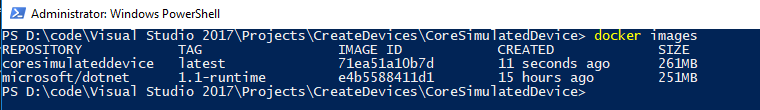


1. Now let's create a local container to test that our simulated device can run from a container
    ```powershell
    docker run -e "IOTHUB_URI=<YOUR IOT HUB URI>" -e "DEVICE_NAME=k1tx1" -e "DEVICE_KEY=<your device key" -e "DEVICE_LATITUDE=32.924276" -e "DEVICE_LONGITUDE=-97.295136" coresimulateddevice k1tx1

You should see the container sending messages to the IOT HUB

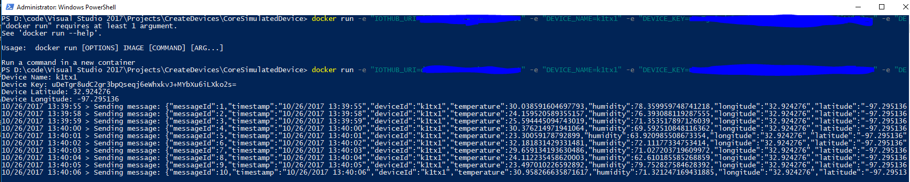

You can also use the Azure Storage Explorer to validate that the message are making it to the IOT Hub and our Table Storage.

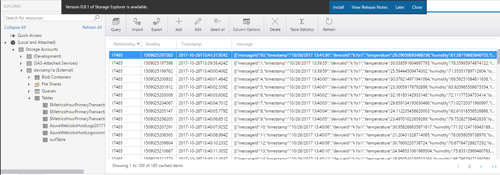

# Exercise 4: Deploy the image to Azure<a name="ex4"></a>

## Deploy and Azure Image Registry and push your image

1. In the Azure Portal Choose + New > Containers > Azure Container Registry (ACR)

    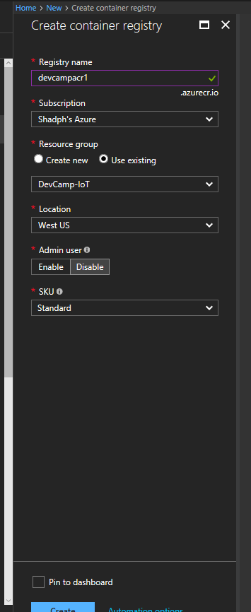

1. Once the ACR is created make sure to enable the Admin User by click on the Access Keys > Admin user > Enable. Then make note of the:

* Registry Name
* Login Server
* User Name:
* Password: 

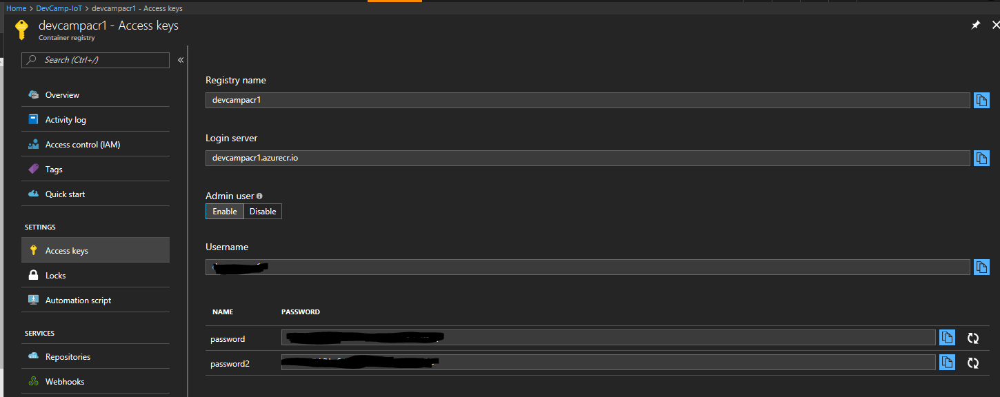

1. Now let's tag our local image for the ACR in a PowerShell Console and push it to the ACR

    ```powershell
    $resourceGroupName = <your resource group name>
    $acrName = <your acr name>
    
    Login-AzureRmAccount
    Select-AzureRmSubscription -Subscription <your subscription>

    $acr = Get-AzureRmContainerRegistry -ResourceGroupName $resourceGroupName -RegistryName $acrName
    $acrImageName = $acr.LoginServer + "/coresimulateddevice:v1"

    docker tag coresimulateddevice $acrImage

    $acrCreds = Get-AzureRmContainerRegistryCredential -RegistryName $acrName -ResourceGroupName $resourceGroupName

    docker login $acr.LoginServer -u $acrCreds.Username -p $acrCreds.Password
    docker push $acrImageName

You should see the image pushed the the ACR

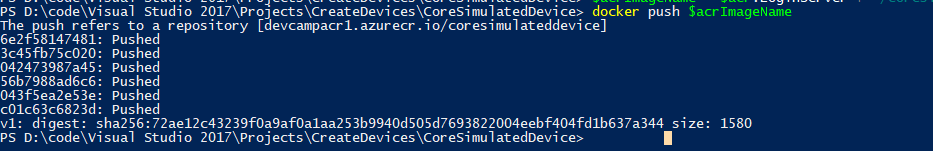

And in the Azure Portal

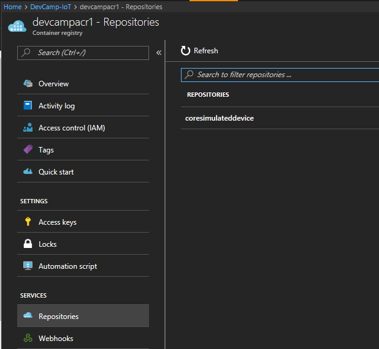


## Deploy an Azure Cotainer Instance (ACI) for each registered eevice to simulate load.

In this lab we'll use PowerShell to deploy an ACI for each device we want to simulate
1. Create a PowerShell Script to deploy the instances

    ```powershell
    Login-AzureRmAccount
    Select-AzureRmSubscription -Subscription "<your subscription here>"

    $rgName = "<your resource group name"
    $acrName = "<your acr name"
    $location = "westus"
    $imageName = "<your acr login server>/coresimulateddevice:v1"

    $deviceName = @("k1tx1", "k1tx2", "k1tx3", "k1tx4", "k1tx5", "k1tx6", "k1tx7", "k1tx8", "k1tx9", "sthlk1", "sthlk2", "sthlk3", "sthlk4", "sthlk5", "sthlk6", "sthlk7", "sthlk8", "sthlk9" )

    $latitude   = @( "32.924276", "32.923664", "32.923556", "32.923556", "32.922763", "32.922079", "32.921502", "32.92107", "32.920566", "32.938589", "32.937923", "32.937455", "32.93668", "32.936338", "32.935366", "32.934321", "32.932736", "32.930341" )

    $longitude  = @( "-97.295136", "-97.296081", "-97.29681", "-97.297626", "-97.297668", "-97.297497", "-97.296853", "-97.295866", "-97.294836", "-97.14298", "-97.143431", "-97.143753", "-97.144439", "-97.14474", "-97.144954", "-97.14489", "-97.144654", "-97.142723" )

    
    $keys = @('<device keys here>', '<device keys here>', '<device keys here>', '<device keys here>', '<device keys here>', '<device keys here>', '<device keys here>', '<device keys here>', '<device keys here>', '<device keys here>', '<device keys here>', '<device keys here>', '<device keys here>', '<device keys here>', '<device keys here>', '<device keys here>', '<device keys here>', '<device keys here>')

    $acr = Get-AzureRmContainerRegistry -ResourceGroupName $rgName -Name $acrName
    $loginServer = $acr.LoginServer
    $acrCreds = Get-AzureRmContainerRegistryCredential -RegistryName $acrName -ResourceGroupName $rgName 
    $secpasswd = ConvertTo-SecureString $acrCreds.Password -AsPlainText -Force
    $acrcred = New-Object System.Management.Automation.PSCredential ($acrCreds.Username, $secpasswd)

    ##Create a single container to test
    #Write-Host "deviceName: " $deviceName[0] 
    #Write-Host "deviceLat: "  $latitude[0] 
    #Write-Host "deviceLong: " $longitude[0] 
    #Write-Host "key: " $keys[0]
    #$EnvironmentHash = @{"IOTHUB_URI"=$loginServer;"DEVICE_NAME"=$deviceName[0];"DEVICE_KEY"=$keys[0];"DEVICE_LATITUDE"=$latitude[0];"DEVICE_LONGITUDE"=$longitude[0]}
    #New-AzureRmContainerGroup -ResourceGroupName $rgName -Name $deviceName[$i] -Image $imageName `
    #    -Location $location -OsType Linux -Cpu 1 -MemoryInGB 1 -IpAddressType Public -RegistryCredential $acrcred -EnvironmentVariable $EnvironmentHash
    ##Show the Console output from the first container
    #Get-AzureRmContainerInstanceLog -ContainerGroupName $deviceName[0] -ResourceGroupName $rgName
    ##Remove the test ACI
    #Remove-AzureRmContainerGroup -ResourceGroupName $rgName -Name $deviceName[0]


    #Create all the containers
    for($i=0; $i -lt $deviceName.Length; $i++)
    {
        Write-Host "deviceName: " $deviceName[$i] 
        Write-Host "deviceLat: "  $latitude[$i] 
        Write-Host "deviceLong: " $longitude[$i] 
        Write-Host "key: " $keys[$i]
        $EnvironmentHash = @{"IOTHUB_URI"=$loginServer;"DEVICE_NAME"=$deviceName[$i];"DEVICE_KEY"=$keys[$i];"DEVICE_LATITUDE"=$latitude[$i];"DEVICE_LONGITUDE"=$longitude[$i]}
        New-AzureRmContainerGroup -ResourceGroupName $rgName -Name $deviceName[$i] -Image $imageName `
        -Location $location -OsType Linux -Cpu 1 -MemoryInGB 1 -IpAddressType Public -RegistryCredential $acrcred -EnvironmentVariable $EnvironmentHash
    }


    ##Clean up Containers when done testing
    for($i=0; $i -lt $deviceName.Length; $i++)
    {
        Remove-AzureRmContainerGroup -ResourceGroupName $rgName -Name $deviceName[$i]
    }

If you deploy all the device containers you should see something similar to this in the output terminal

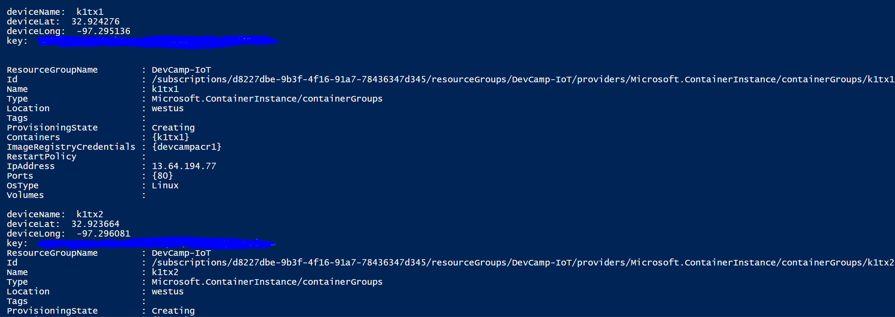

You should also see them created in the portal

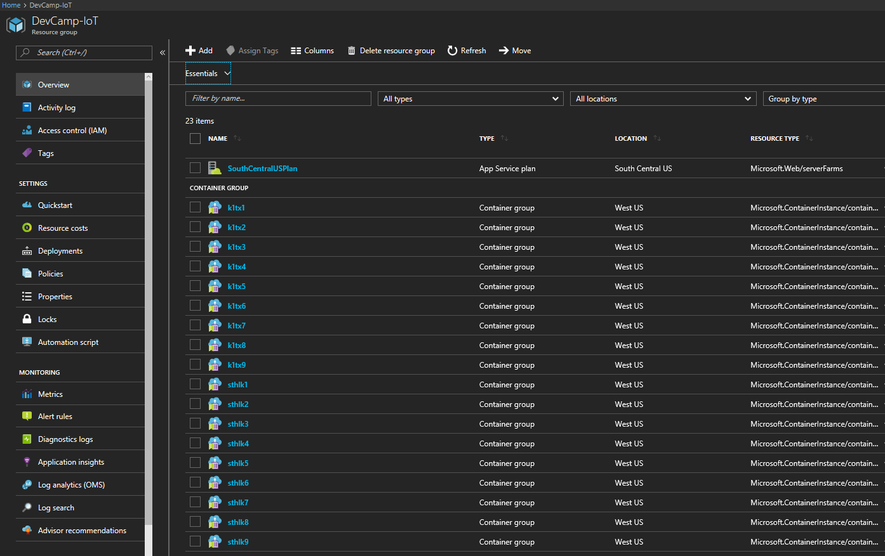

You should also see messages in the Azure Table Storage from multiple devices now

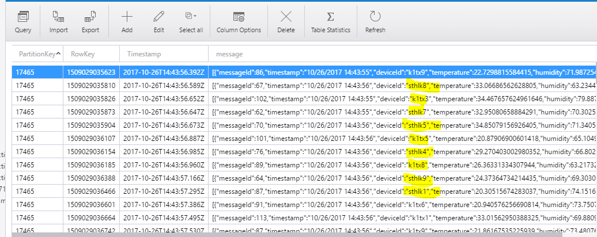


Copyright 2016 Microsoft Corporation. All rights reserved. Except where otherwise noted, these materials are licensed under the terms of the MIT License. You may use them according to the license as is most appropriate for your project. The terms of this license can be found at https://opensource.org/licenses/MIT.