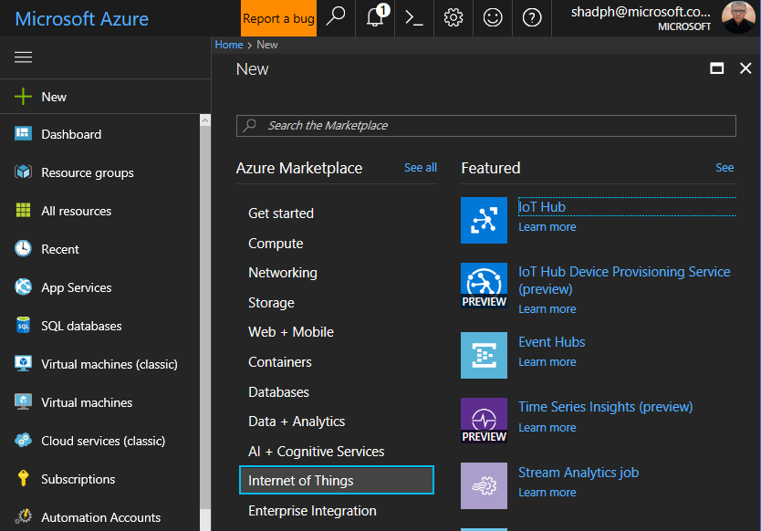
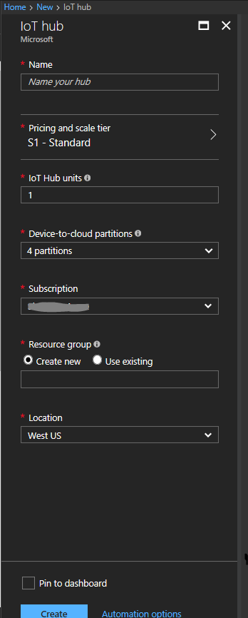

# Hands on Lab - IoT Hub

## Overview

In this lab you will setup an Azure IOT Hub, Create Devices, Code a .NET Core simulated device application, and deploy it as an Azure Container Instance.

## Objectives
In this hands-on lab, you will learn how to:

* Deploy an IOT HUB and create devices
* Devloper the IoT Hub .NET Applications
1. App to create the devices in the IoT Hub
2. App to simulated devices sending messages
3. App to send cloud to device messages
4. App to read device to cloud messages
* Build a docker image of the simulated device
* Deploy device as an Azure Container Instance

## Prerequisites
* You will need ot have docker installed on your work station. Docker can be found here  [here](https://www.docker.com/docker-windows)
* The source for the starter app is located in the [start](start) folder. 
* The finished project is located in the [end](end) folder. 
* Deployed the starter ARM Template [HOL 12](../01-developer-environment).

## Exercises

This hands-on-lab has the following exercises:

* [Exercise 1: Create the IoT Hub](#ex1)
* [Exercise 2: Create the Apps](#ex2)
* [Exercise 3: Build the Docker image](#ex3)
* [Exercise 4: Deploy the image](#ex4)

### Note
> ***In the hands-on-labs you will be using Visual Studio Solutions. Please do not update the NuGet packages to the latest available, as we have not tested the labs with every potential combination of packages.*** 

---
## Exercise 1: Create the IoT Hub

Create an IoT hub for our simulated devices to send messages to. 

1.  Sign in to the Azure Portal and select New > Internet of Things > IoT Hub

    
    
2. Choose a name for the IoT Hub, Pricing Tier, IoT Hub Units, Resource Group Name, and Location (e.g. West US) and click 'Create'

    

3. Make note of the IoT Hub Hostname.

        

4. Click on Shared access policies > iothubowner and not the primary key and Connection string.

    

## Exercise 2: Create the Apps

Create the apps to create the devices in the IoT Hub and the app to simulate a device sending messages to the IoT Hub.

1. Open Visual Studio 2017 and create a new console application
---
Copyright 2016 Microsoft Corporation. All rights reserved. Except where otherwise noted, these materials are licensed under the terms of the MIT License. You may use them according to the license as is most appropriate for your project. The terms of this license can be found at https://opensource.org/licenses/MIT.