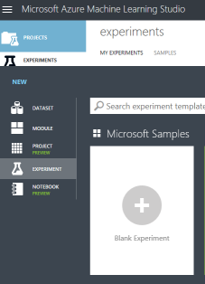

NOTE: This is still a work in progress. Proceed at your own risk. 

# Machine Learning
In this lab, you will extend the City, Power, and Lights (CPL) application to leverage Machine Learning. Exercises 1-3 can be completed without the working City, Power, and Lights application. In these exercises, we will use real world data from New York City's Department of Transportation to create a model predicting how long a repair will take, publish this model as a web service, and then use this web service in the application to show the user a reasonable estimation for time to repair.    
   
Machine Learning Studio supports many types of predictive models capable of regression, classification, clustering, and anomaly detection. Choosing a model type for a given real world prediction can be very difficult: data scientists often test multiple model types against their data to see which performs the best. Frequently, the best results are obtained by combining multiple models of different types together. While a full inventory and examination of the (growing) model types supported by Azure Machine Learning Studio is beyond the scope of this exercise, a good starting place to learn more would be the Azure Machine Learning Studio Cheat Sheet poster: https://docs.microsoft.com/en-us/azure/machine-learning/studio/algorithm-cheat-sheet, or the more detailed documentation available at https://docs.microsoft.com/en-us/azure/machine-learning/studio/algorithm-choice.   
  
For our exercise, we will use a Neural Network Regression model. We will use a "Regression" model (as opposed to classification, clustering, or anomaly detection) as we are trying to predict how long a repair will take. Our goal will be to product a model that, given information about the complaint such as "Complaint Type", when the complaint was reported, and the location of the incident, will return a single value indicating how long the model predicts the repair will take, based on training data we will supply. 

We will leverage a "Neural Network" as it is a good generic model type to use when you do not know much about the underlying data or its patterns. While they Neural Networks are amongst the slowest and resource-intensive models to train, they are extremely well-suited to identifying and expressing very complicated patterns to a high degree of accuracy. In fact, a major drawback of Neural Networks is that their models are almost impossible to be interpreted by a human once they have been created, unlike other model types such as decision trees.   
  
 

Neural Networks originated at the intersection of neuroscience and early modern computing in the 1940s, and seek to replicate how neurons in animal brains operate. At its basic level, a single neuron (biological or computational) consists of a unit with 1-many inputs, and 1-many outputs, with each input assigned a weight. Each output is the sum-product of the inputs and their associated weights, usually after being processed through another function to simulate a threshold. A Neural Network is a collection of many neurons. By default, Azure Machine Learning Studio's Neural Network models use a single "hidden" layer with all neurons "fully connected". However, using Net# (https://docs.microsoft.com/en-us/azure/machine-learning/studio/azure-ml-netsharp-reference-guide), more complicated arrangements can be easily expressed, such as 2 layer models often used for Optical Character Recognition (OCR). The default single-layer model is arranged similar to:  
  
 
  
There are usually significantly more neurons in the "Hidden Layer" compared to the number of inputs. The "learning" is accomplished via iterations. At first, each neuron is given a starting (often random or uniform) set of weights for each input. A set of inputs with known outputs (training data) are provided, and for each of these, the Neural Network's expected output is computed and compared to the known output. Based on how "wrong" the neural network's prediction was compared to the known output, a mathematical function is applied to each weight, hopefully resulting in a slightly more accurate model. This new model's accuracy is then recomputed, and its weights adjusted. This process is repeated a number of times (configurable in Machine Learning Studio). If you specify too few iterations, the model is not sufficiently tuned and provides inaccurate results. However, too many iterations often results in an "over-trained" model in which the Neural Network identifies patterns present in the training data that don't necessarily work when applied to real world data. Creating the "training set" of known data, and also ensuring a sufficient "evaluation set" of data to test the model once it has been trained is a very important step in Machine Learning. See https://www.jefftk.com/p/detecting-tanks for a (possibly apocryphal) example of overtraining. 

****************************************
## Exercise 1: Configure Machine Learning Studio & Preparing our data ## 
In this exercise, we will take a look at the data we will be using to train our model and open Azure Machine Learning Studio 

### 1. Gather the data ###
Download the sample dataset from https://github.com/AzureCAT-GSI/DevCamp/blob/14mlinit/HOL/dotnet/14-ML/NY_complaints_to_DOT_CPL.csv, and open it in a text editor or preferably Excel. You'll see that it is a Comma Separated Value (CSV) formatted text file with linebreaks for each row, with column headers in the first row. This data was originally downloaded from https://data.cityofnewyork.us/Social-Services/Street-Lights-and-Traffic-Signals-311-Service-Requ/jwvp-gyiq. Slight alterations have been made:
* Since New York uses different categories of complaints than our City, Power, and Lights application, we have substituted CPL categories to allow us to use this model against CPL's application in Exercise 3. Example mappings used include: "Traffic Signal Condition" -> "Street light-Light Goes On and Off", "Highway Condition" => "Pot hole", and "Opinion for the Mayor" => "Gas leak"
* We have extracted a few features (columns) in order to improve predictive quality, including "Duration_Days" ("Closed Date" - "Created Date"), as well as Year, Month, Day of Month, and Day of Week for "Created Date". If you desire an additional challenge at the end of the exercise, these features could be created in the Machine Learning Studio.
* In order to ensure that you can generate a good model in a reasonable amount of time for this exercise, duration_days have been generated artificially. The algorithm used to generate the artificial durations was reasonably complex and included random noise to ensure realism- feel free to examine the data to see if you can locate any human-identifiable patterns (there shouldn't be any).  
  

### 2. Open Machine Learning Studio ###
Navigate to https://portal.azure.com and sign in. Click on "New", and search for "Machine Learning Studio Workspace"  
  
  
  
Click on "Create"   
  
 
   
Name your workspace "DevCamp_ML", and add it to the existing DevCamp Resource Group. Choose the same location you've used previously. Create a new storage account "devcampmlstorage", and ensure that your workspace is in the "Standard" pricing Tier and your Web Service Plan is "S1".   
  
  

### 3. Launch Machine Learning Studio ###
Go into the DevCamp Resource Group, and select the newly created Machine Learning Studio Workspace, and then "Launch Machine Learning Studio".     
  
  
  
If you are not already, sign in using the same credentials you used for the Azure Portal  
  
  
  
If you have previously used Machine Learning Studio, make sure you are in the newly created "DevCamp_ML" workspace using the dropdown in the top-right corner. It should be empty.   
  
  

### 4. Upload our data set ###
Choose "Datasets" and click new, then upload our sample data "from a local file"  
  

    
   

************************************************************************************

## Exercise 2: Train a Data Model ##
In this exercise, we will use the data from Exercise 1 to train a neural network to estimate how long a repair will take
### 1. Create a new blank experiment in Machine Learning Studio  ###  
  
 
   
### 2. Add the dataset to your workspace ###  
In the toolbox, expand Saved Datasets -> My Datasets. You should see the data set uploaded in Exercise 1 (if not, check to see if it has completed uploading). Drag the dataset into your workspace  
  
  
  
### 3. Remove rows with missing values ###  
First, let's clean our data. For this sample, we will be fairly intolerant - we'll drop any row that has any missing values. Drag a "Clean Missing Data" module (Data Transformation -> Manipulation) into our workspace, and connect our dataset to its input. Configure it in the right taskpane as follows:   
* All Columns
* Cleaning Mode: remove entire row  
  
  
  
### 4. Partition our data into "Training" and "Evaluation" sets
We need to split our data into training data and evaluation data. The training data will be used by the neural network to create the model, but need to make sure we have some data "set aside" to allow us to evaluate the quality of our model before we use its predictions in production. Using the training data for evaluation can often result in "over-training", where a model provides excellent results against its input data, but fails to make accurate predictions when provided with new data. Our sample data contains information from 1/1/2014 through 9/13/17, so a natural split will be to separate all data before 6/1/17 as training, and the data afterwards as evaluation data. This gives us a good evaluation - we can pretend we used "all information available" in June 2017, and see how the model would have performed from June -> Sep 2017, and leaves enough data in the "training set" to identify long term annual and seasonal patterns. We'll do this in 2 steps: first by year, then by month. For the year split, drag a "Split Data" module (Data Transformation -> Sample & Split) into the workspace and connect it to our dataset. Configure it as follows:
* Mode = Relative Expression
* Relational expression = \"Created Year" < 2017  
  
Since we're going to have multiple "Split Data" modules, let's add a comment so that we can keep track. Right click on the module, and choose "Edit Comment". Decorate it with "Year < 2017", and then expand the module so you can see the comment.  
  
  
  
The left output of the "Year Split" module will now contain our data from 2014 - 2016, and the right output data from just 2017.   
  
Let's add another "Split Data" module to the right output and separate out Jan -> May and Jun+. Configure the new "Split Data" as follows:
* Mode = Relative Expression
* Relational expression = \"Created Month" < 7
* Edit Comment = Month < 7  
  
  
  
Now, our training data is separated into 2 buckets: 2014-2016 and Jan 2017-May 2017. Let's recombine them by adding an "Add Rows" module (Data Transformation->Manipulation). Connect the left output of the "Split Years" and the left output of the "Split Month" modules into the inputs of "Add Rows".  
  
  
  
### 5. Data Visualization ###  
Let's take a quick testing checkpoint. Run your model using the bottom toolbar, and visualize the data coming out of the components we've added. Right click on the "Add Rows" module and choose "Results Dataset" => "Visualize"  
  
  
  
Explore the various columns' statistics. Note that the frequency diagram for "Created_Year" has 3 roughly equal spikes (2014,2015,2016) and a shorter one for 2017. This makes sense, as we've truncated the 2017 data to Jan -> May  
  
  
  
Optionally, perform some quick spot checks, such as:
* The number of rows in the output of the "Add rows" module (our training sample) and the right output of "Split Months" (our evaluation sample) should equal the number of rows that went into the "Split Years" module.
* The evaluation sample should only have data from June 2017 - Sep 2017
* Make sure the "Duration Days" look clean - there should be no rows with Duration <= 0 
  
### 6. Shuffle ###  
We have one final data preparation step. While visualizing the output of the training sample, you may have noticed that our data is sorted by Complaint_Type. Neural networks perform very poorly on ordered data, so we'll want to randomize our data before we use it. Let's use another "Split Data" module, configured as follows:
* Splitting Mode: Split Rows
* Fraction of rows: 0.999
* Randomized Split: checked
* Random seed: Pick a number
* Stratified Split: False
* Edit Comment: Shuffle  
  
  
  
### 7. Modeling ### 
We are now ready for the main part of this exercise: the modeling! Drag in a "Neural Network Regression" module (Machine Learning -> Regression), and a "Train Model" module (Machine Learning-> Train). Connect the "Neural Network Regression" module to the left input of the "Train Model" module, and your training data set into the right output of the "Train Model" module. Then configure then modules as follows:
"Neural Network Regression" module:
* Trainer Mode: Single Parameter
* Hidden Layer: Fully-connected
* Hidden Nodes: 100
* Learning Rate: 0.005
* Learning Iterations: 10 (this is very low, but we want to process our data quickly - if we don't get good results, we can increase this)
* Initial Weights: 0.1
* Momentum: 0.001
* Type: Min-Max
* Shuffle Examples: checked  (Note: this should make our previous "Split Data" shuffle unnecessary. This was a newly released feature during the development of this lab, and did not always appear to shuffle fully during testing)
* Random number seed: Type in any number you choose  
  
For the "Train Model" module, choose "Duration Days" as the column to train against, as this is what we're trying to predict.  
   
  
  
### 8. Training the Model
Let's have another checkpoint to see how out model performs. Run your experiment. While the "Train Model" module is executing, you can watch its progress by clicking on "View output log". The most interesting data here is the "MeanErr" (actually the squared mean error), which is a gauge of how good the model is performing against the training data (which hopefully will replicate against the evaluation sample). In the case below, after 3 (out of 10) iterations, our squared error is extremely low: the square root of 2.16 is ~1.47, which means the model thinks is accurate to a day and a half against the training set, which indicates we're on the right track. Let the training complete.  
       
 
   
### 9. Use our Model to score our Evaluation Data  
Let's see how our model performed by using it against the evaluation sample. "Scoring" a dataset is a Machine Learning term that leverages a model against a dataset, adding the model's predictions as a new column.  Drag in a new "Score Model" module (Machine Learning -> Score), and connect the output of the "Train Model" module to its left input, and the evaluation sample (the right output of the "Split Months" module from a few steps back) to the right input. Ensure that it is configured to "append the score column", as we'll want to compare the model's predictions to our known durations in the evaluation data. Drag in an "Evaluate Model" module (Machine Learning-> Evaluate) and connect the output of "Score Model" to its left input. Run the experiment again.  Note: Machine Learning Studio is fairly intelligent, and will not rerun steps if the parameters/inputs into that step have not changed. Therefore, we can train our model now, and add more steps to our experiment later without having to re-execute the lengthy "Train Model" steps as long as we don't alter any of its inputs or parameters. 
     

      
### 10. Assess our Model's performance
Let's see how our model did against the evaluation sample. Visualize the output of the Evaluate Model module. Against my model, I got a "Mean Absolute Error" of 1.43 days, and almost all predictions were closer than 4 days.  
  
 
  
Overall, it seems like we have a very effective model. Let's eyeball the actual predictions. Visualize the output of the "Score Model" module and compare the "Duration Days" (which is our known duration) to the "Scored Label" column (our model's predictions). Compare the histograms - they have a similar shape, which is what we want. Look at a few rows of the data - the predictions should pretty accurate as well. The model performed very well on our evaluation sample, giving us good reason to believe that we have not over-trained against the sample data, and we can use it in our production system. 
  
   
  
Save your experiment using the bottom toolbar with a name such as DevCampML_CPL  

*****************************************
## Exercise 3. Publish our Model as a Web Service ##
### 1. Set Up the Prediction Web Service pipeline
Click on "Set up a Web Service" -> Predictive Web Service in the bottom toolbar. If this option is disabled, rerun your model (which should be quick as Machine Learning Studio remembers partial progress). In a new tab, new modules will be added to a copy of your experiment, and the data flow changed. 
  
 

### 2. Execute the Prediction Web Service
Click "Run" in the bottom toolbar to run this web service creation pipeline

### 3. Deploy
 Deploy the web service using the bottom toolbar. Use the "New" web service deployment option. Select the storage account and price plan (created in Exercise 1).  
   
 Click "Deploy".  
   
  

### 4. Test the Predictive Web Service
 On the next screen, click on "Test Web Service". Fill in realistic sample data, such as:
* Complaint Type: Pot hole
* Created Date: Today's date
* Descriptor: Pothole - highway
* Incident Zip: 10302
* Address Type: ADDRESS
* City: STATEN ISLAND
* Status: Closed
* Community Board: 01 STATEN ISLAND
* Borough: STATEN ISLAND
* Latitude: 40.6
* Longitude -74.17
* Created Month, etc: calculate using to match what you used for Created Date above
* Duration_Days: 0 (this is ignored).   
  
Click on "Test Request-Response"  
  
  
  
Try altering values (keep them in line with the sample data) and observe the changes in the "Scored Labels" (prediction) value. 
  
When you are ready to proceed, click on "Consume" in the top menu. This will provide the endpoint URI, keys, and even C# sample code.   
  
  

************************************************************************************
## Exercise 4: Use a Trained Data Model in an Application
(This exercise is under development)

************************************************************************************
## Optional extensions
1. Rerun the model to see if you can get more accurate results. Try increasing the number of iterations and the number of hidden nodes
1. Use an online source of data using the Import data tool
1. Use R to clean the data, or expand new features. As an example, remove the "Year","Month","DayofMonth","DayofWeek" columns from the dataset, and create them within Machine Learning Studio. This also results in a cleaner web service. 
1. Experiment with data cleansing tools such as "Clip Values" (Data Transformation -> Scale & Reduce) 
1. Clone the exercise and rerun it without the "randomizing step" and without "Shuffle" in the "Train Model" module, and compare the quality of the resulting model. Take a look into the "output log"s of the training and compare how quickly and effectively the "MeanError" diminishes with each iteration.  
