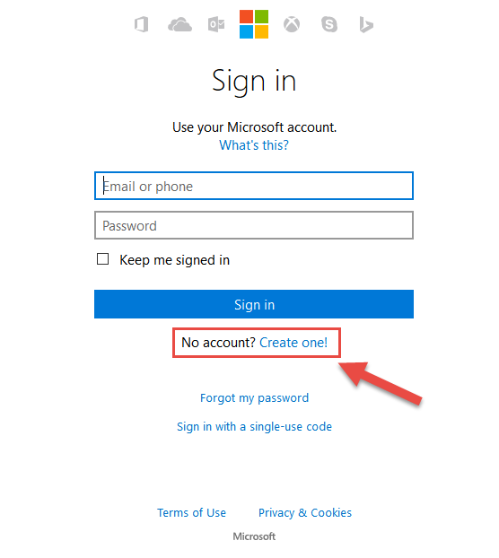

# Developer Environment (.NET)

## Overview
In this lab, you will set up the various developer accounts with Azure services and deploy a developer image to Azure.

## Objectives
In this hands-on lab, you will learn how to:
* Sign up for the various Microsoft developer programs
* Connect Office 365 with Azure
* Review the options for tooling

## Prerequisites

None 

## Exercises
This hands-on-lab has the following exercises:
* Exercise 1: Create a Microsoft Account 
* Exercise 2: Sign up for Visual Studio Dev Essentials
* Exercise 3: Sign up for Office 365
* Exercise 4: Sign up for Azure
* Exercise 4: Deploy and connect to a developer machine to Azure
* Exercise 5: Explore tools for Azure

### Exercise 1: XXX

1. If you do not already have a Microsoft Account, navigate to Live.com and ***No account? Create one!***

     

1. Fill out the sign up form and click  

### Exercise 2: XXX

Instructions and screenshots here

### Exercise 3: XXX

Navigate to dev.office.com

https://msdn.microsoft.com/en-us/office/office365/howto/setup-development-environment

https://portal.microsoftonline.com/Signup/MainSignUp.aspx?OfferId=C69E7747-2566-4897-8CBA-B998ED3BAB88&DL=DEVELOPERPACK

https://portal.office.com/Commerce/Trial.aspx?OfferId=6881A1CB-F4EB-4db3-9F18-388898DAF510&DL=DEVELOPERPACK&ali=1&  << paid

### Exercise 4: XXX

Instructions and screenshots here

## Summary

In this hands-on lab, you learned how to:
* XXX
* XXX
* XXX
* XXX

Copyright 2016 Microsoft Corporation. All rights reserved. Except where otherwise noted, these materials are licensed under the terms of the MIT License. You may use them according to the license as is most appropriate for your project. The terms of this license can be found at https://opensource.org/licenses/MIT.
