# Developer Environment (Java)

## Overview
In this lab, you will set up an Office365 trial subscription, an Azure trial subscription, configure your Azure subscription for the DevCamp, and provision 
a virtual machine in the subscription to use for development of further labs.

## Objectives
In this hands-on lab, you will set up an Office365 developer subscription, and Azure trial subscription, and an Azure-based virutal machine for the development environment for subsequent labs in the DevCamp.  To expedite the process, we've prepared Windows and Linux images that you will copy into your own environment, start the virtual machine and connect to it.  You will then configure the components for Azure development.
* Set up an Office365 trial subscription
* Set up an Azure trial subscription
* Configure your Azure subscription for DevCamp
* Create an Azure Virtual Machine for development
* Connect to the Azure Virtual Machine and configure it for development.

## Prerequisites

There are no Prerequisites for this lab.

## Exercises
This hands-on-lab has the following exercises:
* Exercise 1: Set up Office 365 trial subscription
* Exercise 2: Set up Azure trial subscription
* Exercise 3: Start your VSTS trial subscription
* Exercise 4: Configure your Azure subscription for DevCamp
* Exercise 5: Create an Azure Virtual Machine for development
* Exercise 6: Connect to the Azure Virtual Machine and configure it for development
* Exercise 7: View the resources you deployed

### Exercise 1: Set up Office 365 trial subscription

1. In your browser, go to `https://products.office.com/en-us/business/office-365-enterprise-e3-business-software` 
and click the link that says "Free Trial", which will take you to this page:

    

1. Enter the information requested, and click `Just one more step` which 
    will take you to the following page:
    
    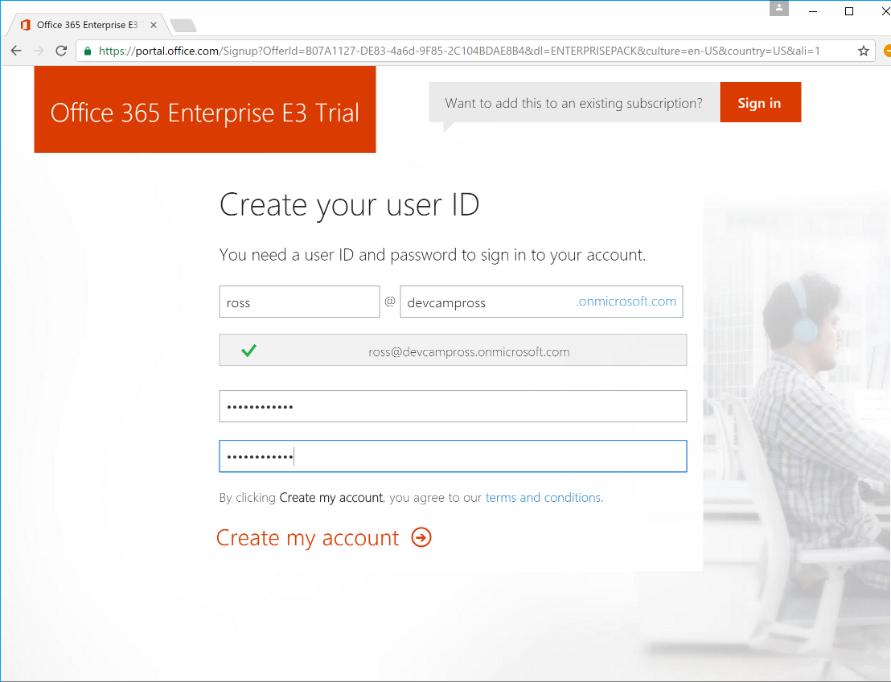

1. Choose a userid and a `tenant name` for your trial.  In this case I chose `devcampross`, but you 
    can choose anything you'd like, as long as it is unique.  You'll also have to choose 
    a password, and click `Create my account`.  Next you will see this page, which asks
    for a phone verification:

    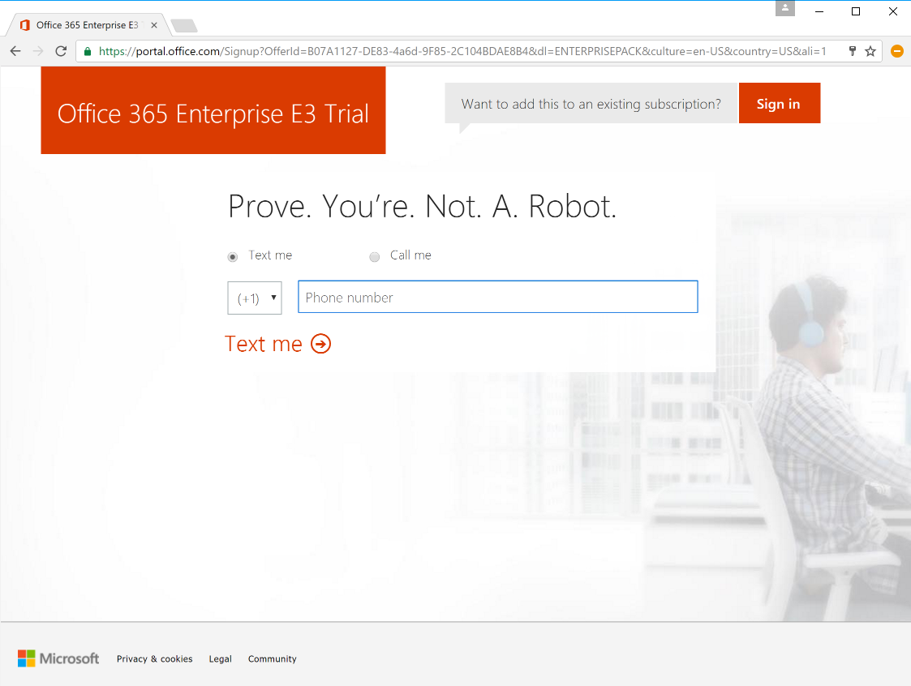

1. After this process is complete, your O365 trial will be set up, and you'll see this page:
    

    Make note of your user id, which will be used to sign onto the Azure portal later.
    Click `You're ready to go`, which will take you to the following screen:
    

    Click on the `admin` app icon, which will open the Office365 admin center page
    in your broser.  It will look like this:

    

     If you'd like to see the welcome tour click `Next`, 
    or simply close the dialog box.   
    
    >Stay on this page until the next exercise.

### Exercise 2: Set up Azure trial subscription

1.  Next, we want to set up an Azure subscription, which
    can be accessed via the Azure Active Directory.  At the bottom of the screen, 
    click `Admin centers`, and then click `Azure AD`. This will open up a new browser tab
    showing this page:

    

1. Click on `Azure subscription`, that will take you to the page for creating a new 
    trial subscription:
    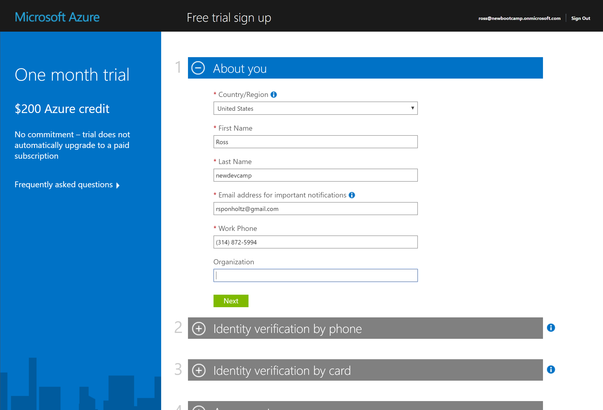

    Enter the requested information and click `next`.

1. Enter the information about you, and verify your identity by phone.  Also you'll 
    need to verify via credit card.  Your credit card will not be charged unless you
    remove the spending cap from your subscription.
    
    

1. Finally after the verification process, you'll have to agree to the terms of the trial
    subscription: 

    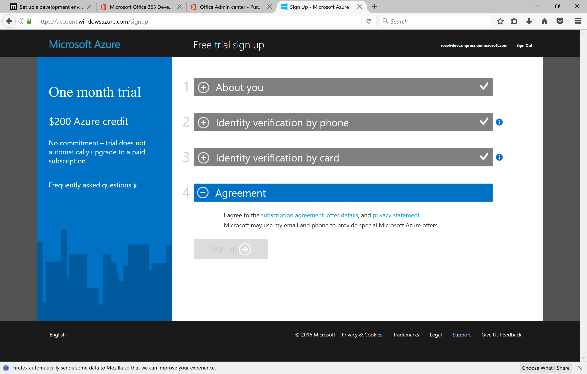

1. it will take a few moments to set up your azure subscription.  

    

1. When the subscription set up process is done, you can click on `Start managing my service`
to open the Azure portal, which will look like this:

    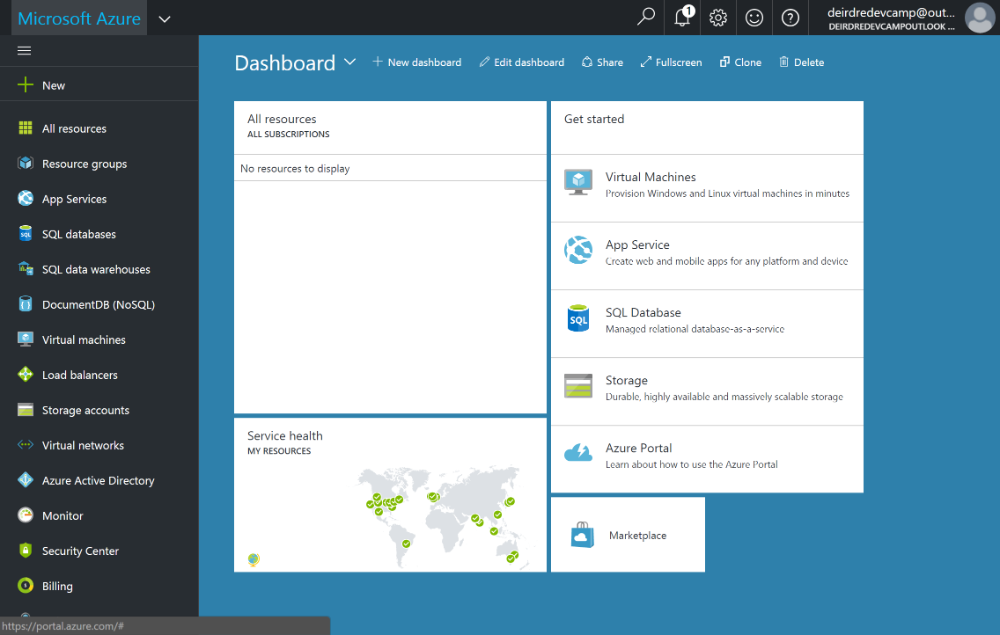

### Exersize 3: Start your VSTS trial subscription

1. In your browser, go to `http://www.visualstudio.com/team-services`, and click on `sign in` in the upper right corner.  This should take you to a screen that looks like this:

    

    click on `Use your benefits`, and this window will pop up:

    

    Click Accept to access your Visual Studio Dev Essentials benefits.

### Exercise 4: Configure your Azure subscription for DevCamp

1. We have created an Azure Resource Group template that will configure the resources you need in Azure for the DevCamp.  To deploy 
these resources in your Azure subscription, do `control-click` on this button:

1. You should see a new tab open in your browser and open the Azure portal, with a blade that looks like this:

    

    Name your resource group `DevCamp`, choose a location for your deployment, check the box that indicates you agree to the terms and conditions, and click the `Purchase` button.

    The Resource Group template will start deploying, and the portal will pin a tile to the dashbord showing the status:

    

1. This will take approximately 20 minutes, and when done, go visit the resource group by clicking `resource groups on the left:

     

    Then click your Resource group

    

### Exercise 5: Create an Azure Virtual Machine for development

1. The Azure resource group template will have created two virtual machines - one for 
Windows development, and the other for Linux development.  In these instructions, we
will focus on the Windows machine setup.  Feel free to use the Linux machine instead,
or to stop or delete it.

    Find the Windows virtual machine in your resource group, it's name will start with `windev`:

    

### Exercise 6 Connect to the Azure Virtual Machine and configure it for development

1. click the virtual machine, and then click `Connect` to connect to the machine using 
Remote Desktop:

    

    This will download a remote desktop connection file, and when you open it, remote desktop 
    on your local machine will attempt to attach to your virtual machine.   When the windows security dialog pops up, click on the `more choices link, then choose `use a different account`
    
    

    Use the credentials l-admin with password Devc@mp2016! to log onto the machine.  It
    would be wise to change the password in the virtual machine.

    When remote desktop is connected, you will see server manager initally.  We will
    want to turn of IE enhanced security, to make accessing the web within the virtual machine easier.  First click local server;

    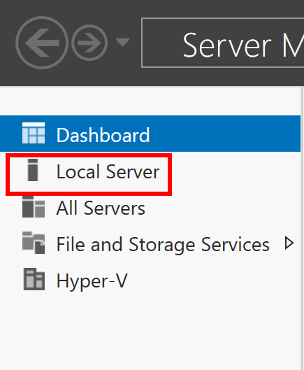

    then click the `on` next to 

    

    A dialog box pops up, turn enhanced security off for administrators.

1. We are going to use git to clone the DevCamp github repository to this development machine.  Open `cmd`, change directory to the root, and do `git clone https://github.com/AzureCAT-GSI/DevCamp.git` :

    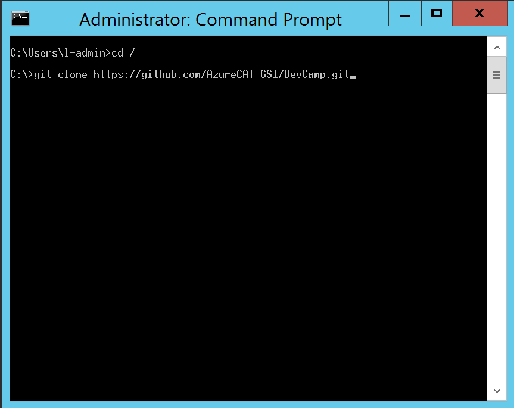

    All of the content for this DevCamp will now be located in `c:\DevCamp\`.

    Start `visual studio 2015`, and in the sign in screen, click `sign in` and use the credentials you used earlier for Office 365.

    
    
    You can create a VSTS repository now, choose an appropriate repository name and click continue:

    

    Create your first team project, and name it `DevCamp`:

    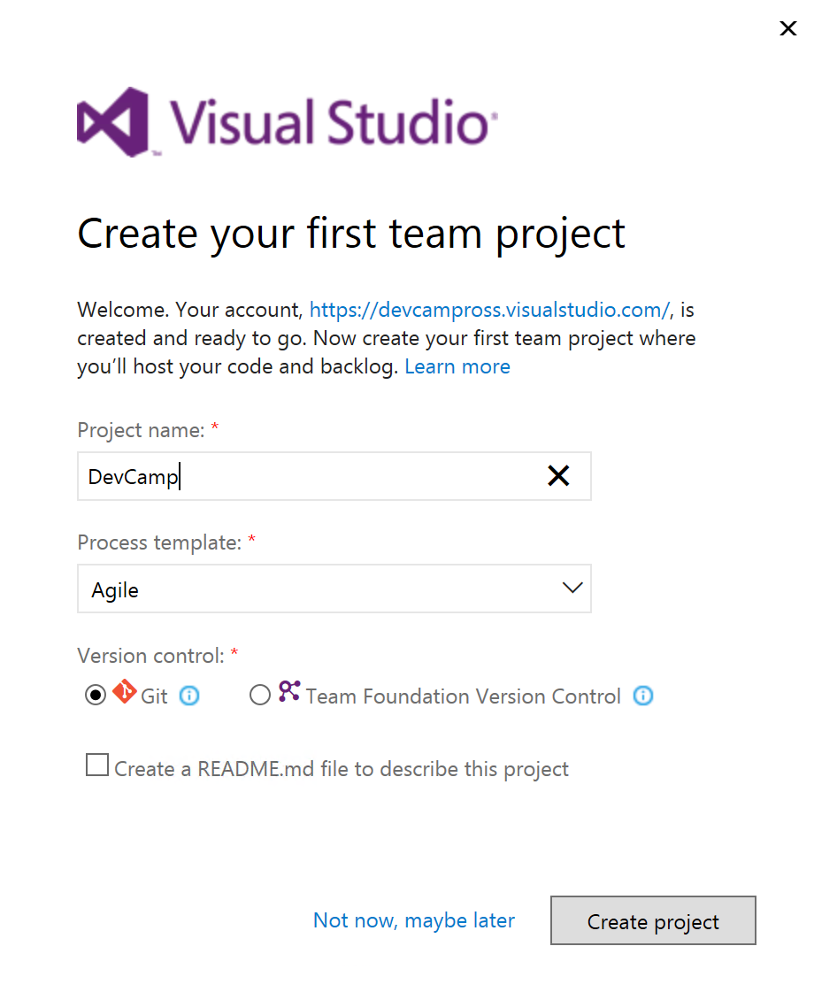

    Finally click close, and you are done with the Visual Studio setup.

1. We are now going to deploy our .NET API to an Azure App Service.  In the command window change the directory too the root with `cd \`, and clone the github repository for the API with `git clone https://github.com/AzureCAT-GSI/DevCampSharedDotNetAPI.git`.  

1. Switch back to Visual Studio and open the API solution with File/Open/Project/Solution:

    

    and open the API solution located at `C:\DevCampSharedDotNetAPI\src>`.  

    

    right click on the DevCamp API project, and choose `publish`:

    

    In the publish wizard, click `Microsoft Azure App Service` for the publish target:

    

    Next select `DevCamp` and then the `incidentapi...` app service, and click `OK`

    

    In the next step, leave all the defaults and click `Publish`:

    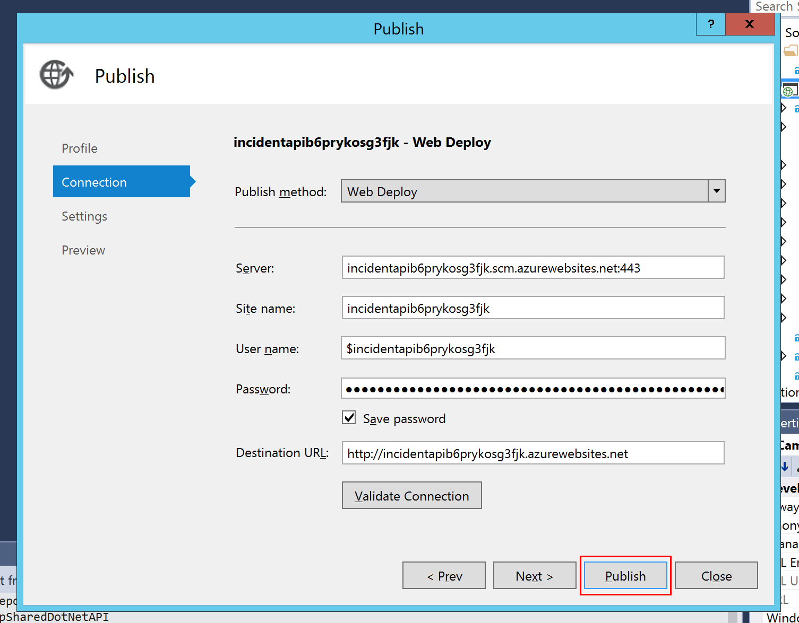

    After a short time, you should see the `publish succeeded` message in the output window:

    
    
1. In a browser windows inside your development Virtual Machine, open a browser window and go to `http://nodejs.org`, 
and click on the `Other Downloads` link under v6.9.0:

    

    In the next page, click on `32 bit` next to `Windows Installer (.msi)`, download the MSI and run the installation.

    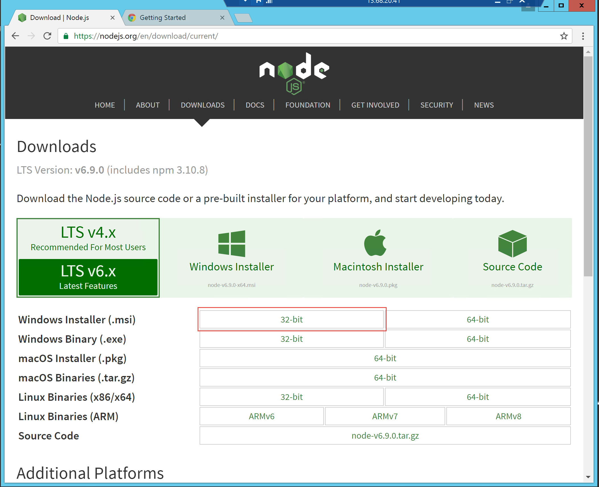

1. Install the azure command line interface.  Go to a terminal window and do this command:
    `node -v` 
    Verify that the version is v6 or greater.

    `npm install azure-cli -g`

1. For Java developers, we have already installed the Java JDK.  We will be using the gradle build manager - to install that, go to a command window and type:

    `choco install gradle`

    Also Eclipse Mars is installed in `C:\Program Files\Eclipse Foundation\4.5.1\eclipse`.  
    If you would like to download a newer version (eg. Neon), Eclipse is available here:

    `http://www.eclipse.org/downloads/`

    and Spring Tool Suite is available here:

    `http://spring.io/tools/sts`

    For example, after downloading the Eclise install, run it and you'll get this screen:

    

    choose `Eclipse IDE for Java EE developers`.  In the next screen, 
    leave the defaults and choose `Install`:

    

    When that is done, click `Launch` to start the IDE and choose a directory
    for your workspace. You will end up with the initial Eclipse screen:

    

    Click `Help` in the menu bar, and choose `install new software`:

    

    In the window that pops up, choose `All Available Sites` for the `Work with` dropdown,
    type `gradle` in the search box, and when the search is complete, 
    choose `Buildshop: Eclipse Plug-ins for Gradle`

    
    
    click through the dialog and install the package.
    Go back to `help/install new software`, and click the `Add..` button
    next to the `work with` dropdown.  In the Add Repository dialog box, git the
    repository a name, and type `http://dl.microsoft.com/eclipse` for the Location, and click `OK`:

    

    Choose both of the packages in the list, and complete the package installation:

    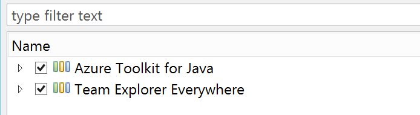

### Exercise 7: View the resources you deployed

1. On your local machine or the virtual machine in Azure, open a browser window and go to the main Azure portal page, http://portal.azure.com.  Log in with the credentials you supplied in the subscription signup exersize.  You should see the Azure portal, similar to this:
    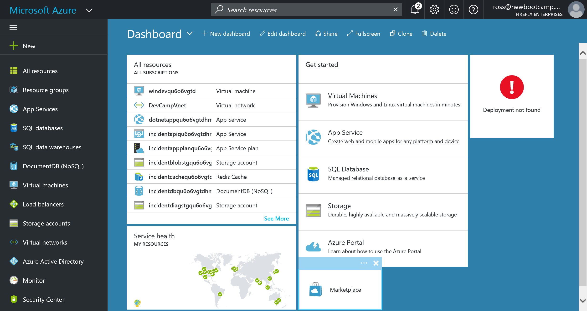

    There is a lot to notice on this screen.  At the upper left corner, the icon under the `Microsoft Azure` banner allows you to shrink and expand the left bar:

    

    Under that, clicking on the `+ New` item will allow you to create new deployments, virtual machines, databases, etc:

    
    
    On the left you will see a list of the Azure services that you can use on the left hand side.  Notice that this list will scroll up and down to reveal more services, and finally an item that says `More Services >`:

    

    You can click on any of these and see what items are deployed, and easily create new deployments.

    At the top of the window you have a search box where you can search for any resources:

    

    The bell icon is for notifications, and in this screenshot, it indicates that there are two notifications pending: 

    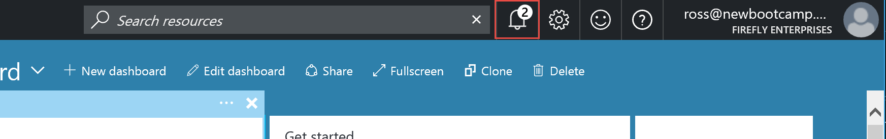

    Clicking on the bell will show you the notifications:

    

    If you click on one of the notifications, you can go to the list of 
    all current notifications:

    

    The gear at the top of the screen lets you set the color palate for the portal, whether or not there will be animations, and other options for the portal itself:

    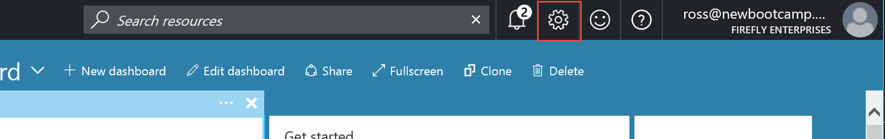

    The "smiley face" button allows you to send feedback to Microsoft:

    

    Clicking on the icon will give you a form to let us know about your experience:

    

    The Question icon will give you the ability to enter a support case, manage support requests, or get further information on Azure.
    

    Your login name and company name on the upper left hand corner has two functions: 

    
    
    If you hover the mouse over your name, you'll get information about your login, the directory and subscription:

    

    If you click on your name, you can sign oudt, change your password, view your permissions, and view your bill:

    

1. Next we will look at the resource group we set up with the template.  Click on `Resource Groups` on the left hand side:

    

    then, click on the resource group that you created:

    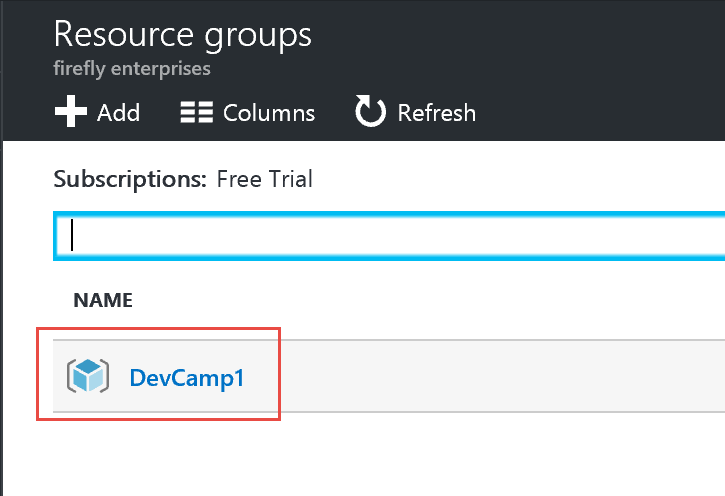

    A new blade will open with the overview of all of the contents of the resource group listed:

    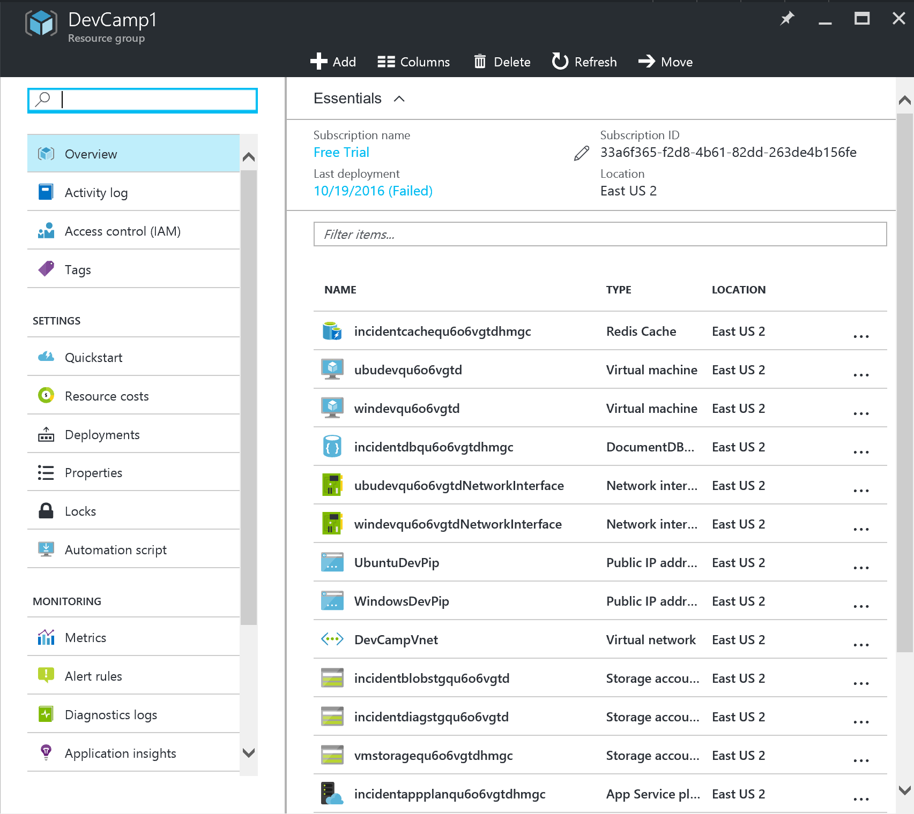

    You can click on any of the items on the left hand side which will view or manipulate settings for the resource group as a whole.  If you click on any of the individual resources in the center, you will get more information on that resource.

## Summary

In this hands-on lab, you learned how to:
* Set up an Office365 developer subscription
* Set up an Azure trial subscription
* Configure your Azure subscription for DevCamp
* Create an Azure Virtual Machine for development
* Connect to the Azure Virtual Machine and configure it for development.

Copyright 2016 Microsoft Corporation. All rights reserved. Except where otherwise noted, these materials are licensed under the terms of the MIT License. You may use them according to the license as is most appropriate for your project. The terms of this license can be found at https://opensource.org/licenses/MIT.
