# Developer Environment (Java)

## Overview
In this lab, you will set up an Office365 trial subscription, an Azure trial subscription, configure your Azure subscription for the DevCamp, and provision 
a virtual machine in the subscription to use for development of further labs.

## Objectives
In this hands-on lab, you will set up an Office365 developer subscription, and Azure trial subscription, and an Azure-based virtual machine for the development environment for subsequent labs in the DevCamp.  To expedite the process, we've prepared a Windows image that you will copy into your own environment, start the virtual machine and connect to it.  You will then configure the components for Azure development.
* Set up an Office365 trial subscription
* Set up an Azure trial subscription
* Configure your Azure subscription for DevCamp
* Create an Azure Virtual Machine for remote development
* Connect to the Azure Virtual Machine and configure it for development
* Review the features of the Azure Portal

## Prerequisites

You will need a cell phone and credit card for identity verification.  The credit card will not be charged unless you remove the spending cap on the subscription you will create.

## Exercises
This hands-on-lab has the following exercises:
* Exercise 1: Set up Office 365 trial subscription
* Exercise 2: Set up Azure trial subscription
* Exercise 3: Start your VSTS trial subscription
* Exercise 4: Configure your Azure subscription for DevCamp
* Exercise 5: Use an Azure Virtual Machine for remote development
* Exercise 6: Deploy Shared API application
* Exercise 7: Azure Portal walkthrough
* Exercise 8: View the resources you created

---
## Exercise 1: Set up Office 365 trial subscription

1. In your browser, go to `https://products.office.com/en-us/business/office-365-enterprise-e3-business-software` 
and click the link that says "Free Trial", which will take you to this page:

    

1. Enter the information requested, and click `Just one more step` which 
    will take you to the following page:
    
    

1. Choose a userid and a `tenant name` for your trial.  In this case I chose `devcampross`, but you 
    can choose anything you'd like, as long as it is unique.  You'll also have to choose 
    a password, and click `Create my account`.  Next you will see this page, which asks
    for a phone verification:

    

1. After this process is complete, your O365 trial will be set up, and you'll see this page:
    
    

    Make note of your user id, which will be used to sign onto the Azure portal later.
    Click `You're ready to go`, which will take you to the following screen:

    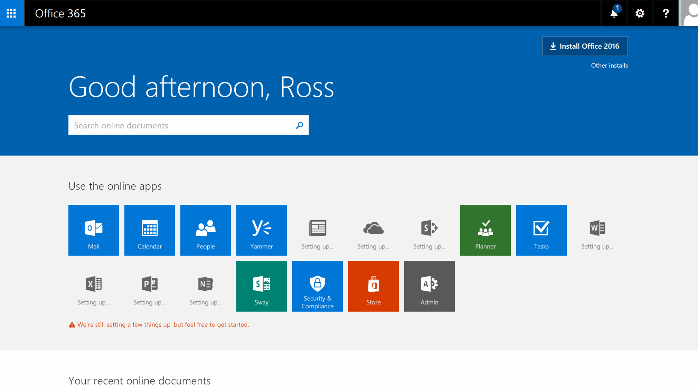

    Click on the `admin` app icon, which will open the Office365 admin center page
    in your browser.  It will look like this:

    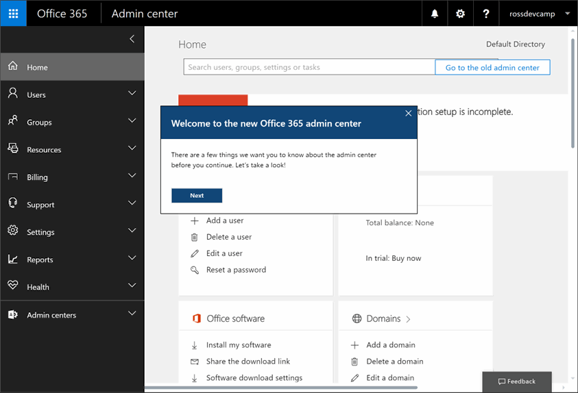

     If you'd like to see the welcome tour click `Next`, 
    or simply close the dialog box.   
    
> Stay on this page until the next exercise.

---
## Exercise 2: Set up Azure trial subscription

1.  Next, we want to set up an Azure subscription, which
    can be accessed via the Azure Active Directory.  At the bottom of the screen, 
    click `Admin centers`, and then click `Azure AD`. This will open up a new browser tab
    showing this page:

    

> BEGIN Steps for Azure Pass redemption - Follow this step if you are using an Azure Pass.

1. Navigate to [http://www.microsoftazurepass.com/]().

    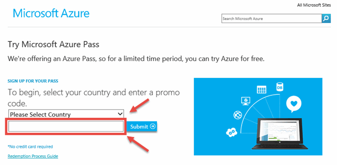

1. Enter the code that is provided by your facilitator into the text box, then click submit

> END Steps for Azure Pass redemption

1. Click on `Azure subscription`, that will take you to the page for creating a new 
    trial subscription:

    

    Enter the requested information and click `next`.

1. Enter the information about you, and verify your identity by phone.  Also you'll 
    need to verify via credit card.  Your credit card will not be charged unless you
    remove the spending cap from your subscription.
    
    

1. Finally after the verification process, you'll have to agree to the terms of the trial
    subscription: 

    

1. it will take a few moments to set up your azure subscription.  

    

1. When the subscription set up process is done, you can click on `Start managing my service`
to open the Azure portal, which will look like this:

    

---
## Exercise 3: Start your VSTS trial subscription

1. In your browser, go to `http://www.visualstudio.com/team-services`, and click on `sign in` in the upper right corner.  This should take you to a screen that looks like this:

    

    click on `Use your benefits`, and this window will pop up:

    

    Click Accept to access your Visual Studio Dev Essentials benefits.

---
### Exercise 4: Configure your Azure subscription for DevCamp

1. We have created an Azure Resource Group template that will configure the resources you need in Azure for the DevCamp.  To deploy 
these resources in your Azure subscription, do `control-click` on this button:

    <a href="https://portal.azure.com/#create/Microsoft.Template/uri/https%3A%2F%2Fraw.githubusercontent.com%2FAzureCAT-GSI%2FDevCamp%2Fmaster%2FShared%2FARMTemplate%2FAzureDeploy.json" target="_blank">
        
    </a>

1. You should see a new tab open in your browser and open the Azure portal, with a blade that looks like this:

    

1. Name your resource group `DevCamp`, choose a location for your deployment.

    > Please **DO NOT** choose the any of following regions for your deployment (as of November 18, 2016)
    > * US Gov
    > * Brazil South
    > * South India
    > * Central India
    > * West India
    > * Canada East
    > * UK West
    > * UK South
    > 

1. check the box that indicates you agree to the terms and conditions, and click the `Purchase` button.    
The Resource Group template will start deploying, and the portal will pin a tile to the dashboard showing the status:

    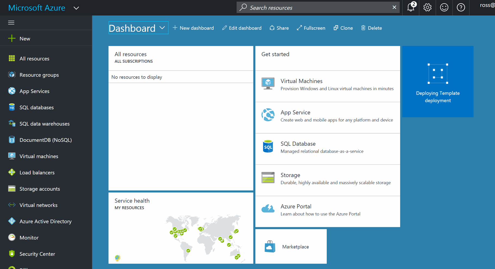

1. This will take approximately 20-30 minutes to complete. Please don't continue on until the template has completed.  While it is working, it is useful to understand what this process is doing.
    In a later session, we will take a look at Azure Resource Group templates, and how to manage your infrastructure the same way 
    you manage your code.  As a short introduction, a template is a JSON file that contains definitions for the resources you want in your
    resource group.  When you apply the resource group template, Azure will apply the template to your Azure resource group, and create 
    the resources you have specified in the template.  This makes it easy to maintain the infrastructure definition in the JSON text file.
    
    In the resource group template we have created for DevCamp, there are several types of resources including Web Apps and Virtual Machines.  The 
    complete list of resources deployed is detailed in Exercise 8 of this Hands-On-Lab.  Resource Group Templates are usually fairly quick to
    apply - the reason this one takes so long is that we are creating a Windows Virtual machine and installing all the tools you will
    need for the DevCamp including Visual Studio, the Java development kit, and other software resources.

    When the Resource Group creation is done, go visit the resource group by clicking `resource groups on the left:

     

    Then click your Resource group

    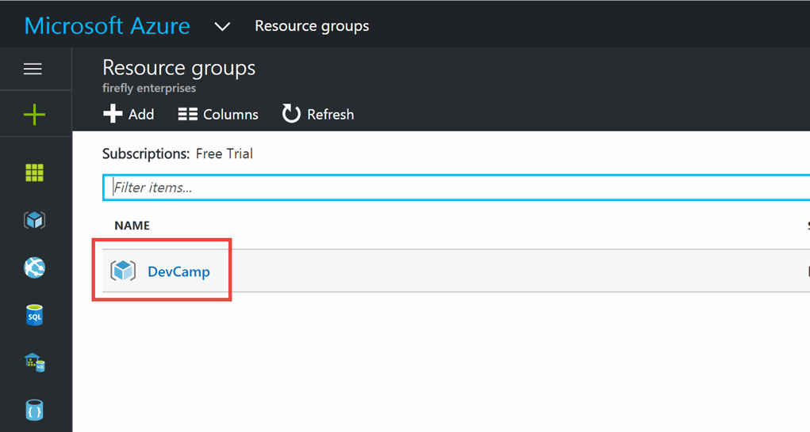

---
## Exercise 5: Use an Azure Virtual Machine for remote development

The Azure resource group template will have created a virtual machine that can be used for remote development on Windows. Exercise 6 describes the configuration for the Windows virtual machine, which would be appropriate for any of the languages.

1. In the DevCamp resource group, select the DevCamp DevTest Lab.

    

1. Find the Windows virtual machine in your DevTest lab. The name will start with the prefix `windev`:

    

1. Select the machine name and open the virtual machine blade  then click `Connect` to connect to the machine using Remote Desktop:

    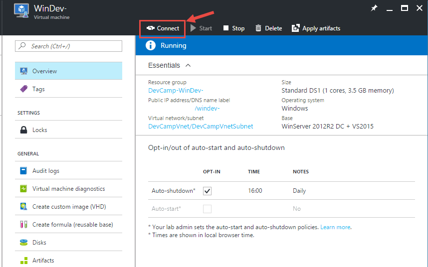

    This will download a remote desktop connection file, and when you open it, remote desktop on your local machine will attempt to attach to your virtual machine.   When the windows security dialog pops up, click on the `more choices link`, then choose `use a different account`
    
    

1. Use the following credentials to log on to the machine:
    
    > User Name = `\l-admin`
    >
    > Password = `Devc@mp2016!` 
 
    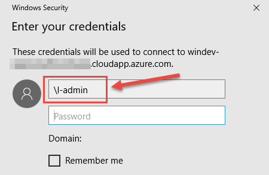

    > It would be wise to change the password in the virtual machine.

1. When remote desktop is connected, you will see server manager initially.  We will want to turn of IE enhanced security, to make accessing the web within the virtual machine easier.  First click `local server`;

    

1. Then click the `on` next to 

    

    A dialog box pops up - choose to turn enhanced security off for administrators.

1. We are going to use git to clone the DevCamp github repository to this development machine. Click on the Start menu, and type `cmd`

    > NOTE: On some high resolution monitors (HIGH DPI), you will notice that the icons and command line windows appear small. If this is an issue, you can download [Remote Desktop Connection Manager 2.7](https://www.microsoft.com/en-us/download/details.aspx?id=44989)

1. Change directory to the root using `cd c:\`

1. Type `git clone https://github.com/AzureCAT-GSI/DevCamp.git` :

    

    All of the content for this DevCamp will now be located in `c:\DevCamp\`.

1. In a browser windows inside your development Virtual Machine, open a browser window and go to `http://nodejs.org`, 
and click on the `Other Downloads` link under v6.9.0:

    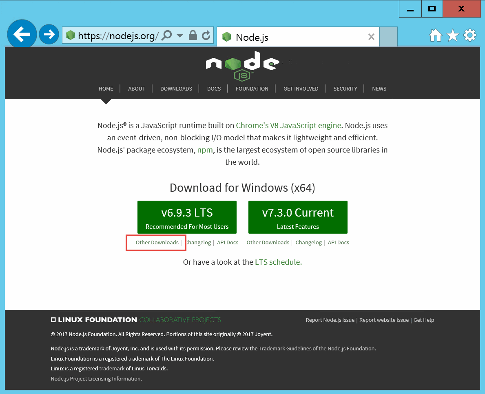

    In the next page, click on `32 bit` next to `Windows Installer (.msi)`, download the MSI and run the installation.

    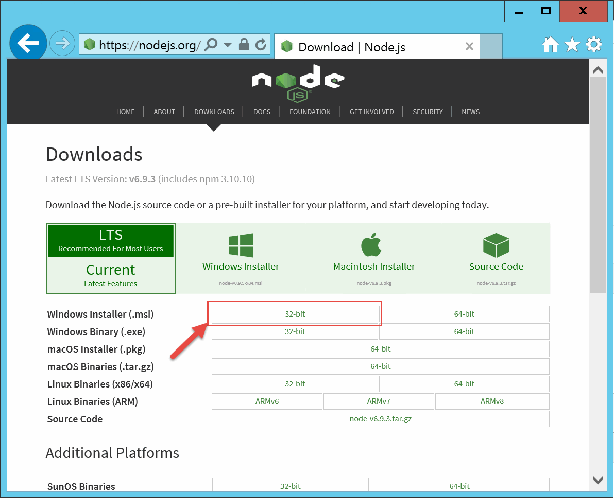

    > Please do not skip this step, because we will need node.js to install the Azure cross platform command line interface in the next step.

1. Install the azure command line interface.  Go to a terminal window and do this command:
    `node -v` 
    Verify that the version is v6 or greater.

    ```CMD
    npm install azure-cli -g
    ```

1. If you are not developing in Java for the DevCamp, you can skip this step. We have already installed the Java JDK, but we will install gradle and Eclipse.  We will be using the gradle build manager - to install that using the [chocolatey package manager](http://www.chocolatey.org), open a command window as administrator and type:

    ```CMD
    choco install -y gradle
    ```

    Also install maven with:

    ```CMD
    choco install -y maven
    ```

    Go to the root directory using `cd \`, and perform

    ```CMD
    refreshenv
    git clone https://github.com/swagger-api/swagger-codegen.git
    cd swagger-codegen
    mvn clean package
    ```

    Also Eclipse Mars is installed in `C:\Program Files\Eclipse Foundation\4.5.1\eclipse`.  
    If you would like to download a newer version (eg. Neon), Eclipse is available here:

    [http://www.eclipse.org/downloads/]()

    and Spring Tool Suite is available here:

    [http://spring.io/tools/sts]()

    For example, after downloading the Eclipse install, run it and you'll get this screen:

    

    choose `Eclipse IDE for Java EE developers`.  In the next screen, 
    leave the defaults and choose `Install`:

    

    When that is done, click `Launch` to start the IDE and choose a directory
    for your workspace. You will end up with the initial Eclipse screen:

    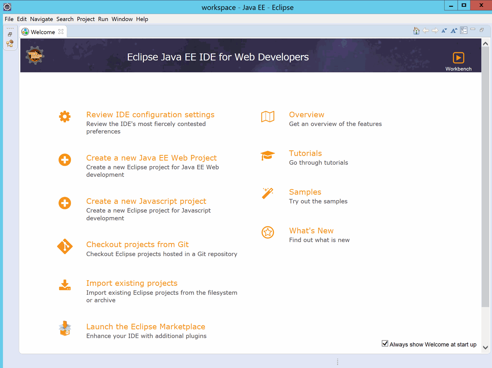

    Click `Help` in the menu bar, and choose `install new software`:

    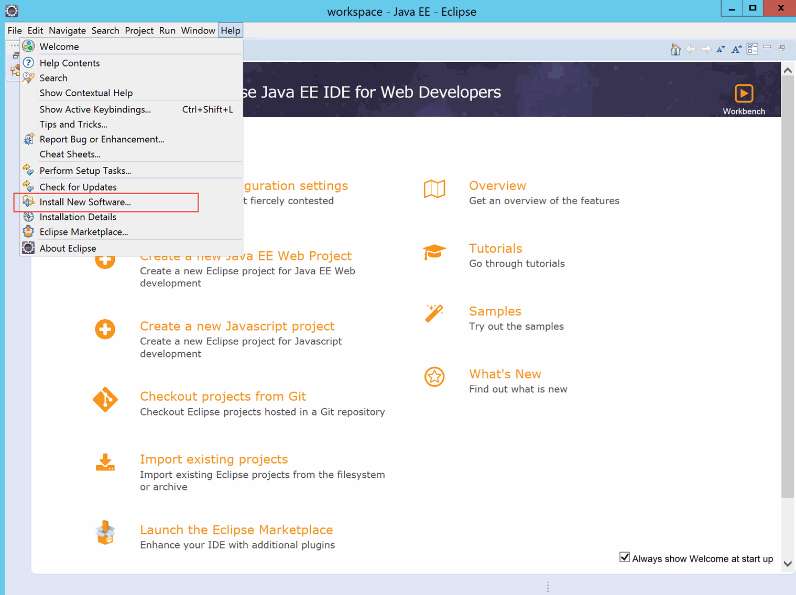

    In the window that pops up, choose `All Available Sites` for the `Work with` dropdown,
    type `gradle` in the search box, and when the search is complete, 
    choose `Buildshop: Eclipse Plug-ins for Gradle`

    
    
    click through the dialog and install the package.
    Go back to `help/install new software`, and click the `Add..` button
    next to the `work with` dropdown.  In the Add Repository dialog box, git the
    repository a name, and type `http://dl.microsoft.com/eclipse` for the Location, and click `OK`:

    

    Choose both of the packages in the list, and complete the package installation:

    

    Also, install the spring tool suite package by using the menu item `Help/Eclipse Marketplace...`, type `spring` in the Find: box and choose `Go`.
    in the list of packages, scroll down to `Spring Tool Suite (STS) for Eclipse 3.8.2.RELEASE` and click `Install`.

    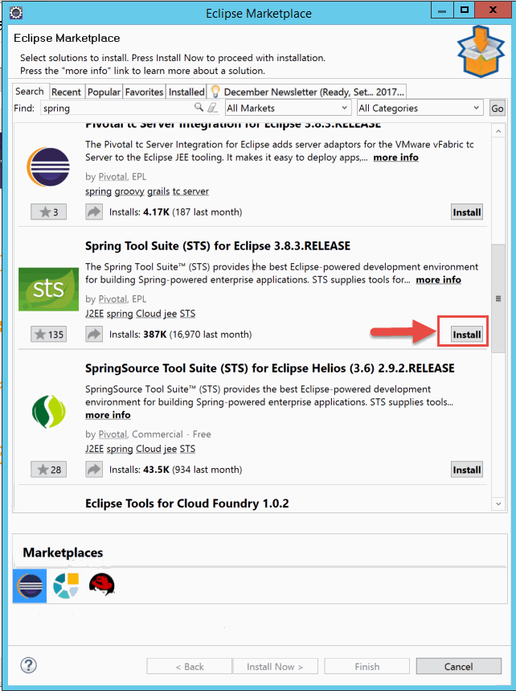

---
## Exercise 6: Deploy shared API application ##

1. Open a browser and navigate to [https://portal.azure.com]() Locate the app service named `incidentapi....` in the resource group blade:
    
    

1. Click on the app service, which will bring up the app service blade.  Click on `Browse` at the top:

    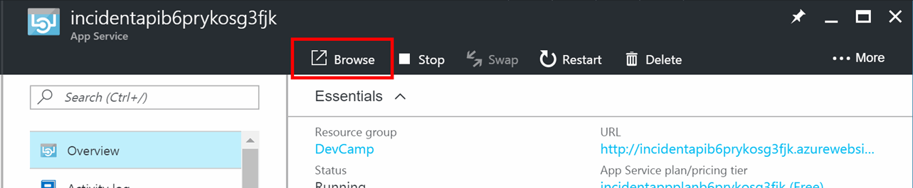

    A new browser tab will open.

    >
    > If the page looks like the above below, this means the API was automatically deployed from GitHub, and you can skip the rest of this excercise.
    >
    
    

    >
    > If the page looks like the image below, continue with this exercise
    >
         
    

1. In the Azure portal, select the API Application (noted with the  icon)
    
    

1.	Select deployment options
 
    

1.	If the app deployment is connected, click disconnect
 
    

1.	Select setup
 
    

1.	Select external repository. 

1. Paste the following in the Repository URL field `https://github.com/AzureCAT-GSI/DevCamp.git`

    

1.	Select OK

---

### Exercise 7: Azure Portal walkthrough

1. On your local machine or the virtual machine in Azure, open a browser window and go to the main Azure portal page, http://portal.azure.com.  Log in with the credentials you supplied in the subscription signup exercise.  You should see the Azure portal, similar to this:

    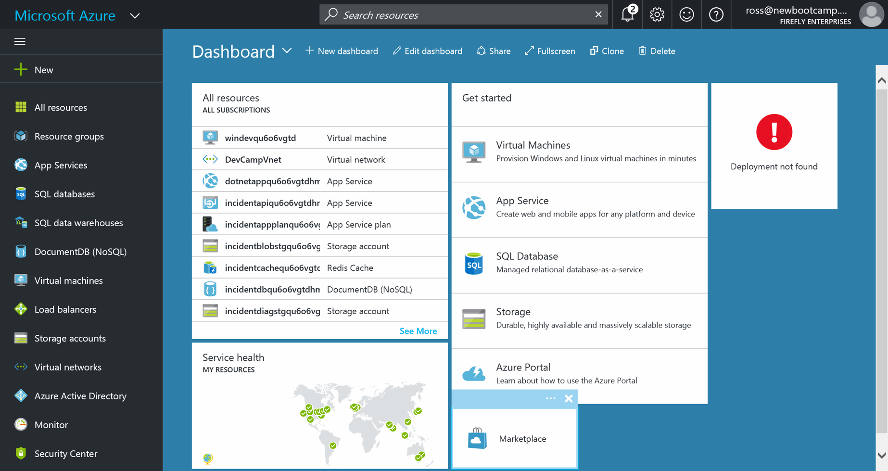

    There is a lot to notice on this screen.  At the upper left corner, the icon under the `Microsoft Azure` banner allows you to shrink and expand the left bar:

    

    Under that, clicking on the `+ New` item will allow you to create new deployments, virtual machines, databases, etc:

    
    
1. On the left you will see a list of the Azure services that you can use on the left hand side.  Notice that this list will scroll up and down to reveal more services, and finally an item that says `More Services >`:

    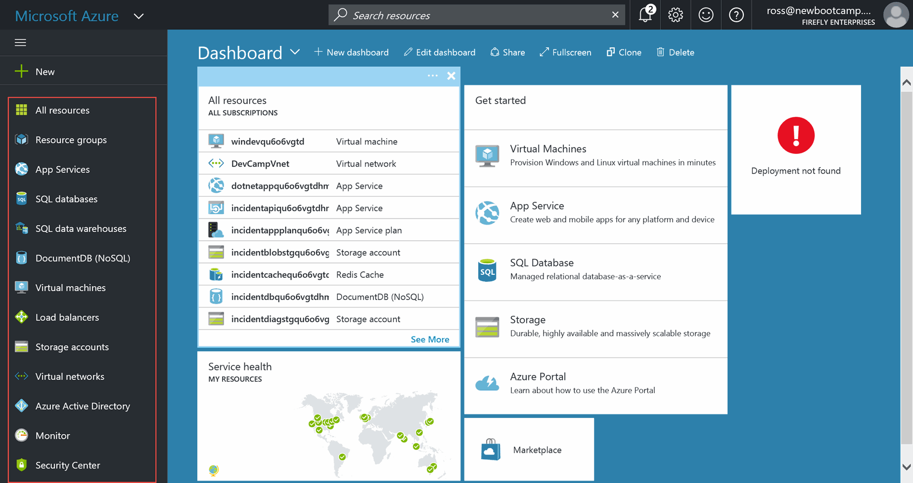

    You can click on any of these and see what items are deployed, and easily create new deployments.

    At the top of the window you have a search box where you can search for any resources:

    

1. The bell icon is for notifications, and in this screenshot, it indicates that there are two notifications pending: 

    

    Clicking on the bell will show you the notifications:

    

    If you click on one of the notifications, you can go to the list of 
    all current notifications:

    

1. The gear at the top of the screen lets you set the color palate for the portal, whether or not there will be animations, and other options for the portal itself:

    

1. The "smiley face" button allows you to send feedback to Microsoft:

    

    Clicking on the icon will give you a form to let us know about your experience:

    

1. The Question icon will give you the ability to enter a support case, manage support requests, or get further information on Azure.
    
    

1. Your login name and company name on the upper left hand corner has two functions: 

    
    
    If you hover the mouse over your name, you'll get information about your login, the directory and subscription:

    

    If you click on your name, you can sign out, change your password, view your permissions, and view your bill:

    

1. Next we will look at the resource group we set up with the template.  Click on `Resource Groups` on the left hand side:

    

    then, click on the resource group that you created:

    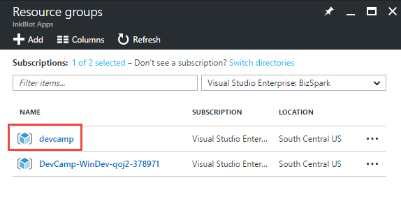

    A new blade will open with the overview of all of the contents of the resource group listed:

    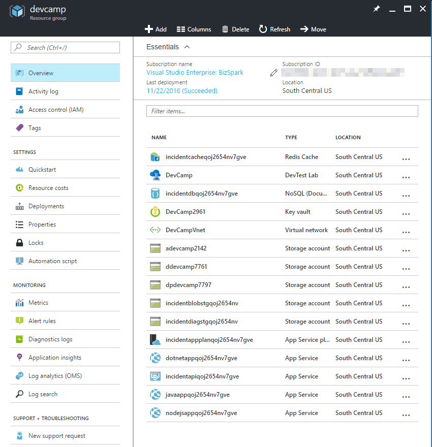

    You can click on any of the items on the left hand side which will view or manipulate settings for the resource group as a whole.  If you click on any of the individual resources in the center, you will get more information on that resource.

1. Azure automatically logs changes to resource group and who made those changes.  Clicking `Activity log` on the left of the blade will allow you to query the log, and clicking on any logged items will give you additional information on that entry:

    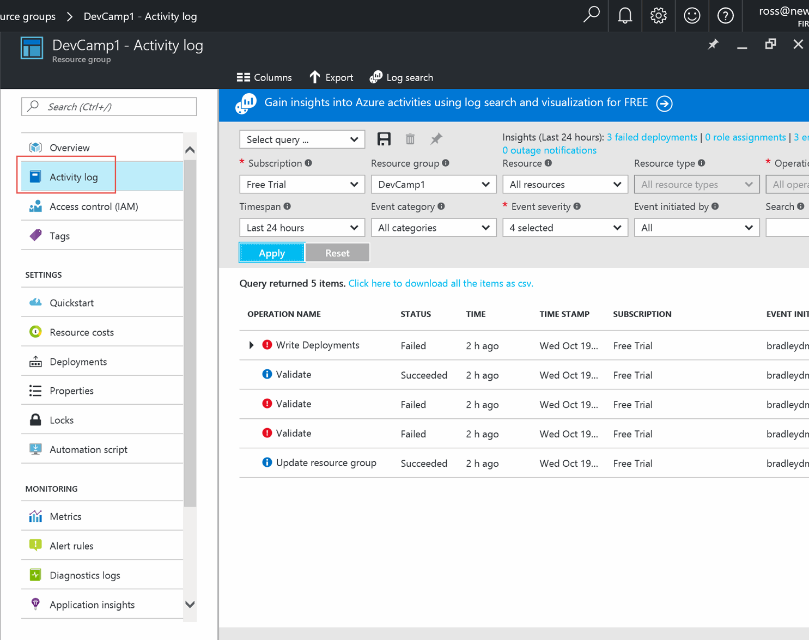

1. Clicking on `Automation script` will allow you to view, edit or download the resource group template that would create this resource group.

    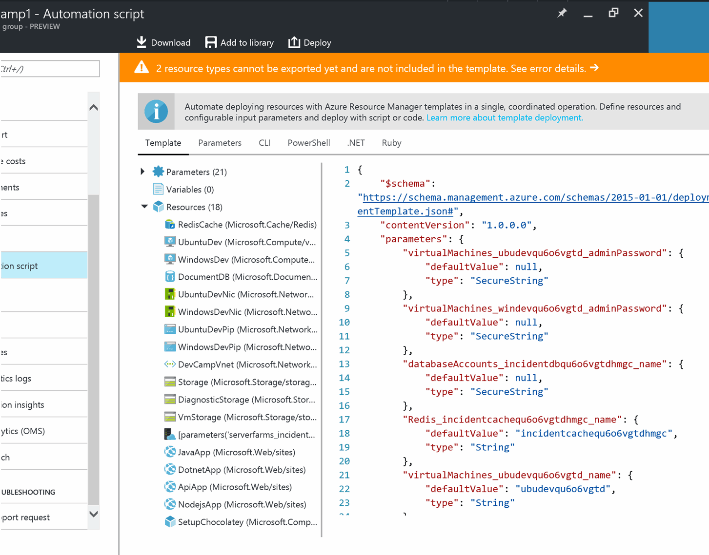
    
1. The Windows VM uses DevTest labs to manage the start up and shut down of the machine. To change the start up schedule, click on the DevTest Lab icon and select `Policy Settings`

    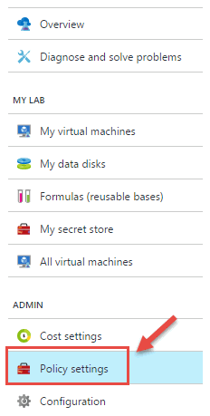

1. Select `Auto-shutdown`

    

1. Modify the Auto-shutdown schedule based on your time zone

    

1. The machine does not automatically turn on. To enable this, in the Policy Settings blade, select `Auto-Start`

    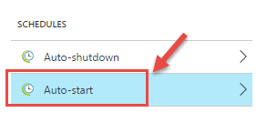

1. Change the schedule based on your time zone.

    

> It is particularly useful to create resources in the Azure portal, then save or edit the resource group template.  Resource group templates will be explained further in a later lab.

## Exercise 8: View the resources you created

Going back to the list of resources in the resource group, we'll go through the list of each resource, with a description.  Feel free to click on the resource and view its detail blade.


Also, our resource group template has added a random string to the end of many of the resources.  In this description, we'll replace that string with .... (order of resources may vary)

1. `incidentcache....:`  This is the Redis cache that we use from the application to make data access faster.  The modern-cloud-apps hands on lab adds support to the application to be able to leverage the cache.

1. ` DevCamp` This is the DevTest lab that is used to manage the VM images and artifacts

1. `incidentdb....:` This is the documentDB database that will hold the JSON incident documents stored by the application.

1. ` DevCamp....` This is the Azure Key Vault that is used to manage secure credentials

1. `DevCampVnet:`  This is an Azure Virtual Network, which will allow components of the resource group to communicate as they were on the same physical network.

1. `addevcamp....:` Storage account for storing artifacts for the DevTest labs.

1. `ddevcamp....:` Storage account for storing the VHDs for images used the DevTest labs..

1. `dpdevcamp....:` Storage account for storing for VHDs for the machines DevTest labs..

1. `incidentblobstg....:` Storage account for storing the uploaded images and the Azure Queue, from the modern-cloud-apps lab.

1. `incidentdiagstg....:` Storage account for storing diagnostics from the services in the resource group.

1. `incidentappplan....:` App Service Plan, which defines how the app services in the resource group will be configured.

1. `dotnetapp....:` App service for running the .NET application when deployed to the cloud.  If you are not using .NET in the labs, you can safely delete this.

1. `incidentapi.....:` App service for running the API service that provides a REST API to the web applications.

1. `javaapp....:` App service for running the Java application when deployed to the cloud.  If you are not using Java in the labs, you can safely delete this.

1. `nodejsapp....:` App service for running the Node.js application when deployed to the cloud.  If you are not using Node.js in the labs, you can safely delete this.

    In the second Resource group, there additional resources created

   

   

1. `windev....:` This is the Windows server virtual machine that we are using as a development machine for these hands-on-labs. You can delete this machine after the developer-environment lab if you are using an on-premises/local machine for development. 

1. `WindowsDevPip:`  This is a public IP that will allow the Windows development virtual machine to communicate with the Internet (eg. via Remote Desktop).  If you delete the Windows virtual machine, you can safely delete this.

1. `windev...NetworkInterface:`  This is a public network interface that will allow the Windows development virtual machine to communicate on the network.  If you delete the Windows virtual machine, you can safely delete this.

---
## Summary

In this hands-on lab, you learned how to:
* Set up an Office365 developer subscription
* Set up an Azure trial subscription
* Configure your Azure subscription for DevCamp
* Create an Azure Virtual Machine for development
* Connect to the Azure Virtual Machine and configure it for development
* Use the Azure portal to view the resources that you created

After completing this module, you can continue on to Module 2: Building modern cloud apps

#### View Module 2 instructions for [Java](../../../HOL/java/02-modern-cloud-apps)

---
Copyright 2016 Microsoft Corporation. All rights reserved. Except where otherwise noted, these materials are licensed under the terms of the MIT License. You may use them according to the license as is most appropriate for your project. The terms of this license can be found at https://opensource.org/licenses/MIT.
