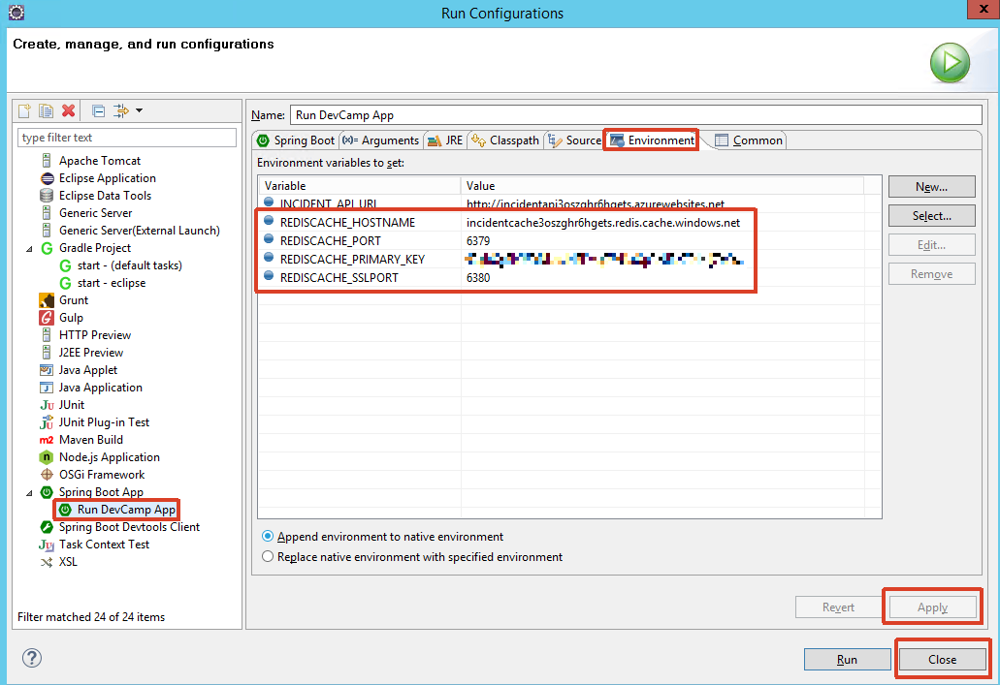

# Hands on Lab - Modern Applications (Java)

## Overview

City Power & Light is a sample application that allows citizens to report "incidents" that have occurred in their community. It includes a landing screen, a dashboard, and a form for reporting new incidents with an optional photo.  The application is implemented with several components:

* Front end web application contains the user interface and business logic. This component has been implemented three times in .NET, NodeJS, and Java.
* WebAPI is shared across the front ends and exposes the backend DocumentDB.
* DocumentDB is used as the data persistence layer.

In this lab, you will work with an existing API to connect to the web application front end. This will allow you perform CRUD operations for incidents. You will also configure additional Azure features for Redis Cache, Azure Storage Queues, and Azure Blob Storage. 

> This guide uses [Eclipse](https://www.eclipse.org) for editing, however please feel free to use your editor of choice.

## Objectives

In this hands-on lab, you will learn how to:

* Use Eclipse to connect to an API.
* Provision an Azure Web App to host the Web site.
* Modify a view to add caching.
* Modify code to add queuing and blob storage.

## Prerequisites

* The source for the starter app is located in the [start](start) folder.
* The finished project is located in the [end](end) folder.
* Deployed the starter ARM Template in [HOL 1](../01-developer-environment).
* Established a development machine either on-premises or in Azure.

## Exercises

This hands-on-lab has the following exercises:
* [Exercise 1: Integrate the API](#ex1)
* [Exercise 2: Add a caching layer](#ex2)
* [Exercise 3: Write images to Azure Blob storage](#ex3)

---
## Exercise 1: Integrate the API<a name="ex1"></a>

1. In your development virtual machine, open a command prompt window and navigate to the `C:\DevCamp\HOL\java\02-modern-cloud-apps\start` folder.

1. Run `gradle eclipse` in the terminal window to restore all dependencies and configure the
   project paths for Eclipse:

    

1. Once package restoration completes, open Eclipse.

    

    Import the HOL Start folder using the menu item `File` -> `Import...`, and choose the Gradle project wizard and click `Next`:

    

    On the gradle `Welcome` page click `Next`, and on the `Import Gradle Project` page, choose the `C:\DevCamp\HOL\java\02-modern-cloud-apps\start` directory.  Click `Finish`:

    

    You will be asked whether to use the existing project descriptor, or to create a new one.  Keep the existing one:

    
  

1. Let's run the application in Debug Mode. Click the Debug icon on the top toolbar, then select "Debug Configurations...".

    
    
    > If you do not have a toolbar you can activate it via the menu: `Window` -> `Appearance` -> `Show Toolbar`.

   

   Click on `Spring Boot App` and click the `+` icon in the top left to create a new run configuration.  
   
   
   
   Give the run configuration a name, such as `Run DevCamp App`, choose the `start` project, click `Search...` and choose `devCamp.WebApp.DevcampApplication` for the main type.

    

   Click `Apply` and `Debug`.  In the console pane you should see something like this:

    

1. Open a browser and navigate to `http://localhost:8080`. You should see the home page of the running application:

    

1. Click on `Dashboard` to see some sample incidents hard-coded in the solution:

    

    As part of the original ARM template we deployed an ASP.NET WebAPI that queries a DocumentDB Collection. Let's integrate that API so that the incidents are dynamically pulled from a data store.

1. In the [Azure Portal](https://portal.azure.com) navigate to the resource group `DevCamp` that you created with the original ARM template. Resource groups can be found on the left hand toolbar.

    Select the API app that begins with the name `incidentapi` followed by a random string of characters.

    

1. The window that slides out is called a **blade** and contains information and configuration options for the resource.  

    On the top toolbar, select `Browse` to open the API in a new browser window.

    

    You should be greeted by the default ASP.NET landing page:
    
    

1. Since we provisioned a new instance of DocumentDB, there are no records in the database. We will generate some sample data using the shared API. It has a route that can be accessed at any time to create or reset the documents in your collection.  In the browser, add the following to your API URL to generate sample documents.

    >
    > Add `/incidents/sampledata` to the end of your API URL. 
    >
    > The URL should look like the following:
    >  
    > `http://incidentapi[YOUR_RG_NAME].azurewebsites.net/incidents/sampledata`
    >
    > You can also do this using the swagger pages which will be available at this URL:
    >
    >`http://incidentapi[YOUR_RG_NAME].azurewebsites.net/swagger`
	
    > In Chrome you should see a JSON response directly in the browser tab, however in Internet Explorer you may be asked top Open or Download a file. If prompted, Open the file in Notepad or Visual Studio Code to see the return message.

1. After navigating to the `sampledata` route, let's verify that the documents were created in DocumentDB. In the Azure Portal, navigate to the Resource Group blade, select the `DevCamp` and then select the DocumentDB resource which starts with `incidentdb`.

    

    Select the DocumentDB database. This will open the DocumentDB blade. Scroll to the Collections section.

    In the Collections section, select `Document Explorer`.
    
    

    The Document Explorer is an easy way to view the documents inside of a collection via the browser. Select the first record to see the JSON body of the document.

    

    

    We can see that several incidents have been created and are now available to the API.

1. Back in Eclipse, let's begin integrating the API into our code. We will need to query the API's endpoint URL, and we have options of where to store that string. While we could insert it directly into our code, a better practice is to abstract such a configuration setting into an environment variable.

    Stop the debugger by pressing the red `stop` square, and open the run configuration you created earlier. Click the `Environment` tab.
    
    
    
    This section defines key/value pairs that will be passed into environment variables whenever the debugger is launched. Add an entry for `INCIDENT_API_URL` and set the value to the ASP.NET WebAPI that we earlier loaded into the browser and noted. It should look something like this: `http://incidentapi3oszghr6hgets.azurewebsites.net`, but with your own website name. Click `OK` to save the environment variable, then `Apply` and `Close`.

    

    Now that the URL is loaded as an environment variable, we can access it from our application by creating a configuration object to hold configuration variables, and setting those variables within the `application.yml` file.
    
    First, let's create the java class `devCamp.WebApp.properties.ApplicationProperties`, and paste in this code:
    
    ```java
    package devCamp.WebApp.properties;

    import org.apache.commons.lang3.builder.ReflectionToStringBuilder;
    import org.apache.commons.lang3.builder.ToStringStyle;
    import org.springframework.boot.context.properties.ConfigurationProperties;

    @ConfigurationProperties(prefix = "application")
    public class ApplicationProperties {
        private String incidentApiUrl;

        public String getIncidentApiUrl() {
            return incidentApiUrl;
        }

        public void setIncidentApiUrl(String incidentApiUrl) {
            this.incidentApiUrl = incidentApiUrl;
        }

        @Override
        public String toString() {
            return ReflectionToStringBuilder.toString(this, ToStringStyle.MULTI_LINE_STYLE);
        }
    }
    ```

    You'll notice a red line under `ReflectionToStringBuilder`. This is because we have to add `org.apache.commons.lang3` as a dependency.
    
    
    
    Open up the `build.gradle` file, and add this line to the dependencies section:
    
    ```java
    compile('org.apache.commons:commons-lang3:3.5')
    ```

    

    To make sure that Eclipse knows about the new packages we added to the build, go to the `Gradle Tasks` tab in the bottom pane.
    
    If Eclipse does not show the `Gradle Tasks` tab you can activate it via the menu. Click `Window` -> `Show View` -> `Other...`.
    
    
    
    
    
    Navigate to the `ide` -> `eclipse` gradle task and right-click on it and choose `Run Gradle Tasks`.
    
    
    
    Then right-click on the project in the project explorer, close the project, and then open it again.
    
    
    
    Open `ApplicationProperties.java` and verify that `ReflectionToStringBuilder` no longer has the red line under it, indicating that the import is resolved properly.  We will do this process several times over the course of the DevCamp.
    
    

    Let's take a look at `src/main/resources/application.yml`.  This is a configuration file that sets up the parameters that we want to import into the application.  For example, this line:
    ```java
    incidentApiUrl: ${INCIDENT_API_URL}
    ```
    tells spring boot to get the `INCIDENT_API_URL` environment variable, and place it into the ApplicationProperties object that we just created. This file has several other setings that we will be using later.

    > Our ARM Template already configured an environment variable for the Azure Web App that will soon run our application.

1. Several components will work together to call and display the incidents in the database. We will need an object to hold the data associated with each incident. We've supplied that object in `devCamp.WebApp.models.IncedentBean.Java`. Open that file and look at its properties and methods.

1. Create the interface `devCamp.WebApp.services.IncidentService.java` with the following code:

    ```java
    package devCamp.WebApp.services;

    import devCamp.WebApp.models.IncidentBean;

    import org.springframework.cache.annotation.CacheEvict;
    import org.springframework.cache.annotation.Cacheable;
    import org.springframework.scheduling.annotation.Async;
    import org.springframework.stereotype.Service;

    import java.util.List;
    import java.util.concurrent.CompletableFuture;

    @Service
    public interface IncidentService {

        List<IncidentBean> getAllIncidents();

        @Async
        CompletableFuture<List<IncidentBean>> getAllIncidentsAsync();

        public IncidentBean createIncident(IncidentBean incident);
        
        @Async
        CompletableFuture<IncidentBean> createIncidentAsync(IncidentBean incident);
        
        @Async
        CompletableFuture<IncidentBean> updateIncidentAsync(String incidentId,IncidentBean newIncident);

        @Async
        CompletableFuture<IncidentBean> getByIdAsync(String incidentId);

        void clearCache();
    }
    ```

    We now need an implementation for this interface, so create `devCamp.WebApp.services.IncidentServiceImpl.java`, and add this code:
    ```java
    package devCamp.WebApp.services;

    import devCamp.WebApp.models.IncidentBean;
    import devCamp.WebApp.properties.ApplicationProperties;
    import org.slf4j.Logger;
    import org.slf4j.LoggerFactory;
    import org.springframework.beans.factory.annotation.Autowired;
    import org.springframework.core.ParameterizedTypeReference;
    import org.springframework.http.HttpMethod;
    import org.springframework.http.ResponseEntity;
    import org.springframework.stereotype.Service;
    import org.springframework.web.client.RestTemplate;

    import java.util.List;
    import java.util.concurrent.CompletableFuture;
    import java.util.concurrent.ExecutionException;

    @Service
    public class IncidentServiceImpl implements IncidentService {
        private static final Logger LOG = LoggerFactory.getLogger(IncidentServiceImpl.class);

        @Autowired
        private ApplicationProperties applicationProperties;

        @Autowired
        private RestTemplate restTemplate;

        @Override
        public List<IncidentBean> getAllIncidents() {
            LOG.info("Performing get {} web service", applicationProperties.getIncidentApiUrl() +"/incidents");
            final String restUri = applicationProperties.getIncidentApiUrl()+"/incidents";
            ResponseEntity<List<IncidentBean>> response = restTemplate.exchange(restUri, HttpMethod.GET, null,
                    new ParameterizedTypeReference<List<IncidentBean>>() {});
            LOG.info("Total Incidents {}", response.getBody().size());
            return response.getBody();
        }

        @Override
        public CompletableFuture<List<IncidentBean>> getAllIncidentsAsync() {
            CompletableFuture<List<IncidentBean>> cf = new CompletableFuture<>();
            CompletableFuture.runAsync(() -> {
                LOG.info("Performing get /incidents web service");
                final String restUri = applicationProperties.getIncidentApiUrl()+"/incidents";
                ResponseEntity<List<IncidentBean>> response = restTemplate.exchange(restUri, HttpMethod.GET, null,
                        new ParameterizedTypeReference<List<IncidentBean>>() {});
                LOG.info("Total Incidents {}", response.getBody().size());
                cf.complete(response.getBody());
                LOG.info("Done getting incidents");
            });
            return cf;
        }

        @Override
        public IncidentBean createIncident(IncidentBean incident) {
            LOG.info("Creating incident");
            final String restUri = applicationProperties.getIncidentApiUrl()+"/incidents";
            IncidentBean createdBean = restTemplate.postForObject(restUri, incident, IncidentBean.class);
            LOG.info("Done creating incident");
            return createdBean;
        }
        
        @Override
        public CompletableFuture<IncidentBean> createIncidentAsync(IncidentBean incident) {
            CompletableFuture<IncidentBean> cf = new CompletableFuture<>();
            CompletableFuture.runAsync(() -> {
                LOG.info("Creating incident");
                final String restUri = applicationProperties.getIncidentApiUrl()+"/incidents";
                IncidentBean createdBean = restTemplate.postForObject(restUri, incident, IncidentBean.class);
                cf.complete(createdBean);
                LOG.info("Done creating incident");
            });
            return cf;
        }

        @Override
        public CompletableFuture<IncidentBean> updateIncidentAsync(String incidentId, IncidentBean newIncident) {
            CompletableFuture<IncidentBean> cf = new CompletableFuture<>();
            CompletableFuture.runAsync(() -> {
                LOG.info("Updating incident");
                //Add update logic here

                cf.complete(null); //change null to data that this method will return after update
                LOG.info("Done updating incident");
            });
            return cf;
        }

        @Override
        public CompletableFuture<IncidentBean> getByIdAsync(String incidentId) {
            CompletableFuture<IncidentBean> cf = new CompletableFuture<>();
            CompletableFuture.runAsync(() -> {
                LOG.info("Getting incident by ID {}", incidentId);
                final String restUri = applicationProperties.getIncidentApiUrl()+"/incidents";
                IncidentBean result = restTemplate.getForObject(restUri, IncidentBean.class);

                cf.complete(result);
                LOG.info("Done getting incident by ID");
            });
            return cf;
        }

        @Override
        public void clearCache() {

        }
    }    
    ```

    This class uses the [RestTemplate](http://docs.spring.io/spring/docs/current/javadoc-api/org/springframework/web/client/RestTemplate.html) library to generate a HTTP GET to the API endpoint, and to convert the return javascript into a java object. In this case, we've specified that it should return a `List<IncidentBean>`.

    It also uses the `CompletableFuture` object to allow the API calls to run asynchronously. This will make pages load faster, because back-end calls don't have to be done synchronously. A couple of the functions we will use later are not asyncronous, for reasons we'll see later. The class also contains functions to create a new incident, update an incident, and get a single incident by ID.  These invoke the appropriate REST api call.

    Notice this class uses the `applicationProperties` object that we created earlier, to get the incident URL.

1. Open `DevCamp.WebApp.Controllers.DashboardController.java`. The dashboard function in this class is called when the user hits the `/dashboard` url.  In the function we are currently populating some dummy data to display on the dashboard. We are going to change this to call the API, and display the retrieved data in the dashboard.

    In the dashboard function, comment out the whole dashboard function:

    ```java
 	@RequestMapping("/dashboard")
	public String dashboard(Model model) {
		ArrayList<IncidentBean> theList = new ArrayList<>();
		for (int i = 1;i<=3;++i){
			IncidentBean bean = new IncidentBean();
			bean.setId("12345");
			bean.setStreet("123 Main St.");
			bean.setFirstName("Jane");
			bean.setLastName("Doe");
			bean.setCreated("1/01/2016");
			theList.add(bean);
		}
    ```

    Insert this code to call the GetAllIncidents API and put the resulting list of IncidentBean in the model.

    ```java
    @Autowired
	IncidentService service;

	@RequestMapping("/dashboard")
	public String dashboard(Model model) {
		List<IncidentBean> list = service.getAllIncidents();
		model.addAttribute("allIncidents", list);
		return "Dashboard/index";
	}	
    ```

    You will notice that the `@Autowired` annotation is underlined in red - you have to resolve the import for it by hovering the mouse pointer over it, and choose the `import Autowired` quck fix.
    
        
    
    You can also do this by clicking on the red `x` next to that line, and choosing the `import Autowired` quick fix.  You will have to do this for `IncidentService` and `List`. For `List`, choose the `import java.util.List` option. This simply adds the appropriate imports to the top of the class. You will have to do this many times during the DevCamp to make sure the proper imports are included.
    
    ***To save some time you can tell Eclipse to add the imports automatically when you save a file. On the menu go to `Java` -> `Editor` -> `Save Actions` -> `Organize Imports`.*** 

1. We will need to create two configuration classes. The first is `devCamp.WebApp.configurations.ApplicationConfig`, with this code:
    ```java
    package devCamp.WebApp.configurations;

    import java.io.IOException;

    import javax.annotation.PostConstruct;

    import org.slf4j.Logger;
    import org.slf4j.LoggerFactory;
    import org.springframework.beans.factory.annotation.Autowired;
    import org.springframework.boot.context.properties.EnableConfigurationProperties;
    import org.springframework.context.annotation.Bean;
    import org.springframework.context.annotation.Configuration;
    import org.springframework.http.converter.StringHttpMessageConverter;
    import org.springframework.http.converter.json.MappingJackson2HttpMessageConverter;
    import org.springframework.web.client.RestTemplate;

    import devCamp.WebApp.properties.ApplicationProperties;

    @Configuration
    @EnableConfigurationProperties(value = {
            ApplicationProperties.class,
    })

    public class ApplicationConfig {
        private static final Logger LOG = LoggerFactory.getLogger(ApplicationConfig.class);
        
        @Autowired
        private ApplicationProperties applicationProperties;

        @PostConstruct
        protected void postConstruct() throws IOException {
            LOG.info(applicationProperties.toString());
        }
        
        @Bean
        RestTemplate getRestTemplate(){
            //create/configure REST template class here and autowire where needed
            final RestTemplate restTemplate = new RestTemplate();
            restTemplate.getMessageConverters().add(new MappingJackson2HttpMessageConverter());
            restTemplate.getMessageConverters().add(new StringHttpMessageConverter());
            return restTemplate;
        }
    }    
    ```
    > This class simply makes sure the application configuration is read in, and also configures the RestTemplate library to use the proper message converters.

    The other configuration class is `devCamp.WebApp.configurations.AsyncConfig`, which sets up a pool of threads for asynchronous processing of calls.  This is the code to paste into that class:

    ```java
    package devCamp.WebApp.configurations;

    import org.slf4j.Logger;
    import org.slf4j.LoggerFactory;
    import org.springframework.aop.interceptor.AsyncUncaughtExceptionHandler;
    import org.springframework.context.annotation.Configuration;
    import org.springframework.scheduling.annotation.AsyncConfigurer;
    import org.springframework.scheduling.annotation.EnableAsync;
    import org.springframework.scheduling.concurrent.ThreadPoolTaskExecutor;

    import java.util.concurrent.Executor;

    @Configuration
    @EnableAsync
    public class AsyncConfig implements AsyncConfigurer{
        private static final Logger LOG = LoggerFactory.getLogger(AsyncConfig.class);

        @Override
        public Executor getAsyncExecutor() {
            ThreadPoolTaskExecutor executor = new ThreadPoolTaskExecutor();
            executor.setCorePoolSize(5);
            executor.setMaxPoolSize(5);
            executor.setQueueCapacity(500);
            executor.setThreadNamePrefix("Chameleon-");
            executor.initialize();

            return executor;
        }

        @Override
        public AsyncUncaughtExceptionHandler getAsyncUncaughtExceptionHandler() {
            return (ex, method, params) -> LOG.error("Uncaught async error", ex);
        }
    }    
    ```


1. In addition to displaying incidents, the application also provides a form to enter in new incidents. The POST from the form is handled by the `IncidentController.java` class. Scroll to the `Create` function of `devCamp.WebApp.Controllers.IncidentController.java` and comment the function out. After the commented out function, add the following code:

    ```java
	@Autowired
    private IncidentService incidentService;

	@PostMapping("/new")
	public String Create(@ModelAttribute IncidentBean incident, @RequestParam("file") MultipartFile imageFile) {
		LOG.info("creating incident");
		//graphService.sendMail(OAuth2TokenUtils.getGivenName(),OAuth2TokenUtils.getMail());
		IncidentBean result = incidentService.createIncident(incident);
		String incidentID = result.getId();

		if (imageFile != null) {
			try {
				String fileName = imageFile.getOriginalFilename();
				if (fileName != null) {
					//save the file
					//now upload the file to blob storage
					/*
					LOG.info("Uploading to blob");
					storageService.uploadFileToBlobStorageAsync(incidentID, fileName, imageFile.getContentType(),
							imageFile.getBytes())
							.whenComplete((a, b) -> {
								//add a event into the queue to resize and attach to incident
								LOG.info("Successfully uploaded file to blob storage, now adding message to queue");
								storageService.addMessageToQueueAsync(incidentID, fileName);
							});
                    */
				}
			} catch (Exception e) {
				return "Incident/details";
			}
			return "redirect:/dashboard";
		}
		return "redirect:/dashboard";
	}
    ```
 
     > You will have to resolve the imports for `@Autowired`, `IncidentService`, etc. as explained above.

    Before we test this code, lets take a look at the HTML template for the dashboard page, located in
    `src/main/resources/templates/Dashboard/index.html`. The following section loops through all of the incidents in the `allIncidents` object in the model, and formats them nicely for the display.

    ```HTML
    <div th:each="incident : ${allIncidents}">
        <div class="col-sm-4">

            <div class="panel panel-default">
                <div class="panel-heading">
                    Outage <span th:text="${incident.Id}"></span>
                </div>
                <table class="table">
                    <tr>
                        <th>Address</th>
                        <td><span th:text="${incident.Street}"></span></td>
                    </tr>
                    <tr>
                        <th>Contact</th>
                        <td><a href="tel:14174444444"><span
                                th:text="${incident.FirstName}"></span> <span
                                th:text="${incident.LastName}"></span></a></td>
                    </tr>
                    <tr>
                        <th>Reported</th>
                        <td><span th:text="${incident.Created}"></span></td>
                    </tr>
                </table>
            </div>
        </div>
    </div>
    ```

    > We aren't making any changes to this file at this point, we are just verifying that the dashboard display simply pulls all the incidents in the model object, and formats them for HTML display.

1. Run the application via the Debug Tab in Eclipse and check the dashboard page at `http://localhost:8080/dashboard`.

    

The cards now represent data returned from our API, replacing the static mockup code. You can also click on `Report Outage`, enter the information requested, then come back to the dashboard display to verify that your outage was saved.

---
## Exercise 2: Add a caching layer<a name="ex2"></a>

Querying our API is a big step forward, but caching the data in memory would increase performance and reduce the load on our API.  Azure offers a managed (PaaS) service called [Azure Redis Cache](https://azure.microsoft.com/en-us/services/cache/).

We deployed an instance of Azure Redis Cache in the ARM Template, but need to add application logic. Spring has great support for caching, and can easily use Azure Redis Cache to hold the data.

1. First, let's add our Redis information to local environment variables. In the [Azure Portal](https://portal.azure.com) navigate to the resource group `DevCamp` and select the Redis Cache instance named `incidentcache...`:

    

1. On the Redis blade, note the **Host Name**.

    

1. Then select `Show access keys` and note the **Primary Key**.

1. Return to the `Overview` blade and expand **Ports** by selecting `Non-SSL port (6379) disabled` and note the Non-SSL port 6379 and SSL Port of 6380 on the port details blade.

    

1. Navigate to the `javaapp...` web application in your `DevCamp` resource group:

    

1. Navigate to the application settings:

    

1. Note that the App Settings Keys have values pre-populated with the values required to consume the Azure services matching the values you found in the details of the Redis Cache instance:

    


    While you are in the Redis blade, go to `Advanced Settings` and set `Allow access only via SSL` to `No`.  At the time of this writing, the Spring support for Redis does not support 
    SSL communication, however it is coming in the near future.
    
    In Eclipse open the run configuration, click the environment tab and add four variables for `REDISCACHE_HOSTNAME`,
    `REDISCACHE_PRIMARY_KEY`, `REDISCACHE_PORT`, and
    `REDISCACHE_SSLPORT`.  Click `Apply` and `Close`.  Your environment variables should look like this:

    

    We will use these variables to configure a Redis client.

    Let's add these variables to the `devCamp.WebApp.properties.ApplicationProperties` class.  Open that up, and add the following after the first private property in the `ApplicationProperties` class:

    ```java
    private String redisHost;
    private Integer redisPort;
    private String primaryKey;
    private Integer redisSslPort;
    ```

    And let's create setters and getters for those class variables by adding these functions:
    ```java
        public String getRedisHost() {
            return redisHost;
        }

        public void setRedisHost(String redisHost) {
            this.redisHost = redisHost;
        }

        public Integer getRedisPort() {
            return redisPort;
        }

        public void setRedisPort(Integer redisPort) {
            this.redisPort = redisPort;
        }

        public String getPrimaryKey() {
            return primaryKey;
        }

        public void setPrimaryKey(String primaryKey) {
            this.primaryKey = primaryKey;
        }

        public Integer getRedisSslPort() {
            return redisSslPort;
        }

        public void setRedisSslPort(Integer redisSslPort) {
            this.redisSslPort = redisSslPort;
        }
    
    ```
    
    

1. To add caching support to your Spring application, open the `build.gradle` file and add the following entries under dependencies:

   ```java
    compile("javax.cache:cache-api")
    compile('org.springframework.data:spring-data-redis')
    compile('redis.clients:jedis')
    compile('org.springframework.boot:spring-boot-starter-cache')
    ```

    To make sure that Eclipse knows about the new packages we added to the build, run the `ide/eclipse` gradle task in the `Gradle Tasks` window. Then right-click on the project in the project explorer, close the project, and then open it again. (See exercise 1 for further details.)

1. In Spring, you can apply caching to a Spring
   [Service](http://docs.spring.io/spring-framework/docs/current/javadoc-api/org/springframework/stereotype/Service.html), and we will be using the `devCamp.WebApp.services.IncidentService` that we created earlier. Open that file up, and put a line with `@Cacheable("incidents")` above the `getAllIncidentsAsync` function declaration:
   
   ```java
	@Cacheable("incidents")
	List<IncidentBean> getAllIncidents();
   ```
   
   
   
    The `@Cacheable` annotation tells spring that the result of the `GetAllIncidents` is cachable and will automatically use the cached version if available. You might have to resolve the import for this annotation.

    Before the `createIncident`, `createIncidentAsync`, and `updateIncidentAsync` functions, add a line with `@CacheEvict(cacheNames="incidents", allEntries=true)`. This tells the Spring framework to clear out the entire cache when those functions are called - these are the ones that make changes to the Incident database.
   
    We still have to configure Spring caching to use Azure Redis Cache. To do this, create a new class
    `devCamp.WebApp.configurations.CacheConfig.java` with this code:

    ```java
    package devCamp.WebApp.configurations;


    import org.slf4j.Logger;
    import org.slf4j.LoggerFactory;
    import org.springframework.beans.factory.annotation.Autowired;
    import org.springframework.boot.context.properties.EnableConfigurationProperties;
    import org.springframework.context.annotation.Bean;
    import org.springframework.context.annotation.Configuration;
    import org.springframework.data.redis.cache.RedisCacheManager;
    import org.springframework.data.redis.connection.RedisConnectionFactory;
    import org.springframework.data.redis.connection.jedis.JedisConnectionFactory;
    import org.springframework.data.redis.core.RedisTemplate;
    import org.springframework.cache.CacheManager;

    import devCamp.WebApp.properties.ApplicationProperties;
    import redis.clients.jedis.JedisPoolConfig;

    @Configuration
    @EnableConfigurationProperties(value = {
            ApplicationProperties.class,
    })
    public class CacheConfig {
        private static final Logger LOG = LoggerFactory.getLogger(ApplicationConfig.class);
        
        @Autowired
        private ApplicationProperties applicationProperties;
        
        @Bean
        public JedisConnectionFactory redisConnectionFactory() {
            JedisPoolConfig poolConfig = new JedisPoolConfig();
            poolConfig.setMaxTotal(5);
            poolConfig.setTestOnBorrow(true);
            poolConfig.setTestOnReturn(true);
            JedisConnectionFactory ob = new JedisConnectionFactory(poolConfig);
            ob.setUsePool(true);
            String redishost = applicationProperties.getRedisHost(); //System.getenv("REDISCACHE_HOSTNAME");
            LOG.info("REDISCACHE_HOSTNAME={}", redishost);
            ob.setHostName(redishost);
            String redisport = applicationProperties.getRedisPort().toString(); //System.getenv("REDISCACHE_PORT");
            LOG.info("REDISCACHE_PORT= {}", redisport);
            try {
                ob.setPort(Integer.parseInt(  redisport));
            } catch (NumberFormatException e1) {
                // if the port is not in the ENV, use the default
                ob.setPort(6379);
            }
            String rediskey = applicationProperties.getPrimaryKey(); //System.getenv("REDISCACHE_PRIMARY_KEY");
            LOG.info("REDISCACHE_PRIMARY_KEY= {}", rediskey);
            ob.setPassword(rediskey);
            ob.afterPropertiesSet();
            RedisTemplate<Object,Object> tmp = new RedisTemplate<>();
            tmp.setConnectionFactory(ob);

            //make sure redis connection is working
            try {
                String msg = tmp.getConnectionFactory().getConnection().ping();
                LOG.info("redis ping response="+msg);
                //clear the cache before use
                tmp.getConnectionFactory().getConnection().flushAll();
            } catch (Exception e) {
                // TODO Auto-generated catch block
                e.printStackTrace();
            }
            return ob;
        }

        @Bean(name="redisTemplate")
        public RedisTemplate<String, String> redisTemplate(RedisConnectionFactory cf) {
            RedisTemplate<String, String> redisTemplate = new RedisTemplate<String, String>();
            redisTemplate.setConnectionFactory(cf);
            return redisTemplate;
        }

        @Bean
        public CacheManager cacheManager() {
            RedisCacheManager manager = new RedisCacheManager(redisTemplate(redisConnectionFactory()));
            manager.setDefaultExpiration(300);
            return manager;
        }
        
    }
    ```

    There is a lot going on in this class.  The `@Configuration` annotation tells Spring that this class declares one or more beans that will generate bean and service definitions. The `@EnableCaching` annotation enables Spring's annotation driving caching mechanism for the application.

    The `CacheConfig` class contains beans that will configure the annotation driven caching. The `redisConnectionFactory` function creates a new `JedisConnectionFactory` with the appropriate
    connection to the Azure Redis cache. It also does a test to make sure it is properly communicating with the cache.

    The `cacheManager` function configures Spring to use the redisConnectionFactory function to connect to the cache.  It also configures the default cache expiration time to 300 seconds.

    All application requests for the dashboard will now first try to use Azure Redis Cache. Under high traffic, this will improve page performance and decrease the API's scaling needs.

1. Finally enable caching for the application. Open `devCamp.WebApp.DevcampApplication.java`, and add the annotation `@EnableCaching` for the class. You will also have to resolve the dependency for the EnableCaching annotation by importing `org.springframework.cache.annotation.EnableCaching`.

1. To test the application using the Azure Redis Cache, note that in the `devCamp.WebApp.services.IncidentServiceImpl` class, the `GetAllincidents` function has
   this code at the top:

   ```java
    LOG.info("Performing get {} web service", applicationProperties.getIncidentApiUrl() +"/incidents")
   ```

   This will print a log message every time the API is called. Start the application and in your browser go to `http://localhost:8080/dashboard`. Look at your console out window in Eclipse, it should end with a line that says (with your own API URL of course)

   ```
   Performing get http://incidentapi[...].azurewebsites.net/incidents web service
   ```

If you refresh your page in the browser, you should not get another log message, since the actual API code will not be called for 300 seconds. Go back to the main page `http://localhost:8080`, and then go to `dashboard`, and verify that you **dont't** get another log message that the web service is called.  This indicates that the dashboard information is being retrieved from the cache. 

> If you refresh or click `Dashboard` before the previous request has completed, you may get two log messages indicating the web service has been called.  This is expected behavior, since the write to cache will happen when the request has completed.

---
## Exercise 3: Write images to Azure Blob Storage<a name="ex3"></a>

When a new incident is reported, the user can attach a photo. In this exercise we will process that image and upload it into an Azure Blob Storage Container.

1. The [Azure Storage SDK](https://github.com/Azure/azure-storage-java)  makes it easy to access Azure storage from within Azure applications. First, lets establish environment variables that we can use in the application for configuration. To get the necessary values, open the [Azure Portal](https://portal.azrue.com) and open the Resource Group. Select the Storage Account beginning with `incidentblobstg`.

    > The other storage accounts are used for diagnostics data and virtual machine disks.

    

    Select `Access Keys` and note the `key1` for the storage account.

    

    In Eclipse open the run configuration, click the environment tab and add the following environment variables:
    * `AZURE_STORAGE_ACCOUNT` is the name of the Azure Storage Account resource.
    * `AZURE_STORAGE_ACCESS_KEY` is `key1` from the Access Keys blade.
    * `AZURE_STORAGE_BLOB_CONTAINER` is the name of the container that will be used. Storage Accounts use containers to group sets of blobs together. For this demo let's use `images` as the Container name.
    * `AZURE_STORAGE_QUEUE` is the name of the Azure Storage Queue resource. For this demo we will use `thumbnails`.

    Your `Run configurations` window in Eclipse should contain these environment variables:

    

    Add the following lines to the dependencies in build.gradle:
    ```java
    compile('com.microsoft.azure:azure-storage:4.4.0')
    compile('com.microsoft.azure:azure-svc-mgmt-storage:0.9.5')
    ```

    To make sure that Eclipse knows about the new packages we added to the build, run the `ide` -> `eclipse` gradle task in the `Gradle Tasks` window. Then right-click on the project in the project explorer, close the project, and then open it again. (See exercise 1 for further details.)

1. To retrieve those configurations in our application, we already have variables set up in the `application.yml` file, but we still need to create a class to hold those values. Create `devCamp.WebApp.properties.AzureStorageAccountProperties.java`, and paste in this code:
    ```java
    package devCamp.WebApp.properties;

    import org.apache.commons.lang3.builder.ReflectionToStringBuilder;
    import org.apache.commons.lang3.builder.ToStringStyle;
    import org.springframework.boot.context.properties.ConfigurationProperties;

    @ConfigurationProperties(prefix = "azure.storage.account")
    public class AzureStorageAccountProperties {
        private String name;
        private String blobContainer;
        private String queue;
        private String key;

        public String getName() {
            return name;
        }

        public void setName(String name) {
            this.name = name;
        }

        public String getBlobContainer() {
            return blobContainer;
        }

        public void setBlobContainer(String blobContainer) {
            this.blobContainer = blobContainer;
        }

        public String getQueue() {
            return queue;
        }

        public void setQueue(String queue) {
            this.queue = queue;
        }

        public String getKey() {
            return key;
        }

        public void setKey(String key) {
            this.key = key;
        }

        @Override
        public String toString() {
            return ReflectionToStringBuilder.toString(this, ToStringStyle.MULTI_LINE_STYLE);
        }
    }
    ```

1. Today we are working with Azure Storage Blobs, but in the future we may decide to extend our application use Azure Stage Tables or Azure Storage Queues. To better organize our code, let's create a storage interaction class with an interface. Create the interface `devCamp.WebApp.services.AzureStorageService.java` and paste in the following code: 

    ```java
        package devCamp.WebApp.services;


        import org.springframework.scheduling.annotation.Async;
        import org.springframework.stereotype.Service;

        import java.util.concurrent.CompletableFuture;

        @Service
        public interface AzureStorageService {

            @Async
            CompletableFuture<Void> addMessageToQueueAsync(String IncidentId, String ImageFileName);

            @Async
            CompletableFuture<String> uploadFileToBlobStorageAsync(String IncidentId, String fileName, String contentType, byte[] fileBuffer);

        }
    ```

1. Now lets create the implementation for this class. Create `devCamp.WebApp.services.AzureStorageServiceImpl.java` and paste in the following code: 

    ```java
        package devCamp.WebApp.services;

        import com.microsoft.azure.storage.CloudStorageAccount;
        import com.microsoft.azure.storage.StorageException;
        import com.microsoft.azure.storage.blob.*;
        import com.microsoft.azure.storage.queue.CloudQueue;
        import com.microsoft.azure.storage.queue.CloudQueueClient;
        import com.microsoft.azure.storage.queue.CloudQueueMessage;
        import devCamp.WebApp.properties.AzureStorageAccountProperties;
        import org.apache.commons.io.FilenameUtils;
        import org.codehaus.jettison.json.JSONException;
        import org.codehaus.jettison.json.JSONObject;
        import org.slf4j.Logger;
        import org.slf4j.LoggerFactory;
        import org.springframework.beans.factory.annotation.Autowired;
        import org.springframework.scheduling.annotation.Async;
        import org.springframework.stereotype.Service;
        import org.springframework.web.multipart.MultipartFile;

        import javax.ws.rs.core.UriBuilder;
        import java.io.IOException;
        import java.net.URISyntaxException;
        import java.util.concurrent.CompletableFuture;

        @Service
        public class AzureStorageServiceImpl implements AzureStorageService {
            private static final Logger LOG = LoggerFactory.getLogger(AzureStorageServiceImpl.class);

            @Autowired
            private CloudStorageAccount cloudStorageAccount;

            @Autowired
            private AzureStorageAccountProperties azureStorageAccountProperties;

            @Async
            @Override
            public CompletableFuture<Void> addMessageToQueueAsync(String IncidentId, String ImageFileName) {
                CompletableFuture<Void> cf = new CompletableFuture<>();
                CompletableFuture.runAsync(() -> {
                    try {
                        CloudQueueClient queueClient = cloudStorageAccount.createCloudQueueClient();

                        CloudQueue msgQ = queueClient.getQueueReference(azureStorageAccountProperties.getQueue());
                        msgQ.createIfNotExists();

                        JSONObject json = new JSONObject()
                                .put("IncidentId", IncidentId)
                                .put("BlobContainerName", azureStorageAccountProperties.getBlobContainer())
                                .put("BlobName", getIncidentBlobFilename(IncidentId, ImageFileName));

                        String msgPayload = json.toString();
                        CloudQueueMessage qMsg = new CloudQueueMessage(msgPayload);
                        msgQ.addMessage(qMsg);
                    } catch (URISyntaxException | StorageException | JSONException e) {
                        LOG.error("addMessageToQueue - error", e);
                        cf.completeExceptionally(e);
                    }
                    cf.complete(null);
                });
                return cf;
            }

            @Async
            @Override
            public CompletableFuture<String> uploadFileToBlobStorageAsync(String IncidentId, String fileName,
                                                                        String contentType, byte[] fileBuffer) {
                CompletableFuture<String> cf = new CompletableFuture<>();
                CompletableFuture.runAsync(() ->{
                    try {
                        CloudBlobClient serviceClient = cloudStorageAccount.createCloudBlobClient();

                        // Container name must be lower case.
                        CloudBlobContainer container = serviceClient.getContainerReference(azureStorageAccountProperties.getBlobContainer());
                        container.createIfNotExists();

                        // Set anonymous access on the container.
                        BlobContainerPermissions containerPermissions = new BlobContainerPermissions();
                        containerPermissions.setPublicAccess(BlobContainerPublicAccessType.CONTAINER);
                        container.uploadPermissions(containerPermissions);

                        //
                        CloudBlockBlob imgBlob = container.getBlockBlobReference(getIncidentBlobFilename(IncidentId,
                                fileName));
                        imgBlob.getProperties().setContentType(contentType);
                        imgBlob.uploadFromByteArray(fileBuffer, 0, fileBuffer.length);
                        UriBuilder builder = UriBuilder.fromUri(imgBlob.getUri());
                        builder.scheme("https");

                        //return result
                        cf.complete(builder.toString());
                    } catch (URISyntaxException | StorageException | IOException e) {
                        LOG.error("uploadFileToBlobStorage - error {}", e);
                        cf.completeExceptionally(e);
                    }
                });
                return cf;
            }

            private String getIncidentBlobFilename(String IncidentId,String FileName) {
                String fileExt = FilenameUtils.getExtension(FileName);
                return String.format("%s.%s", IncidentId,fileExt);
            }
        }
    ```
    > This code calls the Azure storage APIs to create either a Blob or a queue entry. Both of the functions are using the CompletableFuture async pattern so that the application doesn't have to wait for the operations to complete before continuing on.


1. Now lets arrange for the controller that manages new incidents to call the Storage API. Open up 
`devCamp.WebApp.Controllers.IncidentController.java`. Add a class variable for the storage service under the one for `IncidentService`:
    ```java
    @Autowired
    private AzureStorageService storageService;
    ```
    Resolve the import for `AzureStorageService`.

    Find the code inside the `Create` function:
    ```java
    if (fileName != null) {
    ```

    Take the block comments out of the following section so it looks like this:

    ```java
    //save the file
    //now upload the file to blob storage
    
    LOG.info("Uploading to blob");
    storageService.uploadFileToBlobStorageAsync(incidentID, fileName, imageFile.getContentType(),
            imageFile.getBytes())
            .whenComplete((a, b) -> {
                //add an event into the queue to resize and attach to incident
                LOG.info("Successfully uploaded file to blob storage, now adding message to queue");
                storageService.addMessageToQueueAsync(incidentID, fileName);
            });
    ```

1. Finally, lets make sure the configuration class is created when the application starts. Open `devCamp.WebApp.configurations.ApplicationConfig.java`, and add a line containing `AzureStorageAccountProperties.class` in the `@EnableConfigurationProperties` annotation and resolve the import for `AzureStorageAccountProperties`:
    ```java
    @Configuration
    @EnableConfigurationProperties(value = {
            ApplicationProperties.class,
            AzureStorageAccountProperties.class
    })    
    ```

    Add an `@Autowired` instance of the new class inside the class definition:
    ```java
        @Autowired
        private AzureStorageAccountProperties azureStorageAccountProperties;
    ```

    Add a `LOG` statement for the new class to the postConstruct function:

    ```java
    @PostConstruct
    protected void postConstruct() throws IOException {
        LOG.info(applicationProperties.toString());
        LOG.info(azureStorageAccountProperties.toString());
    }    
    ```

    And add a function to create the storage account name:
    ```java
    @Bean
    public CloudStorageAccount getStorageAccount() throws InvalidKeyException, URISyntaxException {
        String cs = String.format("DefaultEndpointsProtocol=http;AccountName=%s;AccountKey=%s",
                azureStorageAccountProperties.getName(),
                azureStorageAccountProperties.getKey());
        LOG.info("using cloud storage account {}",cs);
        return CloudStorageAccount.parse(cs);
    }
    ```

    Resolve the imports for `CloudStorageAccount`, `InvalidKeyException`, and `URISyntaxException`.
    
1. We should be ready to test the storage changes at this point. Run or debug the application within Eclipse, and open a browser window. Before you go to the application, use your favorite search engine and download an image you can post with the incident. Then, navigate to `http://localhost:8080/new` (or click on Report Outage). Fill out the form and hit the `Submit` button.

    

    You should be redirected to the Dashboard screen, which will contain your new Incident.  

1. Within your virtual machine, open the Azure Storage Explorer. If it has not been installed automatically you can download the setup from [storageexplorer.com](http://storageexplorer.com/).
 
1. Connect it to your Azure Storage using your login data.

1. In the Microsoft Azure Storage Explorer, navigate to your Storage Account and ensure that the blob was created.

    

    You can also use the Azure Storage Explorer to view the `thumbnails` queue, and verify that there is an entry for the image we uploaded. It is also safe to delete the images and queue entries using Azure Storage Explorer, and enter new Incidents for testing.

Our application can now create new incidents and upload related images to Azure Blob Storage. It will also put an entry into an Azure queue, to invoke an image resizing process, for example. In a later demo, we'll show how an [Azure Function](https://azure.microsoft.com/en-us/services/functions/) can be invoked via a queue entry to do tasks such as this.

---
## Summary
Our application started as a prototype on our local machine, but now uses a variety of Azure services. We started by consuming data from an API hosted in Azure, optimized that data call by introducing Azure Redis Cache, and enabled the uploading of image files to the affordable and redundant Azure Storage. 

In this hands-on lab, you learned how to:
* Use Eclipse to connect to an Azure hosted ASP.NET WebAPI that queries a DocumentDB Collection and leveraging several Azure services at the same time.
* Provision an Azure Web App to host the Web site.
* Modify a view to add caching. This enables you to use the benefits of the Azure Redis Cache, reducing queries and increasing performance.
* Modify code to add queuing and blob storage.

After completing this module, you can continue on to Module 3: Identity with Azure AD and Office 365 APIs.

### View Module 3 instructions for [Java](../03-azuread-office365).

---
Copyright 2016 Microsoft Corporation. All rights reserved. Except where otherwise noted, these materials are licensed under the terms of the MIT License. You may use them according to the license as is most appropriate for your project. The terms of this license can be found at https://opensource.org/licenses/MIT.