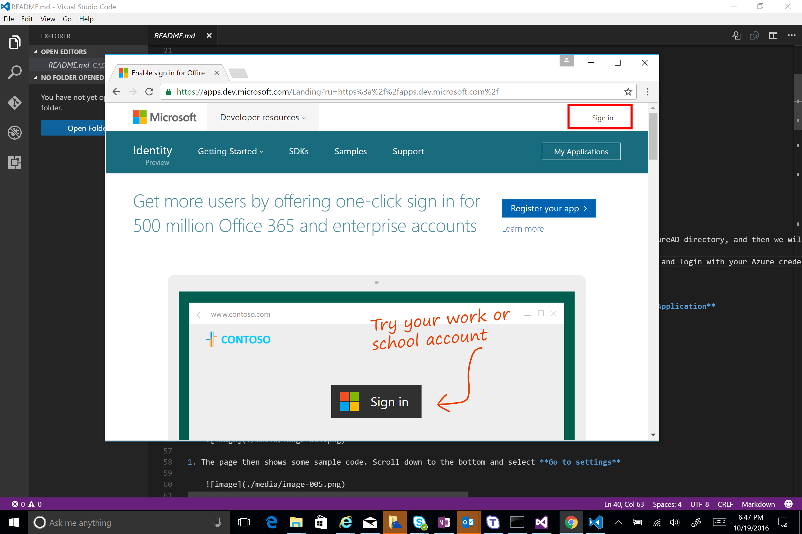
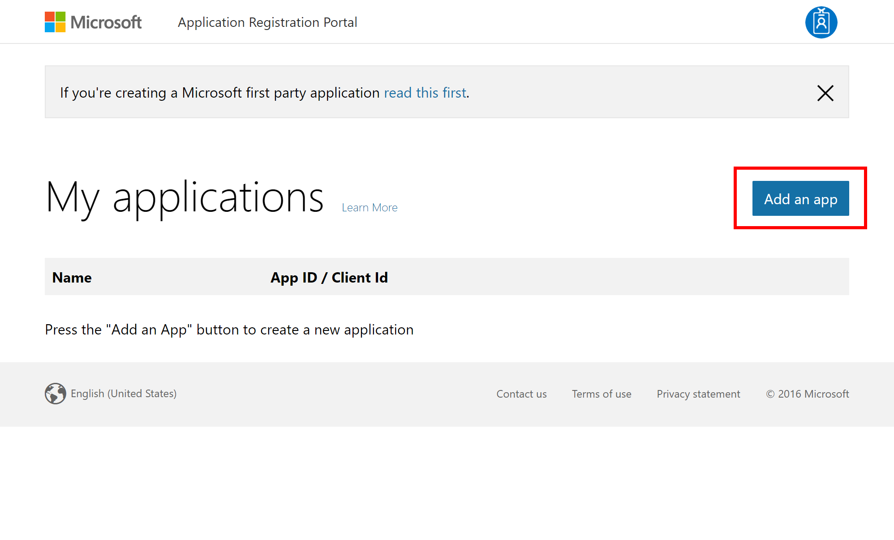
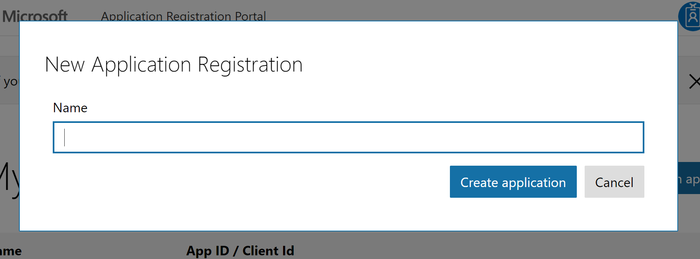
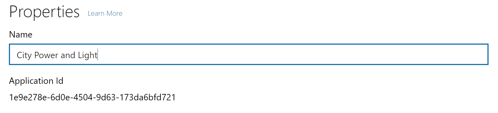
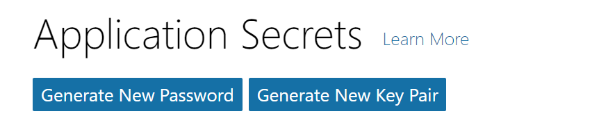
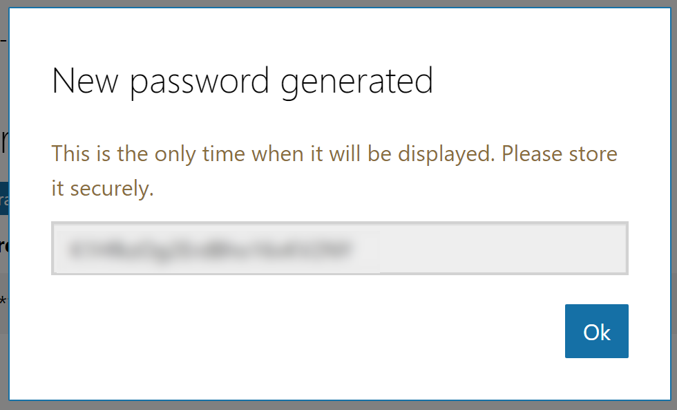
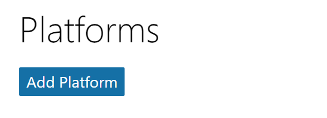
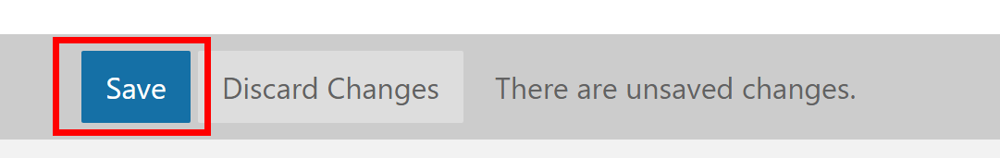
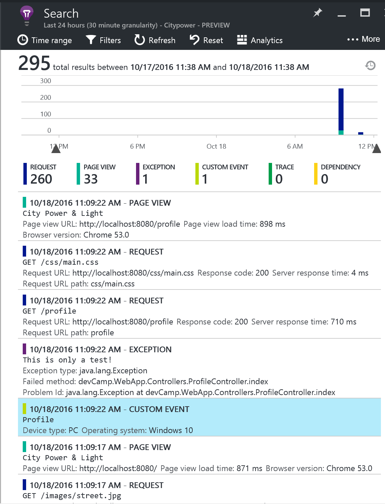
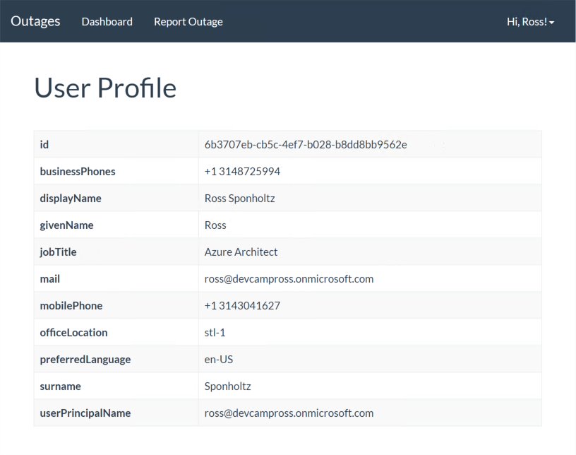

# Hands on Lab - Identity with Azure AD and Office 365 APIs (Java)

## Overview

City Power & Light is a sample application that allows citizens to to report "incidents" that have occured in their community.  It includes a landing screen, a dashboard, and a form for reporting new incidents with an optional photo.  The application is implemented with several components:

* Front end web application contains the user interface and business logic.  This component has been implemented three times in .NET, NodeJS, and Java.
* WebAPI is shared across the front ends and exposes the backend DocumentDB
* DocumentDB is used as the data persistence layer 

In this lab, you will continue enhancing the City Power & Light application by adding authentication for users powered by [Azure Active Direcotry](https://azure.microsoft.com/en-us/services/active-directory/).  Once authenticated, you may then query the [Microsoft Office Graph](https://graph.microsoft.io) to retrieve information pertinent to the aplication.

This guide uses [Eclipse](https://www.eclipse.org) for editing, however please feel free to use your editor of choice.

## Objectives
In this hands-on lab, you will learn how to:

* Take an anonymous application and add user authentication via AzureAD
* Query data from the Microsoft Graph
* Manipulate data in the Microsoft Graph

## Prerequisites

* The source for the starter app is located in the `c:\DevCamp\HOL\java\azuread-office365\start` folder. 
* The finished project is located in the `c:\DevCamp\HOL\java\azuread-office365\end` folder. 
* Deployed the starter ARM Template
* Completion of the first modern-apps lab

## Exercises

This hands-on-lab has the following exercises:

* Exercise 1: Setup authentication 
* Exercise 2: Create a user profile page

## Exercise 1: Integrate the API

AzureAD can handle authentication for web applications. First we will create a new application in our AzureAD directory, and then we will extend our application code to work with an authentication flow. 

1. Navigate in a browser to `https://apps.dev.microsoft.com`, click the link to **Sign in**, and login with your Azure credentials.

    

1. Click `Add an app` to being the process of adding your application

    

    Next, give the application a name (eg. `City Power and Light` ) and press `create application`

    

1. On the next screen, make note of the application Id:

    

1. Under `Application Secrets`, click `Generate New Password`:

    

    Make note of the application secret that was generated - this is the only
    time that you will see it.

    

    In the Platforms section, click on `Add Platform`:

    

    After AzureAD handles the authentication, it needs a 
    route in our application to redirect the user.  For 
    testing locally, we'll use `http://localhost:8080/auth/openid/return` as the **Redirect URI** and 
    as an environment variable named `AAD_RETURN_URL`.  Click the **Create** button. 
    paste that URI in the redirect URI box.

    Finally click `Save` to save your configurations.

    

1. In Eclipse, let's add those environment variables by opening the run environment, click on the environment tab, and clicking `new` (using the values you captured above):

    ```
    "AAD_RETURN_URL": "http://localhost:8080/auth/openid/return",
    "AAD_CLIENT_ID": "2251bd08-10ff-4ca2-a6a2-ccbf2973c6b6",
    "AAD_CLIENT_SECRET": "JjrKfgDyo5peQ4xJa786e8z"
    ```

1. To add AAD identity support libraries to your Spring application, open the build.gradle
   file and add the following entries under dependencies:
   ```java
	compile('com.microsoft.azure:adal4j:1.1.1')
	compile('com.nimbusds:oauth2-oidc-sdk:4.5')
	compile('org.springframework.security:spring-security-core')
	compile('org.springframework.security:spring-security-web')
	compile('org.springframework.security:spring-security-config')
    ```

    To make sure that Eclipse knows about the new packages we added to
    the buld, run the `ide/eclipse` gradle task in the `gradle tasks`
    window. When that is done, right-click on the project in the project explorer,
    close the project, and then open it again.


1. We are going to take a simplistic route for the security features for this example. We are going to create two security filters, one for requesting Azure 
AD Authentication, and the other to process the Azure AD response.  These filters work in conjunction 
with Spring security to allow flexible security requirements for pages in the application.

    First, open the file `devCamp.WebApp.AzureADAuthenticationFilter.java`, which has been commented 
    out. Remove the `/*` at the beginning and the `*/` at the end, so the code is no longer commented out. 

    This is a Spring security fiter that will make sure the user is authenticated on pages
    that require it.  If the user needs authentication, they will be redirected to the login
    page to get the requred token.  
    >Eclipse will complain that there are some missing types - don't worry, we will be adding them in subsequent steps.

1. When the user completes their login, the browser will be redirected back to the same
    page, but with an HTTP post and the token attached.  We need to add a class to catch 
    that post, and save the authentication state in the user's HTTP session. Open the file named `devCamp.WebApp.AzureADResponseFilter.java` which has been commented 
    out. Remove the `/*` at the beginning and the `*/` at the end, so the code is no longer commented out. 

1. These classes need a "helper" class to do some utility functions. Open the file 
named  `devCamp.WebApp.Utils.AuthHelper.java`, which has been commented 
    out. Remove the `/*` at the beginning and the `*/` at the end, so the code is no longer commented out. 

1. Next, we need a class to configure security for our application.  Open `devCamp.WebApp.WWebSecurityConfig.java` which has been commented out. Remove the `/*` at the beginning and the `*/` at the end, so the code is no longer commented out. 

    >This class adds the `AzureADAuthenticationFilter` and the `AzureADResponseFilter` to the 
    filter chain, and configures page matching so that they will be invoked on the proper pages.

1. Our backend code is taking shape, but we need the user interface to display a **Login** button.  Open up `templates/topnav.html` and remove the commented out block of HTML code by deleting the `<!--`  and `-->` characters. Next, for each of the template files (`Dashbord/index.html`, `Home/index.html`, `Incident/index.html`, `Incident/new.html`), replace the navigation bar code with an include for the topnav template.  This is the existing nav bar code:

   ```HTML
    <!-- Top Navigation -->
    <nav class="navbar navbar-default">
        <div class="container-fluid">
            <div class="navbar-header">
                <button type="button" class="navbar-toggle collapsed" data-toggle="collapse" data-target="#navbar-collapse" aria-expanded="false">
                    <span class="sr-only">Toggle navigation</span>
                    <span class="icon-bar"></span>
                    <span class="icon-bar"></span>
                    <span class="icon-bar"></span>
                </button>
                <a class="navbar-brand" th:href="@{/}">Outages</a>
            </div>

            <div class="collapse navbar-collapse" id="navbar-collapse">
                <ul class="nav navbar-nav">
                    <li class="active"><a th:href="@{/dashboard}">Dashboard</a></li>
                    <li><a th:href="@{/new}">Report Outage</a></li>
                </ul>

            </div>
            <!-- /.navbar-collapse -->
        </div>
        <!-- /.container-fluid -->
    </nav>
    ```

    replace it with this:
    ```HTML
    <div th:include="topnav::topnav"></div> 
    ```

    Save all files, run the application and visit the application in the browser. You should see the **Login** button on the top navigation.

    

    Click on the link for **Report Outage**. Since you are not currently authenticated, the application redirects you to Azure to provide a username and password.  Sign in, and you will be redirect back to the homescreen with a username in the top right corner. Click the name to dropdown a link for a **Profile** page and to **Sign Out**.  

    

    The application now behaves differently for anonymous vs. authenticated users, allowing you the developer flexibility in exposing pieces of your application to anonymous audiences while ensuring sensitive content stays protected.

## Exercise 2: Create a user profile page
Next, we are going to create a page to display information about the logged in user.  While AzureAD returns a name and email address when the user logs in, we can query the Microsoft Graph for extended details about a given user.  We will add a view, a controller, and then query the Graph for user information.

1. Create a new file named `templates/Profile/index.html`. Rendered with a set of attributes, we will display a simple table where each row corresponds to an attribute.

    ```html
    <!DOCTYPE html>
    <html lang="en" xmlns="http://www.w3.org/1999/xhtml" 
        xmlns:th="http://www.thymeleaf.org" >
        
    <head>
        <meta charset="UTF-8"/>
        <meta http-equiv="X-UA-Compatible" content="IE=edge"/>
        <meta name="viewport" content="width=device-width, initial-scale=1"/>

        <title>City Power &amp; Light</title>

        <!-- CSS -->
        <link rel="stylesheet" href="//ajax.aspnetcdn.com/ajax/bootstrap/3.3.6/css/bootstrap.css"/>
        <link rel="stylesheet" href="//maxcdn.bootstrapcdn.com/bootswatch/3.3.7/flatly/bootstrap.min.css"/>
        <link rel="stylesheet" href="../css/main.css"/>

    </head>

    <body>
        <div th:include="topnav::topnav"></div> 
        <div class="container">
        
            <h1>User Profile</h1>
        
            <table class="table table-striped table-bordered">
                <tbody>       
                    <tr>
                        <th>id</th>
                        <td th:text="${userProfileBean.ObjectId}"></td>
                    </tr>
                    <tr>
                        <th>businessPhones</th>
                        <td th:text="${userProfileBean.telephoneNumber}"></td>
                    </tr>
                    <tr>
                        <th>displayName</th>
                        <td th:text="${userProfileBean.displayName}"></td>
                    </tr>
                    <tr>
                        <th>givenName</th>
                        <td th:text="${userProfileBean.givenName}"></td>
                    </tr>
                    <tr>
                        <th>jobTitle</th>
                        <td th:text="${userProfileBean.jobTitle}"></td>
                    </tr>
                    <tr>
                        <th>mail</th>
                        <td th:text="${userProfileBean.mail}"></td>
                    </tr>
                    <tr>
                        <th>mobilePhone</th>
                        <td th:text="${userProfileBean.mobile}"></td>
                    </tr>
                    <tr>
                        <th>officeLocation</th>
                        <td th:text="${userProfileBean.physicalDeliveryOfficeName}"></td>
                    </tr>
                    <tr>
                        <th>preferredLanguage</th>
                        <td th:text="${userProfileBean.preferredLanguage}"></td>
                    </tr>
                    <tr>
                        <th>surname</th>
                        <td th:text="${userProfileBean.surname}"></td>
                    </tr>
                    <tr>
                        <th>userPrincipalName</th>
                        <td th:text="${userProfileBean.userPrincipalName}"></td>
                    </tr>
                </tbody>
            </table>
        </div>
        <!-- JavaScript -->
        <script src="//ajax.aspnetcdn.com/ajax/jQuery/jquery-2.2.4.js"></script>
        <script src="//ajax.aspnetcdn.com/ajax/bootstrap/3.3.6/bootstrap.js"></script>	
    </body>
    </html>    
    ```

1. We will need a class to perform the graph API operations - create the `devCamp.WebApp.GraphAPIClient.GraphAPIClient`, and paste in the following code:
    ```java
    package devCamp.WebApp.GraphAPIClient;

    import javax.servlet.http.HttpSession;

    import org.springframework.http.HttpEntity;
    import org.springframework.http.HttpHeaders;
    import org.springframework.http.HttpMethod;
    import org.springframework.http.ResponseEntity;
    import org.springframework.http.converter.StringHttpMessageConverter;
    import org.springframework.http.converter.json.MappingJackson2HttpMessageConverter;
    import org.springframework.web.client.RestTemplate;

    import com.microsoft.aad.adal4j.AuthenticationResult;

    import devCamp.WebApp.Utils.AuthHelper;
    import devCamp.WebApp.ViewModels.UserProfileBean;

    public class GraphAPIClient {

        public static UserProfileBean getUserProfile(HttpSession session) {
            
            //call REST API to create the incident
            // final String uri = "https://graph.windows.net/devcampross.onmicrosoft.com/me?api-version=1.6";
        //final String uri = "https://graph.windows.net/v1.0/me";
        final String uri="https://graph.windows.net/me?api-version=1.6";
            RestTemplate restTemplate = new RestTemplate();
            restTemplate.getMessageConverters().add(new MappingJackson2HttpMessageConverter());
            restTemplate.getMessageConverters().add(new StringHttpMessageConverter());
            HttpHeaders headers = new HttpHeaders();
            
            AuthenticationResult result = AuthHelper.getAuthSessionObject(session);
            String token = result.getAccessToken();
            
            headers.set("Authorization", token);
            System.out.println("TOKEN:"+token);
            headers.set("Accept", "application/json;odata=minimalmetadata");
            HttpEntity<String> entity = new HttpEntity<String>("parameters", headers);
            
            ResponseEntity<UserProfileBean>  response = restTemplate.exchange(uri, HttpMethod.GET, entity, UserProfileBean.class);

            UserProfileBean createdBean =response.getBody();
            return createdBean;		
        }	
    }
    ```

1. With the view prepped, create a controller at `Controllers/ProfileController.java`.  When the `/profile` url is loaded, it will query the Microsoft Graph "Me" endpoint.  This query requires a token to be passed in an `authorization` request header, which we grab from the `user` object provided by the adal4j library.

    ```Java
    package devCamp.WebApp.Controllers;

    import javax.servlet.http.HttpServletRequest;
    import javax.servlet.http.HttpSession;

    import org.springframework.context.annotation.Scope;
    import org.springframework.http.HttpEntity;
    import org.springframework.http.HttpHeaders;
    import org.springframework.http.HttpMethod;
    import org.springframework.http.ResponseEntity;
    import org.springframework.http.converter.StringHttpMessageConverter;
    import org.springframework.http.converter.json.MappingJackson2HttpMessageConverter;
    import org.springframework.stereotype.Controller;
    import org.springframework.ui.Model;
    import org.springframework.web.bind.annotation.RequestMapping;
    import org.springframework.web.client.RestTemplate;

    import com.microsoft.aad.adal4j.AuthenticationResult;

    import devCamp.WebApp.Utils.AuthHelper;
    import devCamp.WebApp.GraphAPIClient.GraphAPIClient;
    import devCamp.WebApp.ViewModels.UserProfileBean;

    @Controller
    @Scope("session")
    public class ProfileController {

        private UserProfileBean getUserProfile(HttpSession session) {
            
            //call REST API to create the incident
            final String uri = "https://graph.windows.net/me?api-version=1.6";
            RestTemplate restTemplate = new RestTemplate();
            restTemplate.getMessageConverters().add(new MappingJackson2HttpMessageConverter());
            restTemplate.getMessageConverters().add(new StringHttpMessageConverter());
            HttpHeaders headers = new HttpHeaders();
            
            AuthenticationResult result = AuthHelper.getAuthSessionObject(session);
            String token = result.getAccessToken();
            
            headers.set("api-version", "2013-04-05");
            headers.set("Authorization", token);
            headers.set("Accept", "application/json;odata=minimalmetadata");
            HttpEntity<String> entity = new HttpEntity<String>("parameters", headers);

            ResponseEntity<UserProfileBean>  response = restTemplate.exchange(uri, HttpMethod.GET, entity, UserProfileBean.class);

            UserProfileBean createdBean =response.getBody();
            return createdBean;		
        }	

        @RequestMapping("/profile")
        public String index(Model model,HttpServletRequest request) {
            HttpSession session = request.getSession();
            UserProfileBean userProfile = GraphAPIClient.getUserProfile(session);
            model.addAttribute("userProfileBean",userProfile);
            return "Profile/index";
        }
    }
    ```
1. We will need a class to contain the user profile information that is retrieved from the Graph API.  It is located in  `devCamp.WebApp.ViewModels.UserProfileBean.java` 

1. The `ProfileController` will display data via the `templates/Profile/index.html` template.  Open this file up and see that it's displaying data from the UserProfileBean.

1. With the view and route created, we can now load `http://localhost:8080/profile` in the browser.

    

We now have a simple visualization of the current user's profile information as loaded from the Microsoft Graph.

## Summary
Our application can now bifurcate anonymous and authenticated users to ensure flexibility between public and private data.  We are also able to leverage the Microsoft Graph to not only return the user's extended user profile, but to send email confirmations whenever a new incident is created.