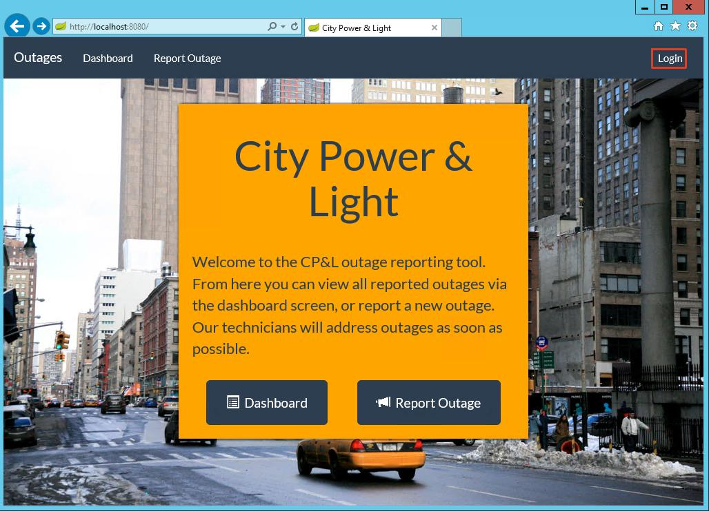

# Hands on Lab - Identity with Azure AD and Office 365 APIs (Java)

## Overview

City Power & Light is a sample application that allows citizens to report "incidents" that have occurred in their community. It includes a landing screen, a dashboard, and a form for reporting new incidents with an optional photo. The application is implemented with several components:

* Front end web application contains the user interface and business logic. This component has been implemented three times in .NET, NodeJS, and Java.
* WebAPI is shared across the front ends and exposes the backend DocumentDB.
* DocumentDB is used as the data persistence layer.

In this lab, you will continue enhancing the City Power & Light application by adding authentication for users powered by [Azure Active Directory](https://azure.microsoft.com/en-us/services/active-directory/). Once authenticated, you may then query the [Microsoft Office Graph](https://graph.microsoft.io) to retrieve information pertinent to the application.

> This guide uses [Eclipse](https://www.eclipse.org) for editing, however please feel free to use your editor of choice.

## Objectives
In this hands-on lab, you will learn how to:

* Take an anonymous application and add user authentication via AzureAD.
* Query data from the Microsoft Graph.
* Manipulate data in the Microsoft Graph.

## Prerequisites

* The source for the starter app is located in the [start](start) folder. 
* The finished project is located in the [end](end) folder. 
* Deployed the starter ARM Template [HOL 1](../01-developer-environment).
* Completion of the [HOL 2](../02-modern-cloud-apps).

> **Note**: If you did not complete the previous labs, the project in the [start](start) folder is cumulative. But you need to add the HOL 2 environment variables.

## Exercises

This hands-on-lab has the following exercises:

* [Exercise 1: Setup authentication](#ex1)
* [Exercise 2: Create a user profile page](#ex2)
* [Exercise 3: Send a confirmation email to the user on incident creation](#ex3)

---
### Exercise 1: Integrate the API<a name="ex1"></a>

AzureAD can handle authentication for web applications. First we will create a new application in our AzureAD directory, and then we will extend our application code to work with an authentication flow. 

1. Navigate in a browser to [https://apps.dev.microsoft.com](https://apps.dev.microsoft.com), login with your Azure credentials (Work or school Account), and click the button to `Add an app`.

    

1. Provide an application name and click `Create`:

    

1. On the Registration page, take note of the `Application ID`. This will be used as an environment variable and is used to configure the authentication library.  

    We also need to generate a client secret. Select the `Generate New Password` button.

    

1. A key is generated for you. ***Save this key***, as you will not be able to retrieve it in the future.

    

1. Click on the `Add Platform` button:

    

1. Select `Web`:

    

1. After AzureAD handles the authentication, it needs a location to redirect the user. For testing locally, we'll use `http://localhost:8080/auth/openid/return` as the `Redirect URI` and as an environment variable named `AAD_RETURN_URL`. Click the `Create` button. Paste that URI in the redirect URI box.


    Click the `Add Url` button, and add `http://localhost:8080/login` also.

1. We will need to grant our application permission to access resources on our behalf. In the Microsoft Graph Permissions section for `Delegated Permissions`, select `Add`:

      

1. Add the following permissions (you will have to scroll down to find them):
    * Mail.ReadWrite
    * Mail.Send
    * User.Read
    * User.ReadBasic.All

    
    
  
    Confirm your selection and close the modal dialog by clicking `OK`.


1. Click the `Save` button on the bottom of the screen.

      

1. In Eclipse, let's add those environment variables by opening the run environment, click on the environment tab, and clicking `new` (using the values you captured above):

    ```
    "AAD_RETURN_URL": "http://localhost:8080/auth/openid/return",
    "AAD_CLIENT_ID": "YOUR CLIENT ID HERE",
    "AAD_CLIENT_SECRET": "YOUR SECRET HERE"
    ```

1. To add AAD identity support libraries to your Spring application, open the `build.gradle` file and add the following entries under dependencies:
   ```java
	compile('org.springframework.boot:spring-boot-starter-security')
	compile('org.springframework.security.oauth:spring-security-oauth2')					
	compile('org.springframework.security:spring-security-jwt')
	compile('org.thymeleaf.extras:thymeleaf-extras-springsecurity4')
    ```

    To make sure that Eclipse knows about the new packages we added to the build, run the `ide/eclipse` gradle task in the `gradle tasks` window. When that is done, right-click on the project in the project explorer, close the project, and then open it again.

1. We are going to use the OAuth2 support in Spring to implement most of the features we need for logins. The main effort here is going to be configuring the application.  First, open your `application.yml` file, and add these lines at the bottom:
    ```
    security:
      oauth2:
        client:
          clientId: ${AAD_CLIENT_ID}
          clientSecret: ${AAD_CLIENT_SECRET}
          accessTokenUri: https://login.microsoftonline.com/common/oauth2/v2.0/token
          userAuthorizationUri: https://login.microsoftonline.com/common/oauth2/v2.0/authorize
          tokenName: access_token
          authenticationScheme: header
          clientAuthenticationScheme: form
          preEstablishedRedirectUri: ${AAD_RETURN_URL}
          scope:  openid,profile,User.Read, Mail.Send
        resource:
          userInfoUri: https://graph.microsoft.com/v1.0/me    
    ```
    This will configure the Spring OAuth2 to use the Azure Active Directory URLs for login, token exchange, and getting the user's information, and it will retrieve the application configuration variables from the OS environment.

    > Be careful with indentation in the `application.yml` file.  The line with `security:` should not be indented at all, the line with `oauth2:` should be indented with two spaces, etc. If you run the application and get an error like this: `java.lang.IllegalArgumentException: HTTP URL must not be null`, check your indentation.  If you continue to have problems with this, it may be convenient to copy this file from the `end` directory.

1. We will need to tell Spring which pages to protect and which ones to remain public. Open the `devCamp.WebApp.DevcampApplication` class. Add the `@EnableOAuth2Sso` annotation, and make the `DevcampApplication` class inherit from `WebSecurityConfigurerAdapter`. Also, add a `configure` function so the class looks like this:

    ```java
    package devCamp.WebApp;

    import org.springframework.boot.SpringApplication;
    import org.springframework.boot.autoconfigure.SpringBootApplication;
    import org.springframework.cache.annotation.EnableCaching;
    import org.springframework.context.annotation.Configuration;

    @Configuration
    @SpringBootApplication
    @EnableCaching
    @EnableOAuth2Sso
    public class DevcampApplication extends WebSecurityConfigurerAdapter {

        @Override
        protected void configure(HttpSecurity http) throws Exception {
            // @formatter:off
            http.antMatcher("/**").authorizeRequests().antMatchers("/", "/login**", "/dashboard**", "/webjars/**").permitAll().anyRequest()
                    .authenticated().and().logout().logoutSuccessUrl("https://login.windows.net/common/oauth2/logout").permitAll().and().csrf()
                    .csrfTokenRepository(CookieCsrfTokenRepository.withHttpOnlyFalse());
            // @formatter:on
        }   

        public static void main(String[] args) {
            SpringApplication.run(DevcampApplication.class, args);
        }
    }
    ```
    You will need to resolve the imports for `EnableOAuth2Sso`, `WebSecurityConfigurerAdapter`, `HttpSecurity` and `CookieCsrfTokenRepository`.

    This configures the `/`, `/login`, `/dashboard` and `/webjars` URLs to be public, and all others to be private. It will also automatically implement a `/logout` URL which will logout the user from the application and Azure Active Directory.

1. These are the main changes to our application to add Azure Active Directory authentication. In fact, if you were to run the application at this point, you should be able to get to the main page and the dashboard, but be redirected to the Azure Active Directory login page if you try to go to the new incident page. We need the user interface to display a `Login` button if the user is not logged in. Open up `templates/topnav.html` and remove the commented out block of HTML code by deleting the `<!--`  and `-->` characters. 

    Also, update the HTML line at the top of the `templates/topnav.html` file to include a definition for `http://www.thymeleaf.org/thymeleaf-extras-springsecurity4`:

    ```
    <html xmlns:th="http://www.thymeleaf.org" xmlns:sec="http://www.thymeleaf.org/thymeleaf-extras-springsecurity4">

    ```

    The `topnav.html` file relies on a function to retrieve the user's name from the token that is retrieved from Azure Active Directory.  Create the class `devCamp.WebApp.Utils.OAuth2TokenUtils`, and paste in this code:
    ```java
    package devCamp.WebApp.Utils;

    import java.util.HashMap;

    import org.slf4j.Logger;
    import org.slf4j.LoggerFactory;
    import org.springframework.security.core.Authentication;
    import org.springframework.security.core.context.SecurityContext;
    import org.springframework.security.core.context.SecurityContextHolder;
    import org.springframework.security.oauth2.provider.OAuth2Authentication;

    public class OAuth2TokenUtils {
        private static final Logger LOG = LoggerFactory.getLogger(OAuth2TokenUtils.class);
        //businessPhones
        //mail
        //officeLocation
        //displayName
        //givenName
        //userPrincipalName

        public static String getMail() {
            return getAttr("mail");
        }

        public static String getGivenName() {
            return getAttr("givenName");
        }

        public static String getAttr(String attr) {
            HashMap hm = getMap();
            if (hm != null){
                String m = (String)hm.get(attr);
                LOG.info("{} = {}",attr,m);
                return m;
            }
            return null;
        }

        private static HashMap getMap(){
            SecurityContext securityContext = SecurityContextHolder.getContext();
            if (securityContext != null) {
                Authentication sco = securityContext.getAuthentication();
                if (sco instanceof OAuth2Authentication){
                    OAuth2Authentication au = (OAuth2Authentication)sco;
                    Authentication auth = au.getUserAuthentication();
                    Object deets = auth.getDetails();
                    if (deets instanceof HashMap){
                        return (HashMap)deets;
                    }
                }
            }
            return null;		
        }
    }
    ```

    This is a relatively ugly class - Spring has generic support for OAuth2, but in this class we are depending on the fact that we are using Azure Active Directory.  That makes it possible for us to downcast and get the underlying user's information.

1. Save all files, run the application and visit the application in the browser. You should see the `Login` button on the top navigation.

    

    Click on the link for `Report Outage`. Since you are not currently authenticated, the application redirects you to Azure to provide a username and password. Sign in, and you will be redirect back to the homescreen with a username in the top right corner. Click the name to dropdown a link for a `Profile` page and to `Sign Out`.  

    

    The application now behaves differently for anonymous vs. authenticated users, allowing you the developer flexibility in exposing pieces of your application to anonymous audiences while ensuring sensitive content stays protected.

---
## Exercise 2: Create a user profile page<a name="ex2"></a>

Next, we are going to create a page to display information about the logged in user. While AzureAD returns a name and email address when the user logs in, we can query the Microsoft Graph for extended details about a given user.  We will add a view, a controller, and then query the Graph for user information.

1. We will need a class to contain the user profile information that is retrieved from the Graph API. It is located in  `devCamp.WebApp.models.UserProfileBean`, with this code:
    ```java
    package devCamp.WebApp.models;

    import org.codehaus.jackson.annotate.JsonProperty;

    public class UserProfileBean {
        @JsonProperty(value = "odata.metadata")
        private String OdataMetadata;
        private String Entity;
        private String objectId;
        private String TelephoneNumber;
        private String DisplayName;
        private String GivenName;
        private String JobTitle;
        private String Mail;
        private String Mobile;
        private String PhysicalDeliveryOfficeName;
        private String PreferredLanguage;
        private String Surname;
        private String UserPrincipalName;
        
        public String getOdataMetadata(){
            return OdataMetadata;
        }
        public void setOdataMetadata(String data){
            OdataMetadata = data;
        }
        public String getEntity(){
            return Entity;
        }
        public void setEntity(String entity) {
            Entity = entity;
        }
        public String getObjectId() {
            return objectId;
        }
        public void setObjectId(String id) {
            objectId = id;
        }
        public String getTelephoneNumber() {
            return TelephoneNumber;
        }
        public void setTelephoneNumber(String telephoneNumber) {
            TelephoneNumber=telephoneNumber;
        }
        public String getDisplayName() {
            return DisplayName;
        }
        public void setDisplayName(String displayName) {
            DisplayName = displayName;
        }
        public String getGivenName() {
            return GivenName;
        }
        public void setGivenName(String givenName) {
            GivenName = givenName;
        }
        public String getJobTitle() {
            return JobTitle;
        }
        public void setJobTitle(String jobTitle) {
            JobTitle = jobTitle;
        }
        public String getMail() {
            return Mail;
        }
        public void setMail(String mail) {
            Mail = mail;
        }
        public String getMobile() {
            return Mobile;
        }
        public void setMobile(String mobile) {
            Mobile = mobile;
        }
        public String getPhysicalDeliveryOfficeName() {
            return PhysicalDeliveryOfficeName;
        }
        public void setPhysicalDeliveryOfficeName(String officeLocation) {
            PhysicalDeliveryOfficeName = officeLocation;
        }
        public String getPreferredLanguage() {
            return PreferredLanguage;
        }
        public void setPreferredLanguage(String preferredLanguage) {
            PreferredLanguage = preferredLanguage;
        }
        public String getSurname() {
            return Surname;
        }
        public void setSurname(String surname) {
            Surname = surname;
        }
        public String getUserPrincipalName() {
            return UserPrincipalName;
        }
        public void setUserPrincipalName(String userPrincipalName) {
            UserPrincipalName = userPrincipalName;
        }
    }
    ```

1. Create a new file named `templates/Profile/index.html`. Rendered with a set of attributes, we will display a simple table where each row corresponds to an attribute.

    ```html
    <!DOCTYPE html>
    <html lang="en" xmlns="http://www.w3.org/1999/xhtml" 
        xmlns:th="http://www.thymeleaf.org" >
        
    <head>
        <meta charset="UTF-8"/>
        <meta http-equiv="X-UA-Compatible" content="IE=edge"/>
        <meta name="viewport" content="width=device-width, initial-scale=1"/>

        <title>City Power &amp; Light</title>

        <!-- CSS -->
        <link rel="stylesheet" href="//ajax.aspnetcdn.com/ajax/bootstrap/3.3.6/css/bootstrap.css"/>
        <link rel="stylesheet" href="//maxcdn.bootstrapcdn.com/bootswatch/3.3.7/flatly/bootstrap.min.css"/>
        <link rel="stylesheet" href="../css/main.css"/>

    </head>

    <body>
        <div th:include="topnav::topnav"></div> 
        <div class="container">
        
            <h1>User Profile</h1>
        
            <table class="table table-striped table-bordered">
                <tbody>       
                    <tr>
                        <th>id</th>
                        <td th:text="${userProfileBean.ObjectId}"></td>
                    </tr>
                    <tr>
                        <th>businessPhones</th>
                        <td th:text="${userProfileBean.telephoneNumber}"></td>
                    </tr>
                    <tr>
                        <th>displayName</th>
                        <td th:text="${userProfileBean.displayName}"></td>
                    </tr>
                    <tr>
                        <th>givenName</th>
                        <td th:text="${userProfileBean.givenName}"></td>
                    </tr>
                    <tr>
                        <th>jobTitle</th>
                        <td th:text="${userProfileBean.jobTitle}"></td>
                    </tr>
                    <tr>
                        <th>mail</th>
                        <td th:text="${userProfileBean.mail}"></td>
                    </tr>
                    <tr>
                        <th>mobilePhone</th>
                        <td th:text="${userProfileBean.mobile}"></td>
                    </tr>
                    <tr>
                        <th>officeLocation</th>
                        <td th:text="${userProfileBean.physicalDeliveryOfficeName}"></td>
                    </tr>
                    <tr>
                        <th>preferredLanguage</th>
                        <td th:text="${userProfileBean.preferredLanguage}"></td>
                    </tr>
                    <tr>
                        <th>surname</th>
                        <td th:text="${userProfileBean.surname}"></td>
                    </tr>
                    <tr>
                        <th>userPrincipalName</th>
                        <td th:text="${userProfileBean.userPrincipalName}"></td>
                    </tr>
                </tbody>
            </table>
        </div>
        <!-- JavaScript -->
        <script src="//ajax.aspnetcdn.com/ajax/jQuery/jquery-2.2.4.js"></script>
        <script src="//ajax.aspnetcdn.com/ajax/bootstrap/3.3.6/bootstrap.js"></script>	
    </body>
    </html>    
    ```

1. We will need a class to perform the graph API operations - create the `devCamp.WebApp.services.GraphService` interface, and paste in the following code:
    ```java
    package devCamp.WebApp.services;

    import org.springframework.stereotype.Service;

    import devCamp.WebApp.models.UserProfileBean;

    @Service
    public interface GraphService {
        public UserProfileBean getUserProfile() ;
    }
    ```

    The implementation for this interface will be `devCamp.WebApp.services.GraphServiceImpl`.  This is a great example of calling a service with the OAuth2 credentials.  Paste in  this code:

    ```java
    package devCamp.WebApp.services;

    import org.codehaus.jettison.json.JSONArray;
    import org.codehaus.jettison.json.JSONException;
    import org.codehaus.jettison.json.JSONObject;
    import org.slf4j.Logger;
    import org.slf4j.LoggerFactory;
    import org.springframework.beans.factory.annotation.Autowired;
    import org.springframework.beans.factory.annotation.Value;
    import org.springframework.context.annotation.Bean;
    import org.springframework.http.HttpEntity;
    import org.springframework.http.HttpHeaders;
    import org.springframework.http.MediaType;
    import org.springframework.security.oauth2.client.OAuth2ClientContext;
    import org.springframework.security.oauth2.client.OAuth2RestOperations;
    import org.springframework.security.oauth2.client.OAuth2RestTemplate;
    import org.springframework.security.oauth2.client.resource.OAuth2ProtectedResourceDetails;
    import org.springframework.security.oauth2.client.token.grant.code.AuthorizationCodeResourceDetails;
    import org.springframework.security.oauth2.config.annotation.web.configuration.EnableOAuth2Client;
    import org.springframework.stereotype.Service;

    import devCamp.WebApp.models.UserProfileBean;

    @EnableOAuth2Client
    @Service
    public class GraphServiceImpl implements GraphService{
        private static final Logger LOG = LoggerFactory.getLogger(GraphServiceImpl.class);
        @Autowired
        private OAuth2RestOperations restTemplate;
            
        @Value("${oauth2.resource.userInfoUri:https://graph.microsoft.com/v1.0/me}")
        private String baseUrl;
        
        public UserProfileBean getUserProfile() {
            LOG.info("getting user profile");
            UserProfileBean result = restTemplate.getForObject(baseUrl, UserProfileBean.class);
            return result;
        }
        
        
        @Bean
        public OAuth2RestOperations restTemplate(OAuth2ClientContext oauth2ClientContext) {
            return new OAuth2RestTemplate(resource(), oauth2ClientContext);
        }

        @Bean
        protected OAuth2ProtectedResourceDetails resource() {
            AuthorizationCodeResourceDetails resource = new AuthorizationCodeResourceDetails();
            resource.setClientId("my-trusted-client");
            return resource ;
        }
                
    }
    ```

1. Next, lets create a controller at `devCamp.WebApp.Controllers.ProfileController`. This will invoke the above service when the `/profile` URL is loaded, querying the Microsoft Graph "Me" endpoint.  

    ```Java
    package devCamp.WebApp.Controllers;

    import org.slf4j.Logger;
    import org.slf4j.LoggerFactory;
    import org.springframework.beans.factory.annotation.Autowired;
    import org.springframework.context.annotation.Configuration;
    import org.springframework.stereotype.Controller;
    import org.springframework.ui.Model;
    import org.springframework.web.bind.annotation.RequestMapping;

    import devCamp.WebApp.models.UserProfileBean;
    import devCamp.WebApp.services.GraphService;


    @Configuration
    @Controller
    public class ProfileController {
        private static final Logger LOG = LoggerFactory.getLogger(ProfileController.class);

        @Autowired
        private GraphService graphService;
        
        @RequestMapping("/profile")
        public String index(Model model) {
            LOG.info("getting user profile");
            UserProfileBean result = graphService.getUserProfile();

            model.addAttribute("userProfileBean",result);
            return "Profile/index";
        }
            
    }
    ```

1. With the view and controller created, we can now run the application, log in, and load `http://localhost:8080/profile` in the browser.

    

We now have a simple visualization of the current user's profile information as loaded from the Microsoft Graph.  If there are missing fields in this page,
those fields were likely not filled in in the Azure Active Directory user profile.

---

## Exercise 3: Interact with the Microsoft Graph<a name="ex3"></a>

In the previous exercise you read data from the Microsoft Graph API, but other endpoints can be used for more sophisticated tasks. In this exercise we will use the Graph to send an email message whenever a new incident is reported.

1. We are going to create a `sendMail` function in the `GraphService` object - first, open up the `devCamp.WebApp.services.GraphService.java` file and add a declaration for the new function inside of the interface definition:
    ```java
    public void sendMail(String displayName,String emailAddr);
    ```

    Open up the `devCamp.WebApp.services.GraphServiceImpl.java` file, and add the implementation for the sendMail function:
    ```java
	private static String emailContent1 = "<html><head><meta http-equiv='Content-Type' content='text/html; charset=us-ascii\'>"
			+ "<title></title></head><body style=\"font-family:Calibri\">"
			+ "<div style=\"width:50%;background-color:#CCC;padding:10px;margin:0 auto;text-align:center;\">"
			+"<h1>City Power &amp; Light</h1><h2>New Incident Reported by ";
	private static String emailContent2 = "</h2><p>A new incident has been reported to the City Power &amp; Light outage system.</p>"   
			+"<br /></div></body></html>";

	@Value("${oauth2.resource.mailUri:https://graph.microsoft.com/v1.0/me/sendMail}")
	private String mailUrl;
	
    public void sendMail(String displayName,String emailAddr){
    	LOG.info("sending email");
    	String email = emailContent1 + displayName+ emailContent2;
    	
    	JSONObject body = null;
		try {
			body = new JSONObject()
					.put("ContentType", "HTML")
					.put("Content", email);
    			
			JSONObject aa = new JSONObject()
					.put("Address", emailAddr);
			JSONObject ee = new JSONObject()
					.put("EmailAddress", aa);
	    	JSONArray recipients = new JSONArray()
	    			.put(ee);
	    	JSONObject jsonMessage = new JSONObject()
	    			.put("Subject","New Incident Reported")
	    			.put("Body",body)
	    			.put("ToRecipients",recipients);
	        JSONObject json = new JSONObject()
	                .put("Message", jsonMessage)
	                .put("SaveToSentItems", true);   
	        String jsons = json.toString();
	        HttpHeaders headers = new HttpHeaders();
	        headers.setContentType(MediaType.APPLICATION_JSON);
	        HttpEntity<String> entity = new HttpEntity<String>(jsons,headers);
	        
	    	String result = restTemplate.postForObject(mailUrl, entity, String.class);   	
		} catch (JSONException e) {
			// TODO Auto-generated catch block
			e.printStackTrace();
		}   
    }
    ```

1. Lets update the `devCamp.WebApp.Controllers.IncidentController` to call this function when a new incident is created. Add an `@Autowired` instance of `GraphService` under the one for `AzureStorageService`. You will have to resolve the import for `GraphService` as well: 
    ```java
	@Autowired
    private GraphService graphService;    
    ```
    Next, add the call to the `sendMail` function at the beginning of the `Create` function:
    ```java
	public String Create(@ModelAttribute IncidentBean incident, @RequestParam("file") MultipartFile imageFile) {
		LOG.info("creating incident");
		graphService.sendMail(OAuth2TokenUtils.getGivenName(),OAuth2TokenUtils.getMail()); 
    ```
    You will need to resolve the imports for `GraphService` and `OAuth2TokenUtils`.
    
1. You can now test the functionality by running the application, logging in, and creating a new incident. Go to [outlook.office365.com/owa/](https://outlook.office365.com/owa/) to see it. Use the credentials you used to create your Azure subscription.
    
    

Sending this email did not require the setting up of a dedicated email server, but instead leveraged capabilities within the Microsoft Graph. We could have also created a calendar event, or a task related to the incident for a given user, all via the API.

---
## Summary

Our application can now bifurcate anonymous and authenticated users to ensure flexibility between public and private data. We are also able to leverage the Microsoft Graph to not only return the user's extended user profile, but to send email confirmations whenever a new incident is created.

In this hands-on lab, you learned how to:
* Take an anonymous application and add user authentication via AzureAD.
* Query data from the Microsoft Graph.
* Manipulate data in the Microsoft Graph.

After completing this module, you can continue on to Module 4: DevOps with Visual Studio Team Services.

### View instructions for [Module 4 for Java](../04-devops-ci).

---
Copyright 2016 Microsoft Corporation. All rights reserved. Except where otherwise noted, these materials are licensed under the terms of the MIT License. You may use them according to the license as is most appropriate for your project. The terms of this license can be found at https://opensource.org/licenses/MIT.