# DevOps with Visual Studio Team Services (Java)

## Overview
In this lab, you will create a Visual Studio Team Services online account, check in your code, create a Continuous Integration pipeline, and test your cloud-based application.

## Objectives
In this hands-on lab, you will learn how to:
* Create a Visual Studio Team Services online account
* Create a VSTS Git repository
* Add your code to the VSTS Git repository
* Create a Continuous Integration pipeline

## Prerequisites

* The source for the starter app is located in the [start](start) folder. 
* There will be no code changes required so the the end folder will remain empty. 
* Deployed the starter ARM Template HOL 1
* Completion of the [azuread-office365](../03-azuread-office365)

> Note: If you did not complete the previous labs, the project in the start folder is cumulative.

## Exercises
This hands-on-lab has the following exercises:
* Exercise 1: Create VSTS online account 
* Exercise 2: Create VSTS Git repository
* Exercise 3: Add application to VSTS Git
* Exercise 4: Create a Continuous Integration pipeline

---
## Exercise 1: Create VSTS online account

1. In your browser, navigate to [https://www.visualstudio.com/]()

    

1. Log in with your Azure AD account 

---
## Exercise 2: Create VSTS Git repository

VSTS gives us the option to use Git or 
[TFVC](https://www.visualstudio.com/en-us/docs/tfvc/overview) as our 
project's repository. For this exercise we will use Git, and then clone 
the repository to our dev machine. 

> Note that if you acquired these lab materials via a `git clone` of the workshop repo then you should select a folder somewhere else on your dev machine. 
> This will minimize conflicts between the two separate repositories 

1. Starting at your account's landing page, locate the section entitled **Recent projects & teams** and click **New**.

    

1. Enter a project name such as **DevCamp**, ensure **Version Control** is set to **Git** and then click **Create Project**.

    

1. Wait for the project to be created. This process may take up to 60 seconds. When finished select the **Navigate to Project** button

    

1. Exit out of the Congratulations window and explore your pre-built dashboard. Familiarize yourself with the variety of widgets available, and the customization options. 

    

1. Click **Code** on the top toolbar to navigate to the Code screen.  Then click the **Generate Git Credentials** button to set a user name, alias, and password.

    

1. Next, select the **Copy** icon to copy the HTTPS URL for the repository.

1. In a console window, navigate to a spot on your dev machine and execute a `git clone https://yourrepo.com/DefaultCollection/_git/Repo.git`

    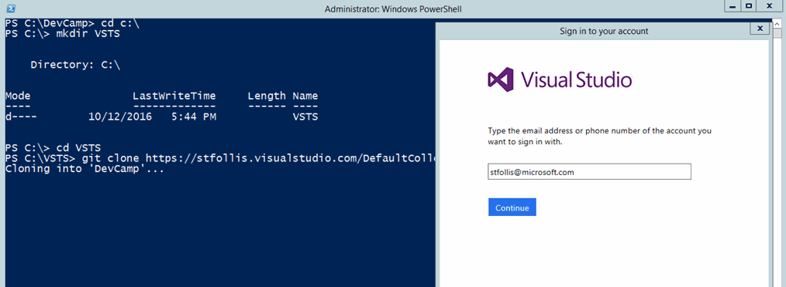

    Depending on your environment setup you may need to authenticate with VSTS

You have now created a project in VSTS with a Git repository, and cloned the repository locally to your developer machine.  Next we'll upload code from our machine to VSTS.

----
## Exercise 3: Add application to VSTS Git

1. When we cloned our repository it was empty.  Take the code that you have developed in the earlier labs (or the `start` folder bundled with this readme) and paste it into our new directory.  This can be done via the command line, or with good old copy/paste in an Explorer or Finder window.

    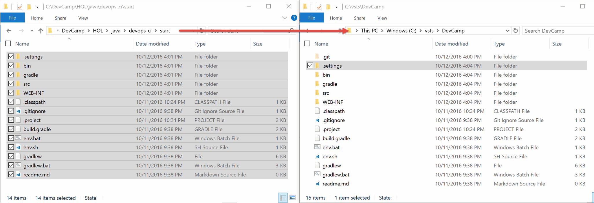

    > Depending on how your environment is setup, there may be a hidden folder `.git` in your originating directory. Do not copy this folder into the destination directory linked to VSTS

1. Back in the console, execute a `git status` to ensure the files are picked up by git.

    ```CMD
    git status
    ```

    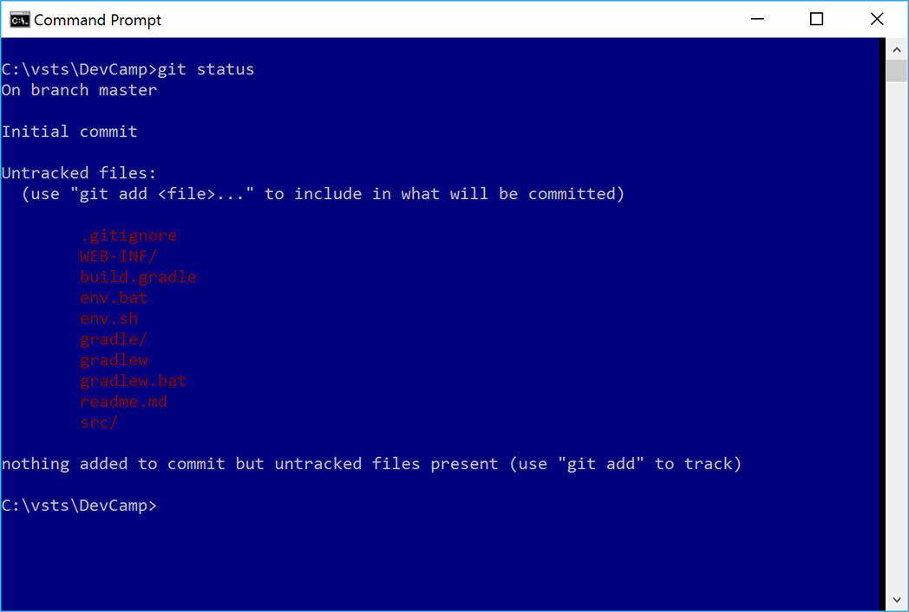

1. Execute `git add *` to track the files, then a `git commit -m "initial upload"` to commit the files to the repository. Finally, execute `git push origin master` to push the files up to VSTS.

    ```CMD
    git add *
    git commit -m "initial upload"
    git push origin master
    ```

    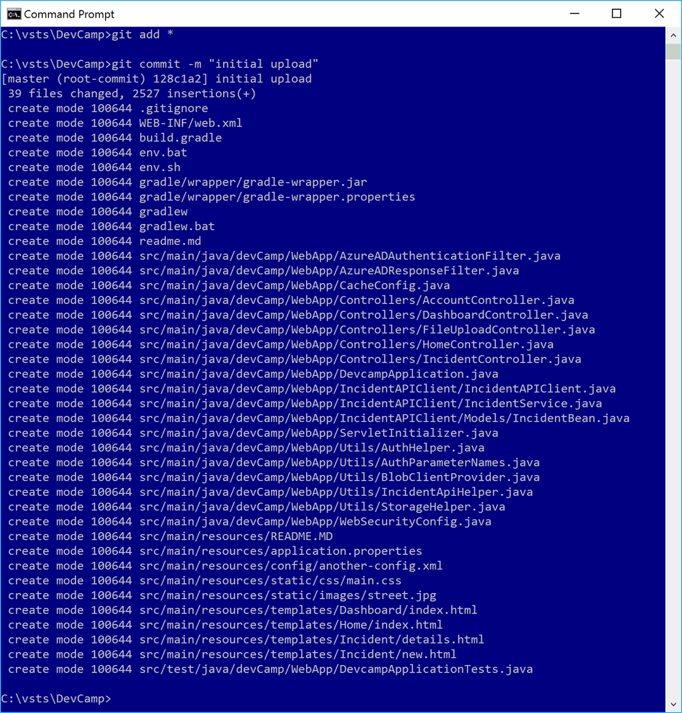

1. In the browser, reload the **Code** page to see the uploaded code

    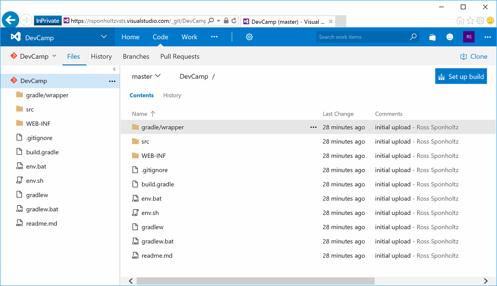

1. Now, any changes you make to the local repository can be pushed up to VSTS.  Other team members may also begin interacting with the code base via their own clones and pushes.

    > Note that we did not include the `build` or `.gradle` folders. These components are typically not added to source control, as they bloat the size of the repository.  These files should have been excluded from your 
    > repository due to settings in the `.gitignore` file

---
## Exercise 4: Create a Continuous Integration pipeline

With application code now uploaded to VSTS, we can begin to create builds via a 
Build Definition.  Navigate to the **Build** tab from he top navigation.  
We will use the hosted agent within VSTS to process our builds in this 
exercise.

1. From the **Build** tab, create a new **Build Definition**

    

1. There are prebuilt definitions for a variety of programming languages and application stacks, however for this exercise select **Empty** and click **Next**

    

1. Confirm the Repository Source is set to your VSTS Project, that the repository is set the repo that was earlier created, and that the Agent Queue is set to **Hosted**.  

    Check the box next to **Continuous Integration** to automatically run this build anytime code is checked into the repository.

    

1. After the empty Build Definition is created, we need to create a series of Build Steps.

    * Perform a gradle build of the application
    * Copy the ROOT.war file into a `/webapps` directory, so that when we do a web deploy, 
    the WAR gets placed in the right location
    * Package the code assets into a deployable zip file
    * Publish the zip file as a Publish Artifact that can be consumed by the VSTS Release System

    Each of these steps will begin by clicking the **Add build step** button

    

1.  Add a Build Step for **Gradle**, found under the left-hand filter for **Build**.  After you have done this, click `Close` to close the task catalog.

    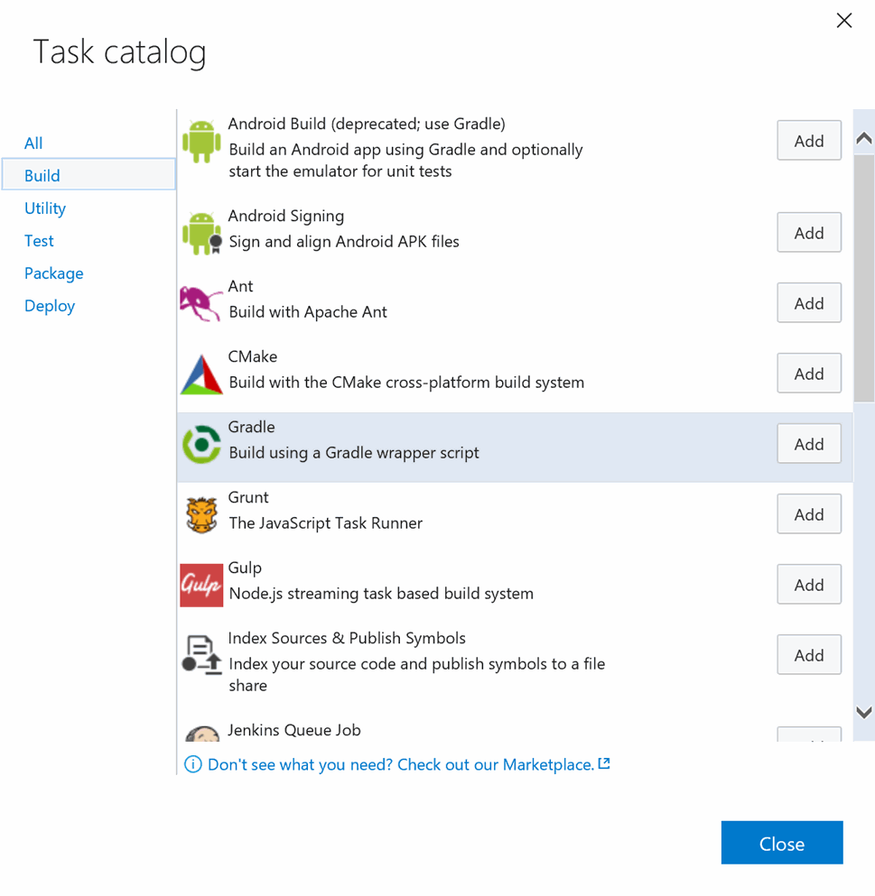

    Configure the step **Tasks** to `war`, and uncheck the checkbox for 
    "Publish to TFS/Team Services" in the Junit Test Results box.

    Also click the pencil icon to name this build step to **Java DevCamp build**

    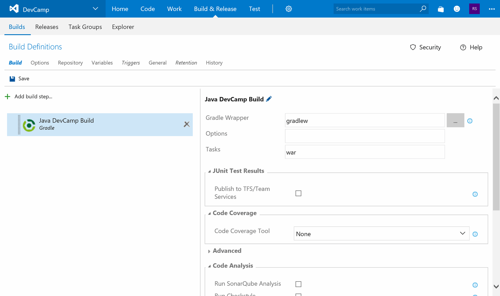

1. Add a Build Step for **Copy Files**, found under the left-hand filter for **Utility**

    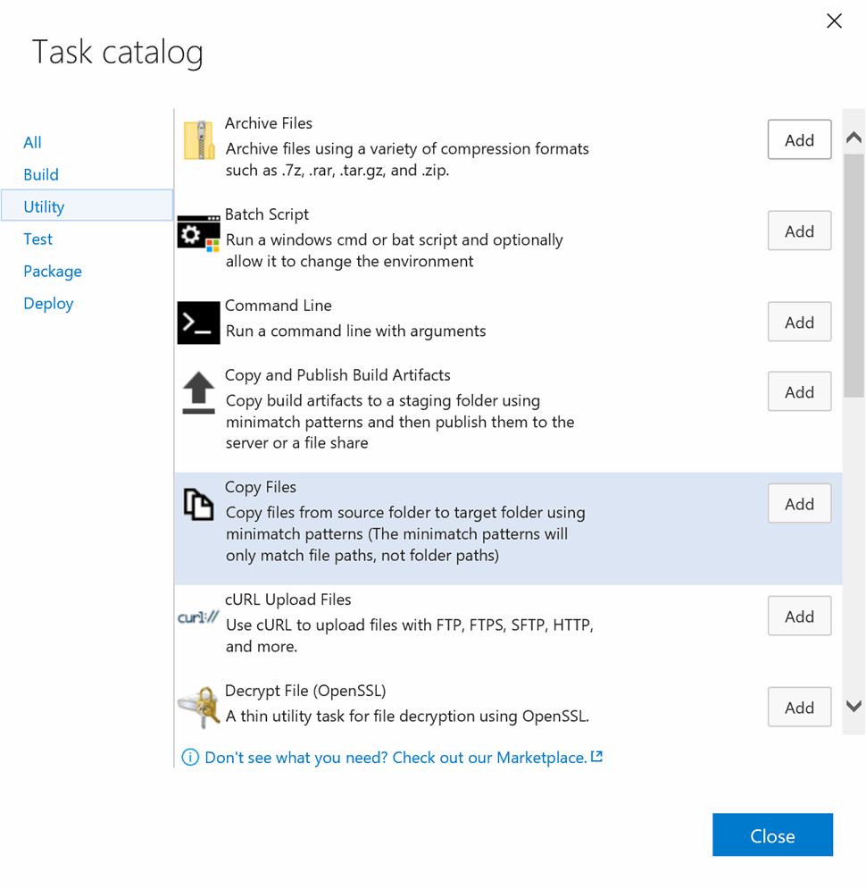

    In configuration boxes, we can use variables in addition to string 
    literals.   

    Configure **Source Folder** for `$(build.sourcesdirectory)/build/libs`, 
    **Contents** for `**/*.war`,
    **Target Folder** for `$(build.artifactstagingdirectory)/webapps` 
    and name the step **Copy WAR file**

    
 

1. Add a Build Step for **Archive**, found under the left-hand filter for **Utility**

    

    For **Root Folder** insert `$(build.artifactstagingdirectory)`

    For **Archive file to create** insert 
    `$(Build.ArtifactStagingDirectory)/$(Build.BuildId).zip`
    This will dynamically name our zip file of code with the build number.

    Uncheck the box for **Prefix root folder name to archive paths** to 
    avoid an unnecessary nesting within the .zip file.

    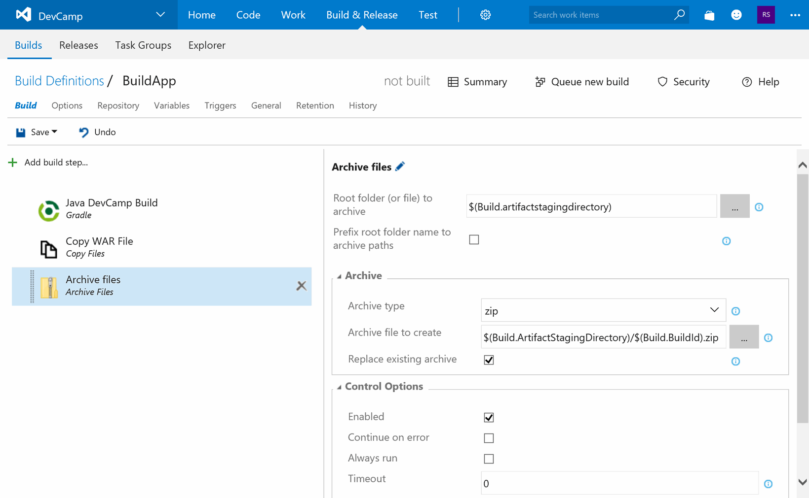

    > You can define your own variables to use throughout the Build and Release pipelines by 
    clicking **Variables** in the Build Definition's sub-navigation. Also see 
    [here](https://www.visualstudio.com/docs/build/define/variables) for all pre-defined 
    variables available 

1. Finally, create a Build Step for **Publish Build Artifacts**, found under the left-hand filter 
for **Utility**.  This step outputs a file(s) from our Build Definition as a special "artifact" 
that can be used in VSTS' Release Definitions.

    

    Configure **Path to Publish** as `$(Build.ArtifactStagingDirectory)/$(Build.BuildId).zip` to target 
    the zip file created in the previous Build Step.

    For **Artifact Name** enter `drop`

    Set **Artifact Type** to `Server`

    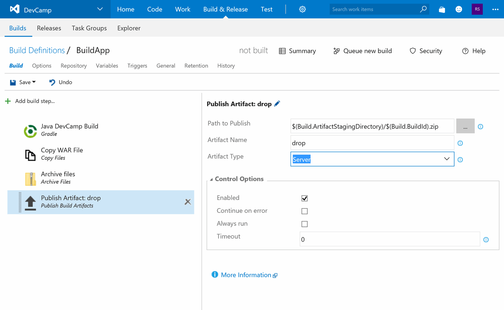

1. Save your Build Definition named **BuildApp**

    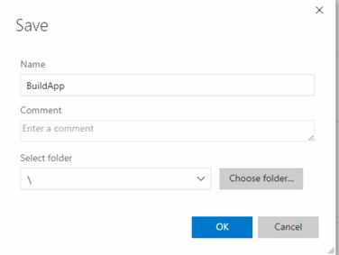

1. Our saved Build Definition is ready to be processed by the Hosted Build Agent.  
Click **Queue New Build** to start the build process. 

    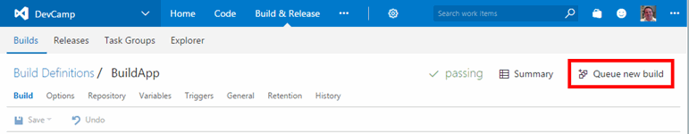

    Accept the defaults and click **OK**

    

    Your Build will then be queued until the Hosted Build Agent can pick it up for processing.  
    This typically takes less than 60 seconds to begin.

1. Once your Build completes, click each step on the left navigation bar and inspect the output.  

    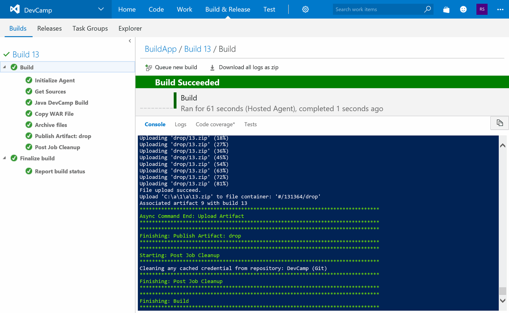

1. Let's inspect the output artifacts that were published.  Click the **Build 13** header 
in the left pane to view the build's landing page.  Then select **Artifacts** from the horizontal 
toolbar, and **Download** the **drop** artifact.

    

1. Unzip `drop.zip` to see our files (including the restored `webapps` folder).  This 
artifact will be deployed to an Azure Web App in a later lab.

    

---
### Exercise 5: Deploy code to an Azure Web App

In the ARM Template that was originally deployed, a web app was created as a development 
environment to hold a deployed Java application. We will use this web app as a deployment 
target from VSTS. First, we need to prepare this web app for our application code.

1. Visit the Azure Web App by browsing to the [Azure Portal](http://portal.azure.com), 
opening the Resource Group, and select the Azure Web App resource that contains 
**javaapp** before the random string. 

    

    Once the blade expands, select **Browse** from the top toolbar

    

    A new browser tab will open with a splash screen visible

    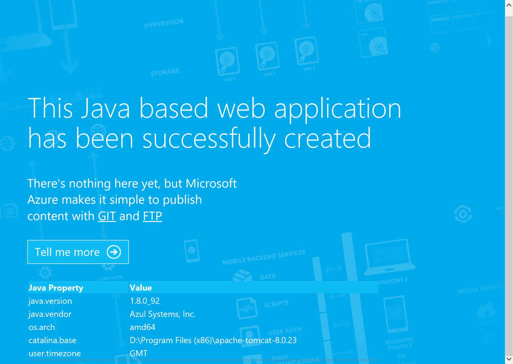

1. We can deploy our code to this Azure Web App, however it was not configured with our 
AzureAD details. When trying to authenticate, AzureAD would refuse since it does not 
know about this domain. 

    To fix this, return to `https://apps.dev.microsoft.com`, login, and open your 
    application settings. 

    

    In the section for **Platforms**, click **Add Url** to add the URL of your Azure Web 
    App from Step 1.  Remember to append the `/auth/openid/return` route at the end, since 
    that is the route that will process the return data from AzureAD. Ensure this address 
    is using **https**.

    

    Make sure you click **Save** at the bottom of the screen to add the URL to your 
    AzureAD app.

1. Now that AzureAD is configured, we need to add our AzureAD related environment 
variables to the Azure Web App.  Back in the 
**javaapp***** blade where you hit **Browse** earlier, open **Application Settings** from 
the left navigation.

    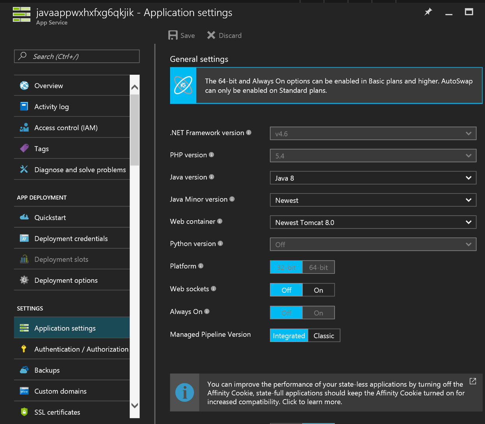

    Find the **App Settings** section containing a table of settings.  In the ARM Template 
    we auto-generated the majority of these settings, however we need to add a few 
    additional environment variables to match the `.vscode/launch.json` file that we have 
    been using locally.

    * **AAD_RETURN_URL** should be set to the same URL that we just configured for our 
    AzureAD application. Should be similar to 
    `https://javaappmm6lqhplzxjp2.azurewebsites.net/auth/openid/return`. Ensure this 
    is using **https**.

    * **AAD_CLIENT_ID** should match the Application ID in the apps.dev.microsoft.com 
    portal and similar to `2251bd08-10ff-4ca2-a6a2-ccbf2973c6b6`

    * **AAD_CLIENT_SECRET** should be the Application Secret generated in the apps 
    portal, and be similar to `JjrKfgDyo5peQ4xJa786e8z`

    

1. Now that the AzureAD application and the Azure Web App are ready, let's configure VSTS 
to deploy our built application. Back in our VSTS Build Definition, click on 
**Releases**. 

    

    Create a new release definition by selecting **New Definition**

    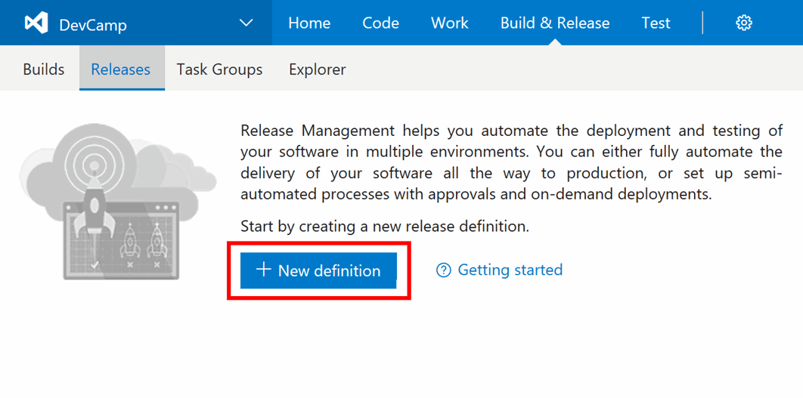

    Choose **Empty** to start with an empty release definition, and choose **Next**

    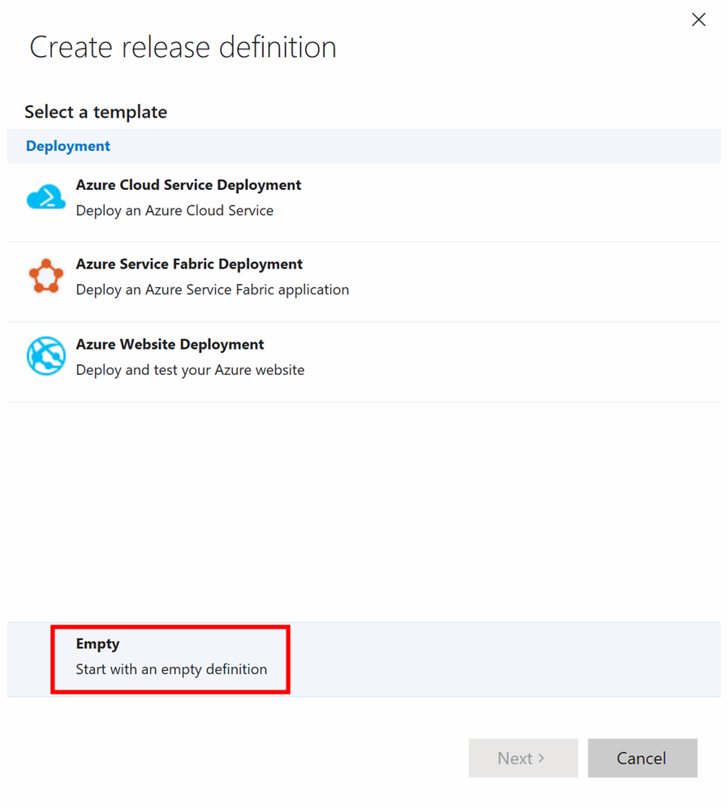

    Next, check the box next to "Continuous deployment" to make sure a new release will
    be executed whenever a build completes.  Click **Create** to complete the process.

    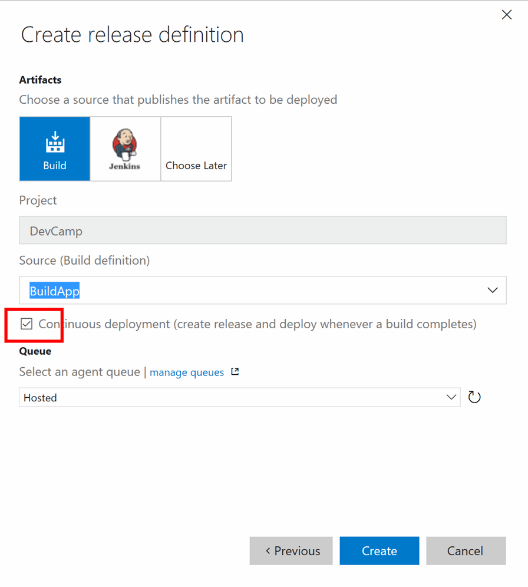

1. In the release definition screen, click the pencil and rename the release definition 
to **Cloud Test Realease** and change the environment name to **Test Environment**

    

    Next, click on **Add tasks**

    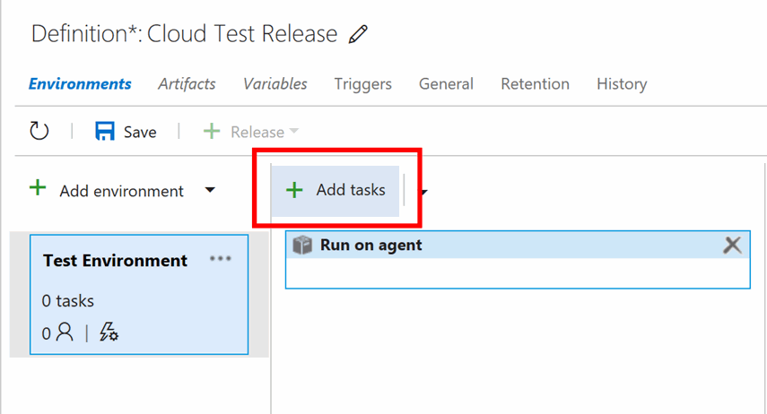

    In the task catalog, find **Azure App Service Deploy** and click **Add**, and then **Close**

    

    > Make sure to select the step with **RM** in the title, as it uses the newer Azure Resource Manager deployment system

1. Click on the task name **Deploy AzureRM App Service:** to open the attributes for that task. VSTS will 
need a connection to the Azure subscription that you are deploying the application to.  Click **Manage** 
to open a new browser tab holding configuration options.

    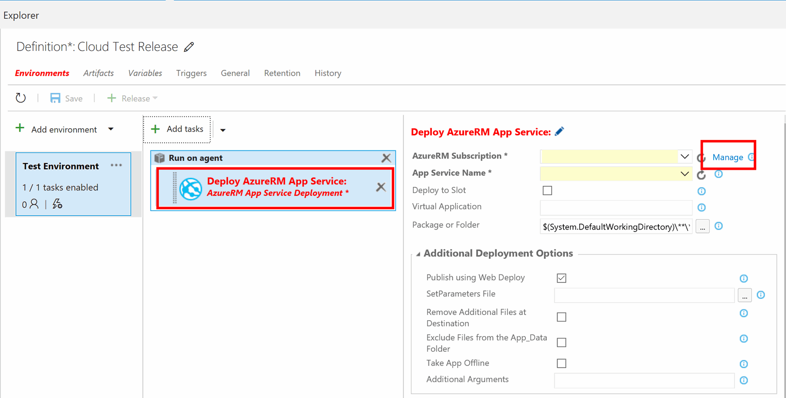
    
    In the new tab, select **New Service Endpoint** and from the dropdown choose **Azure Resource Manager**

    

    The modal window should automatically determine your subscription information. 
    Provide a name such as **Azure**, select **OK**, and a close the browser tab.

    

    If your subscription is not in the dropdown list, click the link at the bottom of the window, and the window 
    format will change to allow you to enter connection information on your subscription:    

    

    If you have not created a service principal for the subscription, you will have to follow the 
    [instructions](https://go.microsoft.com/fwlink/?LinkID=623000&clcid=0x409) to do so.  This process will 
    provide the information to enter in this dialog:
    1. open [this PowerShell script](https://raw.githubusercontent.com/Microsoft/vso-agent-tasks/master/Tasks/DeployAzureResourceGroup/SPNCreation.ps1) 
    in your browser. Select all the content from the window and copy to the clipboard.
    1. open a PowerShell ISE window.  in the text window, paste the PowerShell script from the clipboard.

    

    1. Click the green arrow to run the PowerShell script

    

    1. The PowerShell script will ask for your **subscription name** and a **password**.  This password is 
    for the service principal only, not the password for your subscription.  So you can use whatever password 
    you would like, just remember it.    

    

    1. You will then be asked for your Azure login credentials.  Enter your Azure username and password.  
    The script will print out several values that you will need to enter into the **Add Azure Resource Manager Service Endpoint**
    window.  Copy and paste these values from the PowerShell window:
        Subscription ID
        Subscription Name
        Service Principal Client ID
        Service Principal Key
        Tenant ID
    Also, enter a user-friendly name to use when referring to this service endpoint connection.

    

    Click **Verify connection*, and ensure that the window indicates that the connection was verified. 
    Then Click **OK** and **Close**.

    

    > This pattern is used to connect to a variety of services beyond Azure such as Jenkins, Chef, and Docker

1. Back on the VSTS Build window, in the Build Step we started earlier, click the **Refresh** icon. The **Azure** connection that we setup should now appear.  Select it. 

    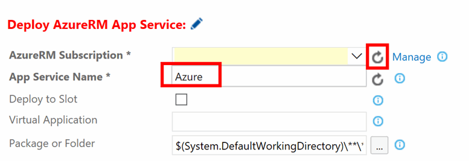

    Next, for **App Service Name** click the **Refresh** icon, choose the name of the Java Azure Web App. 
    It may take a moment to populate.

    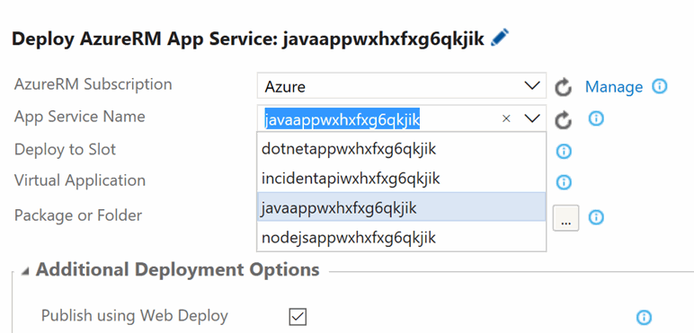

1. **Save** the Build Definition, supplying a comment if you'd like.  Next, click **Release** and **Create Release**

    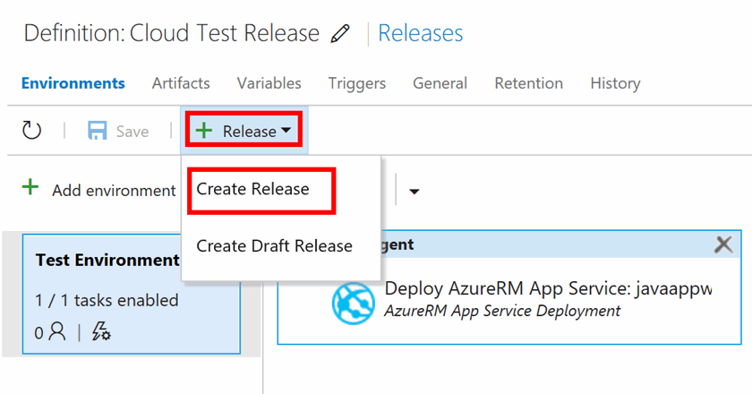

    In the following window, type a description for the release, choose the build that you created earlier, and click **Create**

    

    You should see a message that your release has been created.  Click on the link for **Release-1**

    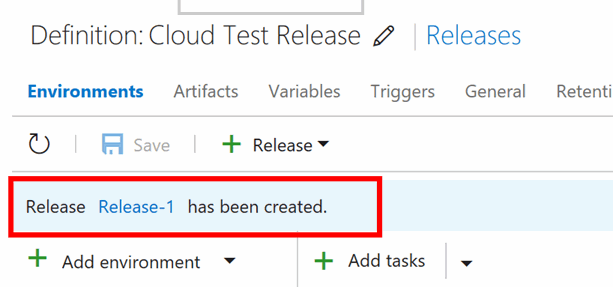
    
    You will see the status for the release:

    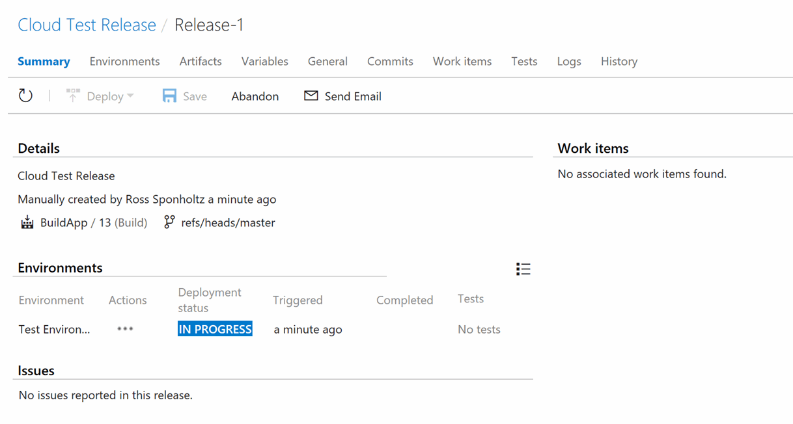
    
    When the release is complete, browse to the deployment website.  You should see the same application 
    you tested in the modern-apps lab:

    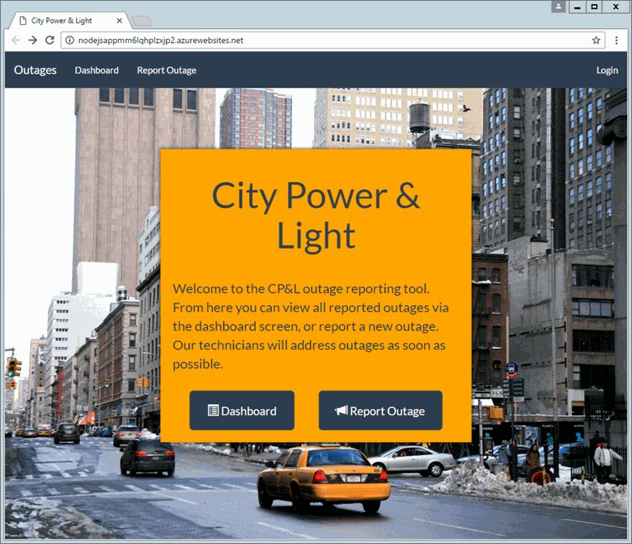

    If you make changes to the application and `git push` back to the VSTS server, this will
    automatically trigger a build and deployment.  Try to make a small change to the application and verify that the 
    application is re-deployed to the test environment.

--- 
## Summary

In this hands-on lab, you learned how to:
* Create a Visual Studio Team Services online account
* Create a VSTS Git repository
* Add your code to the VSTS Git repository
* Create a Continuous Integration pipeline
* Deploy a built application to an Azure Web App from VSTS

Copyright 2016 Microsoft Corporation. All rights reserved. Except where otherwise noted, these materials are licensed under the terms of the MIT License. You may use them according to the license as is most appropriate for your project. The terms of this license can be found at https://opensource.org/licenses/MIT.