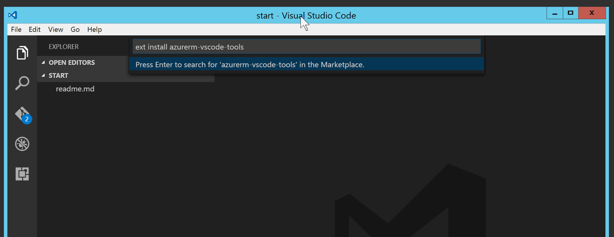
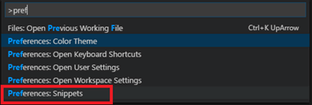
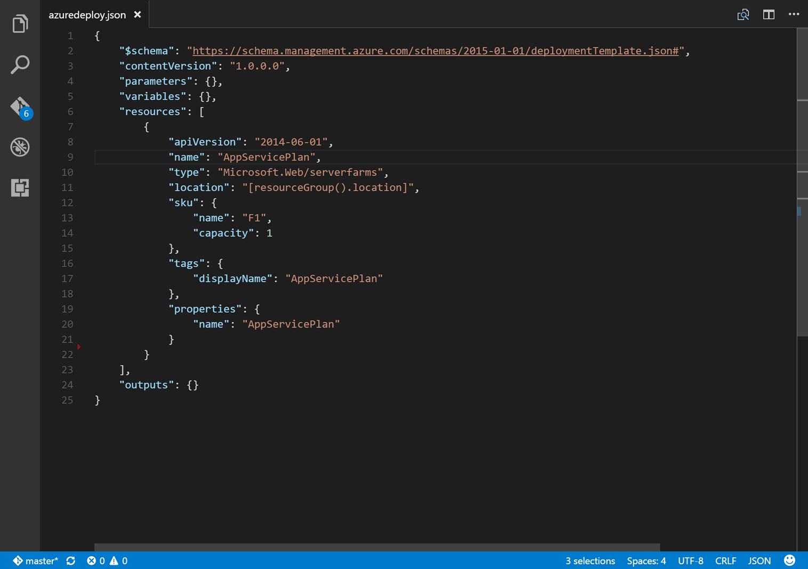
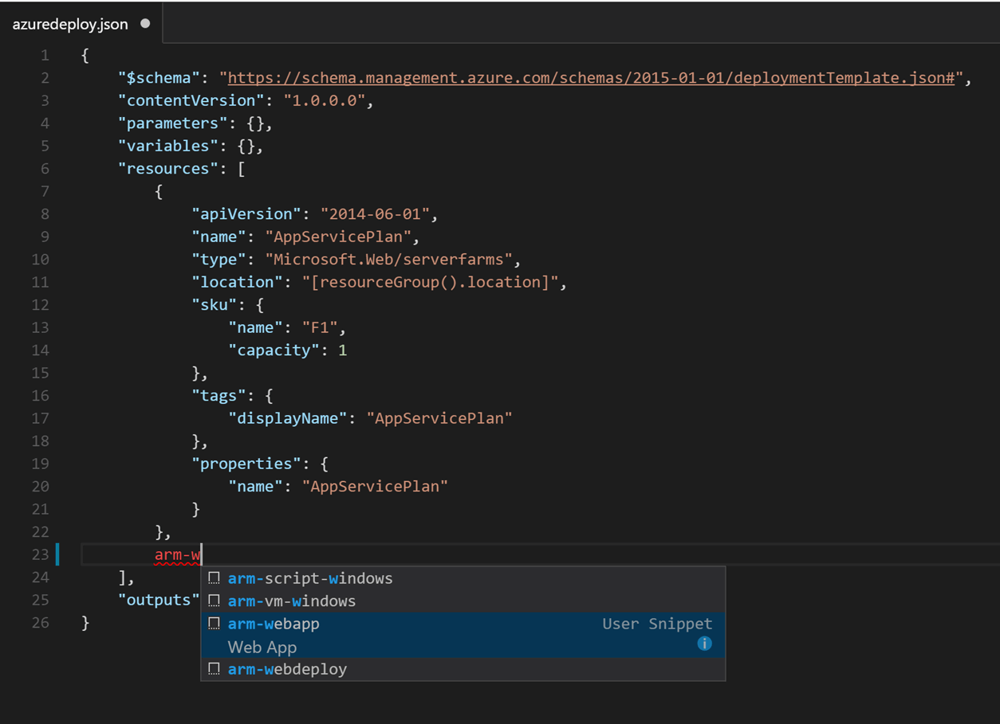
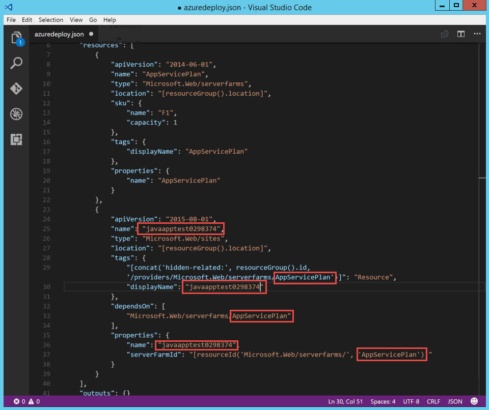
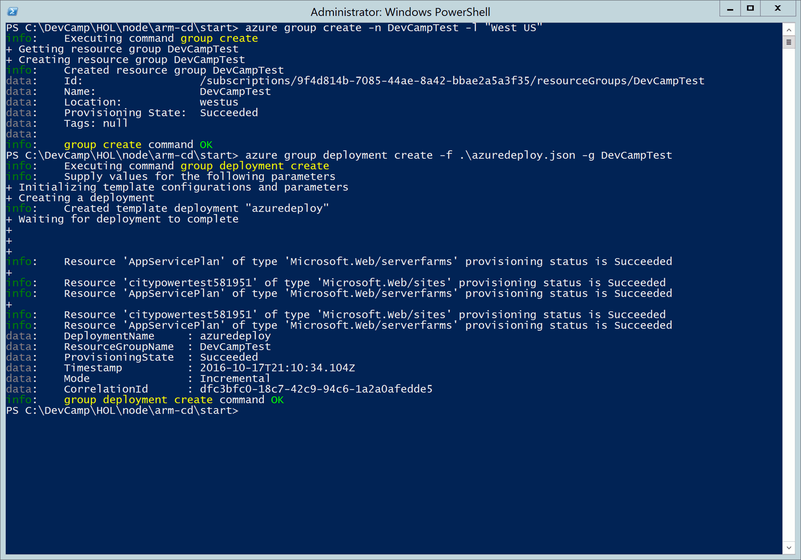

# ARM (NodeJS)

## Overview
In this lab, you will learn to provision and manage resources in Azure with the new Azure Resource Manager.  Then we will deploy our sample application into newly created infrastructure.

## Objectives
In this hands-on lab, you will learn how to:
* Author Azure Resource Manager templates
* Deploy ARM Templates to Azure
* Integrate environments into VSTS Release pipelines

## Prerequisites

The source for the starter app is located in the [TODO:ADD REF](#) folder. 

## Exercises
This hands-on-lab has the following exercises:
* Exercise 1: Create an ARM Template in Visual Studio Code
* Exercise 2: Deploy ARM Template to Azure via the XPlat CLI
* Exercise 3: Integrate new Web App into VSTS
* Exercise 4: Deploy City Power & Light to new Web App

### Exercise 1: Create an ARM Template in Visual Studio Code

Visual Studio Code includes a sizable ecosystem of extensions.  One such extension is the [Azure Resource Manager Tools](https://marketplace.visualstudio.com/items?itemName=msazurermtools.azurerm-vscode-tools).

1. Install the ARM Tools extension in Visual Studio Code by using the [Command Palette](https://code.visualstudio.com/Docs/editor/codebasics#_command-palette).  With VSCode open, press `CTRL` + `P` and enter `ext install azurerm-vscode-tools`.

    

    This extension gives intellisense and schema support for ARM Templates.  
    
1. Next, let's install a pack of code snippets to make creating resources easier. In VS Code, you can open the JSON snippets file by either navigating to **File** -> **Preferences** -> **User Snippets** -> **JSON**, or by selecting F1 and typing `preferences` until you can select **Preferences: Snippets**.

    

    From the options, select **JSON**

    

    The json file that opens can be extended to hold custom snippets.  
    
    
    
    From the [azure-xplat-arm-tooling](https://github.com/Azure/azure-xplat-arm-tooling/) repo, open the [raw snippets file](https://raw.githubusercontent.com/Azure/azure-xplat-arm-tooling/master/VSCode/armsnippets.json) and copy the entire contents to your clipboard.

    Then, paste the contents into VSCode in between the `{}` of the json file. 

    

    Save and close the file. You will now be able to use snippets in the creation of ARM files.

1. Now that we have our tooling setup, open `start/armdeploy.json`. This is a skeleton ARM Template, including the four sections Parameters, Variables, Resources, and Outputs. Click into the brackets next to Resources and create a linebreak.  In the new line, type `arm-p` and hit enter to select **arm-plan**.  This will create a new App Service Plan, which controls the features and performance of assoicated Azure Web Apps.

    

    Tap the right arrow key, then hit backspace to remove the `1` from the resource name. 

    

    Next to our resource's ending `}` add a `,` and a line break. Then repeat the process above to create a Web App by typing `arm-w` and selecting `arm-webapp`.

     

    This web app name needs to be globally unique, as it will be used for the https://***.azurewebsites.net DNS entry and cannot be the same as an existing webapp.  Use `nodejsapptest` plus 4-5 random characters.

    The webapp resource has stubbed in 3 instances of `APP_SERVICE_PLAN_NAME`. Replace this value with the `AppServicePlan` name value that you gave the App Service Plan earlier.

    

1. The web application needs to be configured to work with the AzureAD, Azure Storage, Azure Redis Cache, and ASP.NET WebAPI that we configured earlier. 

    In earlier exercises we have configured these settings as environment variables on our local machines, and in the Azure Portal for our "Dev" Azure Web App.  

    ARM Templates can include `resources`, which define numerous options for a given resource.  For a web app, we can use `appsettings` to adjust the environment variables present on our app.  Here is an extended web app with the `resources` array filled in.  Paste the `resources` content into your ARM Template, updating the `dependsOn` attribute to match your website's `name`, and the environment variables to match your values. 

    > If you are using VSCode and have been debugging locally with `.vscode/launch.json` then you can copy/paste the values into the template to override the sample values below

    ```json
    {
        "apiVersion": "2015-08-01",
        "name": "citypowertest581951",
        "type": "Microsoft.Web/sites",
        "location": "[resourceGroup().location]",
        "tags": {
            "[concat('hidden-related:', resourceGroup().id, '/providers/Microsoft.Web/serverfarms/AppServicePlan')]": "Resource",
            "displayName": "citypowertest581951"
        },
        "dependsOn": [
            "Microsoft.Web/serverfarms/AppServicePlan"
        ],
        "properties": {
            "name": "citypowertest581951",
            "serverFarmId": "[resourceId('Microsoft.Web/serverfarms/', 'AppServicePlan')]"
        },
        "resources": [
            {
                "name": "appsettings",
                "type": "config",
                "apiVersion": "2015-08-01",
                "dependsOn": [
                    "[concat('Microsoft.Web/sites/', 'citypowertest581951')]"
                ],
                "tags": {
                    "displayName": "AppSettings"
                },
                "properties": {
                    "WEBSITE_NODE_DEFAULT_VERSION": "6.7.0",
                    "AZURE_STORAGE_ACCOUNT": "incidentblobstgmm6lqhplz",
                    "AZURE_STORAGE_ACCESS_KEY": "A3HFnKZPzGWzQl7z/UzCev32QE6aCecbbQ4qAmmyKwjCYGBjzHXT3d2CmgX7NUR6+fMZsk2VUlaSE7x4nzW5hg==",
                    "AZURE_STORAGE_BLOB_CONTAINER": "images",
                    "AZURE_STORAGE_QUEUE": "thumbnails",
                    "INCIDENT_API_URL": "https://incidentapimm6lqhplzxjp2.azurewebsites.net",
                    "REDISCACHE_HOSTNAME": "incidentcachemm6lqhplzxjp2.redis.cache.windows.net",
                    "REDISCACHE_PORT": "6379",
                    "REDISCACHE_SSLPORT": "6380",
                    "REDISCACHE_PRIMARY_KEY": "ofiGLn8mowbVJ9/egFQ2+opdel4FQw7yWMFhxZclfPo=",
                    "AAD_CLIENT_ID": "2251bd08-10ff-4ca2-a6a2-ccbf2973c6b6",
                    "AAD_CLIENT_SECRET": "JjrKfgDyo5peQ4xJa786e8z",
                    "AAD_RETURN_URL": "[concat('https://', reference('citypowertest581951', '2015-08-01').defaultHostName, '/auth/openid/return')]"
                }
            }
        ]
    }
    ```

    > For the `AAD_RETURN_URL` we are dynamically resolving the value by using a `reference()` lookup for a given app name. Ensure that `citypowertest581951`   matches whatever name you choose for your web app

We are now ready to deploy our ARM Template containing an App Service Plan, and a Web App with environment variables to Azure. 

### Exercise 2: Deploy ARM Template to Azure via the XPlat CLI

For deploying the ARM Template we will use the Azure Xplat CLI.  Please Ensure you have [installed](https://azure.microsoft.com/en-us/documentation/articles/xplat-cli-install/#option-1-install-an-npm-package) the Azure XPlat CLI package from NPM before proceeding.

1. From the command line, `cd` to the `start` directory containing our ARM Template

    ```bash
    azure group create -n DevCampTest -l "West US"
    azure group deployment create -f .\azuredeploy.json -g DevCampTest
    ```
    
    > Feel free to swap out "West US" with another region

    

1. Open the [Azure Portal](https://portal.azure.com) and verify that the Resource Group was created with the defined resources.

    

    Also check the **Application Settings** blade to verify that the environment variables were created as expected

    

1. To use authentication with this app, we need to update our AzureAD app registration to whitelist its URL. In the browser, head back to the [Application Registration Portal](https://apps.dev.microsoft.com/#/appList) and select your application.  Under the **Platforms** heading, select **Add Url** and paste in the URL of your newly created Azure Web App plus the `/auth/openid/return` suffix. Also, since two of our applications share the same *.azurewebsites.net domain we need to add an entry for `https://azurewebsites.net` into the list. 

    

    > See [here](https://azure.microsoft.com/en-us/documentation/articles/active-directory-v2-limitations/#restrictions-on-redirect-uris) for more information about redirect URIs

The new resource group is now holding our "Test" environment web app and has been added to our app registration.

### Exercise 3: Integrate new Web App into VSTS

Back in VSTS, open the **Release Definition** that we started in a previous lab.  You should be be able to find this by navigating to **Releases** on the top navigation. We need to create a second environment to serve as our test web app.


1. In the Release Definition, select **Add environment** and select **Clone a selected environment**. 

    

1. VSTS allows us to control and govern how releases happen between environments.  Instead of automatically deploying our test environment after our dev environment, let's add an approval step.  A user can look at the dev environment, confirm it is is ready, and then authorize a release to the test envrionment. 

    For the **Pre-deployment approval** option, select **Specific users** and enter your account name. Then click the **Create** button

    

1. Rename the environment from **Dev copy** to **Test** and click the the **Deploy AzureRM App Service** task. Update the **App Service Name** to match the web app that you just deployed via the ARM Template. The task now targets the test environment web app, rather than the dev environment web app.

    

1. Save your Release Definition to finish adding the additional environment.

### Exercise 4: Deploy City Power & Light to new Web App

With the updated Release Definition, we can now execute a release.

1. Click on the **Release** button and in the dropdown choose **Create Release**.

    

1. Select a Build to release into the environments. This is likely the largest numbered Build. Then click the **Create** button

    

1. Click the Release number to navigate to the Release Details screen

    

1. On the top toolbar, select **Logs** to monitor the release process.  When the release for the dev environment finishes, you will be prompted to approve the release to the test environment.  Click **Approve** to continue the release.

    

1. Once the test environment app has finished its release, open the app in the browser and login.

    

We have now created a new "test" environment web app and app service plan via an ARM Template, and integrated the new environment into our VSTS Release Definition.

## Summary

In this hands-on lab, you learned how to:
* Create an ARM Template in Visual Studio Code
* Deploy ARM Template to Azure via the XPlat CLI
* Integrate new Web App into VSTS
* Deploy City Power & Light to new Web App

Copyright 2016 Microsoft Corporation. All rights reserved. Except where otherwise noted, these materials are licensed under the terms of the MIT License. You may use them according to the license as is most appropriate for your project. The terms of this license can be found at https://opensource.org/licenses/MIT.
