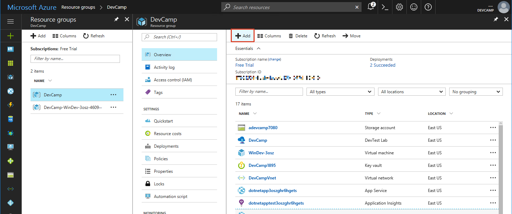
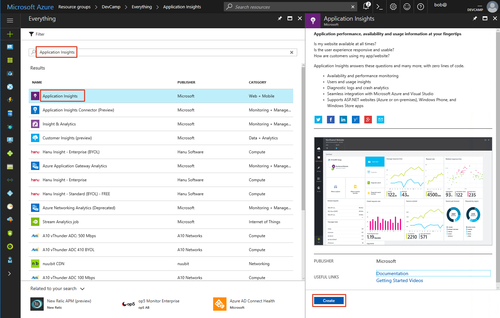
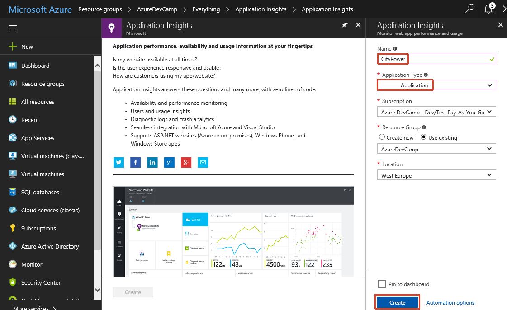
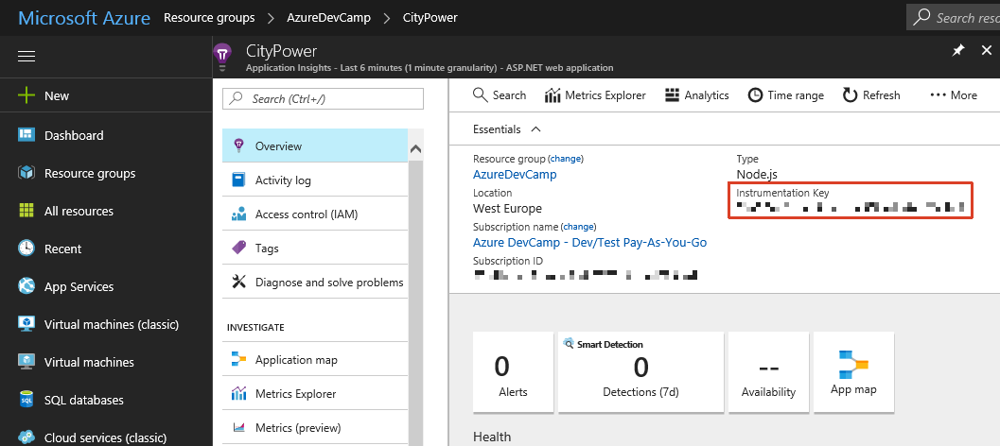
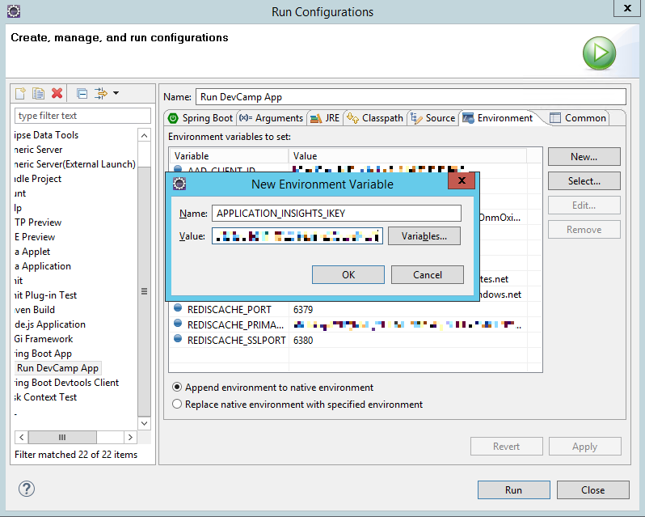
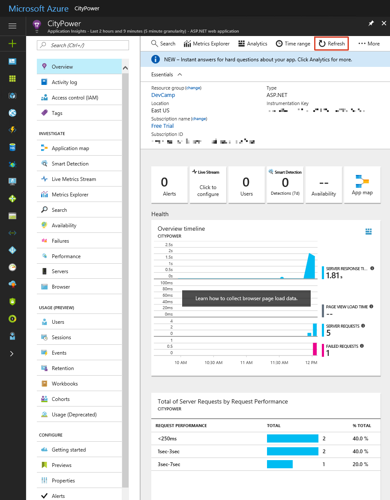
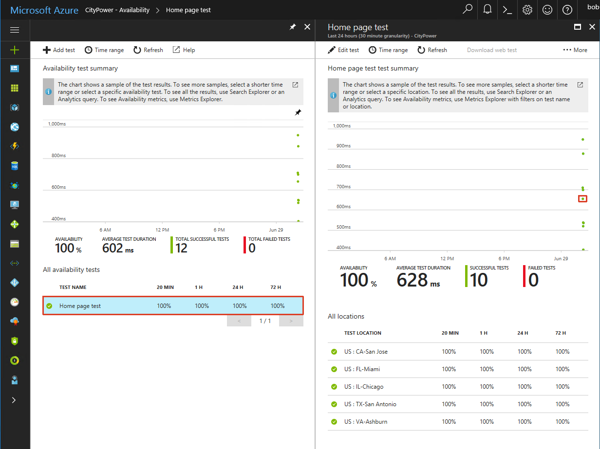

# Monitoring with Application Insights (Java)

## Overview
In this lab, you will create and integrate an instance of Application Insights with your application to provide a 360° view of your app performance. 

## Objectives
In this hands-on lab, you will learn how to:
* Learn to create an Application Insights instance.
* Use SDKs to add telemetry to your application.
* View performance metrics in the Azure Portal.

## Prerequisites

* The source for the starter app is located in the [start](start) folder. 

> &#x1F53A; **Note**: If you did not complete the previous labs, the project in the [start](start) folder is cumulative. But you need to add the previous HOL's environment variables and make all necessary changes to Azure. &#x1F53A;

## Exercises
This hands-on-lab has the following exercises:
* [Exercise 1: Create an Application Insights resource](#ex1)
* [Exercise 2: Add server and client side SDKs ](#ex2)
* [Exercise 3: Monitor custom events](#ex3)
* [Exercise 4: Create a global web test](#ex4)
* [Exercise 5: Interact with your telemetry data](#ex5)
* [Exercise 6: Monitor logging events](#ex6)

---
## Exercise 1: Create an Application Insights resource<a name="ex1"></a>

An instance of Application Insights can be created in a variety of ways, including ARM Templates or CLI commands. For this exercise we will use the Azure Portal to create and configure our instance.

1. In a browser, navigate to the [Azure Portal](https://portal.azure.com).

1. Open the Resource Group that was originally deployed. Click `Add` on the top toolbar to add a new Azure resource to this group.

    

1. Search for `Application Insights` and select the entry from the results list:

    

1. In the overview blade that opens, click `Create` to open the creation settings blade. Enter a name, configure `Application Type` to `Java web application` and then click the `Create` button.

    Creation typically takes less than a minute.

    

1. Once provisioning completes, return to your Resource Group and open the resource. You may need to hit the refresh button within the resource group blade.

    

1.  In the `Essentials` section, take note of the `Instrumentation Key`. We will need that in future exercises.

    

We now have an instance of Application Insights created and ready for data. The Instrumentation Key is important, as it is the link that ties an application to the AI service. 

---
## Exercise 2: Add server and client side SDKs<a name="ex2"></a>

App Insights works with 2 components:
1. A server side SDK that integrates into the Java processes.
2. A snippet of JavaScript sent down to the client's browser to monitor behavior.

We will add both components to our application and enable the sending of telemetry into the AppInsights service.

1. Open the application in Eclipse. Feel free to use the folder you've been using throughout the hands on labs, or feel free to use the `start` folder. Make sure the environment variables that you created in the previous hands on labs are present. 

1. Microsoft publishes an SDK for AppInsights on Java on [Maven](https://mvnrepository.com/artifact/com.microsoft.azure/applicationinsights-web). This SDK can be configured via environment variable, so for consistency let's set an environment variable for `APPLICATION_INSIGHTS_IKEY` equal to the key we noted in Exercise 1.

    

1. Next, open the `build.gradle` file for your project and add the following dependency in the dependencies section: 
    ```Java
   compile('com.microsoft.azure:applicationinsights-web:2.+')
    ```
    Gradle will automatically retrieve and include these libraries when the application is built or run. 
    
    To make sure that Eclipse knows about the new packages we added to the build, run the `ide/eclipse` gradle task in the `gradle tasks` window. Then right-click on the project in the project explorer, close the project, and then open it again.

1. With the SDK installed we need a class file to handle its setup. Create a new file in `devCamp.WebApp.configurations.AppInsightsConfig` and paste in the following code:

    ```Java
    package devCamp.WebApp.configurations;

    import javax.servlet.Filter;

    import org.springframework.boot.context.embedded.FilterRegistrationBean;
    import org.springframework.context.annotation.Bean;
    import org.springframework.core.Ordered;
    import org.springframework.beans.factory.annotation.Value;
    import org.springframework.context.annotation.Configuration;
    import com.microsoft.applicationinsights.TelemetryConfiguration;
    import com.microsoft.applicationinsights.web.internal.WebRequestTrackingFilter;


    @Configuration
    public class AppInsightsConfig {

	//Initialize AI TelemetryConfiguration via Spring Beans
        @Bean
        public String telemetryConfig() {
            String telemetryKey = System.getenv("APPLICATION_INSIGHTS_IKEY");
            if (telemetryKey != null) {
                TelemetryConfiguration.getActive().setInstrumentationKey(telemetryKey);
            }
            return telemetryKey;
        }
	
	//Set AI Web Request Tracking Filter
        @Bean
        public FilterRegistrationBean aiFilterRegistration(@Value("${spring.application.name:application}") String applicationName) {
	       FilterRegistrationBean registration = new FilterRegistrationBean();
	       registration.setFilter(new WebRequestTrackingFilter(applicationName));
	       registration.setName("webRequestTrackingFilter");
	       registration.addUrlPatterns("/*");
	       registration.setOrder(Ordered.HIGHEST_PRECEDENCE + 10);
	       return registration;
       } 

	//Set up AI Web Request Tracking Filter
        @Bean(name = "WebRequestTrackingFilter")
        public Filter webRequestTrackingFilter(@Value("${spring.application.name:application}") String applicationName) {
            return new WebRequestTrackingFilter(applicationName);
        }	
    }
    ```

    This class will configure the `WebRequestTrackingFilter` to be the first filter on the http filter chain. It will also pull the instrumentation key from the operating system environment variable if it is available.

    > We are using the web http filter configuration rather than the Spring MFC configuration [described here](https://azure.microsoft.com/en-us/documentation/articles/app-insights-java-get-started/) because this is a Spring Boot application, and it has it's own spring MVC configuration. 

1. Create an `ApplicationInsights.xml` file in the `src/main/resources` directory, and paste in the following code:

    ```XML
    <?xml version="1.0" encoding="utf-8"?>
    <ApplicationInsights xmlns="http://schemas.microsoft.com/ApplicationInsights/2013/Settings" schemaVersion="2014-05-30">


    <!-- The key from the portal: -->

    <InstrumentationKey>your key here</InstrumentationKey>


    <!-- HTTP request component (not required for bare API) -->

    <TelemetryModules>
        <Add type="com.microsoft.applicationinsights.web.extensibility.modules.WebRequestTrackingTelemetryModule"/>
        <Add type="com.microsoft.applicationinsights.web.extensibility.modules.WebSessionTrackingTelemetryModule"/>
        <Add type="com.microsoft.applicationinsights.web.extensibility.modules.WebUserTrackingTelemetryModule"/>
    </TelemetryModules>

    <!-- Events correlation (not required for bare API) -->
    <!-- These initializers add context data to each event -->

    <TelemetryInitializers>
        <Add   type="com.microsoft.applicationinsights.web.extensibility.initializers.WebOperationIdTelemetryInitializer"/>
        <Add type="com.microsoft.applicationinsights.web.extensibility.initializers.WebOperationNameTelemetryInitializer"/>
        <Add type="com.microsoft.applicationinsights.web.extensibility.initializers.WebSessionTelemetryInitializer"/>
        <Add type="com.microsoft.applicationinsights.web.extensibility.initializers.WebUserTelemetryInitializer"/>
        <Add type="com.microsoft.applicationinsights.web.extensibility.initializers.WebUserAgentTelemetryInitializer"/>

    </TelemetryInitializers>
    </ApplicationInsights>    
    ``` 

    Edit this line to contain your instrumentation key you saved earlier:
    ```XML
    <InstrumentationKey>your key here</InstrumentationKey>
    ```
    >
    > This file allows you to configure what is tracked by ApplicationInsights and how it is communicated to Azure. There is documentation on [the .NET version](https://azure.microsoft.com/en-us/documentation/articles/app-insights-configuration-with-applicationinsights-config/), but this should be checked against the [Java SDK repository](https://github.com/Microsoft/ApplicationInsights-Java).
    >

1. Run your application and then navigate around several pages to generate sample telemetry.

1. Back in the Azure Portal, refresh the browser tab (or click `Refresh` from the top toolbar) until you see data appear.

    

    > It may take 3-5 minutes for data to appear even when manually refreshing.

1. Our server is now sending data, but what about the client side? Let's add the JavaScript library.

    In the portal, click the tile that says `Learn how to collect browser page load data`: 
    
    

1. The next blade will give you a JavaScript snippet pre-loaded with the Instrumentation Key. This snippet, when placed on an HTML page, will download the full Application Insights JavaScript library and configure itself. Click the clipboard icon to copy the snippet.

    

1. Let's integrate the snippet into our web pages. In Eclipse create a new file at `src/main/resources/templates/appinsights.html` and paste in the snippet, which will look like this (with your instrumentation key):

    ```html
    <!-- 
    To collect end-user usage analytics about your application, 
    insert the following script into each page you want to track.
    Place this code immediately before the closing </head> tag,
    and before any other scripts. Your first data will appear 
    automatically in just a few seconds.
    -->
    <script type="text/javascript">
    var appInsights=window.appInsights||function(config){
        function i(config){t[config]=function(){var i=arguments;t.queue.push(function(){t[config].apply(t,i)})}}var t={config:config},u=document,e=window,o="script",s="AuthenticatedUserContext",h="start",c="stop",l="Track",a=l+"Event",v=l+"Page",y=u.createElement(o),r,f;y.src=config.url||"https://az416426.vo.msecnd.net/scripts/a/ai.0.js";u.getElementsByTagName(o)[0].parentNode.appendChild(y);try{t.cookie=u.cookie}catch(p){}for(t.queue=[],t.version="1.0",r=["Event","Exception","Metric","PageView","Trace","Dependency"];r.length;)i("track"+r.pop());return i("set"+s),i("clear"+s),i(h+a),i(c+a),i(h+v),i(c+v),i("flush"),config.disableExceptionTracking||(r="onerror",i("_"+r),f=e[r],e[r]=function(config,i,u,e,o){var s=f&&f(config,i,u,e,o);return s!==!0&&t["_"+r](config,i,u,e,o),s}),t
        }({
            instrumentationKey:"2fd01fb1-d6cb-4c2f-9244-171989d2ac67"
        });
        
        window.appInsights=appInsights;
        appInsights.trackPageView();
    </script>
    ```
1. We need to make two small changes to the `appinsights.html` file. Since Spring Boot and Thymeleaf will process all pages through an SGML validator, we need to make sure that the JavaScript snippet doesn't cause it problems. So paste in ` // <![CDATA[` on the line after `<script type="text/javascript">` and add `    // ]]>` on the line before the final `</script>`. Your file should look like this when you are done: 

    ```html
    <!-- 
    To collect end-user usage analytics about your application, 
    insert the following script into each page you want to track.
    Place this code immediately before the closing </head> tag,
    and before any other scripts. Your first data will appear 
    automatically in just a few seconds.
    -->
    <script type="text/javascript">
    // <![CDATA[
    var appInsights=window.appInsights||function(config){
        function i(config){t[config]=function(){var i=arguments;t.queue.push(function(){t[config].apply(t,i)})}}var t={config:config},u=document,e=window,o="script",s="AuthenticatedUserContext",h="start",c="stop",l="Track",a=l+"Event",v=l+"Page",y=u.createElement(o),r,f;y.src=config.url||"https://az416426.vo.msecnd.net/scripts/a/ai.0.js";u.getElementsByTagName(o)[0].parentNode.appendChild(y);try{t.cookie=u.cookie}catch(p){}for(t.queue=[],t.version="1.0",r=["Event","Exception","Metric","PageView","Trace","Dependency"];r.length;)i("track"+r.pop());return i("set"+s),i("clear"+s),i(h+a),i(c+a),i(h+v),i(c+v),i("flush"),config.disableExceptionTracking||(r="onerror",i("_"+r),f=e[r],e[r]=function(config,i,u,e,o){var s=f&&f(config,i,u,e,o);return s!==!0&&t["_"+r](config,i,u,e,o),s}),t
        }({
            instrumentationKey:"2fd01fb1-d6cb-4c2f-9244-171989d2ac67"
        });
        
        window.appInsights=appInsights;
        appInsights.trackPageView();
    // ]]>    
    </script>
    ```
1. Now update all of the html templates to include `appinsights.html`.   
    * templates/Dashboard/index.html
    * templates/Home/index.html
    * templates/Incident/new.html
    * templates/Profile/index.html
    
    with `<div th:include="appinsights"></div> ` right after the `<body>` tag in each file, for example:
    ```HTML
    <body>
 	<div th:include="appinsights"></div>   
     ...
    ```
1. Re-run the application and load several pages to generate more sample telemetry. The Azure Portal should now light up data for **Page View Load Time**:

    

Our application is now providing the Application Insights service telemetry data from both the server and client.

---
## Exercise 3: Monitor custom events<a name="ex3"></a>

Up until this point the telemetry provided has been an automatic, out-of-the-box experience. For custom events we need to use the SDK. Let's create an event where any time a user views their Profile page, we record their name and AzureAD tenant ID.

1. Open `devCamp.WebApp.Controllers.ProfileController` add the following code to the index method before the `return` statement:

    ```java
    TelemetryClient telemetry = new TelemetryClient();

    Map<String, String> properties = new HashMap<String, String>();
    properties.put("User", result.getUserPrincipalName());
    properties.put("displayname", result.getDisplayName());

    telemetry.trackEvent("Profile", properties, null);    	

    model.addAttribute("userProfileBean",result);

    try { 
        throw new Exception("This is only a test!"); 
    } catch (Exception exc) { 
        telemetry.trackException(exc); 
        System.out.println("[6] Exception             -- message=\"This is only a test!\""); 
    } 
    ```

    Resolve the imports for `TelemetryClient`, `Map` and `HashMap`.
    
    This code will send the users `UserPrincipalName` and `DisplayName` to AppInsights. It also demonstrates how to send exceptions to AppInsights.

1. Save the file, restart the application, and generate sample telemetry by visiting the profile page, leaving, and returning to the profile page. In the Azure Portal we can see the data by pressing the `Search` button:

     

    Clicking on one of the custom events gives us this:

    

    For exceptions, we get the call stack and more information associated with the event:

    

    > ***Note:*** If you do not see your custom events, look at the URL you are redirected to after your sign in. If you are redirected to the Azure hosted instance of your app, update your settings on [https://apps.dev.microsoft.com](https://apps.dev.microsoft.com) to reflect your current debugging environment. Remove the Azure addresses and enter the current port number that Visual Studio uses for debugging.

These custom events (and the related concept of custom metrics) are a powerful way to integrate telemetry into our application and centralize monitoring across multiple application instances.

---
## Exercise 4: Create a global web test<a name="ex4"></a>

Application Insights has the ability to do performance and availability testing of your application from multiple locations around the world, all configured from the Azure portal.  

1. To show the Application Insights availability monitoring capability, we first need to make sure the application is deployed to the Azure App service.  This is done in the [DevOps with Visual Studio Team Services](../04-devops-ci) hands-on-lab. To verify the application is running in the cloud, first go to the Azure portal, open your resource group, and click on the Java app service:

    

    Then, click the `Browse` link in the App service blade:

    

    This should open another window with the City Power and Light application in it. Make note of the URL at the top of the browser.

2. In the Azure portal, click on the City Power Application Insights deployment in your resource group to open its blade. Availability is under `INVESTIGATE` in the scrolling pane - click on it to open the `Availability` tab:

    

    Click on `Add test`. In the `Create test` blade, give the test a name, put the URL for your application in the URL box, and choose several
    locations to test your application from. You can choose to receive an alert email when the availability test fails by clicking on the `Alerts` box and entering the alert configuration. Click `OK` and `Create`.  

    

    It may take 5-10 minutes for your web test to start running. When it is executing and collecting data, you should see availability information on the `Availability` tab of the Application Insights blade. You can click on the web test to get more information:

    

    And clicking on one of the dots on the graph will give you information about that specific test. Clicking on the request will show you the response that was received from your application:

    

    > With all of this testing, you may exceed the limits of the free service tier for Azure app services. If that occurs, you can click on the App Service, and you'll see a notification that your App Service has been stopped due to it's consumption. All you need to do is change the App service plan to basic, which will start the application again.

---
## Exercise 5: Interact with your telemetry data<a name="ex5"></a>

In the `Metrics Explorer`, you can create charts and grids based on the telemetry data received, and you can relate data points over time. These charts and graphs are very configurable, so you can see the metrics that matter to you.

1. Here is an example of page views vs process CPU and processor time:

    

    In `Search` you can see the raw telemetry events, you can filter on the specific events you want to see, and you can drill into more detail on those events. You can also search for properties on the telemetry event. This will be particularly useful when we add logging to the telemetry in Exercise 6. Here is the basic view:

    
    
    Clicking on one of the events gives you a detail blade for that event:

    

    If there are remote dependencies, such as calls to a database or other resources, those will appear under `Calls to Remote Dependencies`. If there were exceptions, traces or failed calls to dependencies, you could get detail on that under `Related Items`.

1. When we go to `Application map`, we can see a diagram of the monitored items that make up the application:

    

---
## Exercise 6: Monitor logging events<a name="ex6"></a>

Application Insights can also integrate with the Java logging frameworks such as Log4J and Logback. To accomplish this, we need to add the proper Application Insights logging library project, and configure the logging implementation to send logs to AI.  

1. Open the `build.gradle` file for your project and add this line to the dependencies section: 
    ```Java
    compile('com.microsoft.azure:applicationinsights-logging-logback:2.+)'
    ```
    Gradle will automatically retrieve and include the library when the application is built or run. 
    
    To make sure that Eclipse knows about the new packages we added to the build, run the `ide/eclipse` gradle task in the `gradle tasks` window. Then right-click on the project in the project explorer, close the project, and then open it again.

1. Create a `src/main/resources/logback.xml` file, and paste in this xml code:

    ```XML
    <?xml version="1.0" encoding="UTF-8"?>
    <configuration>
        <appender name="aiAppender" 
            class="com.microsoft.applicationinsights.logback.ApplicationInsightsAppender">
        </appender>
        <root level="trace">
            <appender-ref ref="aiAppender" />
        </root>

        <include resource="org/springframework/boot/logging/logback/base.xml"/>
        <logger name="org.springframework.web" level="DEBUG"/>
    </configuration>
    ```
    This sets up `ApplicationInsightsAppender` as the logback appender for all trace level messages.

    > The include and logger lines at the bottom are examples of other logging tasks you can do within the logback environment. Please refer to the [logback documentation](http://logback.qos.ch/) for more information. 

---
## Summary
Azure gives you a complete toolset to monitor the status and performance of your applications. It also allows you to run automated performance tests to easily find weaknesses before you go live with your app.

In this hands-on lab, you learned how to:
* Create an Application Insights instance.
* Use SDKs to add telemetry to your application.
* View performance metrics in the Azure Portal.

After completing this module, you can continue on to Module 7: Bots.

### View Module 7 instructions for [Java](../07-bot).

---
Copyright 2016 Microsoft Corporation. All rights reserved. Except where otherwise noted, these materials are licensed under the terms of the MIT License. You may use them according to the license as is most appropriate for your project. The terms of this license can be found at https://opensource.org/licenses/MIT.
