# Visualizing data using PowerBI (Java)

## Overview
In this lab, you will create a Power BI report to visualize the Incident data.

## Objectives
In this hands-on lab, you will learn how to:
* Connect to data in Cosmos DB using Power BI
* Add a calculated column to a Power BI report
* Publish and view a report to the Power BI service

## Prerequisites

* Have an Incidents API and Cosmos DB deployed to an Azure subscription
* A Windows machine with a Power BI Supported Operating System
    - Windows 10 , Windows 7, Windows 8, Windows 8.1, Windows Server 2008 R2, Windows Server 2012, Windows Server 2012 R2
    - Microsoft Power BI Desktop requires Internet Explorer 9 or greater.
    - Microsoft Power BI Desktop is available for 32-bit (x86) and 64-bit (x64) platforms.

## Exercises
This hands-on-lab has the following exercises:
* [Exercise 1: Set up your environment](#ex1)
* [Exercise 2: Connect and prepare the data](#ex2)
* [Exercise 3: Publish to the Power BI service](#ex3)

---
## Exercise 1: Set up your environment <a name="ex1"></a>

### To download via direct link

1. In a browser, navigate to the [Power BI service portal](https://powerbi.microsoft.com).

1. Scroll to the bottom of the page to the Downloads section and select `Power BI Desktop`.

    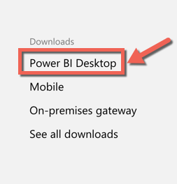

1. Click the `Download Free` button

    

1. Your download will start. Save the `.MSI` to a local folder.

    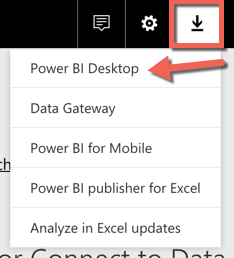


### To download via the Power BI portal

1. In a browser, navigate to the *Power BI service portal* https://powerbi.microsoft.com.

1. Click `sign in` and login with your organizational account

    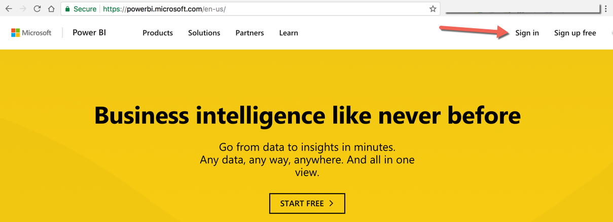

1. If this is your first time signing in, you may see a Quick tour link. View the tour or click `No thanks`

    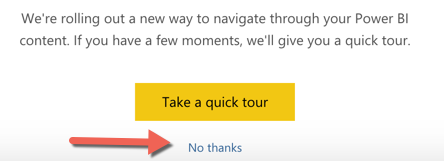

1. From the menu, click the download icon then click  `Power BI Desktop`

    

1. Your download will start. Save the `.MSI` to a local folder.

    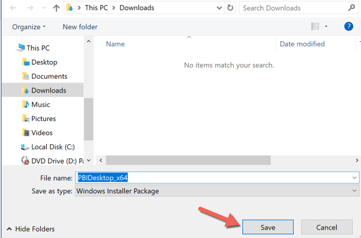


You are now ready to create Power BI reports and dashboards.

---
## Exercise 2: Connect and prepare the data <a name="ex2"></a>

1. We will need to load some incidents so our report can have some data. In a browser, navigate to `http://incidentapi[YOUR API ID]].azurewebsites.net/incidents/fakedata`. You will see a message similar to the following that indicates success:

```JSON
    {
    "Version": {
        "_Major": 1,
        "_Minor": 1,
        "_Build": -1,
        "_Revision": -1
    },
    "Content": {
        "Message": "Initialized fake data with [486] incidents",
        "Id": "780f8505-20c2-4a7a-8904-e8ec728b1a7f",
        "Timestamp": "2017-10-04T21:52:09.1253208Z",
        "Headers": [
        {
            "Key": "Content-Type",
            "Value": [
            "application/json; charset=utf-8"
            ]
        }
        ]
    },
    "StatusCode": 200,
    "ReasonPhrase": "OK",
    "Headers": [],
    "RequestMessage": null,
    "IsSuccessStatusCode": true
    }
```
1. Launch the Power BI desktop tool and select `Open other reports`

    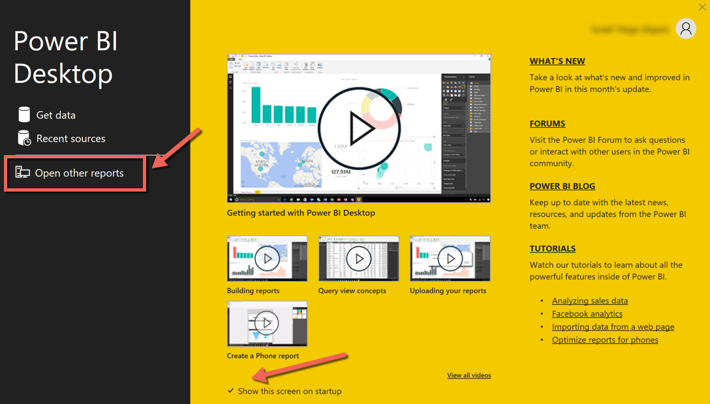

1. Navigate to the HOL 6, Start folder and choose the `Outage Dashboard`

    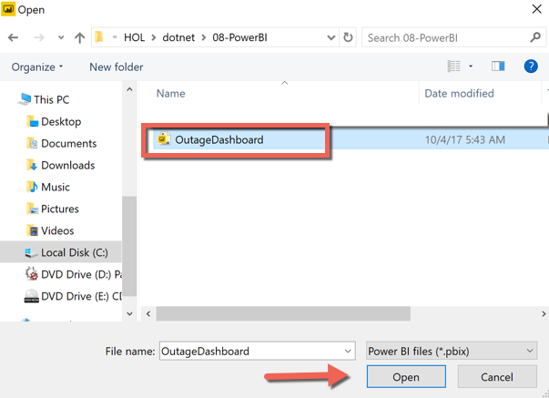

1. Once the dashboard is open, you will see that the visuals are broken. We will get data from your Cosmos DB Database.

    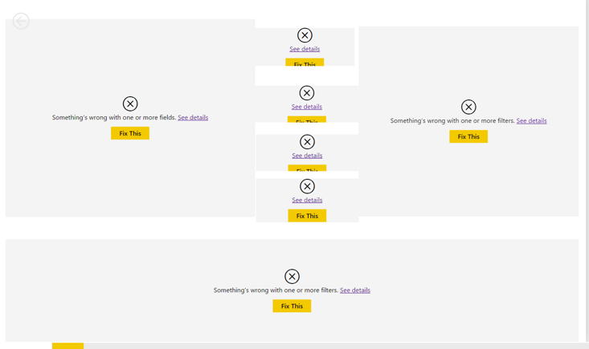

1. From the menu, choose `Get Data > More`

    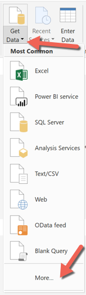

1. On the Get Data screen, choose `Azure > Azure CosomosDB`

    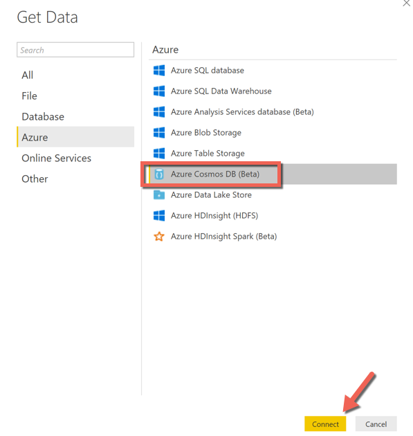

1. You may get a prompt stating that the conntector is in preview. Click `Continue`

    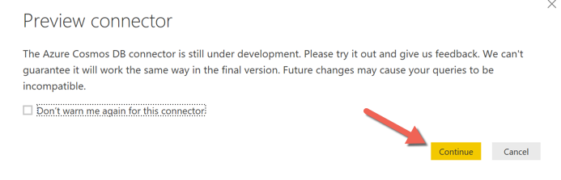

1. In Azure, gather the connection information for your CosmosDB. You will need the URL and the key.
    
    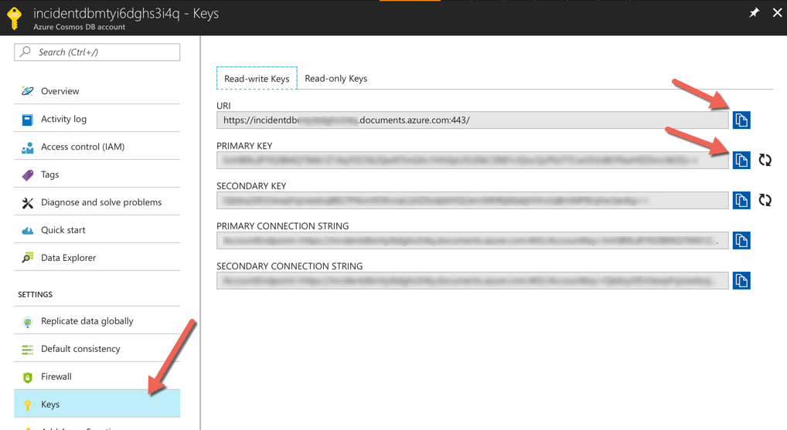

1. In the Power BI connection screen, enter your URL

    

1. Entet the key and click `Connect`

    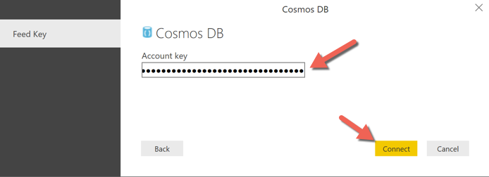

1. Power BI will connect to your data and discover the data. Select the `Incidents` collection and then click `Load`

    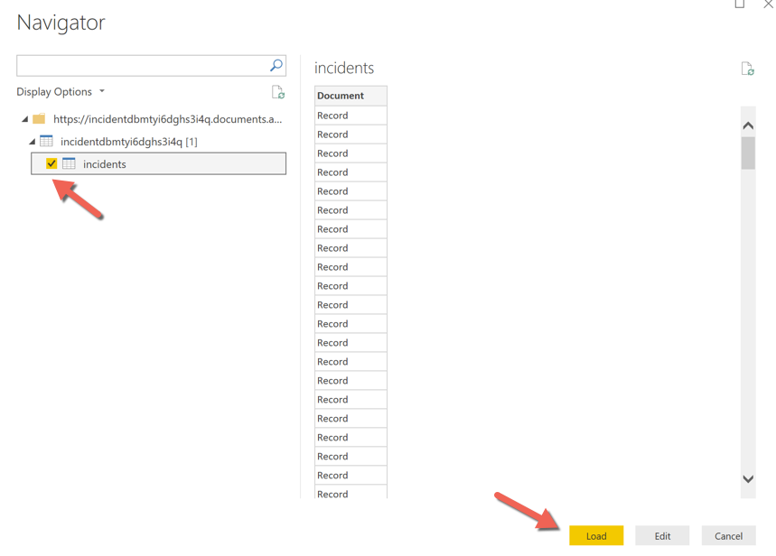

1. You may recieve a prompt that notifies you of pending changes. Click `Apply Changes` to accept the updates

    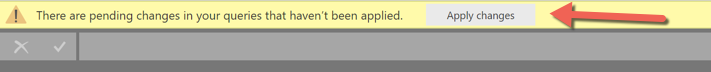

1. From the side navigation menu, click the `Table` icon

    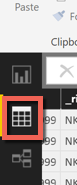

1. Now that we have our data, we neeed to configure the data source to transform the fields for display on the report. On the right side of the screen, in the Incidents table definition, click the `...` and choose `Edit Query`

    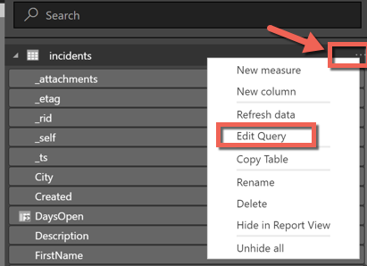

1. Find the `Document` table header and click on the `Expand` icon. This will display the following screen. Uncheck the `Use original column as prefix` option and click `Ok`

    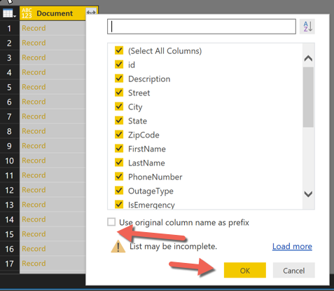

1. On the right side you will see a list of transformations that were applied to datasource so far.

    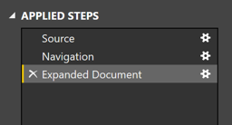

1. Click `Close and apply` to go back to the report.

    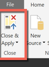

1. Notice that the report now shows some visualizations.

    

1. Edit the query again and let's transform some of the fields for the report. Select the `Created` column

    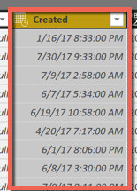

1. From the menu click on `Transform`. Choose `Data type > Date/time` and `Date/Time`

    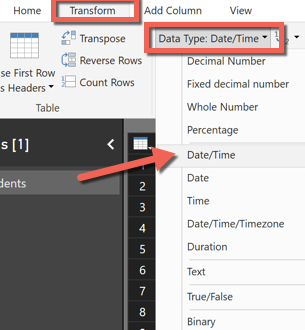

1. Apply the same transform to the `LastModified` column

    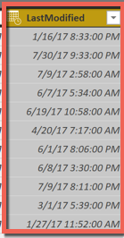

1. Now let's add a new column to the datasource that calculates the number of days a incident is open. From the modeling menu, choose `New Column`

    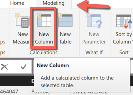

1. Enter the following formula in the custom query window

    ```Excel
    DaysOpen = if(incidents[Created] = TODAY(), 0, DateDiff(incidents[Created], Today(), DAY))
    ```

    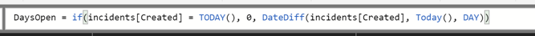

1. Close and apply the changes to the query and go back to the report.

    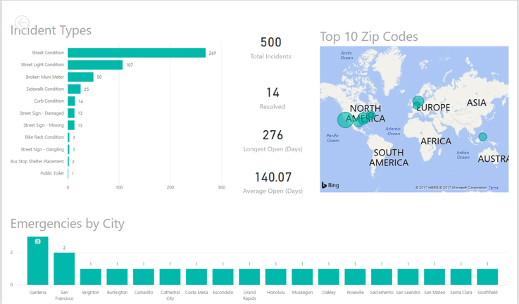

1. Now, let's change some of the visualizations. Select the Map visualization.

    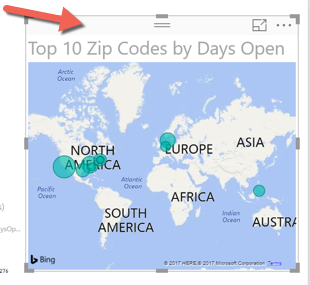

1. On the formatting options, find the `Title Text` field. Change the name to `Top 10 Zip Codes`

    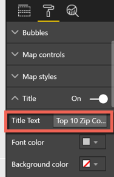

1. Chose the `Average Of Days Open` visualization card.

    

1. From the formatting options, change the visual to a status bar. Add `Days Open` column to the `Value`, `Minimum Value` and `Maximun Value`. Confiure the display type to match the value.

    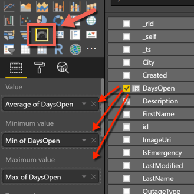

1. Your report should be udpated with the new visualizations.

    

You are now ready to publish your data.

---
## Exercise 3: Publish to the Power BI service <a name="ex3"></a>

1. From the menu, click the `Publish` icon. This will connect to the Power BI service and upload the report.

    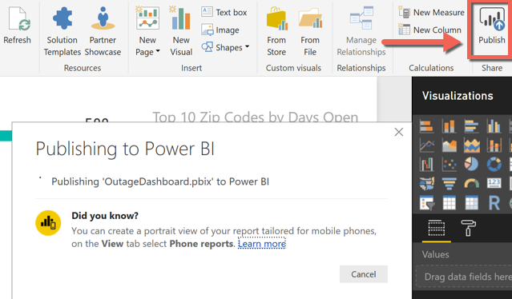

1. Once it is complete, click the `Open 'OutageDashbaord.pbix in Power BI` link

    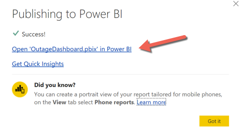

1. You can now view the Power BI report in the browser.

    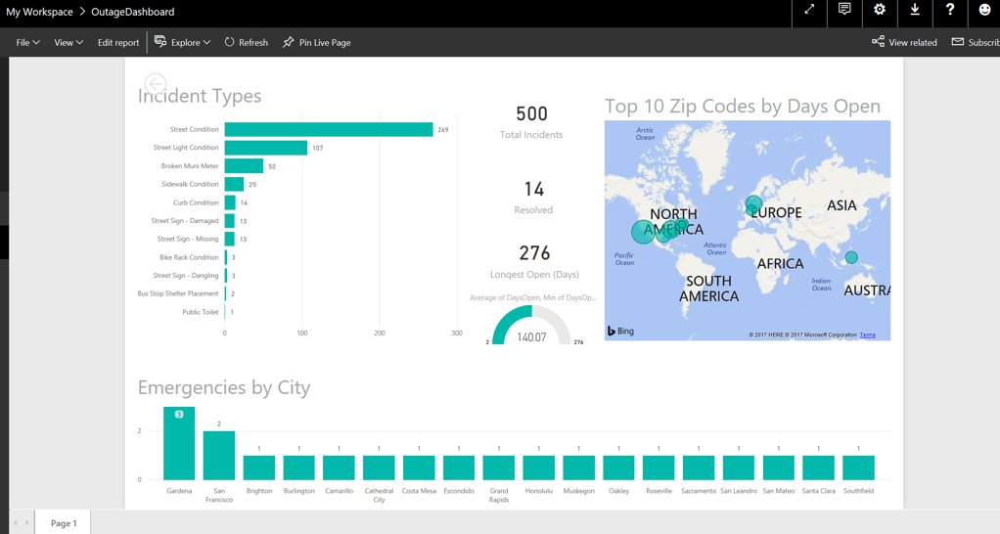

---
## Summary
Combining Azure data and Power BI for visualization is a powerful combination that you can leverage within your applicaiton.

In this hands-on lab, you learned how to:
* Set up your environment
* Connect and prepare the data
* Publish to the Power BI service

---
Copyright 2016 Microsoft Corporation. All rights reserved. Except where otherwise noted, these materials are licensed under the terms of the MIT License. You may use them according to the license as is most appropriate for your project. The terms of this license can be found at https://opensource.org/licenses/MIT.