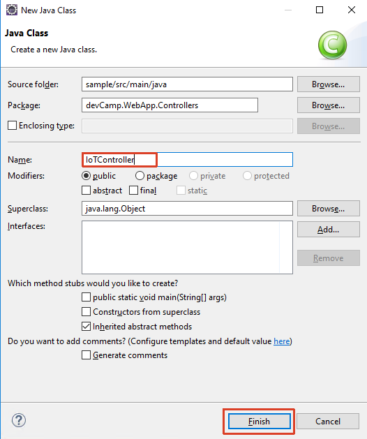
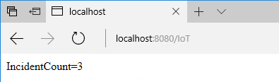

# IoT (Java)

## Overview
City Power & Light is a sample application that allows citizens to report "incidents" that have occurred in their community. It includes a landing screen, a dashboard, and a form for reporting new incidents with an optional photo. The application is implemented with several components:

* Front end web application contains the user interface and business logic. This component has been implemented three times in .NET, NodeJS, and Java.
* WebAPI is shared across the front ends and exposes the backend DocumentDB.
* DocumentDB is used as the data persistence layer.

In this lab, you will combine the web app with an IoT device based on an Arduino board that will query the app for the number of incidents and display the refreshed number every minute.

## Objectives
In this hands-on lab, you will learn how to:
* Set up the developing environment to support the programming of Arduino chips.
* Create your own IoT software from scratch.

## Prerequisites
* The source for the starter app is located in the [start](start) folder. 
* The finished project is located in the [end](end) folder. 
* Deployed the starter ARM Template [HOL 1](../01-developer-environment).
* Completion of the [HOL 5](../05-arm-cd).

## Exercises
This hands-on-lab has the following exercises:
* [Exercise 1: Set up your environment](#ex1)
* [Exercise 2: Create output that will be consumed by the device](#ex2)
* [Exercise 3: Program the device](#ex3)

---
## Exercise 1: Set up your environment<a name="ex1"></a>

To program an Arduino device on your machine you need ..., Visual Studio and ...

1. The easiest way to install ...

You have now installed all the necessary components to start programming an Arduino device on your machine.

---

## Exercise 2: Create output that will be consumed by the device<a name="ex2"></a>

The device will regularly call an URL to fetch the current incident count. We will add a page to our existing web application as an easy way to provide this data.

1. In the `DevcampApplication.java` file add `/iot**` to the list of `antMatchers`.

1. Create a new Controller. Right-click on `devCamp.WebApp.Controllers` and select `New` -> `Class`.

    

1. In the `New Java Class` dialog enter `IoTController` as the name and click `Finish`.

    

1. The controller will just emulate the behavior of the dashboard controller. Add the following code to the newly created file:

    ```csharp
    package devCamp.WebApp.Controllers;
    
    import java.util.List;
    import java.util.concurrent.CompletableFuture;
    
    import devCamp.WebApp.models.IncidentBean;
    import devCamp.WebApp.services.IncidentService;
    import org.slf4j.Logger;
    import org.slf4j.LoggerFactory;
    import org.springframework.beans.factory.annotation.Autowired;
    import org.springframework.scheduling.annotation.Async;
    import org.springframework.stereotype.Controller;
    import org.springframework.ui.Model;
        import org.springframework.web.bind.annotation.RequestMapping;
        
    @Controller
    public class IoTController {
      private static final Logger LOG = LoggerFactory.getLogger(DashboardController.class);
    
      @Autowired
      IncidentService service;
    
      @RequestMapping("/iot")
      public String iot(Model model) {
        List<IncidentBean> list = service.getAllIncidents();
        model.addAttribute("allIncidents", list);
        return "IoT/index";
      }  
    }


1. Create a new template. Right-click on `src/main/resources` and select `New` -> `Other...`. ...

    

1. In the `New` dialog select the `HTML File` template and click `Next >`.

    

1. Set the folder to `[...]/resources/templates/IoT` and the file name to `index.html`, then click `Finish`.

    

1. The template will only display the number of incidents. Add the following code to the newly created file:

    ```html
    <span th:text="${allIncidents.size()}" th:remove="tag"></span>

1. Start the debugger and add `/iot` to the URL to test the new view. It will contain just the number of incidents.

    

You have now created the data feed for your device.

---
## Exercise 3: Program the device<a name="ex3"></a>

Introduction.
  
1. Exercise.

Summary.

---
## Summary

In this hands-on lab, you learned how to:
* Set up the developing environment to support the programming of Arduino chips.
* Create your own IoT software from scratch.

---
Copyright 2017 Microsoft Corporation. All rights reserved. Except where otherwise noted, these materials are licensed under the terms of the MIT License. You may use them according to the license as is most appropriate for your project. The terms of this license can be found at https://opensource.org/licenses/MIT.