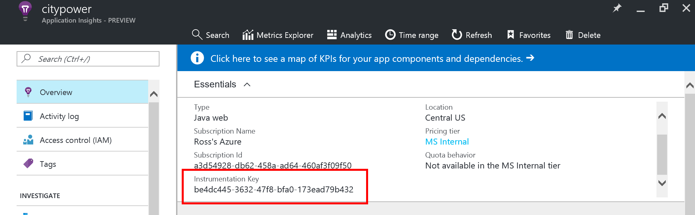

# Monitoring with Application Insights (NodeJS)

## Overview
In this lab, you will create and integrate an instance of Application Insights with your application to provide a 360* view of your app performance. 

## Objectives
In this hands-on lab, you will learn how to:
* Learn to create an Application Insights instance
* Use SDKs to add telemetry to your application
* View performance metrics in the Azure Portal

## Prerequisites

The source for the starter app is located in the [TODO:ADD REF](#) folder. 

## Exercises
This hands-on-lab has the following exercises:
* Exercise 1: Create an Application Insights resource
* Exercise 2: Add server and client side SDK's 
* Exercise 3: Monitor custom events
* Exercise 4: Create a global web test
* Exercise 5: Interact with your telemetry data

### Exercise 1: Create an Application Insights resource

An instance of Application Insights can be created in a variety of ways, including ARM Templates or CLI commands.  For this execise we will use the Azure Portal to create and configure our instance.

1. In a browser, navigate to the [Azure Portal](https://portal.azure.com)

1. Open the Resource Group that was originally deployed.  Click **Add** on the top toolbar to add a new Azure resource to this group.

    

1. Search for `Application Insights` and select the entry from the results list

    

1. In the overview blade that opens, click **Create** to open the creation settings blade. Select a name, configure **Application Type** to `Java web Application` and then click the **Create** button. 

    Creation typically takes less than a minute.

    

1. Once provisioning completes, return to your Resource Group and open the resource.

    

1.  In the **Essentials** section, take note of the **Instrumentation Key**.  We will need that in future exercises.

    

We now have an instance of Application Insights created and ready for data.  The Instrumentation Key is important, as it is the link that ties an application to the AI service. 

### Exercise 2: Add server and client side SDK's 

App Insights works with 2 components: 
1. A server side SDK that integrates into the NodeJS processes
2. A snippet of JavaScript sent down to the client's browser to monitor behavior

We will add both components to our application and enable the sending of telementry into the AppInsights service.

1. Open the application in Eclipse STS. Feel free to use the folder you've been using throughout the hands on labs, or feel free to use the `start` folder. 

1. Microsoft publishes an SDK for AppInsights on Java on [GitHub](https://github.com/Microsoft/ApplicationInsights-Java).  This SDK can be configured via environment variable, so for consistency let's set an environment variable for `APPLICATION_INSIGHTS_IKEY` equal to the key we noted in Exercise 1.

1. Next, open the build.gradle file for your project and add these two lines to the dependencies section: 
    ```Java
    compile('com.microsoft.azure:applicationinsights-core:1.0.6')
    compile('com.microsoft.azure:applicationinsights-web:1.0.6')
    ```
    gradle will automatically retrieve and include these libraries when the application is built or run. 
    
    To make sure that Eclipse knows about the new packages we added to
    the buld, run the `ide/eclipse` gradle task in the `gradle tasks`
    window. Then right-click on the project in the project explorer,
    close the project, and then open it again.

1. With the SDK installed we need a class file to handle its setup. Create a new file in `devCamp.WebApp.AppInsightsConfig` and paste in the following code:

    ```Java
    package devCamp.WebApp;

    import javax.servlet.Filter;

    import org.springframework.boot.context.embedded.FilterRegistrationBean;
    import org.springframework.context.annotation.Bean;
    import org.springframework.context.annotation.Configuration;

    import com.microsoft.applicationinsights.web.internal.WebRequestTrackingFilter;


    @Configuration
    public class AppInsightsConfig {

        @Bean
        public FilterRegistrationBean aiFilterRegistration() {
            FilterRegistrationBean registration = new FilterRegistrationBean();
            registration.setFilter(new WebRequestTrackingFilter());
            registration.addUrlPatterns("/**");
            registration.setOrder(1);
            return registration;
        } 

        @Bean(name = "WebRequestTrackingFilter")
        public Filter WebRequestTrackingFilter() {
            return new WebRequestTrackingFilter();
        }	
    }
    ```

    This class will configure the `WebRequestTrackingFilter` to be the first filter on the http filter chain. 

    > We are using the web http filter configuration rather than the Spring MFC configuration [described here](https://azure.microsoft.com/en-us/documentation/articles/app-insights-java-get-started/) because this is a Spring Boot application, and it has it's own spring MVC configuration. 

1. Create an `ApplicationInsights.xml` file in the `src/main/resources` directory, and paste in the following code:

    ```XML
    <?xml version="1.0" encoding="utf-8"?>
    <ApplicationInsights xmlns="http://schemas.microsoft.com/ApplicationInsights/2013/Settings" schemaVersion="2014-05-30">


    <!-- The key from the portal: -->

    <InstrumentationKey>your key here</InstrumentationKey>


    <!-- HTTP request component (not required for bare API) -->

    <TelemetryModules>
        <Add type="com.microsoft.applicationinsights.web.extensibility.modules.WebRequestTrackingTelemetryModule"/>
        <Add type="com.microsoft.applicationinsights.web.extensibility.modules.WebSessionTrackingTelemetryModule"/>
        <Add type="com.microsoft.applicationinsights.web.extensibility.modules.WebUserTrackingTelemetryModule"/>
    </TelemetryModules>

    <!-- Events correlation (not required for bare API) -->
    <!-- These initializers add context data to each event -->

    <TelemetryInitializers>
        <Add   type="com.microsoft.applicationinsights.web.extensibility.initializers.WebOperationIdTelemetryInitializer"/>
        <Add type="com.microsoft.applicationinsights.web.extensibility.initializers.WebOperationNameTelemetryInitializer"/>
        <Add type="com.microsoft.applicationinsights.web.extensibility.initializers.WebSessionTelemetryInitializer"/>
        <Add type="com.microsoft.applicationinsights.web.extensibility.initializers.WebUserTelemetryInitializer"/>
        <Add type="com.microsoft.applicationinsights.web.extensibility.initializers.WebUserAgentTelemetryInitializer"/>

    </TelemetryInitializers>
    </ApplicationInsights>    
    ``` 

    Edit this line to contain your instrumentation key you saved earlier:
    ```XML
    <InstrumentationKey>your key here</InstrumentationKey>
    ```
    >
    > This file allows you to configure what is tracked by ApplicationInsights and how it is communicated to Azure.  There is documentation on [the .NET version](https://azure.microsoft.com/en-us/documentation/articles/app-insights-configuration-with-applicationinsights-config/), but this should be checked against the [Java SDK repository](https://github.com/Microsoft/ApplicationInsights-Java)
    >

1. Run your application and in the navigate around several pages to generate sample telementry.  

1. Back in the Azure Portal, refresh the browser tab (or click **Refresh** from the top toolbar) until you see data appear.  

    

    > It may take 3-5 minutes for data to appear even when manually refreshing

1. Our server is now sending data, but what about the client side? Let's add the JavaScript library.  

    In the portal, click the tile that says **Learn how to collect browser page load data**    
    
    

1. The next blade with give you a JavaScript snippet pre-loaded with the Instrumentation Key.  This snippet, when place on an HTML page, will download the full Application Insights JavaScript library and configure itself.  Click the clipboard icon to copy the snippet.

    

1. Let's integrate the snippet into our web pages. Create a new file at `src/main/resources/templates/appinsights.html` and paste in the snippet.

    ```html
    <!-- 
    To collect end-user usage analytics about your application, 
    insert the following script into each page you want to track.
    Place this code immediately before the closing </head> tag,
    and before any other scripts. Your first data will appear 
    automatically in just a few seconds.
    -->
    <script type="text/javascript">
    var appInsights=window.appInsights||function(config){
        function i(config){t[config]=function(){var i=arguments;t.queue.push(function(){t[config].apply(t,i)})}}var t={config:config},u=document,e=window,o="script",s="AuthenticatedUserContext",h="start",c="stop",l="Track",a=l+"Event",v=l+"Page",y=u.createElement(o),r,f;y.src=config.url||"https://az416426.vo.msecnd.net/scripts/a/ai.0.js";u.getElementsByTagName(o)[0].parentNode.appendChild(y);try{t.cookie=u.cookie}catch(p){}for(t.queue=[],t.version="1.0",r=["Event","Exception","Metric","PageView","Trace","Dependency"];r.length;)i("track"+r.pop());return i("set"+s),i("clear"+s),i(h+a),i(c+a),i(h+v),i(c+v),i("flush"),config.disableExceptionTracking||(r="onerror",i("_"+r),f=e[r],e[r]=function(config,i,u,e,o){var s=f&&f(config,i,u,e,o);return s!==!0&&t["_"+r](config,i,u,e,o),s}),t
        }({
            instrumentationKey:"2fd01fb1-d6cb-4c2f-9244-171989d2ac67"
        });
        
        window.appInsights=appInsights;
        appInsights.trackPageView();
    </script>
    ```
1. We need to make two small changes to the appinsights.html file.  Since Spring Boot and Thymeleaf will process all pages through an SGML validator, we need to make sure that the Javascript snippet doesn't cause it problems.  So paste in ` // <![CDATA[` on the line after `<script type="text/javascript">` and add `    // ]]>` on the line before the final `</script>`.  Your file should look like this when you are done: 

    ```html
    <!-- 
    To collect end-user usage analytics about your application, 
    insert the following script into each page you want to track.
    Place this code immediately before the closing </head> tag,
    and before any other scripts. Your first data will appear 
    automatically in just a few seconds.
    -->
    <script type="text/javascript">
    // <![CDATA[
    var appInsights=window.appInsights||function(config){
        function i(config){t[config]=function(){var i=arguments;t.queue.push(function(){t[config].apply(t,i)})}}var t={config:config},u=document,e=window,o="script",s="AuthenticatedUserContext",h="start",c="stop",l="Track",a=l+"Event",v=l+"Page",y=u.createElement(o),r,f;y.src=config.url||"https://az416426.vo.msecnd.net/scripts/a/ai.0.js";u.getElementsByTagName(o)[0].parentNode.appendChild(y);try{t.cookie=u.cookie}catch(p){}for(t.queue=[],t.version="1.0",r=["Event","Exception","Metric","PageView","Trace","Dependency"];r.length;)i("track"+r.pop());return i("set"+s),i("clear"+s),i(h+a),i(c+a),i(h+v),i(c+v),i("flush"),config.disableExceptionTracking||(r="onerror",i("_"+r),f=e[r],e[r]=function(config,i,u,e,o){var s=f&&f(config,i,u,e,o);return s!==!0&&t["_"+r](config,i,u,e,o),s}),t
        }({
            instrumentationKey:"2fd01fb1-d6cb-4c2f-9244-171989d2ac67"
        });
        
        window.appInsights=appInsights;
        appInsights.trackPageView();
    // ]]>    
    </script>
    ```
1. Now update all of the html templates to include appinsights .html.   
    * templates/Dashboard/index.html
    * templates/Home/index.html
    * templates/Incident/new.html
    * templates/Details/details.html
    
    with `<div th:include="appinsights"></div> ` right after the `<body>` tag in each file, for example:
    ```HTML
    <body>
 	<div th:include="appinsights"></div>   
     ...
    ```
1. Re-run the application and load several pages to generate more sample telementry. The Azure Portal should now light up data for **Page View Load Time** 

    

Our application is now providing the Application Insights service telementry data from both the server and client.

### Exercise 3: Monitor custom events

Up until this point the telemetry provided has been an automatic, out-of-the-box experience.  For custom events we need to use the SDK. Let's create an event where any time a user views their Profile page, we record their name and AzureAD tenant ID.
[TODO RWS complete after AAD portion is completed]
1. Open `routes/profile.js` and adjust it to use our `appInsightsUtility`

    ```javascript
    var express = require('express');
    var router = express.Router();
    var request = require('request');
    var authUtility = require('../utilities/auth');
    var appInsightsUtility = require('../utilities/appInsights');

    /* GET profile page. */
    router.get('/', authUtility.ensureAuthenticated, function (req, res) {

        // Record User Details with Custom Event
        // Generates the tenant ID and a user ID to send to AppInsights
        appInsightsUtility.customEvent(req.user._json.preferred_username, req.user._json.tid);

        // Create options object configuring the HTTP call
        var options = {
            url: 'https://graph.microsoft.com/v1.0/me',
            method: 'GET',
            json: true,
            headers: {
                authorization: 'Bearer ' + req.user.token
            }
        };

        // Query Graph API
        request(options, function (error, results, body) {

            // Render page with returned attributes
            res.render('profile', {
                title: 'Profile',
                user: req.user,
                attributes: body
            });

        });

    });

    module.exports = router;
    ```

1. Save the file, restart the application, and generate sample telemetry by visitng the profile page, leaving, and returning to the profile page.  In the Azure Portal we can see the data in the **Usage** pane from the left navigation.

     

    Drilling into the metrics explorer we can see our custom data:

    

These custom events (and the related concept of constom metrics) are a powerful way to integrate telemetry into our application and centralize monitoring across multiple application instances.

### Exercise 4: Create a global web test

### Exercise 5: Interact with your telemetry data

## Summary

In this hands-on lab, you learned how to:
* Create a Visual Studio Team Services online account
* Create a VSTS Git repository
* Add your code to the VSTS Git repository
* Create a Continuous Integration pipeline

Copyright 2016 Microsoft Corporation. All rights reserved. Except where otherwise noted, these materials are licensed under the terms of the MIT License. You may use them according to the license as is most appropriate for your project. The terms of this license can be found at https://opensource.org/licenses/MIT.