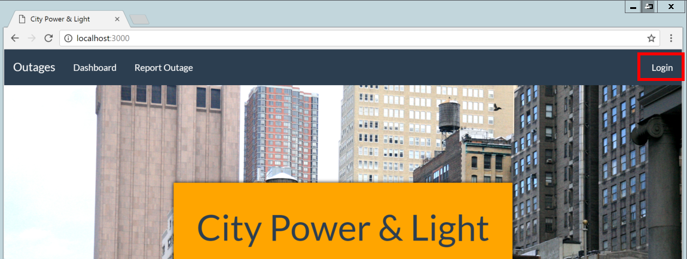
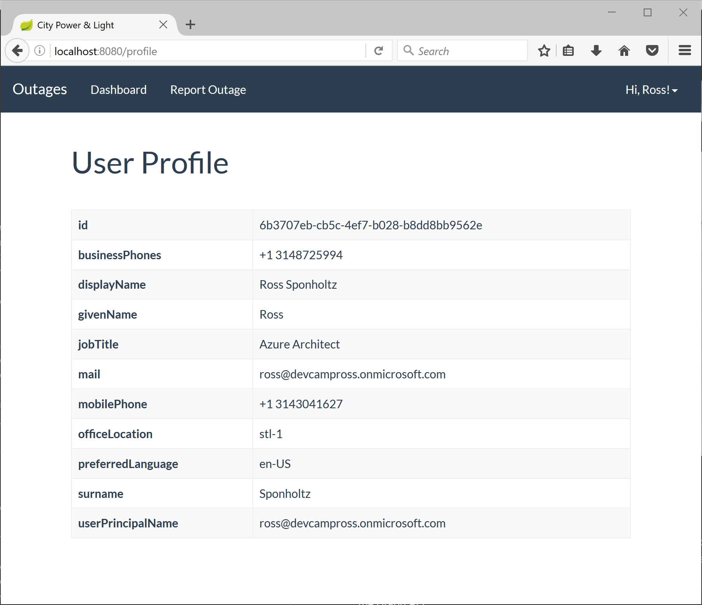

# Hands on Lab - Identity with Azure AD and Office 365 APIs (Java)

## Overview

City Power & Light is a sample application that allows citizens to to report "incidents" that have occured in their community.  It includes a landing screen, a dashboard, and a form for reporting new incidents with an optional photo.  The application is implemented with several components:

* Front end web application contains the user interface and business logic.  This component has been implemented three times in .NET, NodeJS, and Java.
* WebAPI is shared across the front ends and exposes the backend DocumentDB
* DocumentDB is used as the data persistence layer 

In this lab, you will continue enhancing the City Power & Light application by adding authentication for users powered by [Azure Active Direcotry](https://azure.microsoft.com/en-us/services/active-directory/).  Once authenticated, you may then query the [Microsoft Office Graph](https://graph.microsoft.io) to retrieve information pertinent to the aplication.

This guide uses [Eclipse STS](https://spring.io/tools) for editing, however please feel free to use your editor of choice.

## Objectives
In this hands-on lab, you will learn how to:

* Take an anonymous application and add user authentication via AzureAD
* Query data from the Microsoft Graph
* Manipulate data in the Microsoft Graph

## Prerequisites

* The source for the starter app is located in the `HOL\node\azuread-office365\start` folder. 
* The finished project is located in the `HOL\node\azuread-office365\end` folder. 
* Deployed the starter ARM Template
* Completion of the first modern-apps lab

## Exercises

This hands-on-lab has the following exercises:

* Exercise 1: Setup authentication 
* Exercise 2: Create a user profile page
* Exercise 3: Send a confirmation email to the user on incident creation

## Exercise 1: Integrate the API

AzureAD can handle authentication for web applications. First we will create a new application in our AzureAD directory, and then we will extend our application code to work with an authentication flow. 

1. Navigate in a browser to `https://apps.dev.microsoft.com`, click the button to **Register your app**, and login with your Azure credentials.

    

1. There are several types of application that can be registered.  For City Power & Light, select **Web Application**

    

1. Provide an application name and contact email address.

    

1. After AzureAD handles the authentication, it needs a route in our application to redirect the user.  
For testing locally, we'll use `http://localhost:8080/auth/openid/return` as the **Redirect URI** and 
as an environment variable named `AAD_RETURN_URL`.  Click the **Create** button. 

    

1. The page then shows some sample code. Scroll down to the bottom and select **Go to settings**

    

1. On the Registration page, take note of the **Application ID**. This will be used as an environment variable named `AAD_CLIENT_ID` and is used to configure the authentication library.  

    We also need to generate a client secret. Select the **Generate New Password** button.

    

1. A key is generated for you. Save this, as you will not be able to retrieve it in the future. This key will become the `AAD_CLIENT_SECRET` environment variable.

    

1. In Eclipse, let's add those environment variables by opening the run environment, click on the environment tab, and clicking `new` (using the values you captured above):

    ```
    "AAD_RETURN_URL": "http://localhost:3000/auth/openid/return",
    "AAD_CLIENT_ID": "2251bd08-10ff-4ca2-a6a2-ccbf2973c6b6",
    "AAD_CLIENT_SECRET": "JjrKfgDyo5peQ4xJa786e8z"
    "AAD_TENANT_ID": "JjrKfgDyo5peQ4xJa786e8z"
    ```

1. To add AAD identity support libraries to your Spring application, open the build.gradle
   file and add the following entries under dependencies:
   ```java
	compile('com.microsoft.azure:adal4j:1.1.1')
	compile('com.nimbusds:oauth2-oidc-sdk:4.5')
	compile('org.springframework.security:spring-security-core')
	compile('org.springframework.security:spring-security-web')
	compile('org.springframework.security:spring-security-config')
    ```

    To make sure that Eclipse knows about the new packages we added to
    the buld, run the `ide/eclipse` gradle task in the `gradle tasks`
    window. When that is done, right-click on the project in the project explorer,
    close the project, and then open it again.


1. The Spring security features can be rather complex, however we are going to take a simplistic 
route with this example.  We are going to create two security filters, one for requesting Azure 
AD Authentication, and the other to process the Azure AD response.  These filters work in conjunction 
with Spring security to allow flexible security requirements for pages in the application.

    First, open the file `devCamp.WebApp.AzureADAuthenticationFilter.java`, which has been commented 
    out. Remove the `/*` at the beginning and the `*/` at the end, so the code is no longer commented out. 

    This is a Spring security fiter that will make sure the user is authenticated on pages
    that require it.  If the user needs authentication, they will be redirected to the login
    page to get the requred token.  

1. When the user completes their login, the browser will be redirected back to the same
    page, but with an HTTP post and the token attached.  We need to add a class to catch 
    that post. Open the file named `devCamp.WebApp.AzureADResponseFilter.java` which has been commented 
    out. Remove the `/*` at the beginning and the `*/` at the end, so the code is no longer commented out. 

1. These classes need a "helper" class to do some utility functions. Open the file 
named  `devCamp.WebApp.Utils.AuthHelper.java`, which has been commented 
    out. Remove the `/*` at the beginning and the `*/` at the end, so the code is no longer commented out. 

1. Next, we need a class to configure security for our application.  Open `devCamp.WebApp.WWebSecurityConfig.java` which has been commented out. Remove the `/*` at the beginning and the `*/` at the end, so the code is no longer commented out. 

    This class adds the `AzureADAuthenticationFilter` and the `AzureADResponseFilter` to the 
    filter chain, and configures page matching so that they will be invoked on the proper pages.


1. Our backend code is taking shape, but we need the user interface to display a **Login** button.  Open up `templates/topnav.html` and remove the commented out block of HTML code by deleting the `<!--`  and `-->` characters. Save all files and run the application and visit the application in the browser, and you should see the **Login** button on the top navigation.

    

    Click on the link for **Report Outage**. Since you are not currently authenticated, the application redirects you to Azure to provide a username and password.  Sign in, and you will be redirect back to the homescreen with a username in the top right corner. Click the name to dropdown a link for a **Profile** page and to **Sign Out**.  

    

The application now behaves differently for anonymous vs. authenticated users, allowing you the developer flexibility in exposing pieces of your application to anonymous audiences while ensuring sensitive content stays protected.
[TODO rws complete to here]
## Exercise 2: Create a user profile page
Next, we are going to create a page to display information about the logged in user.  While AzureAD returns a name and email address, we can query the Microsoft Graph for extended details about a given user.  We will add a view, a route, and then query the Graph for user information.

1. Create a new file named `templates/Profile/index.html`. Rendered with a set of attributes, we will display a simple table where each row corresponds to an attribute.

    ```html
    <!DOCTYPE html>
    <html lang="en" xmlns="http://www.w3.org/1999/xhtml" 
        xmlns:th="http://www.thymeleaf.org" >
        
    <head>
        <meta charset="UTF-8"/>
        <meta http-equiv="X-UA-Compatible" content="IE=edge"/>
        <meta name="viewport" content="width=device-width, initial-scale=1"/>

        <title>City Power &amp; Light</title>

        <!-- CSS -->
        <link rel="stylesheet" href="//ajax.aspnetcdn.com/ajax/bootstrap/3.3.6/css/bootstrap.css"/>
        <link rel="stylesheet" href="//maxcdn.bootstrapcdn.com/bootswatch/3.3.7/flatly/bootstrap.min.css"/>
        <link rel="stylesheet" href="../css/main.css"/>

    </head>

    <body>
        <div th:include="topnav::topnav"></div> 
        <div class="container">
        
            <h1>User Profile</h1>
        
            <table class="table table-striped table-bordered">
                <tbody>
                    <tr>
                        <th>@odata.context</th>
                        <td th:text="${userProfileBean.Entity}"></td>
                    </tr>	        
                    <tr>
                        <th>id</th>
                        <td th:text="${userProfileBean.Id}"></td>
                    </tr>
                    <tr>
                        <th>businessPhones</th>
                        <td th:text="${userProfileBean.businessPhones}"></td>
                    </tr>
                    <tr>
                        <th>displayName</th>
                        <td th:text="${userProfileBean.displayName}"></td>
                    </tr>
                    <tr>
                        <th>givenName</th>
                        <td th:text="${userProfileBean.givenName}"></td>
                    </tr>
                    <tr>
                        <th>jobTitle</th>
                        <td th:text="${userProfileBean.jobTitle}"></td>
                    </tr>
                    <tr>
                        <th>mail</th>
                        <td th:text="${userProfileBean.mail}"></td>
                    </tr>
                    <tr>
                        <th>mobilePhone</th>
                        <td th:text="${userProfileBean.mobilePhone}"></td>
                    </tr>
                    <tr>
                        <th>officeLocation</th>
                        <td th:text="${userProfileBean.OfficeLocation}"></td>
                    </tr>
                    <tr>
                        <th>preferredLanguage</th>
                        <td th:text="${userProfileBean.preferredLanguage}"></td>
                    </tr>
                    <tr>
                        <th>surname</th>
                        <td th:text="${userProfileBean.surname}"></td>
                    </tr>
                    <tr>
                        <th>userPrincipalName</th>
                        <td th:text="${userProfileBean.userPrincipalName}"></td>
                    </tr>
                </tbody>
            </table>
        </div>
        <!-- JavaScript -->
        <script src="//ajax.aspnetcdn.com/ajax/jQuery/jquery-2.2.4.js"></script>
        <script src="//ajax.aspnetcdn.com/ajax/bootstrap/3.3.6/bootstrap.js"></script>	
    </body>
    </html>    
    ```

1. With the view prepped, create a controller at `Controllers/ProfileController.java`.  When the route is loaded, it will query the Microsoft Graph "Me" endpoint.  This query requires a token to be passed in an `authorization` request header, which we grab from the `user` object provided by the adal4j library.

    ```Java
    package devCamp.WebApp.Controllers;

    import java.util.ArrayList;

    import org.springframework.stereotype.Controller;
    import org.springframework.ui.Model;
    import org.springframework.web.bind.annotation.RequestMapping;

    import devCamp.WebApp.ViewModels.UserProfileBean;
    import groovyjarjarantlr.collections.List;

    @Controller
    public class ProfileController {

        UserProfileBean createDummyUserProfile() {
            UserProfileBean userProfile = new UserProfileBean();
            userProfile.setEntity("https://graph.microsoft.com/v1.0");
            userProfile.setId("id1");
            ArrayList<String> bizphones = new ArrayList<String>();
            bizphones.add("555-1212");
            bizphones.add("123-4567");		
            userProfile.setBusinessPhones(bizphones);
            userProfile.setDisplayName("Ross Devcamp");
            userProfile.setGivenName("Ross");
            userProfile.setJobTitle("Java Coder");
            userProfile.setMail("rossdevcamp@hotmail.com");
            userProfile.setMobilePhone("314-555-1212");
            userProfile.setOfficeLocation("123 main street");
            userProfile.setPreferredLanguage("US English");
            userProfile.setSurname("Devcamp");
            userProfile.setUserPrincipalName("rossdevcamp@hotmail.com");
            return userProfile;
        }
        
        @RequestMapping("/profile")
        public String index(Model model) {
            UserProfileBean userProfile = createDummyUserProfile();
            model.addAttribute("userProfileBean",userProfile);
            return "Profile/index";
        }
    }
    ```

1. With the view and route created, we can now load `http://localhost:8080/profile` in the browser.

    

We now have a simple visualization of the current user's profile information as loaded from the Microsoft Graph.

## Exercise 3: Interact with the Microsoft Graph
In the previous exercise you read data from the Microsoft Graph, but other endpoints can be used for more sophisticated tasks.  In this exercise we will use the Graph to send an email message whenever a new incident is reported.

1. Create a new file in `utilities/mail.js` that will take a recipient and generate a JSON message body for passing into the Graph API. 

    ```javascript
    // https://graph.microsoft.io/en-us/docs/api-reference/v1.0/api/user_post_messages

    // The contents of the outbound email message that will be sent to the user
    var emailContent = `
    <html>

    <head>
    <meta http-equiv='Content-Type' content='text/html; charset=us-ascii\'>
    <title></title>
    </head>

    <body style="font-family:Calibri">
    <div style="width:50%;background-color:#CCC;padding:10px;margin:0 auto;text-align:center;">
        <h1>City Power &amp; Light</h1>
        <h2>New Incident Reported by {{name}}</h2>
        <p>A new incident has been reported to the City Power &amp; Light outage system.</p>   
        <br />
    </div>
    </body>

    </html>
    `;

    /**
    * Returns the outbound email message content with the supplied name populated in the text
    * @param {string} name The proper noun to use when addressing the email
    * @return {string} the formatted email body
    */
    function getEmailContent(name) {
        return emailContent.replace('{{name}}', name);
    }

    /**
    * Wraps the email's message content in the expected [soon-to-deserialized JSON] format
    * @param {string} content the message body of the email message
    * @param {string} recipient the email address to whom this message will be sent
    * @return the message object to send over the wire
    */
    function wrapEmail(content, recipient) {
        var emailAsPayload = {
            Message: {
                Subject: 'New Incident Reported',
                Body: {
                    ContentType: 'HTML',
                    Content: content
                },
                ToRecipients: [
                    {
                        EmailAddress: {
                            Address: recipient
                        }
                    }
                ]
            },
            SaveToSentItems: true
        };
        return emailAsPayload;
    }

    /**
    * Delegating method to wrap the formatted email message into a POST-able object
    * @param {string} name the name used to address the recipient
    * @param {string} recipient the email address to which the connect email will be sent
    */
    function generateMailBody(name, recipient) {
        return wrapEmail(getEmailContent(name), recipient);
    }

    module.exports.generateMailBody = generateMailBody; 
    ```

    > There are [numerous settings](https://graph.microsoft.io/en-us/docs/api-reference/v1.0/api/user_post_messages) you can include in a mail message

1. Extend `routes/new.js` to call our helper by adding a new function after the end of `function uploadImage()` and before the module export statement.

    ```javascript
    function emailConfirmation(user) {

        return new Promise(function (resolve, reject) {

            // Generate email markup
            var mailBody = emailUtility.generateMailBody(user.displayName, user.email);

            // Set configuration options
            var options = {
                url: 'https://graph.microsoft.com/v1.0/me/sendMail',
                json: true,
                method: 'POST',
                headers: {
                    'Authorization': 'Bearer ' + user.token
                },
                body: mailBody
            };

            // POST new message to Graph API
            request(options, function (error, response) {

                console.log('Email confirmation message sent.');
                resolve();

            });

        });

    }

    ```

    Also update the series of chained promises in the original `.post` to include a reference to the new `emailConfirmation` function

    ```javascript
    // Process the fields into a new incident, upload image, and add thumbnail queue message
    createIncident(fields, files)
        .then(uploadImage)
        .then(addQueueMessage)
        .then(emailConfirmation(req.user))
        .then(() => {

            // Successfully processed form upload
            // Redirect to dashboard
            res.redirect('/dashboard');

        });
    ```

    Finally, add a reference at the top of the page for `var emailUtility = require('../utilities/email');`

 1. Load the application in the browser, and create a new incident.  You should soon receive an email in the current user's inbox.

           

Sending this email did not require the setting up of a dedicated email server, but instead leveraged capabilities within the Microsfot Graph.  We could have also created a calendar event, or a task related to the incident for a given user, all via the API.

## Summary
Our application can now bifurcate anonymous and authenticated users to ensure flexibility between public and private data.  We are also able to leverage the Microsoft Graph to not only return the user's extended user profile, but to send email confirmations whenever a new incident is created.