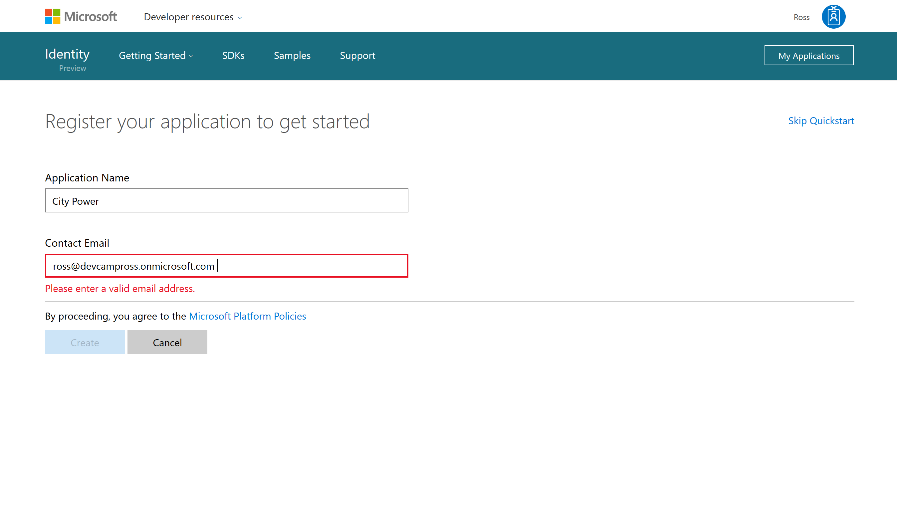

# Developer Environment (Java)

## Overview
In this lab, you will XXX.

## Objectives
In this hands-on lab, you will set up an Office365 developer subscription, and Azure trial subscription, and an Azure-based virutal machine for the development environment for subsequent labs in the DevCamp.  To expedite the process, we've prepared Windows and Linux images that you will copy into your own environment, start the virtual machine and connect to it.  You will then configure the components for Azure development.
* Set up an Office365 developer subscription
* Set up an Azure trial subscription
* Configure your Azure subscription for DevCamp
* Create an Azure Virtual Machine for development
* Connect to the Azure Virtual Machine and configure it for development.

## Prerequisites

The source for the starter app is located in the [TODO:ADD REF](#) folder. 

## Exercises
This hands-on-lab has the following exercises:
* Exercise 1: Set up Office 365 Developer subscription
* Exercise 2: Set up Azure trial subscription
* Exercise 3: Configure your Azure subscription for DevCamp
* Exercise 4: Create an Azure Virtual Machine for development
* Exercise 5: Connect to the Azure Virtual Machine and configure it for development

### Exercise 1: Set up Office 365 Developer subscription

Instructions and screenshots here
    
    
    
    
    
    
    
    
    
    
    
    
    
    
    
    
    
    
    
    
    
    
    
    
    
    
    
    
    
    
    
    
    
    
    
    
    
    

### Exercise 2: Set up Azure trial subscription

Instructions and screenshots here

### Exercise 3: Configure your Azure subscription for DevCamp

Instructions and screenshots here

### Exercise 4: Create an Azure Virtual Machine for development

Instructions and screenshots here

### Exercise 5: Connect to the Azure Virtual Machine and configure it for development

Instructions and screenshots here
## Summary

In this hands-on lab, you learned how to:
* Set up an Office365 developer subscription
* Set up an Azure trial subscription
* Configure your Azure subscription for DevCamp
* Create an Azure Virtual Machine for development
* Connect to the Azure Virtual Machine and configure it for development.

Copyright 2016 Microsoft Corporation. All rights reserved. Except where otherwise noted, these materials are licensed under the terms of the MIT License. You may use them according to the license as is most appropriate for your project. The terms of this license can be found at https://opensource.org/licenses/MIT.
