# DevOps with Visual Studio Team Services (Java)

## Overview
In this lab, you will create a Visual Studio Team Services online account, check in your code, create a Continuous Integration pipeline, and test your cloud-based application.

## Objectives
In this hands-on lab, you will learn how to:
* Create a Visual Studio Team Services online account
* Create a VSTS Git repository
* Add your code to the VSTS Git repository
* Create a Continuous Integration pipeline

## Prerequisites

The source for the starter app is located in the [TODO:ADD REF](#) folder. 

## Exercises
This hands-on-lab has the following exercises:
* Exercise 1: Create VSTS online account 
* Exercise 2: Create VSTS Git repository
* Exercise 3: Add application to VSTS Git
* Exercise 4: Create a Continuous Integration pipeline

### Exercise 1: Create VSTS online account

1. In your browser, browser to `https://www.visualstudio.com/team-services/`

    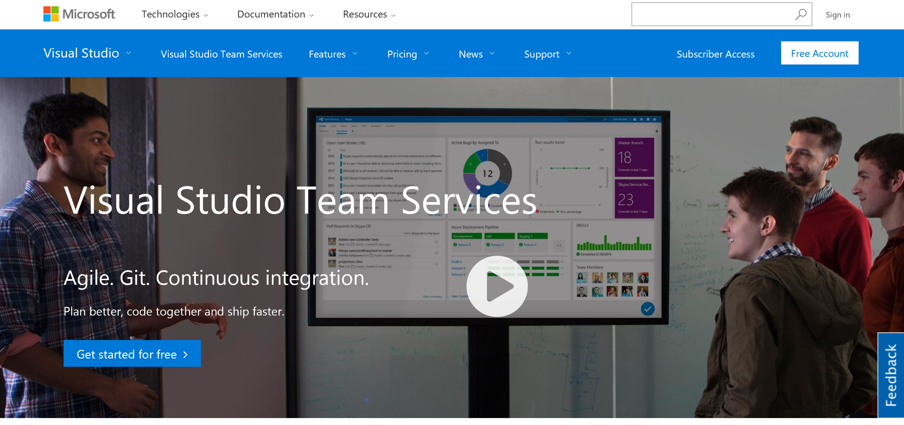

1. Click "sign in" and log in with your account

### Exercise 2: Create VSTS Git repository

VSTS gives us the option to use Git or 
[TFVC](https://www.visualstudio.com/en-us/docs/tfvc/overview) as our 
project's repository. For this exercise we will use Git, and then clone 
the repository to our dev machine. 

> Note that if you acquired these lab materials via a `git clone` of 
the workshop repo then you should select a folder somewhere else on your 
dev machine. This will minimize conflicts between the two separate 
repositories 

1. Starting at your account's landing page, locate the section entitled **Recent projects & teams** and click **New**.

    

1. Enter a project name such as **DevCamp**, ensure **Version Control** is set to **Git** and then click **Create Project**.

    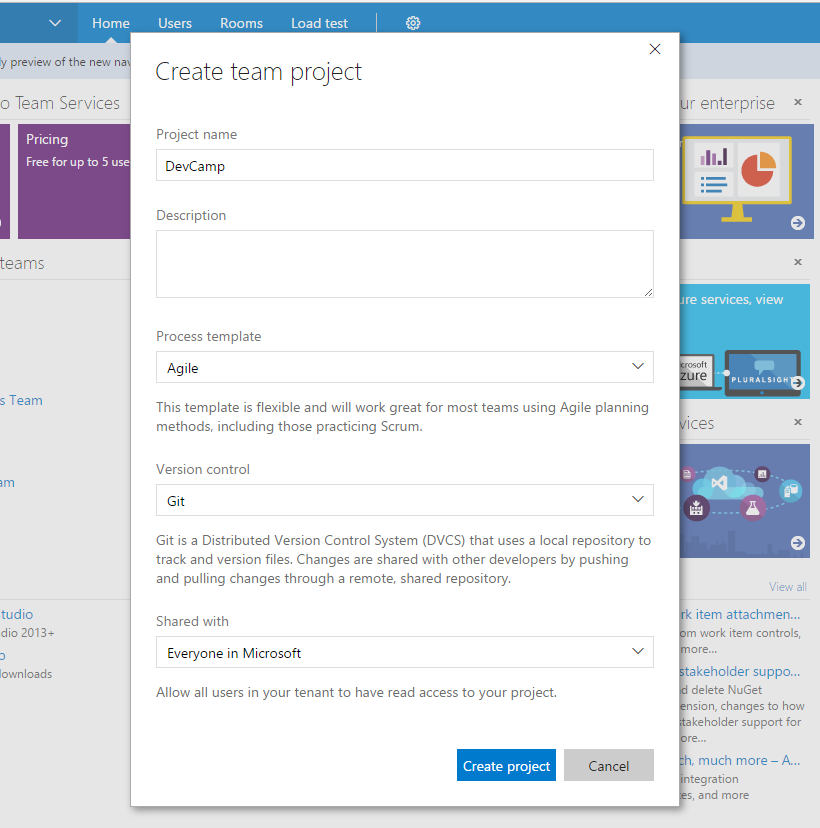

1. Wait for the project to be created. This process may take up to 60 seconds. When finished select the **Navigate to Project** button

    

1. Exit out of the Congratulations window and explore your pre-built dashboard. Familiarize yourself with the variety of widgets available, and the customization options. 

    

1. Click **Code** on the top toolbar to navigate to the Code screen.  Then click the **Generate Git Credentials** button to set a user name, alias, and password.

    

1. Next, select the **Copy** icon to copy the HTTPS URL for the repository.

1. In a console window, navigate to a spot on your dev machine and execute a `git clone https://yourrepo.com/DefaultCollection/_git/Repo.git`

    

    Depending on your environment setup you may need to authenticate with VSTS

You have now created a project in VSTS with a Git repository, and cloned the repository locally to your developer machine.  Next we'll upload code from our machine to VSTS.

### Exercise 3: Add application to VSTS Git

1. When we cloned our repository it was empty.  Take the code that you have developed in the earlier labs (or the `start` folder bundled with this readme) and paste it into our new directory.  This can be done via the command line, or with good old copy/paste in an Explorer or Finder window.

    

    > Depending on how your environment is setup, there may be a hidden folder `.git` in your orignating directory. Do not copy this folder into the destination directory linked to VSTS

1. Back in the console, execute a `git status` to ensure the files are picked up by git.

    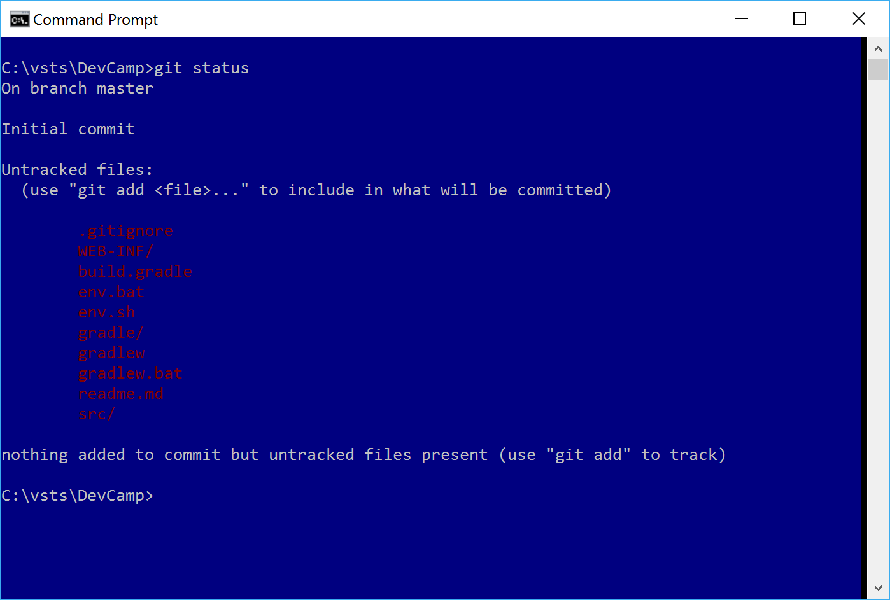

1. Execute `git add *` to track the files, then a `git commit -m "initial upload` to commit the files to the repository. Finally, execute `git push origin master` to push the files up to VSTS.

    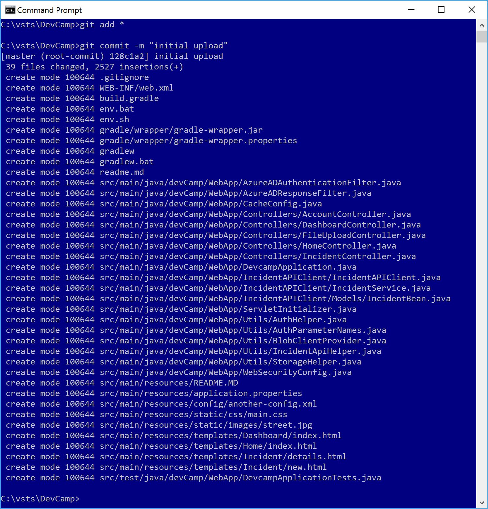

1. In the browser, reload the **Code** page to see the uploaded code

    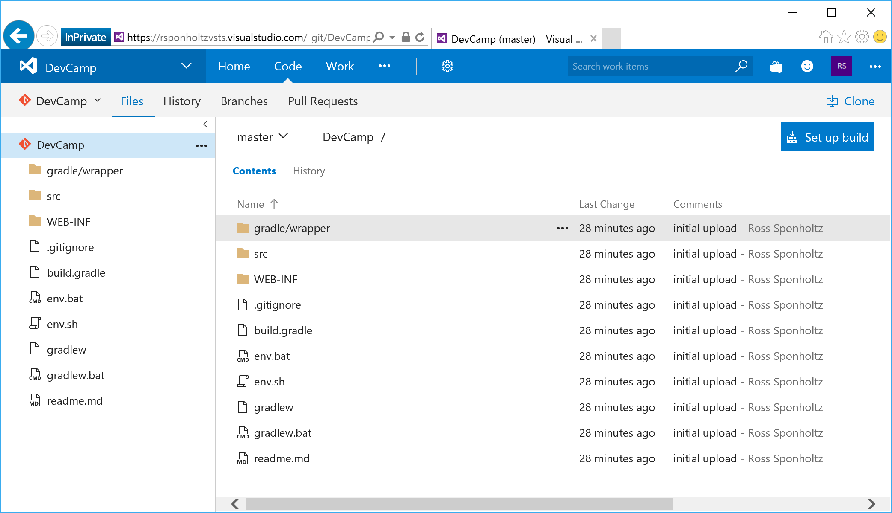

1. Now, any changes you make to the local repository can be pushed up to VSTS.  Other team members may also begin interacting with the code base via their own clones and pushes.

> Note that we did not include the `build` or `.gradle` folders. These 
components are typically not added to source control, as they bloat the 
size of the repository.  These files should have been excluded from your 
respository due to settings in the `.gitignore` file

### Exercise 4: Create Continuous Integration pipeline

With application code now uploaded to VSTS, we can begin to create builds via a 
Build Definition.  Navigate to the **Build** tab from he top navigation.  
We will use the hosted agent within VSTS to process our builds in this 
exercise.

1. From the **Build** tab, create a new **Build Definition**

    

1. There are prebuilt definitions for a variety of programming languages and application stacks, however for this exercise select **Empty** and click **Next**

    

1. Confirm the Repository Source is set to your VSTS Project, that the repository is set the repo that was earlier created, and that the Agent Queue is set to **Hosted**.  

    Check the box next to **Contiuous Integration** to automatically run this build anytime code is checked into the repository.

    

1. After the empty Build Definition is created, we need to create a series of Build Steps.

    * Verify NodeJS version installed on the build agent by echoing it to the console
    * Restore all package dependencies with `npm install`
    * Package the code assets into a deployable zip file
    * Publish the zip file as a Publish Artifact that can be consumed by the VSTS Release System

    Each of these steps will begin by clicking the **Add build step** button

    

1.  Add a Build Step for **Gradle**, found under the left-hand filter for **Build**

    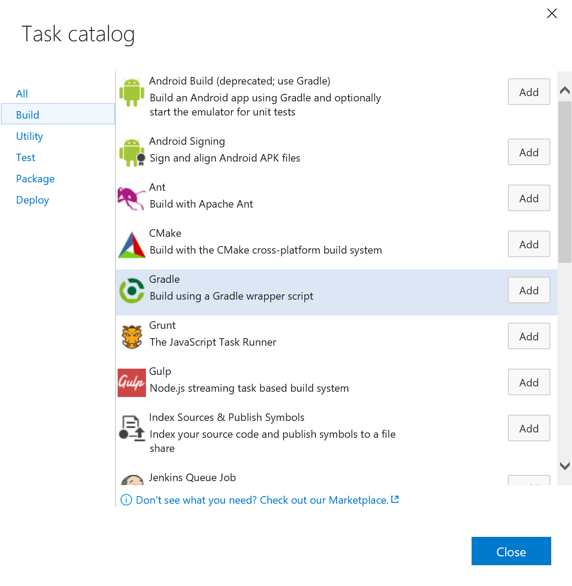

    Configure the step **Tasks** to `war`, and uncheck the checkbox for 
    "Publish to TFS/Team Services" in the Junit Test Results box.

    Also click the pencil icon to name this build step to **Java DevCamp build**

    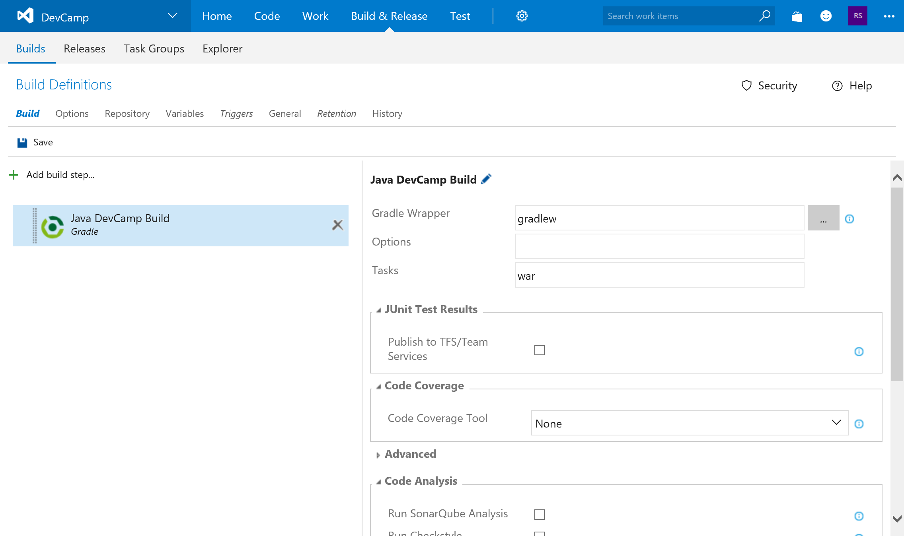

1. Add a Build Step for **Copy Files**, found under the left-hand filter for **Utility**

    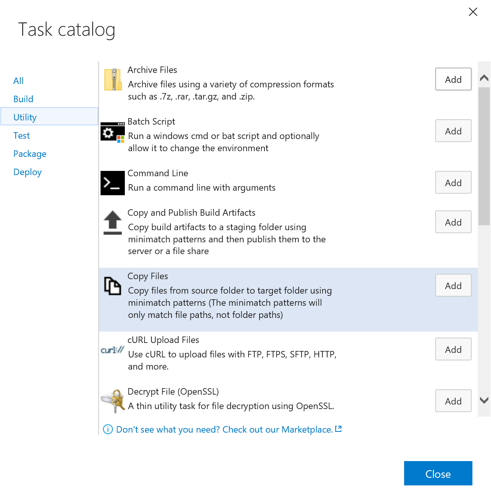

    In configuration boxes, we can use variables in addition to string 
    literals.   

    Configure **Source Folder** for `$(build.sourcedirectory)`, 
    **Contents** for `**/*.war`,
    **Target Folder** for `$(build.artifactstagingdirectory)/website` 
    and name the step **Copy WAR file**

    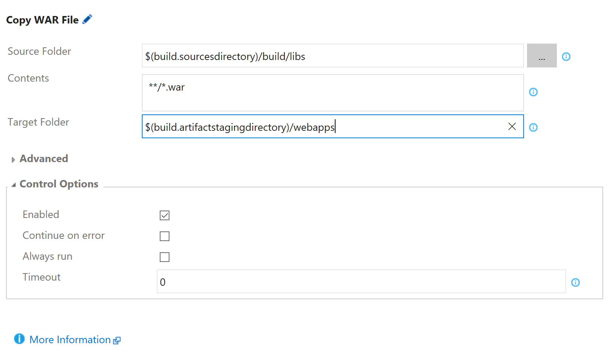
 

1. Add a Build Step for **Archive**

    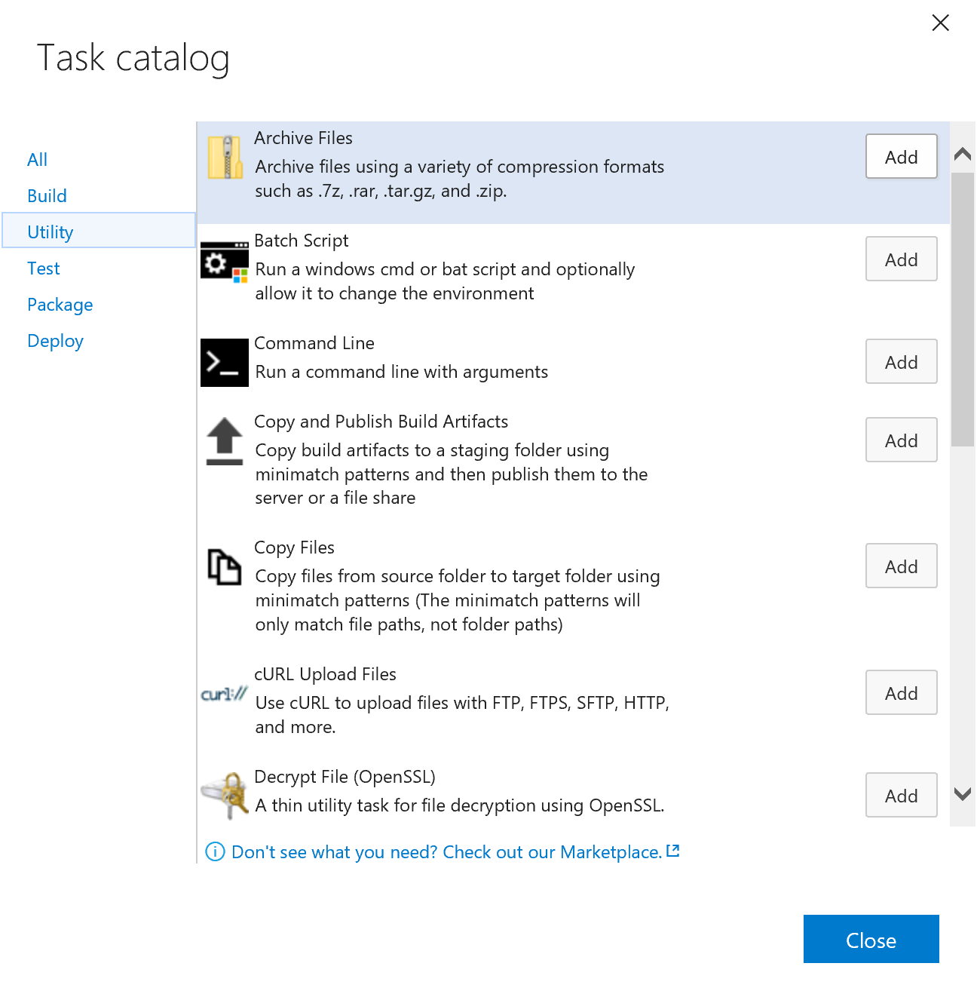

    For **Root Folder* insert `$(build.artifactstagingdirectory)`.

    For **Archive file to create** insert 
    `$(Build.ArtifactStagingDirectory)/$(Build.BuildId).zip`. 
    This will dynamically name our zip file of code with the build number.

    Uncheck the box for **Prefix root folder name to archive paths** to 
    avoid an unnecessary nesting within the .zip file.

    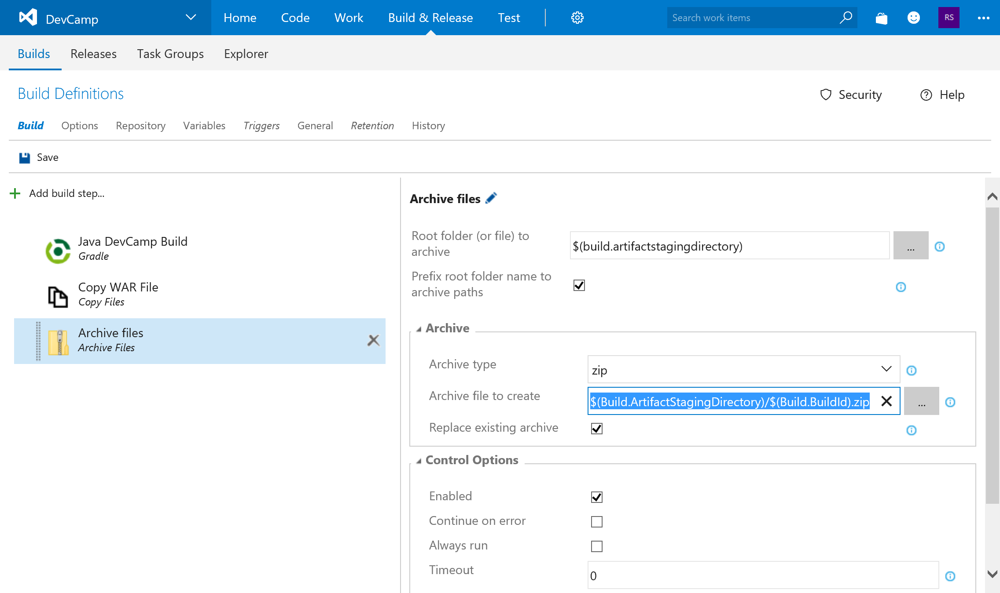

    > You can define your own variables to use throughout the Build and Release pipelines by clicking **Variables** in the Build Definition's sub-navigation. Also see [here](https://www.visualstudio.com/docs/build/define/variables) for all pre-defined variables available 

[TODO: RWS finish from here on down]
1. Finally, create a Build Step for **Publish Build Artifacts**.  This step outputs a file(s) from our Build Definition as a special "artifact" that can be used in VSTS' Release Definitions.

    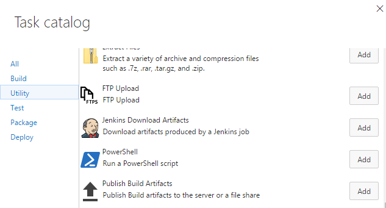

    Configure **Path to Publish** as `$(Build.SourcesDirectory)/archive/$(Build.BuildId).zip` to target the zip file created in the previous Build Step.

    For **Artifact Name** enter `drop`

    Set **Artifact Type** to `Server`

    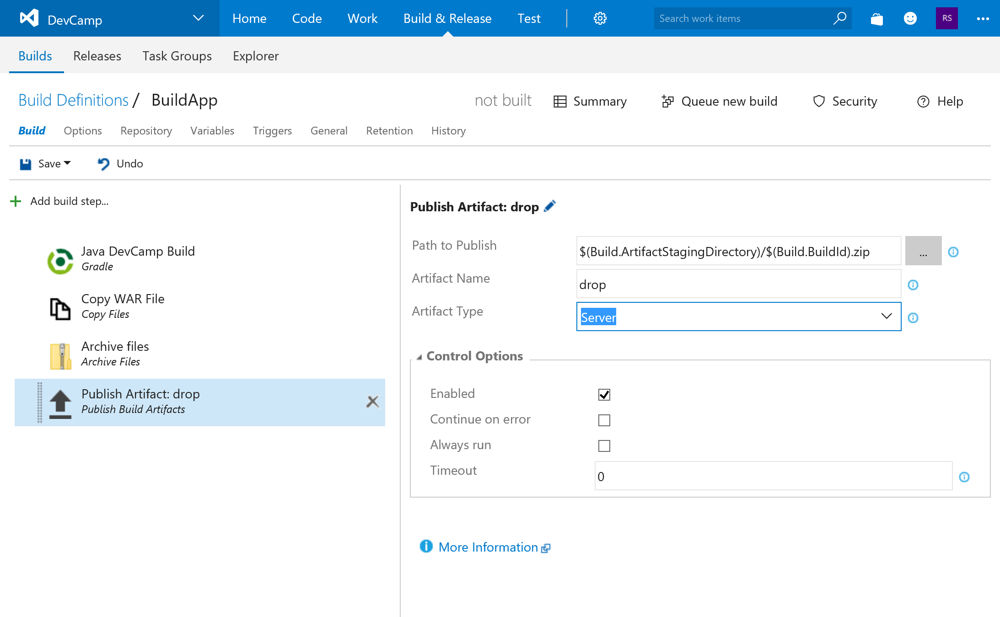

1. Save your Build Definition named **BuildApp**

    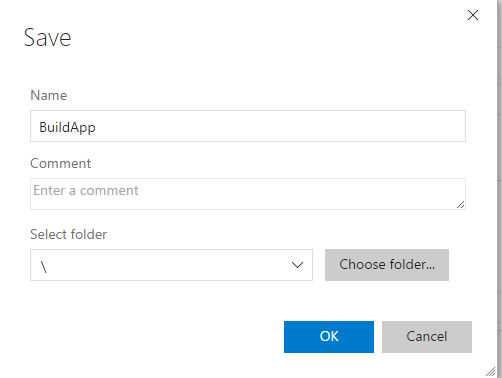

1. Our saved Build Definition is ready to be processed by the Hosted Build Agent.  Click **Queue New Build** to start the build process. 

    

    Accept the defaults and click **OK**

    

    Your Build will then be queued until the Hosted Build Agent can pick it up for processing.  This typically lasts less than 60 seconds to begin.

1. Once your Build completes, click each step on the left navigation bar and inspect the output.  For **Echo Node Version** we can see the agent's version in the right **Logs** pane

    

1. Let's inspect the output artifacts that were published.  Click the **Build 213** header in the left pane to view the build's landing page.  Then select **Artifacts** from the horizontal toolbar, and **Download** the **drop** artifact.

    

1. Unzip `drop.zip` to see our files (including the restored `node_modules` folder).  This artifact will be deployed to an Azure Web App in a later lab.

    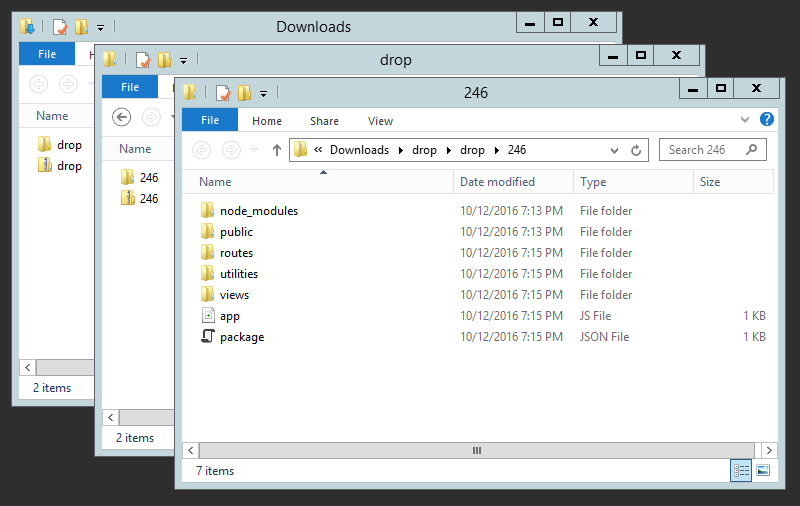

We not have a Build Definition that will construct our NodeJS application and package it for deployment anytime code is checked into the repository, or a manual build is queued. 

## Summary

In this hands-on lab, you learned how to:
* Create a Visual Studio Team Services online account
* Create a VSTS Git repository
* Add your code to the VSTS Git repository
* Create a Continuous Integration pipeline

Copyright 2016 Microsoft Corporation. All rights reserved. Except where otherwise noted, these materials are licensed under the terms of the MIT License. You may use them according to the license as is most appropriate for your project. The terms of this license can be found at https://opensource.org/licenses/MIT.