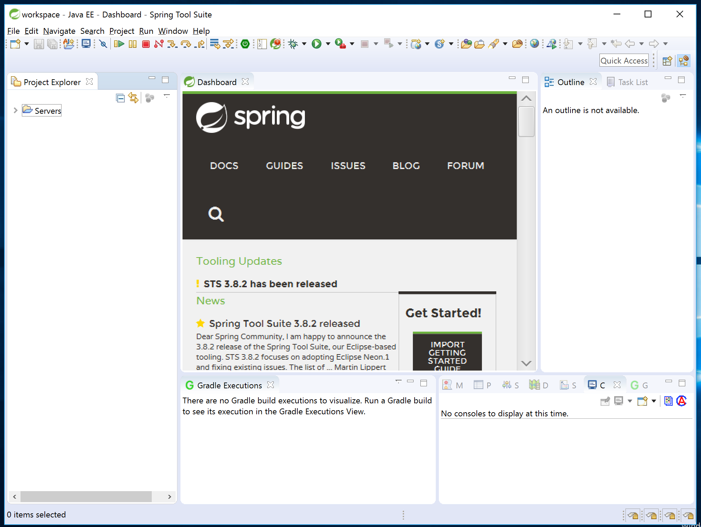
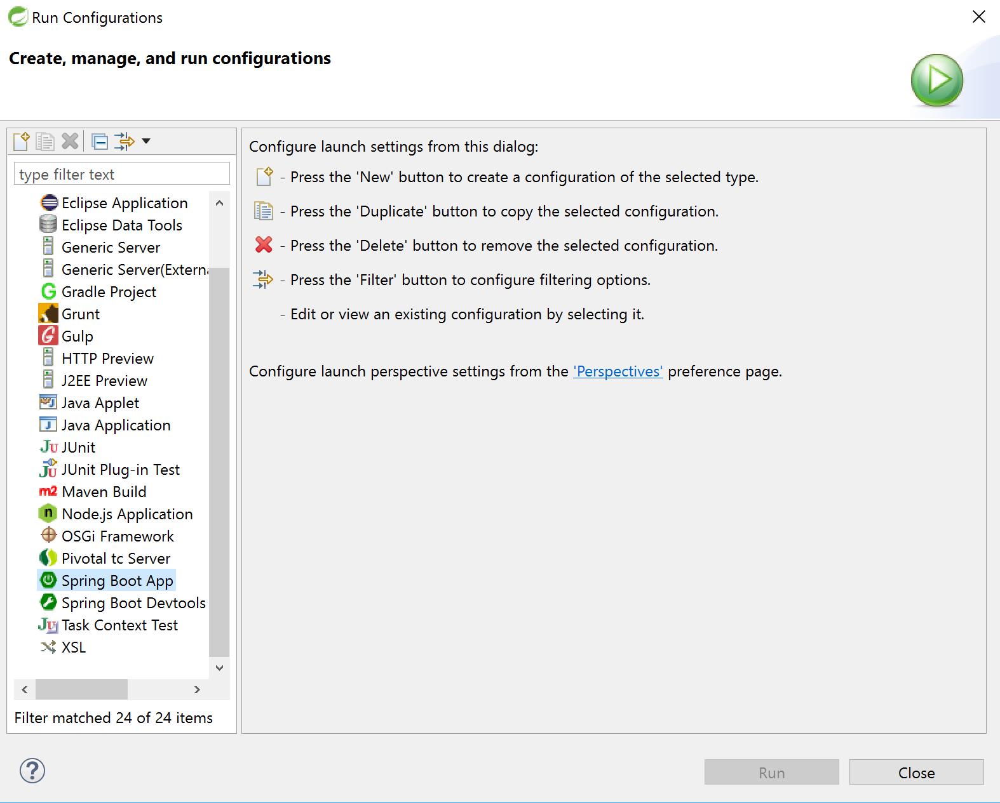
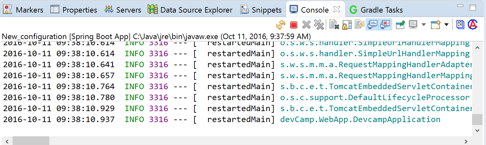
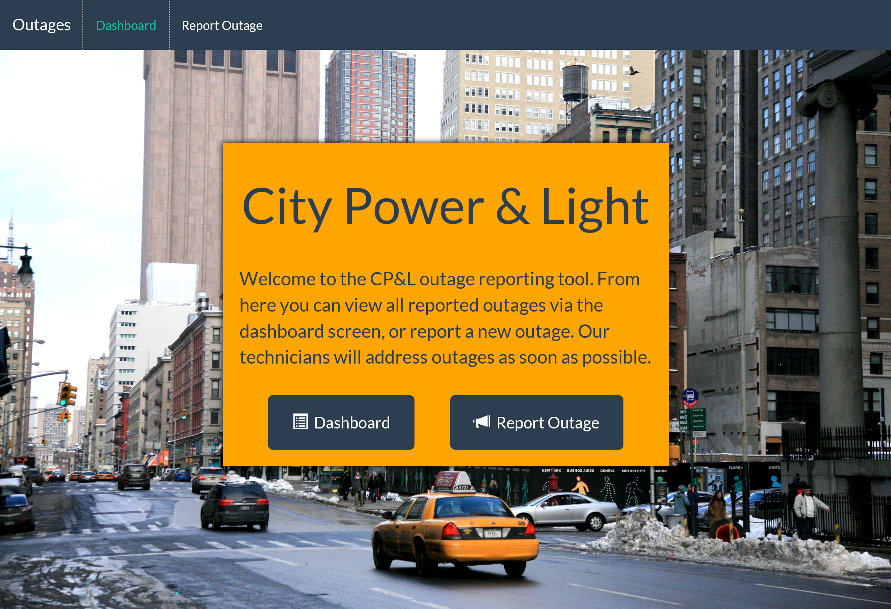
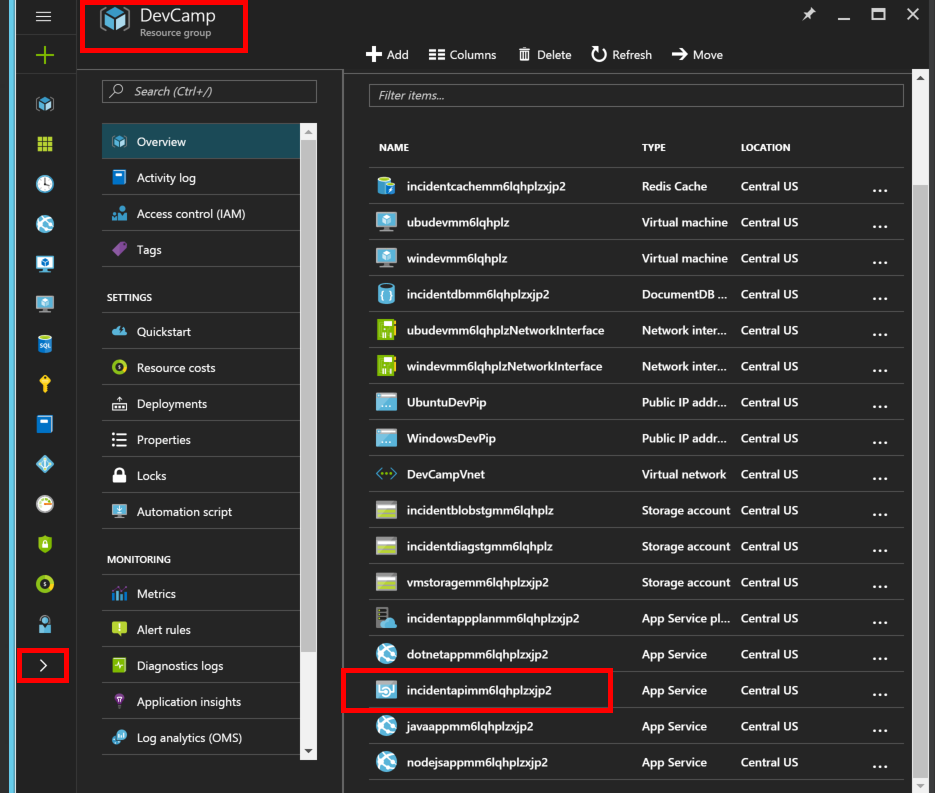
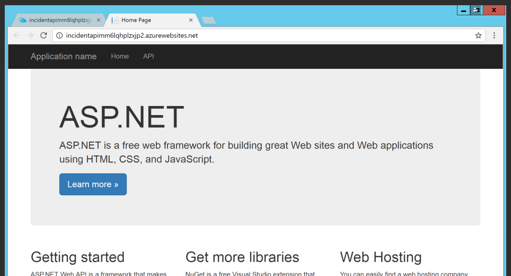
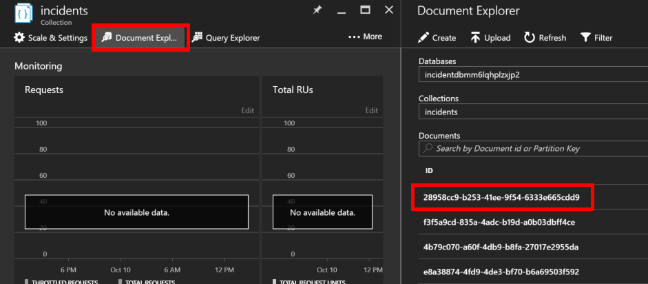
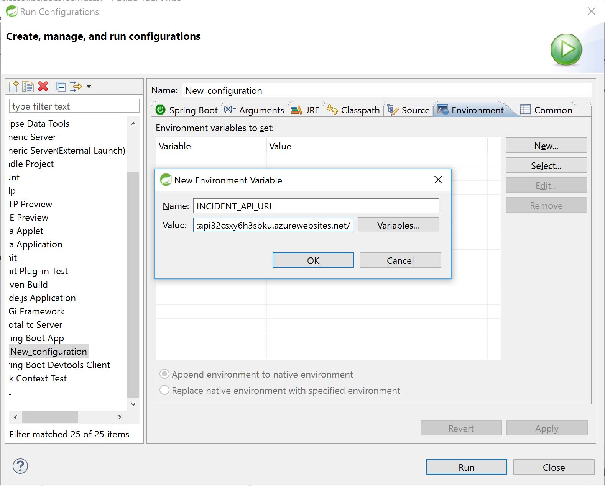
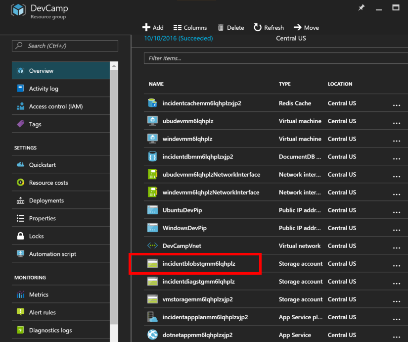
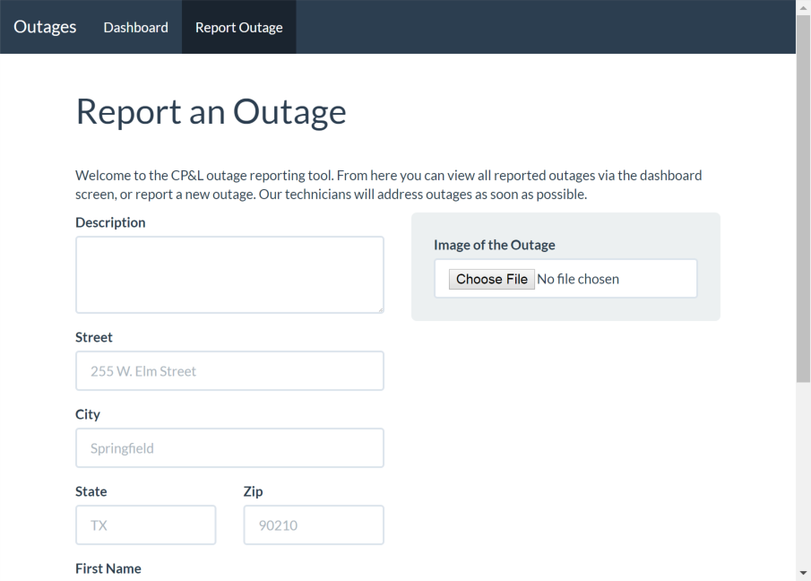

# Hands on Lab - Modern Applications (Java)

## Overview

City Power & Light is a sample application that allows citizens to to report "incidents" that have occured in their community.  It includes a landing screen, a dashboard, and a form for reporting new incidents with an optional photo.  The application is implemented with several components:

* Front end web application contains the user interface and business logic.  This component has been implemented three times in .NET, NodeJS, and Java.
* WebAPI is shared across the front ends and exposes the backend DocumentDB
* DocumentDB is used as the data persistence layer

In this lab, you will work with an existing API to connect to the web application front end. This will allow you perform CRUD operations for incidents. You will also configure additional Azure features for Redis Cache, Azure Storage Queues, and Azure Blob Storage.

> This guide uses [Eclipse STS](https://spring.io/tools) for editing, however please feel free to use your editor of choice.

## Objectives

In this hands-on lab, you will learn how to:

* Use Eclipse to connect to an API
* Deploy the application to an Azure Web App
* Modify a view to add caching
* Modify code to add queuing and blob storage

## Prerequisites

* The source for the starter app is located in the HOL\node\modern-cloud-apps\start folder.
* The finished project is located in the HOL\node\modern-cloud-apps\end folder.
* Deployed the starter ARM Template

## Exercises

This hands-on-lab has the following exercises:

* Exercise 1: Integrate the API
* Exercise 2: Add a caching layer
* Exercise 3: Write images to Azure Blob storage

## Exercise 1: Integrate the API

1. Download or `git clone` the source files to your local machine

1. Navigate to the `HOL\node\modern-cloud-apps\start` folder in a terminal window

1. Run `gradle eclipse` to restore all dependencies and configure the
   project paths for Eclipse

    

1. Once package restoration completes, open Eclipse STS and Import the  **start** folder

    

1. Let's run the application in Debug Mode.  Click the Debug icon on
   the top toolbar, then select "Debug Configurations...".

    

   Click on "Spring Boot App" and click the + icon in the top left to create a
   new run configuration.  Choose the Start project,
   devCamp.WebApp.DevcampApplication for the main type.

    

   Click "Apply" and "Run".  In the console pane you should see
   something like this:

    

1. Open a browser and navigate to `http://localhost:8080`. You should now see the running application

    

1. On the Dashboard page, notice how the incidents are stubbed in.

    

    As part of the original ARM template we deployed an ASP.NET WebAPI that queries a DocumentDB Collection. Let's integrate that API so that the incidents are dynamically pulled from a data store.

1. In the [Azure Portal](https://portal.azure.com) navigate to the resource group that you created with the original ARM template.  Resource Groups can be found on the left hand toolbar -> More Services -> Resource Groups.

    Select the API app that begins with the name **incidentsapi** followed by a random string of characters.

    

1. The window that slides out is called a **blade** and contains information and configuration options for the resource.

    On the top toolbar, select **Browse** to open the API in a new browser window.

    

    You should be greeted by the default ASP.NET landing page. Capture
    the URL in notepad or other text editor.
    

1. Since we provisioned a new instance of DocumentDB, there are not any records to use as sample data.  To generate sample data, our API has a route that can be hit at any time to reset the documents in our collection.  In the browser, add `/incidents/sampledata` to your API's URL to generate sample documents.

1. After navigating to the sampledata route, let's verify that the documents were created in DocumentDB. In the Azure Portal, navigate to the Resource Group blade and select the DocumentDB resource.

    

    Select the one database, and then select the **incidents** collection.

    

    In the Collection blade, select **Document Explorer** from the top toolbar.

    

    The Document Explorer is an easy way to view the documents inside of a collection via the browser. Select the first record to see the JSON body of the document.

    

    We can see that several incidents have been created and are now available to the API.

1. Back in Eclipse, let's begin integrating the API into our code.  We will need to query the API's endpoint URL, and we have options of where to store that string.  While we could insert it directly into our code, a better practice is to abstract such a configuration setting into an environment variable.

    Stop the debugger by pressing the red "stop" square, and open the
    run configuration you created earlier.  Click the "Environment"
    tab.  This section defines key/value pairs that will be passed
    into enviromment variables whenever the debugger is launched. Add
    an entry for `INCIDENT_API_URL` and set the value to the ASP.NET
    WebAPI that we earlier loaded into the browser (and captured in
    notepad). Do not add a trailing slash. Click OK to save the
    environment variable, then apply and close.

    

    Now that the URL is loaded as an environment variable, we can
    access it from our application by calling System.getenv("INCIDENT_API_URL")`.  We will repeat this process several times to configure our application with Azure services.

    > Our ARM Template already configured an environment variable for the Azure Web App that will soon run our application

1. Several components will work together to call and display the
   incidents in the database.  First we will need an object to hold
   the data associated with each incident.  We've supplied that object
   in devCamp.WebApp.IncidentAPIClient.Models.IncedentBean.Java.  Open
   that file and look at the properties and methods.

1. Create the class devCamp.WebApp.IncidentAPIClient.IncidentAPIClient.java with the
   following code:

    ```java
    package devCamp.WebApp.IncidentAPIClient;

    import java.util.List;

    import org.apache.commons.logging.Log;
    import org.apache.commons.logging.LogFactory;
    import org.springframework.cache.annotation.CacheEvict;
    import org.springframework.core.ParameterizedTypeReference;
    import org.springframework.http.HttpMethod;
    import org.springframework.http.ResponseEntity;
    import org.springframework.http.converter.StringHttpMessageConverter;
    import org.springframework.http.converter.json.MappingJackson2HttpMessageConverter;
    import org.springframework.web.client.RestTemplate;

    import devCamp.WebApp.IncidentAPIClient.Models.IncidentBean;

    public class IncidentAPIClient {
        private Log log = LogFactory.getLog(IncidentAPIClient.class);
        private String baseURI;

        public String getBaseURI() {
            return baseURI;
        }

        public void setBaseURI(String baseURI) {
            this.baseURI = baseURI;
        }

        public IncidentBean CreateIncident(IncidentBean incident) {
            //call REST API to create the incident
            final String uri = baseURI+"/incidents";
            RestTemplate restTemplate = new RestTemplate();
            restTemplate.getMessageConverters().add(new MappingJackson2HttpMessageConverter());
            restTemplate.getMessageConverters().add(new StringHttpMessageConverter());
            
            IncidentBean createdBean = restTemplate.postForObject(uri, incident, IncidentBean.class);
            return createdBean;
        }

        public List<IncidentBean> GetAllIncidents() {
            log.info("Performing get /incidents web service");
            final String uri = baseURI+"/incidents";
            RestTemplate restTemplate = new RestTemplate();

            ResponseEntity<List<IncidentBean>> IncidentResponse =
                    restTemplate.exchange(uri,
                                HttpMethod.GET, null, new ParameterizedTypeReference<List<IncidentBean>>() {
                        });

            return IncidentResponse.getBody();
        }

        public IncidentBean GetById(String incidentId) {
                //call REST API to create the incident
                final String uri = String.format("%s/incidents/%s", baseURI,incidentId);
                RestTemplate restTemplate = new RestTemplate();
                restTemplate.getMessageConverters().add(new MappingJackson2HttpMessageConverter());
                restTemplate.getMessageConverters().add(new StringHttpMessageConverter());
                
                IncidentBean retval = restTemplate.getForObject(uri, IncidentBean.class);
                
                return retval;		
            }
        
            public IncidentBean UpdateIncident(String incidentId,IncidentBean newIncident){
                //call REST API to create the incident
                final String uri = baseURI+"/incidents";
                RestTemplate restTemplate = new RestTemplate();
                restTemplate.getMessageConverters().add(new MappingJackson2HttpMessageConverter());
                restTemplate.getMessageConverters().add(new StringHttpMessageConverter());
                
                IncidentBean retval = null;
                return retval;		
            }
            
        public IncidentAPIClient(String baseURI) {
            if (baseURI == null){
                //throw argument null exception
            }
            this.baseURI = baseURI;

        }
    }

    ```

    This class uses the
    [RestTemplate](http://docs.spring.io/spring/docs/current/javadoc-api/org/springframework/web/client/RestTemplate.html) library
    to generate a HTTP GET to the API endpoint, and to convert the
    return javascript into a java object.  In this case, we've
    specified that it should return a `List<IncidentBean>`.

1.  Next, create an object to create an IncidentAPIClient with the
    proper URI. Create the class devCamp.WebApp.Utils.IncidentAPIClient:

    ```java
    package devCamp.WebApp.Utils;

    import devCamp.WebApp.IncidentAPIClient.IncidentAPIClient;

    public class IncidentAPIHelper {
        public static IncidentAPIClient getIncidentAPIClient() {

            String apiurl= System.getenv("INCIDENT_API_URL");
            return new IncidentAPIClient(apiurl);
        }
    }
    ```

1. Open DevCamp.WebApp.Controllers.java. In the dashboard function,
    comment out this section of code that generated the dummy
    dashboard data:

    ```java
    ArrayList<IncidentBean> theList = new ArrayList<>();
    for (int i = 1;i<=3;++i){
        IncidentBean bean = new IncidentBean();
        bean.setId("12345");
        bean.setStreet("123 Main St.");
        bean.setFirstName("Jane");
        bean.setLastName("Doe");
        bean.setCreated("1/01/2016");
        theList.add(bean);
    }
    ```

    Insert this code to call the GetAllIncidents API and put the
    resulting list of IncidentBean in the model.

    ```java
    IncidentAPIClient client = IncidentApiHelper.getIncidentAPIClient();
    ArrayList<IncidentBean> theList = client.GetAllIncidents();
    model.addAttribute("allIncidents",theList);
    ```

    Before we test this code, open the HTML template for the dashboard
    page, located in
    src/main/resources/templates/Dashboard/index.html. The following
    section loops through all of the incidents in the allIncidents
    object in the model, and formats them nicely for the display.

    ```HTML
    <div th:each="incident : ${allIncidents}">
        <div class="col-sm-4">

            <div class="panel panel-default">
                <div class="panel-heading">
                    Outage <span th:text="${incident.Id}"></span>
                </div>
                <table class="table">
                    <tr>
                        <th>Address</th>
                        <td><span th:text="${incident.Street}"></span></td>
                    </tr>
                    <tr>
                        <th>Contact</th>
                        <td><a href="tel:14174444444"><span
                                th:text="${incident.FirstName}"></span> <span
                                th:text="${incident.LastName}"></span></a></td>
                    </tr>
                    <tr>
                        <th>Reported</th>
                        <td><span th:text="${incident.Created}"></span></td>
                    </tr>
                </table>
            </div>
        </div>
    </div>
    ```

1. Run the application via the Debug Tab in Eclipse and check the
   dashboard page at http://localhost:8080/dashboard.

    

The cards now represent data returned from our API, replacing the static mockup code.

## Exercise 2: Add a caching layer
Querying our API is a big step forward, but querying a cache would increase 
performance and limit the load on our API.  Azure offers a managed (PaaS) 
service called [Azure Redis Cache](https://azure.microsoft.com/en-us/services/cache/).

We deployed an instance of Azure Redis Cache in the ARM Template, but
need to add application logic. Spring has great support for caching,
and can easily use Azure Redis Cache to hold the data.


1. First, let's add our Redis information to local environment variables. In the [Azure Portal](https://portal.azure.com) navigate to the Resource Group and select the Redis instance.

    

    On the Redis blade, note the **Host Name**, then select the **key icon** and note the **Primary Key**.

    

    On the Redis blade, expand **Ports* and note the Non-SSL port 6379 and SSL Port of 6380.

    

    In Eclipse open the run configuration, click the environment tab
    and add four variables for `REDISCACHE_HOSTNAME`,
    `REDISCACHE_PRIMARY_KEY`, `REDISCACHE_PORT`, and
    `REDISCACHE_SSLPORT`.  Click apply and close.

    We will use these variables to configure a Redis client.

1. To add caching support to your Spring application, open the build.gradle
   file and add the following entries under dependencies:
   ```java
    compile("javax.cache:cache-api")
    compile('org.springframework.data:spring-data-redis')
    compile('redis.clients:jedis')
    compile('org.springframework.boot:spring-boot-starter-cache')
    ```

    To make sure that Eclipse knows about the new packages we added to
    the buld, run the `ide/eclipse` gradle task in the `gradle tasks`
    window. Then right-click on the project in the project explorer,
    close the project, and then open it again.

    In Spring, you can apply caching to a Spring
   [Service](http://docs.spring.io/spring-framework/docs/current/javadoc-api/org/springframework/stereotype/Service.html). 
   We need to create a Java class for this service, so create a new Java class named 
   `devCamp.WebApp.IncidentAPIClient.IncidentService.java` with this
   code:

   ```java

    package devCamp.WebApp.IncidentAPIClient;

    import java.util.List;

    import org.apache.commons.logging.Log;
    import org.apache.commons.logging.LogFactory;
    import org.springframework.cache.annotation.CacheEvict;
    import org.springframework.cache.annotation.Cacheable;
    import org.springframework.stereotype.Service;

    import devCamp.WebApp.IncidentAPIClient.Models.IncidentBean;
    import devCamp.WebApp.Utils.IncidentApiHelper;

    @Service
    public class IncidentService {

        private Log log = LogFactory.getLog(IncidentService.class);

        @Cacheable("incidents")
        public List<IncidentBean> GetAllIncidents() {
            IncidentAPIClient client = IncidentApiHelper.getIncidentAPIClient();
            return client.GetAllIncidents();
        }

        @CacheEvict(cacheNames="incidents", allEntries=true)
        public IncidentBean CreateIncident(IncidentBean incident) {
            return IncidentApiHelper.getIncidentAPIClient().CreateIncident(incident);		
        }
        
        @CacheEvict(cacheNames="incidents", allEntries=true)
        public IncidentBean UpdateIncident(String incidentId,IncidentBean newIncident){
            return IncidentApiHelper.getIncidentAPIClient().UpdateIncident(incidentId,newIncident);
        }
        
        public IncidentBean GetById(String incidentId) {
            return IncidentApiHelper.getIncidentAPIClient().GetById(incidentId);		
        }

        @CacheEvict(cacheNames="incidents", allEntries=true)
        public void ClearCache() {
        }
        
    }
   ```

    The `@Service` annotation tells Spring that this is a service
    class, and the `@Cacheable` annotation tells spring that the
    result of the GetAllIncidents is cachable and will automatically
    use the cached version if available.

    The `@CacheEvict` annotation on the other API calls tells Spring to clear the cache 
    when those functions are called; these are the ones that make changes to the Incident database.

    We still have to configure Spring caching to use Azure Redis
    Cache. To do this, create a new class
    devCamp.WebApp.CacheConfig.java with this code:

    ```java
    package devCamp.WebApp;

    import java.util.Arrays;
    import org.apache.commons.logging.Log;
    import org.apache.commons.logging.LogFactory;
    import org.springframework.cache.CacheManager;
    import org.springframework.cache.annotation.CachingConfigurerSupport;
    import org.springframework.cache.annotation.EnableCaching;
    import org.springframework.context.annotation.Bean;
    import org.springframework.context.annotation.Configuration;
    import org.springframework.data.redis.cache.RedisCacheManager;
    import org.springframework.data.redis.connection.RedisConnection;
    import org.springframework.data.redis.connection.RedisConnectionFactory;
    import org.springframework.data.redis.connection.jedis.JedisConnectionFactory;
    import org.springframework.data.redis.core.RedisTemplate;

    import redis.clients.jedis.JedisPoolConfig;

    @Configuration
    @EnableCaching
    public class CacheConfig extends CachingConfigurerSupport {
        private Log log = LogFactory.getLog(CacheConfig.class);

        @Bean
        public JedisConnectionFactory redisConnectionFactory() {
                JedisPoolConfig poolConfig = new JedisPoolConfig();
                poolConfig.setMaxTotal(5);
                poolConfig.setTestOnBorrow(true);
                poolConfig.setTestOnReturn(true);
                JedisConnectionFactory ob = new JedisConnectionFactory(poolConfig);
                ob.setUsePool(true);
                String redishost = System.getenv("REDISCACHE_HOSTNAME");
                log.info("REDISCACHE_HOSTNAME="+redishost);
                ob.setHostName(redishost);
                String redisport = System.getenv("REDISCACHE_PORT");
                log.info("REDISCACHE_PORT="+redisport);
                try {
                    ob.setPort(Integer.parseInt(  redisport));
                } catch (NumberFormatException e1) {
                    // if the port is not in the ENV, use the default
                    ob.setPort(6379);
                }
                String rediskey = System.getenv("REDISCACHE_PRIMARY_KEY");
                log.info("REDISCACHE_PRIMARY_KEY="+rediskey);
                ob.setPassword(rediskey);
                ob.afterPropertiesSet();
                RedisTemplate<Object,Object> tmp = new RedisTemplate<>();
                tmp.setConnectionFactory(ob);

                //make sure redis connection is working
                try {
                    String msg = tmp.getConnectionFactory().getConnection().ping();
                    log.info("redis ping response="+msg);
                } catch (Exception e) {
                    // TODO Auto-generated catch block
                    e.printStackTrace();
                }
                return ob;
            }

        @Bean(name="redisTemplate")
        public RedisTemplate<String, String> redisTemplate(RedisConnectionFactory cf) {
            RedisTemplate<String, String> redisTemplate = new RedisTemplate<String, String>();
            redisTemplate.setConnectionFactory(cf);
            return redisTemplate;
        }

        @Bean
        public CacheManager cacheManager() {
            RedisCacheManager manager =new RedisCacheManager(redisTemplate(redisConnectionFactory()));
            manager.setDefaultExpiration(300);
            return manager;
        }
    }
    ```

    There is a lot going on in this class.  The `@Configuration`
    annotation tells Spring that this class declares one or more beans
    that will generate bean and service definitions.  The
    `@EnableCaching` annotation enables Spring's annotation driving
    caching mechanism for the application.

    The `CacheConfig` class contains beans that will configure the
    annotation driven caching. The `redisConnectionFactory` function
    creates a new `JedisConnectionFactory` with the appropriate
    connection to the Azure Redis cache. It also does a test to make
    sure it is properly communicating with the cache.

    The `cacheManager` function configures Spring to use the
    redisConnectionFactory function to connect to the cache.  It also
    configures the default cache expiration time to 300 seconds.

    All application requests for the dashboard will now first try to
    use Azure Redis Cache. Under high traffic, this will improve page
    performance and decrease the API's scaling needs.

1. Change the `devCamp.WebApp.Controllers.DashboardController.java`
class to use the IncidentService rather than the IncidentAPIClient
directly. To do this add these lines inside the DashboardController class:

    ```java
    @Autowired
    IncidentService service;
    ```

    Also, change these two lines:
    ```java
    IncidentAPIClient client = IncidentApiHelper.getIncidentAPIClient();
    ArrayList<IncidentBean> theList = client.GetAllIncidents();
    ```
    to this:

    ```java
    List<IncidentBean> theList = service.GetAllIncidents();
    ```

    You will also have to make sure the IncidentService is imported
    for the class.

1. To test the application using the Azure Redis Cache, note that in
   the IncidentAPIClient class, the `GetAllincidents` function has
   this code at the top:

   ```java
    log.info("Performing get /incidents web service");
   ```

   This will print a log message every time the API is called. Start
   the application and in your browser go to
   `http://localhost:8080/dashboard`. Look at your console out window
   in Eclipse, it should end with a line that says

   ```
   Performing get /incidents web service
   ```

If you refresh your page in the browser, you should not get another
   log message, since the actual API code will not be called for 300 seconds.


## Exercise 3: Write images to Azure Blob Storage

When a new incident is reported, the user can attach a photo.  In this exercise we will process that image and upload it into an Azure Blob Storage Container.

1. The [Azure Storage SDK](https://github.com/Azure/azure-storage-java) 
    makes it easy to access Azure storage from within Azure applicatons.
    First, lets establish environment variables that we can use in the applicaiton
    for configuration.  To get the necessary values, open the [Azure Portal](https://portal.azrue.com) and open the Resource Group.  Select the Storage Account beginning with `incidentblobstg`.

    > The other storage accounts are used for diagnostics data and virtual machine disks

    

    Select **Access Keys** and note the **key1** for the storage account.

    

     In Eclipse open the run configuration, click the environment tab
    and add the following environment variables:
    * `AZURE_STORAGE_ACCOUNT` is the name of the Azure Storage Account resource
    * `AZURE_STORAGE_ACCESS_KEY` is **key1** from the Access Keys blade
    * `AZURE_STORAGE_BLOB_CONTAINER` is the name of the container that will be used. Storage Accounts use containres to group sets of blobs together.  For this demo let's use `images` as the Container name

    Add the following lines to the dependencies in build.gradle:
    ```java
    compile('com.microsoft.azure:azure-storage:4.4.0')
    compile('com.microsoft.azure:azure-svc-mgmt-storage:0.9.5')
    ```

    Run the `ide/eclipse` gradle task in the `gradle tasks`
    window. Then right-click on the project in the project explorer,
    close the project, and then open it again.

1. Today we are working with Azure Storage Blobs, but in the future we may 
decide to extend our application use Azure Stage Tables or Azure Storage 
Queues.  To better organize our code, let's create a storage interaction 
class.  Create `devCamp.WebApp.StorageAPIClient.StorageAPIClient.java` and 
paste in the following code: 

    ```java
    package devCamp.WebApp.StorageAPIClient;

    import org.apache.commons.io.FilenameUtils;
    import org.codehaus.jettison.json.JSONException;
    import org.codehaus.jettison.json.JSONObject;
    import org.springframework.web.multipart.MultipartFile;
    import com.microsoft.azure.storage.*;
    import com.microsoft.azure.storage.blob.*;
    import com.microsoft.azure.storage.queue.CloudQueue;
    import com.microsoft.azure.storage.queue.CloudQueueClient;
    import com.microsoft.azure.storage.queue.CloudQueueMessage;

    import java.io.*;
    import java.net.URISyntaxException;
    import java.security.InvalidKeyException;

    import javax.ws.rs.core.UriBuilder;

    public class StorageAPIClient {

        //configuration values from the system Environment
        private String account;
        private String key;
        private String azureStorageContainer;
        private String azureStorageQueue;
        private String blobStorageConnectionString;
        
        public StorageAPIClient(String account, String key, String azureStorageContainer, String azureStorageQueue) {
            this.account = account;
            this.key = key;
            this.azureStorageContainer = azureStorageContainer;
            this.azureStorageQueue = azureStorageQueue;
            blobStorageConnectionString = String.format("DefaultEndpointsProtocol=http;AccountName=%s;AccountKey=%s", account,key);
        }

        public  String UploadFileToBlobStorage(String IncidentId, MultipartFile imageFile){
            CloudStorageAccount account;
            try {
                account = CloudStorageAccount.parse(blobStorageConnectionString);
                CloudBlobClient serviceClient = account.createCloudBlobClient();

                // Container name must be lower case.
                CloudBlobContainer container = serviceClient.getContainerReference(azureStorageContainer);
                container.createIfNotExists();

                // Set anonymous access on the container.
                BlobContainerPermissions containerPermissions = new BlobContainerPermissions();
                containerPermissions.setPublicAccess(BlobContainerPublicAccessType.CONTAINER);
                container.uploadPermissions(containerPermissions);

                // 
                CloudBlockBlob imgBlob = container.getBlockBlobReference(getIncidentBlobFilename(IncidentId,imageFile.getOriginalFilename()));
                imgBlob.getProperties().setContentType(imageFile.getContentType());
                imgBlob.upload(imageFile.getInputStream(),imageFile.getSize());
                UriBuilder builder = UriBuilder.fromUri(imgBlob.getUri());
                builder.scheme("https");
                return builder.toString();
            } catch (InvalidKeyException | URISyntaxException | StorageException | IOException e) {
                // TODO Auto-generated catch block
                e.printStackTrace();
            } 
            return null;
        }

        private String getIncidentBlobFilename(String IncidentId,String FileName) {
            String fileExt = FilenameUtils.getExtension(FileName);
            // TODO check this against the .NET code - 
            //	with this code in, we're generating filenames that don't have a period between the incident id and the extension 
    //		if (fileExt.startsWith(".")){
    //			fileExt = fileExt.substring(1);
    //		}
            return String.format("%s%s", IncidentId,fileExt);
        }
    }


    ```

1. Next lets create a configuration class to handle retrieving the 
environment variables and creating a StorageAPIClient. Create 
`devCamp.WebApp.Utils.StorageAPIHelper.java` and paste in the following code:
    ```java
    package devCamp.WebApp.Utils;

    import devCamp.WebApp.StorageAPIClient.StorageAPIClient;

    public class StorageAPIHelper {

    public static StorageAPIClient getIncidentAPIClient() {

        String account = System.getenv("AZURE_STORAGE_ACCOUNT");;
        String key = System.getenv("AZURE_STORAGE_ACCESS_KEY");;
        String queue = System.getenv("AZURE_STORAGE_QUEUE");
        String container = System.getenv("AZURE_STORAGE_BLOB_CONTAINER");
        
        return new StorageAPIClient(account, key,queue,container);	
    }
    }

    ```

1. Now lets arrange for the controller that manages new incidents to call the Storage API.  Open up 
`devCamp.WebApp.ControllersIncidentController.java. :


1. With the utility created, let's update `routes/new.js` to handle new incidents:

    ```javascript
    var fs = require('fs');
    var express = require('express');
    var router = express.Router();
    var request = require('request');
    var formidable = require('formidable');
    var storageUtility = require('../utilities/storage');

    /* GET new outage */
    router.get('/', function (req, res) {
        res.render('new', {
            title: 'Report an Outage'
        });
    });

    /* POST new outage */
    router.post('/', function (req, res) {

        // Parse a form submission with formidable
        var form = new formidable.IncomingForm();
        form.parse(req, (err, fields, files) => {

            // Process the fields into a new incident, upload image, and add thumbnail queue message
            createIncident(fields, files)
                .then(uploadImage)
                .then(() => {

                    // Successfully processed form upload
                    // Redirect to dashboard
                    res.redirect('/dashboard');

                });

        });

    });

    function createIncident(fields, files) {

        return new Promise(function (resolve, reject) {

            // Build request object
            var incident = {
                "Description": fields.description,
                "Street": fields.addressStreet,
                "City": fields.addressCity,
                "State": fields.addressState,
                "ZipCode": fields.addressZip,
                "FirstName": fields.firstName,
                "LastName": fields.lastName,
                "PhoneNumber": fields.phone,
                "OutageType": "Outage",
                "IsEmergency": (fields.emergency === "on") ? true : false
            };

            // Get API URL from environment variable
            var apiUrl = `${process.env.INCIDENT_API_URL}/incidents`;

            // POST new incident to API
            request.post(apiUrl, { form: incident, json: true }, function (error, results) {

                // Successfully created a new incident
                console.log('Created incident');

                var incidentId = results.body.id;
                resolve([incidentId, files]);

            });

        });

    }

    function uploadImage(input) {

        return new Promise(function (resolve, reject) {

            // Check if no image was uploaded
            if (input[1].image.size === 0) {
                console.log('No image uploaded');
                resolve();
            }
            else {

                // Use the storage utility to upload a blob to Azure Storage
                storageUtility.uploadBlob(input).then(function (blob) {
                    console.log('Image uploaded');
                    resolve(blob);
                });

            }

        });

    }

    module.exports = router;
    ```

    When a new incident comes in, the Formidable library parses the data fields and image. Fields get POSTed to our Incidents API, while the image is uploaded to Blob Storage.

1. Open a browser window and navigate to `http://localhost:3000/new`.  Fill out the form and hit the **Submit** button.

    

    You should be redirected to the Dashboard screen.

    > It may take up to 60 seconds to see your new entry due to the cache

2. In the Microsoft Azure Storage Explorer, navigate to your Storage Account and ensure that the blob was created.

    

Our application can now create new incidents and upload related images to Azure Blob Storage.
