# Hands on Lab - Modern Applications (NodeJS)

## Overview

City Power & Light is a sample application that allows citizens to to report "incidents" that have occurred in their community.  It includes a landing screen, a dashboard, and a form for reporting new incidents with an optional photo.  The application is implemented with several components:

* Front end web application contains the user interface and business logic.  This component has been implemented three times in .NET, NodeJS, and Java.
* WebAPI is shared across the front ends and exposes the backend DocumentDB
* DocumentDB is used as the data persistence layer 

In this lab, you will work with an existing API to connect to the web application front end. This will allow you perform CRUD operations for incidents. You will also configure additional Azure features for Redis Cache, Azure Storage Queues, and Azure Blob Storage.

> This guide use [Visual Studio Code](https://code.visualstudio.com/) for editing, however please feel free to use your editor of choice.  If you are interested in using full Visual Studio + [Node.js Tools for Visual Studio Extension (NTVS)](https://www.visualstudio.com/vs/node-js/), please see [here](https://github.com/Microsoft/nodejstools/wiki/Projects#create-project-from-existing-files) for instructions on wrapping existing code into a VS Project.

## Objectives

In this hands-on lab, you will learn how to:

* Use Visual Studio Code to connect to an API
* Deploy the application to an Azure Web App
* Modify a view to add caching
* Modify code to add queuing and blob storage

## Prerequisites

* The source for the starter app is located in the `HOL\node\modern-cloud-apps\start` folder. 
* The finished project is located in the `HOL\node\modern-cloud-apps\end` folder. 
* Deployed the starter ARM Template

## Exercises

This hands-on-lab has the following exercises:

* Exercise 1: Integrate the API
* Exercise 2: Add a caching layer
* Exercise 3: Write images to Azure Blob storage

### Exercise 1: Integrate the API

1. Download or `git clone` the source files to your local machine

1. Navigate to the `HOL\node\modern-cloud-apps\start` folder in a terminal window

1. Run `npm install` to restore all dependencies

    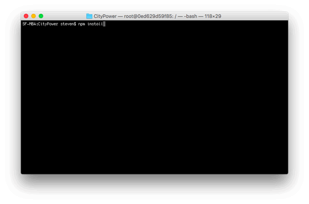

1. Once package restoration completes, open the **start** folder in VSCode

    > If you have added `code` to your command line path you can simply run `code .` from the prompt 

    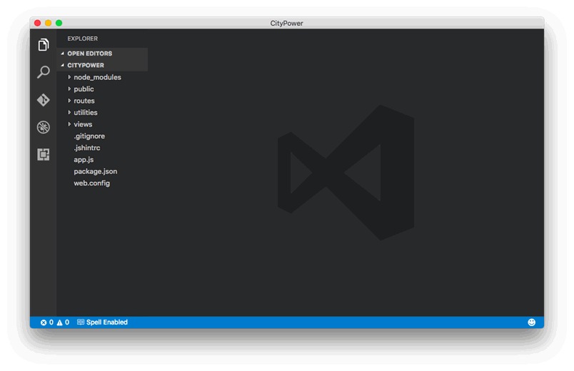

1. Let's run the application in Debug Mode.  Click the Debug icon on the left toolbar, then select the green "start" triangle.  In the Environment dropdown select **Node.js**.  VSCode then scaffolds out the files that it needs for debugging support in a launch.json file, stored at the root of your poject folder in a `.vscode` folder.  Click the green start triangle a second time to launch the application.

    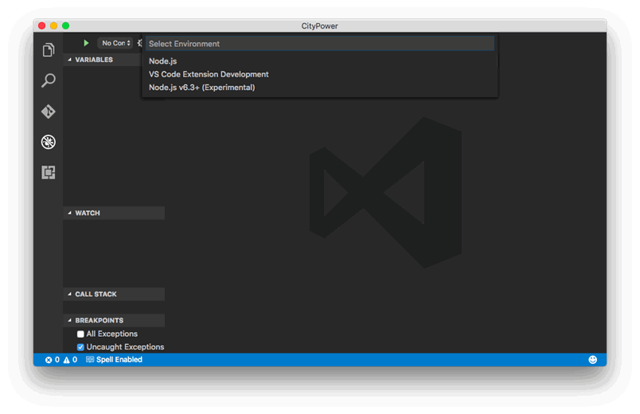 

1. Open a browser and navigate to `http://localhost:3000`. You should now see the running application

    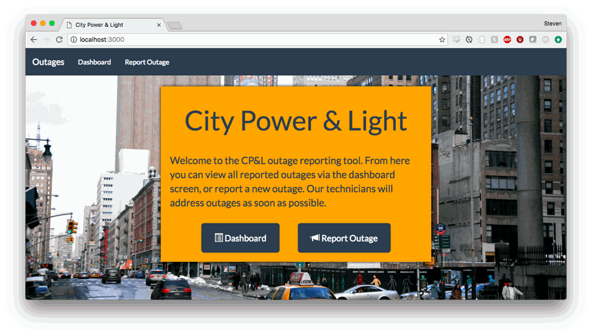

1. On the Dashboard page, notice how the incidents are stubbed in.  

    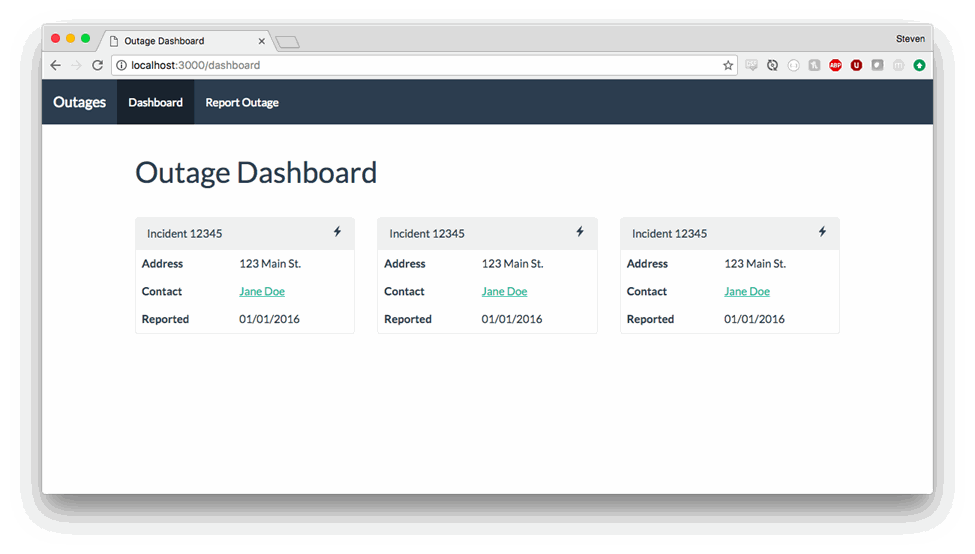

    As part of the original ARM template we deployed an ASP.NET WebAPI that queries a DocumentDB Collection. Let's integrate that API so that the incidents are dynamically pulled from a data store.

1. In the [Azure Portal](https://portal.azure.com) navigate to the resource group that you created with the original ARM template.  Resource Groups can be found on the left hand toolbar -> More Services -> Resource Groups.

    Select the API app that begins with the name **incidentsapi** followed by a random string of characters.

    

1. The window that slides out is called a **blade** and contains information and configuration options for the resource.  

    On the top toolbar, select **Browse** to open the API in a new browser window.

    

    You should be greeted by the default ASP.NET landing page
    

1. Since we provisioned a new instance of DocumentDB, there are not any records to use as sample data.  To generate sample data, our API has a route that can be hit at any time to reset the documents in our collection.  In the browser, add `/incidents/sampledata` to your API's URL to generate sample documents.

    > In Chrome you should see a JSON response directly in the browser tab, however in Internet Explorer you may be asked top Open or Download a file. If prompted, Open the file in Notepad or Visual Studio Code to see the return message

1. After navigating to the sampledata route, let's verify that the documents were created in DocumentDB. In the Azure Portal, navigate to the Resource Group blade and select the DocumentDB resource.

    

    In the left hand navigation, select **Document Explorer**

    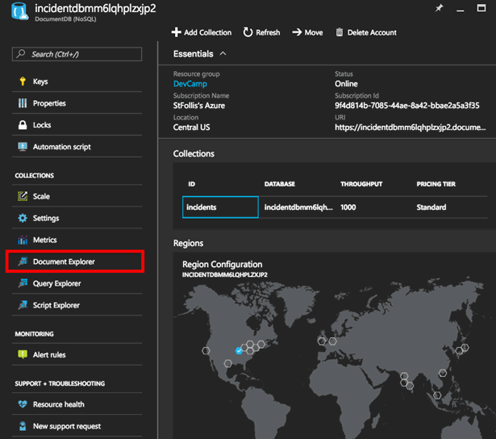

    After the documents load, select the first entry

    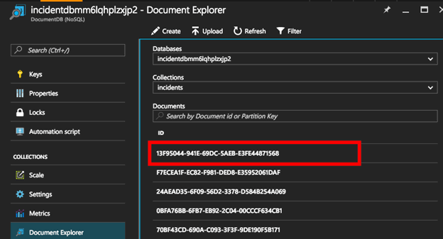

    The Document Explorer is an easy way to view the documents inside of a collection via the browser. Select the first record to see the JSON body of the document.

    

    We can see that several incidents have been created and are now available to the API.

1. Back in VSCode, let's begin integrating the API into our code.  We will need to query the API's endpoint URL, and we have options of where to store that string.  While we could insert it directly into our code, a better practice is to abstract such a configuration setting into an environment variable.  VSCode makes it straightforward to define variables at runtime in the debugging settings.

    Stop the debugger by pressing the red "stop" square, and open the `.vscode/launch.json` file that was previously generated.  Under `configurations` create an `env` object.  This section defines key/value pairs that will be passed into environment variables whenever the debugger is launched. Add an entry for `INCIDENT_API_URL` and set the value to the ASP.NET WebAPI that we earlier loaded into the browser. Do not add a trailing slash.

    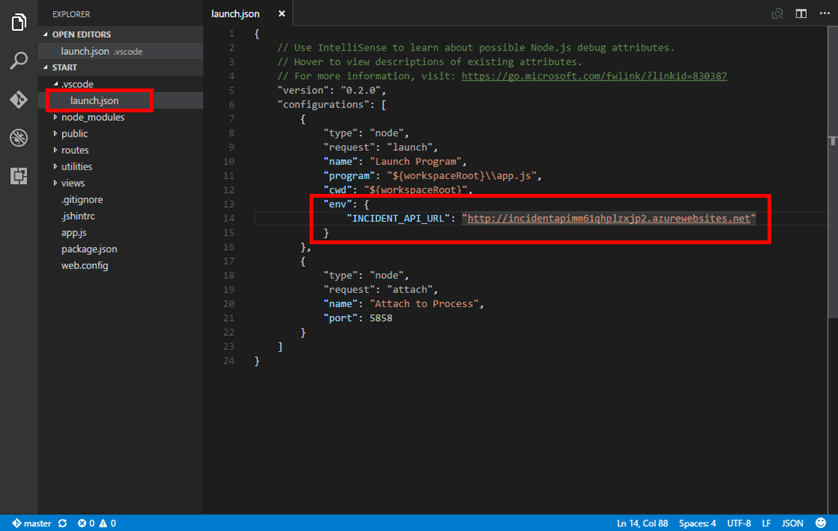

    > Before October 2016 the `env` note was present by default. For [newer versions of VSCode](https://code.visualstudio.com/updates/v1_7#_node-debugging) you will need to manually create the `env: {}` configuration object

    Now that the URL is loaded as an environment variable, we can access it from our application by referencing `process.env.INCIDENT_API_URL`.  We will repeat this process several times to configure our application with Azure services.

    > Our ARM Template already configured an environment variable for the Azure Web App that will soon run our application

1. The dashboard page is handled by the `/routes/dashboard.js` file. Open the file and paste this function at the bottom:

    ```javascript
    function getIncidents() {

        return new Promise(function (resolve, reject) {

            // Define URL to use for the API
            var apiUrl = `${process.env.INCIDENT_API_URL}/incidents`;

            // Make a GET request with the Request library
            request(apiUrl, { json: true }, function (error, results, body) {

                // Resolve the Promise with incident data
                resolve(body);

            });

        });

    }
    ```

    This function uses the popular [request](https://github.com/request/request) library to generate a HTTP GET to the API endpoint. It is also wrapping the call in [JavaScript Promise syntax](https://developer.mozilla.org/en-US/docs/Web/JavaScript/Reference/Global_Objects/Promise) to avoid nested callbacks when consuming the function.

    > Ensure that the version you have locally of Node is recent enough to support Promises. To be safe it is advised to [upgrade](https://nodejs.org/en/) to Node v6

    Next, wrap `res.render()` in our new `getIncidents()` function:

    ```javascript
    // Query the API for incident data
    getIncidents().then(function (incidents) {

        // Render view
        res.render('dashboard', {
            title: 'Outage Dashboard',
            incidents: incidents
        });

    });
    ```

    At the top of the file, add `var request = require('request');` below the other require statements to load the library.

1.  On the command line, execute `npm install request --save` to download the request library and save it to `package.json`.

1. To test if the API returns data, set a breakpoint by clicking in the gap left of the line number containing `resolve(body)`.  Then start the VSCode debugger and open your browser to `http://localhost:3000/dashboard`.

    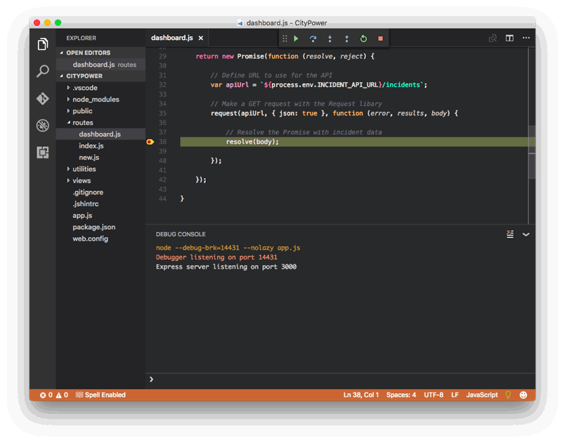

    The breakpoint should be hit as the page loads.  Hover over the `body` parameter to examine the array of returned incidents from the API.  This is the array that will be passed to the view for rendering. Next we need to update our view to accommodate the data.

1. Open `views/dashboard.pug` and replace the template to include incident data:

    ```pug
    extends layout

    block content

        .container

            h1 #{title}

            .row
                if incidents 
                    each incident in incidents
                        .col-sm-4
                            .panel.panel-default
                                .panel-heading Incident #{incident.id.split('-').pop()}
                                    i.glyphicon.glyphicon-flash.pull-right                            
                                table.table
                                    tr
                                        th Address
                                        td #{incident.Street}
                                    tr
                                        th Contact
                                        td
                                            a(href=`tel:${incident.PhoneNumber}`) #{incident.FirstName} #{incident.LastName}
                                    tr
                                        th Reported
                                        td #{moment(incident.Created).format('MM/DD/YYYY')}

    ```
    
    > **Pug** is the same library as **Jade**, [which underwent a rename](https://github.com/pugjs/pug/issues/2184) 

1. With the dashboard route code and the view template updated, run the application via the Debug Tab in VSCode and check the dashboard page.

    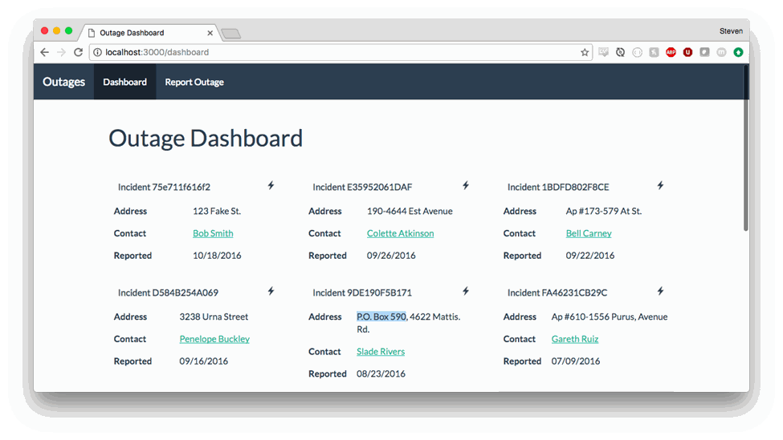

The cards now represent data returned from our API, replacing the static mockup code.

### Exercise 2: Add a caching layer
Querying our API is a big step forward, but querying a cache would increase performance and limit the load on our API.  Azure offers a managed (PaaS) service called [Azure Redis Cache](https://azure.microsoft.com/en-us/services/cache/).

We deployed an instance of Azure Redis Cache in the ARM Template, but need to add application logic
* First, check the cache to see if a set of incidents is available
* If not, query the API
* Cache response from API
* Set cached response to expire after 60 seconds

1. First, let's add our Redis information to local environment variables. In the [Azure Portal](https://portal.azure.com) navigate to the Resource Group and select the Redis instance.

    

    On the Redis blade, note the **Host Name**, then select the **key icon** and note the **Primary Key**.

    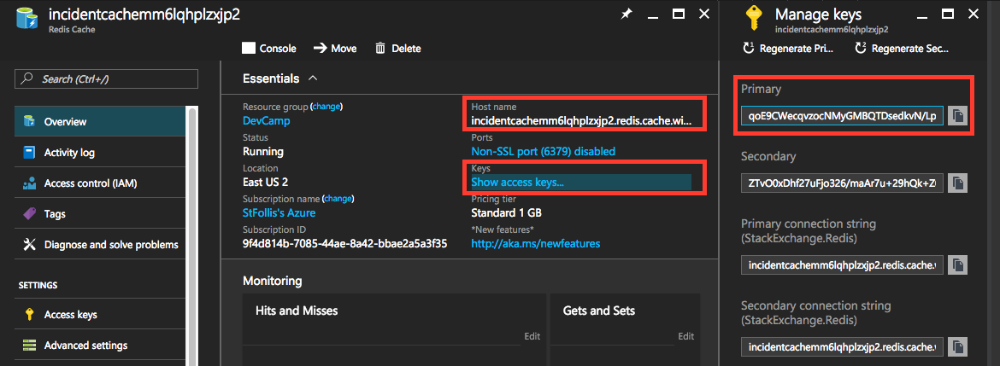

    On the Redis blade, expand **Ports** by clicking on **Non-SSL port (6379) disabled** and note the Non-SSL port of **6379** and SSL Port of **6380**.

    

    In VSCode, open `.vscode/launch.json` and add four variables for `REDISCACHE_HOSTNAME`, `REDISCACHE_PRIMARY_KEY`, `REDISCACHE_PORT`, and `REDISCACHE_SSLPORT`. The values of each were noted previously, and should look similar to:

    ```json
    "env": {
            "NODE_ENV": "development",
            "INCIDENT_API_URL": "http://incidentapimm6lqhplzxjp2.azurewebsites.net",
            "REDISCACHE_HOSTNAME": "incidentcachemm6lqhplzxjp2.redis.cache.windows.net",
            "REDISCACHE_PRIMARY_KEY": "bZcVx7XSRICO+RlKrh2eqvIAFMv0y3i5LQbk91LILSY=",
            "REDISCACHE_PORT": "6379",
            "REDISCACHE_SSLPORT": "6380"
        },
    ``` 

    We will use these variables to configure a Redis client. 

1. From the command line, run `npm install redis --save` to install the Redis library.

1. To create a Redis client, open `routes/dashboard.js` and extend the require statements to include the Redis library:

    ```javascript
    var express = require('express');
    var router = express.Router();
    var request = require('request');

    // Setup Redis Client
    var redis = require("redis");
    var client = redis.createClient(process.env.REDISCACHE_SSLPORT, process.env.REDISCACHE_HOSTNAME, { auth_pass: process.env.REDISCACHE_PRIMARY_KEY, tls: { servername: process.env.REDISCACHE_HOSTNAME } });
    ```
    
1. Our `getIncidents()` function needs to be enhanced.  Replace the existing function with the following, which uses the Redis client to implement the cache logic bullet points from above.

    ```javascript
    function getIncidents() {

        return new Promise(function (resolve, reject) {

            // Check cache for incidentData key
            client.get('incidentData', function (error, reply) {

                if (reply) {
                    // Cached key exists
                    console.log('Cached key found');

                    // Parse results
                    var incidents;
                    if (reply === 'undefined') {
                        // No results, return null
                        incidents = null;
                    }
                    else {
                        incidents = JSON.parse(reply);
                    }

                    // Resolve Promise with incident data
                    resolve(incidents);

                }
                else {
                    // Cached key does not exist
                    console.log('Cached key not found');

                    // Define URL to use for the API
                    var apiUrl = `${process.env.INCIDENT_API_URL}/incidents`;

                    // Make a GET request with the Request libary
                    request(apiUrl, { json: true }, function (error, results, body) {

                        // Store results in cache
                        client.set("incidentData", JSON.stringify(body), 'EX', 60, function (error, reply) {
                            console.log('Stored results in cache');
                        });

                        // Resolve Promise with incident data
                        resolve(body);

                    });

                }

            });

        });

    }
    ```

1. Back in VSCode, the Debug Console should be emitting information about whether the cache was used, or the API was hit directly.

    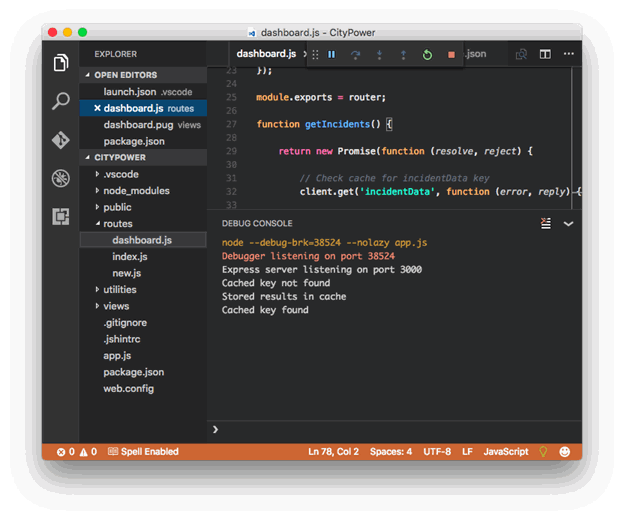

All application requests for the dashboard will now first try to use Azure Redis Cache.  Under high traffic, this will improve page performance and decrease the API's scaling needs.   

### Exercise 3: Write images to Azure Blob Storage

When a new incident is reported, the user can attach a photo.  In this exercise we will process that image and upload it into an Azure Blob Storage Container.

1. The [Azure Storage SDK](https://github.com/Azure/azure-storage-node) looks at environment variables for configuration.  To get the necessary values, open the [Azure Portal](https://portal.azrue.com) and open the Resource Group.  Select the Storage Account beginning with `incidentblobstg`.

    > The other storage accounts are used for diagnostics data and virtual machine disks

    

    Select **Access Keys** and note the **key1** for the storage account.

    

    In VSCode, open `.vscode/launch.json` and add variables. 
    * `AZURE_STORAGE_ACCOUNT` is the name of the Azure Storage Account resource 
    * `AZURE_STORAGE_ACCESS_KEY` is **key1** from the Access Keys blade
    * `AZURE_STORAGE_BLOB_CONTAINER` is the name of the container that will be used. Storage Accounts use containers to group sets of blobs together.  For this demo let's use `images` as the Container name
    * `AZURE_STORAGE_QUEUE` is the name of the queue that will be used to store new messages

    ```json
     "env": {
        "NODE_ENV": "development",
        "INCIDENT_API_URL": "http://incidentapimm6lqhplzxjp2.azurewebsites.net",
        "REDISCACHE_HOSTNAME": "incidentcachemm6lqhplzxjp2.redis.cache.windows.net",
        "REDISCACHE_PRIMARY_KEY": "bZcVx7XSRICO+RlKrh2eqvIAFMv0y3i5LQbk91LILSY=",
        "REDISCACHE_PORT": "6379",
        "REDISCACHE_SSLPORT": "6380",
        "AZURE_STORAGE_ACCOUNT": "incidentblobstgmm6lqhplz",
        "AZURE_STORAGE_ACCESS_KEY": "JP+YcOPBfI58bkmugEHPKKPaM5NLIrq18IBfUfC+0sCsX3V6pSV2a+GU34mD68OoMsiGf79Axu1lHf5pB98Zkw==",
        "AZURE_STORAGE_BLOB_CONTAINER": "images",
        "AZURE_STORAGE_QUEUE": "thumbnails",
    }
    ```

    Now when the SDK fires up it will configure itself with these settings.

1. To better organize our code, let's create a utility file to handle interactions with Azure Storage.  Create `utilities/storage.js` and paste in the following:

    ```javascript
    var fs = require('fs');
    var mime = require('mime');
    var azure = require('azure-storage');

    // Instantiage Blob Storage services
    var blobService = azure.createBlobService();
    var queueService = azure.createQueueService();
    queueService.messageEncoder = new azure.QueueMessageEncoder.TextBase64QueueMessageEncoder();

    module.exports.uploadBlob = function (input) {

        return new Promise(function (resolve, reject) {

            // Define variables to use with the Blob Service
            var stream = fs.createReadStream(input[1].image.path);
            var streamLength = input[1].image.size;
            var options = { contentSettings: { contentType: input[1].image.type } };
            var blobName = input[0] + '.' + mime.extension(input[1].image.type);
            var blobContainerName = process.env.AZURE_STORAGE_BLOB_CONTAINER;

            // Confirm blob container
            blobService.createContainerIfNotExists(blobContainerName, function (containerError) {

                // Upload new blob
                blobService.createBlockBlobFromStream(blobContainerName, blobName, stream, streamLength, options, function (blobError, blob) {

                    // Successfully uploaded the image
                    console.log('Uploaded image');
                    resolve(blob);

                });

            });

        });

    }

    module.exports.createQueueMessage = function (blob) {

        return new Promise(function (resolve, reject) {

            // Create message object
            var message = {
                BlobContainerName: blob.container,
                BlobName: blob.name
            };

            // Confirm queue
            queueService.createQueueIfNotExists(process.env.AZURE_STORAGE_QUEUE, function (error, result, response) {

                // Insert new queue message
                queueService.createMessage(process.env.AZURE_STORAGE_QUEUE, JSON.stringify(message), function (error, result, response) {

                    // Successfully created queue message
                    console.log('Added message to queue');
                    resolve();

                });

            });

        });

    }
    ```

1. With the utility created, let's update `routes/new.js` to handle new incidents. Replace the contents with:

    ```javascript
    var fs = require('fs');
    var express = require('express');
    var router = express.Router();
    var request = require('request');
    var formidable = require('formidable');
    var storageUtility = require('../utilities/storage');

    /* GET new outage */
    router.get('/', function (req, res) {
        res.render('new', {
            title: 'Report an Outage'
        });
    });

    /* POST new outage */
    router.post('/', function (req, res) {

        // Parse a form submission with formidable
        var form = new formidable.IncomingForm();
        form.parse(req, (err, fields, files) => {

            // Process the fields into a new incident, upload image, and add thumbnail queue message
            createIncident(fields, files)
                .then(uploadImage)
                .then(addQueueMessage)
                .then(() => {

                    // Successfully processed form upload
                    // Redirect to dashboard
                    res.redirect('/dashboard');

                });

        });

    });

    function createIncident(fields, files) {

        return new Promise(function (resolve, reject) {

            // Build request object
            var incident = {
                "Description": fields.description,
                "Street": fields.addressStreet,
                "City": fields.addressCity,
                "State": fields.addressState,
                "ZipCode": fields.addressZip,
                "FirstName": fields.firstName,
                "LastName": fields.lastName,
                "PhoneNumber": fields.phone,
                "OutageType": "Outage",
                "IsEmergency": (fields.emergency === "on") ? true : false
            };

            // Get API URL from environment variable
            var apiUrl = `${process.env.INCIDENT_API_URL}/incidents`;

            // POST new incident to API
            request.post(apiUrl, { form: incident, json: true }, function (error, results) {

                // Successfully created a new incident
                console.log('Created incident');

                var incidentId = results.body.id;
                resolve([incidentId, files]);

            });

        });

    }

    function uploadImage(input) {

        return new Promise(function (resolve, reject) {

            // Check if no image was uploaded
            if (input[1].image.size === 0) {
                console.log('No image uploaded');
                resolve();
            }
            else {

                // Use the storage utility to upload a blob to Azure Storage
                storageUtility.uploadBlob(input).then(function (blob) {
                    console.log('Image uploaded');
                    resolve(blob);
                });

            }

        });

    }

    function addQueueMessage(blob) {

        return new Promise(function (resolve, reject) {

            if (blob) {

                storageUtility.createQueueMessage(blob).then(function() {
                    resolve();
                });            

            }
            else {
                console.log('No message to add to the queue');
                resolve();
            }

        });

    }

    module.exports = router;
    ```

    When a new incident comes in, the Formidable library parses the data fields and image. Fields get POSTed to our Incidents API, while the image is uploaded to Blob Storage and a new message is added to our queue.

1. In the terminal, execute a `npm install formidable azure-storage --save` to install the dependencies.

1. Open a browser window and navigate to `http://localhost:3000/new`.  Fill out the form and hit the **Submit** button.

    

    You should be redirected to the Dashboard screen.  

    > It may take up to 60 seconds to see your new entry due to the cache

2. In the Microsoft Azure Storage Explorer, navigate to your Storage Account and ensure that the blob was created.

    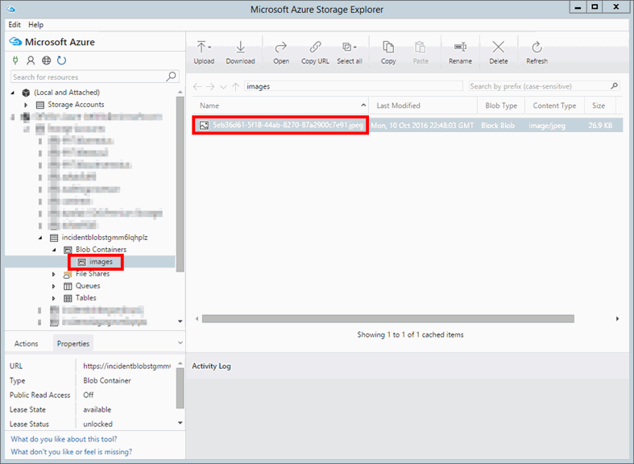

## Summary
Our application started as a prototype on our local machine, but now uses a variety of Azure services.  We started by consuming data from an API hosted in Azure, optimized that data call by introducing Azure Redis Cache, and enabled the uploading of image files to the affordable and redundant Azure Storage. 

Copyright 2016 Microsoft Corporation. All rights reserved. Except where otherwise noted, these materials are licensed under the terms of the MIT License. You may use them according to the license as is most appropriate for your project. The terms of this license can be found at https://opensource.org/licenses/MIT.
