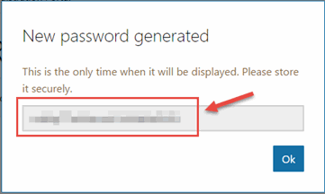

# Hands on Lab - Identity with Azure AD and Office 365 APIs (NodeJS)

## Overview

City Power & Light is a sample application that allows citizens to to report "incidents" that have occurred in their community.  It includes a landing screen, a dashboard, and a form for reporting new incidents with an optional photo.  The application is implemented with several components:

* Front end web application contains the user interface and business logic.  This component has been implemented three times in .NET, NodeJS, and Java.
* WebAPI is shared across the front ends and exposes the backend DocumentDB
* DocumentDB is used as the data persistence layer 

In this lab, you will continue enhancing the City Power & Light application by adding authentication for users powered by [Azure Active Directory](https://azure.microsoft.com/en-us/services/active-directory/).  Once authenticated, you may then query the [Microsoft Office Graph](https://graph.microsoft.io) to retrieve information pertinent to the application.

> This guide use [Visual Studio Code](https://code.visualstudio.com/) for editing, however please feel free to use your editor of choice.  If you are interested in using full Visual Studio + [Node.js Tools for Visual Studio Extension (NTVS)](https://www.visualstudio.com/vs/node-js/), please see [here](https://github.com/Microsoft/nodejstools/wiki/Projects#create-project-from-existing-files) for instructions on wrapping existing code into a VS Project.

## Objectives
In this hands-on lab, you will learn how to:

* Take an anonymous application and add user authentication via AzureAD
* Query data from the Microsoft Graph
* Manipulate data in the Microsoft Graph

## Prerequisites

* The source for the starter app is located in the `HOL\node\azuread-office365\start` folder. 
* The finished project is located in the `HOL\node\azuread-office365\end` folder. 
* Deployed the starter ARM Template
* Completion of the first modern-apps lab

## Exercises

This hands-on-lab has the following exercises:

* Exercise 1: Setup authentication 
* Exercise 2: Create a user profile page
* Exercise 3: Send a confirmation email to the user on incident creation

### Exercise 1: Integrate the API

AzureAD can handle authentication for web applications. First we will create a new application in our AzureAD directory, and then we will extend our application code to work with an authentication flow. 

1. Navigate in a browser to [https://apps.dev.microsoft.com](https://apps.dev.microsoft.com), click the button to **Register your app**, and login with your Azure credentials.

    

1. There are several types of application that can be registered.  For City Power & Light, select **Web Application**

    

1. Provide an application name and contact email address.

    

1. After AzureAD handles the authentication, it needs a route in our application to redirect the user.  For testing locally, we'll use `http://localhost:3000/auth/openid/return` as the **Redirect URI** and as an environment variable named `AAD_RETURN_URL`.  Click the **Create** button. 

    

1. The page then shows some sample code. Scroll down to the bottom and select **Go to settings**

    

1. On the Registration page, take note of the **Application ID**. This will be used as an environment variable named `AAD_CLIENT_ID` and is used to configure the authentication library.  

    We also need to generate a client secret. Select the **Generate New Password** button.

    

1. A key is generated for you. Save this, as you will not be able to retrieve it in the future. This key will become the `AAD_CLIENT_SECRET` environment variable. Click the **Save** button at the bottom of the page.

    

1. In VSCode, let's add those environment variables into `.vscode/launch.json`:

    ```json
    "AAD_RETURN_URL": "http://localhost:3000/auth/openid/return",
    "AAD_CLIENT_ID": "2251bd08-10ff-4ca2-a6a2-ccbf2973c6b6",
    "AAD_CLIENT_SECRET": "JjrKfgDyo5peQ4xJa786e8z"
    ```
1. We have two choices of libraries to handle authentication between our Node application and AzureAD. The first is the [Azure Active Directory Library for NodeJS](https://github.com/AzureAD/azure-activedirectory-library-for-nodejs) (ADAL), and the second leverages [Passport.js](http://passportjs.org/) with the [Azure Active Directory Passport.js Plugin](https://github.com/AzureAD/passport-azure-ad).  For this example, we will use the Passport plugin in a utility file.    

    Create `utility/auth.js` and paste in the following:

    ```javascript
    var passport = require('passport');
    var OIDCStrategy = require('passport-azure-ad').OIDCStrategy;

    var config = {
        creds: {
            returnURL: process.env.AAD_RETURN_URL,
            identityMetadata: 'https://login.microsoftonline.com/common/v2.0/.well-known/openid-configuration', // For using Microsoft you should never need to change this.
            validateIssuer: false,
            clientID: process.env.AAD_CLIENT_ID,
            clientSecret: process.env.AAD_CLIENT_SECRET, // if you are doing a responseType of code or id_token code
            skipUserProfile: true, // for AzureAD should be set to true.
            responseType: 'id_token code', // for login only flows use id_token. For accessing resources use `id_token code`
            responseMode: 'form_post', // For login only flows we should have token passed back to us in a POST
            scope: ['Profile', 'Openid', 'Email', 'User.Read', 'Mail.Send', 'Calendars.ReadWrite'] // additional scopes you may wish to pass
        }
    };

    module.exports.setup = function (app) {

        //   Passport session setup.

        //   To support persistent login sessions, Passport needs to be able to
        //   serialize users into and deserialize users out of the session.  Typically,
        //   this will be as simple as storing the user ID when serializing, and finding
        //   the user by ID when deserializing.
        passport.serializeUser(function (user, done) {
            done(null, user.email);
        });

        passport.deserializeUser(function (id, done) {
            findByEmail(id, function (err, user) {
                done(err, user);
            });
        });

        // array to hold logged in users
        var users = [];

        var findByEmail = function (email, fn) {
            for (var i = 0, len = users.length; i < len; i++) {
                var user = users[i];
                console.log('we are using user: ', user);
                if (user.email === email) {
                    return fn(null, user);
                }
            }
            return fn(null, null);
        };

        //  Use the OIDCStrategy within Passport. 
        // 
        //   Strategies in passport require a `validate` function, which accept
        //   credentials (in this case, an OpenID identifier), and invoke a callback
        //   with a user object.
        passport.use(new OIDCStrategy({
            callbackURL: config.creds.returnURL,
            realm: config.creds.realm,
            clientID: config.creds.clientID,
            clientSecret: config.creds.clientSecret,
            oidcIssuer: config.creds.issuer,
            identityMetadata: config.creds.identityMetadata,
            responseType: config.creds.responseType,
            responseMode: config.creds.responseMode,
            skipUserProfile: config.creds.skipUserProfile,
            scope: config.creds.scope,
            validateIssuer: config.creds.validateIssuer
        },
            function (iss, sub, profile, accessToken, refreshToken, done) {

                console.log(`Email address we received was: ${profile.email}`);
                
                // Add the token to the profile
                // TODO: Add logic for token refreshment
                profile.token = accessToken;
                
                // Asynchronous verification for effect...
                process.nextTick(function () {
                    findByEmail(profile.email, function (err, user) {
                        if (err) {
                            return done(err);
                        }
                        if (!user) {
                            // "Auto-registration"
                            users.push(profile);
                            return done(null, profile);
                        }
                        return done(null, user);
                    });
                });
            
        }

        ));

        //Routes
        app.get('/', function (req, res) {
            res.render('index', { user: req.user });
        });

        app.get('/login',
            passport.authenticate('azuread-openidconnect', { failureRedirect: '/login' }),
            function (req, res) {
                console.log('Login was called in the Sample');
                res.redirect('/');
            });

        //   Our POST routes

        //   POST /auth/openid
        //   Use passport.authenticate() as route middleware to authenticate the
        //   request.  The first step in OpenID authentication will involve redirecting
        //   the user to their OpenID provider.  After authenticating, the OpenID
        //   provider will redirect the user back to this application at
        //   /auth/openid/return
        app.post('/auth/openid',
            passport.authenticate('azuread-openidconnect', { failureRedirect: '/login' }),
            function (req, res) {
                console.log('Authentication was called');
                res.redirect('/');
            });

        // GET /auth/openid/return
        //   Use passport.authenticate() as route middleware to authenticate the
        //   request.  If authentication fails, the user will be redirected back to the
        //   login page.  Otherwise, the primary route function function will be called,
        //   which, in this example, will redirect the user to the home page.
        app.get('/auth/openid/return',
            passport.authenticate('azuread-openidconnect', { failureRedirect: '/login' }),
            function (req, res) {
                res.redirect('/');
            });

        // POST /auth/openid/return
        //   Use passport.authenticate() as route middleware to authenticate the
        //   request.  If authentication fails, the user will be redirected back to the
        //   login page.  Otherwise, the primary route function function will be called,
        //   which, in this example, will redirect the user to the home page.
        app.post('/auth/openid/return',
            passport.authenticate('azuread-openidconnect', { failureRedirect: '/login' }),
            function (req, res) {
                res.redirect('/');
            });

        app.get('/logout', function (req, res) {
            req.logout();
            res.redirect('/');
        });


        // Simple route middleware to ensure user is authenticated.

        //   Use this route middleware on any resource that needs to be protected.  If
        //   the request is authenticated (typically via a persistent login session),
        //   the request will proceed.  Otherwise, the user will be redirected to the
        //   login page.
        function ensureAuthenticated(req, res, next) {
            if (req.isAuthenticated()) { return next(); }
            res.redirect('/login');
        }

    };

    module.exports.ensureAuthenticated = function (req, res, next) {
        if (req.isAuthenticated()) {
            return next();
        }
        res.redirect('/login');
    };
    ```

1. With our authentication utility prepared, open `app.js` and add a require statement for `authHelper` and then call its setup with `authHelper.setup(app)`.  

    > Ensure this call comes after the route declarations, yet before the errors configuration.

    ```javascript
    // Modules
    var express = require('express');
    var experssHelper = require('./utilities/express');
    var errorHelper = require('./utilities/errors');
    var authHelper = require('./utilities/auth');

    // Create Express Application
    var app = express();

    // Configure Locals
    var env = process.env.NODE_ENV || 'development';
    app.locals.moment = require('moment');

    // Configure Express 
    experssHelper.setup(app);

    // Configure Routes
    app.use('/', require('./routes/index'));
    app.use('/dashboard', require('./routes/dashboard'));
    app.use('/new', require('./routes/new'));

    // Configure Authentication
    authHelper.setup(app);

    // Configure Errors
    errorHelper.setup(app);

    // Start Server
    app.set('port', process.env.PORT || 3000);
    var server = app.listen(app.get('port'), function () {
        console.log('Express server listening on port ' + server.address().port);
    });
    ```

1. The Passport middleware adds a `user` object to the `req` object. In order to use this object in our views to display user data, we need to update how we call `res.render()` in each of our routes. 

    For `routes/dashboard.js` and `routes/index.js` find where `res.render()` is called and add an attribute for `user: req.user`. For example, for `dashboard.js` the updated call would look like:

    ```javascript
    // Render view
    res.render('dashboard', {
        title: 'Outage Dashboard',
        incidents: incidents,
        user: req.user
    });
    ```

    Simply piping the user data into our views is useful, but what if we want to make a page in our application only visible to logged in users? To do this we need to check the user's status before loading a route.  Let's make `routes/new.js` a secure page by adding some authentication.  Reference our `authUtility` file, and then pass `authUtility.ensureAuthenticated` into both our `.get` and `.post` routes.  Here's an abbreviated snippet of `routes/new.js`:

    ```javascript
    var fs = require('fs');
    var express = require('express');
    var router = express.Router();
    var request = require('request');
    var formidable = require('formidable');
    var storageUtility = require('../utilities/storage');
    var authUtility = require('../utilities/auth');

    /* GET new outage */
    router.get('/', authUtility.ensureAuthenticated, function (req, res) {
        res.render('new', {
            title: 'Report an Outage'
        });
    });

    /* POST new outage */
    router.post('/', authUtility.ensureAuthenticated, function (req, res) {

        // Parse a form submission with formidable
        var form = new formidable.IncomingForm();
        form.parse(req, (err, fields, files) => {
    ```

    With these edits, each page will receive a `user` object if a user is authenticated, and when the **Report an Outage** page is loaded it will ensure the user is authenticated.  

1. Express needs to use passport for this middleware.  Open `utilities/express.js` and add the following after the Setup View engines block

    Also add a `var passport = require('passport');` to the top of the page

    ```javascript
    var express = require('express');
    var expressSession = require('express-session');
    var bodyParser = require('body-parser');
    var cookieParser = require('cookie-parser');
    var path = require('path');
    var pug = require('pug');
    var passport = require('passport');

    module.exports.setup = function (app) {

        // Setup Express Middleware
        app.use(expressSession({ secret: 'citypower', resave: true, saveUninitialized: false }));
        app.use(bodyParser.json());
        app.use(bodyParser.urlencoded({ extended: true }));
        app.use(cookieParser());
        app.use(express.static(path.join(__dirname, '../public')));

        // Setup View Engine
        app.set('views', path.join(__dirname, '../views'));
        app.set('view engine', 'pug');

        // Configure Passport authentication
        app.use(passport.initialize());
        app.use(passport.session());
        
    };
    ```

1. To install dependencies, run `npm install passport-azure-ad@2.0.3 --save` from the command line.

    > Please ensure you declare the `2.0.3` version, as `3.0.0` has breaking changes with this code

1. Our backend code is taking shape, but we need the user interface to display a **Login** button.  Open up `views/navigation.pug` and remove the commented out blocks of code by deleting the `//-` characters. Now load the application in the browser and you should see the **Login** button on the top navigation.

    

    Click on the link for **Report Outage**. Since you are not currently authenticated, the application redirects you to Azure to provide a username and password.  Sign in, and you will be redirect back to the homescreen with a username in the top right corner. Click the name to dropdown a link for a **Profile** page and to **Sign Out**.  

    

The application now behaves differently for anonymous vs. authenticated users, allowing you the developer flexibility in exposing pieces of your application to anonymous audiences while ensuring sensitive content stays protected.

### Exercise 2: Create a user profile page
Next, we are going to create a page to display information about the logged in user.  While AzureAD returns a name and email address, we can query the Microsoft Graph for extended details about a given user.  We will add a view, a route, and then query the Graph for user information.

1. Create a new file named `views/profile.pug`. Rendered with a set of attributes, we will display a simple table where each row corresponds to an attribute.

    ```pug
    extends layout

    block content

        .container
            h1 User Profile

            if attributes
                table.table.table-striped.table-bordered
                    each key, value in attributes
                        tr
                            th= value
                            td= key
    ```

1. With the view prepped, create a route at `routes/profile.js`.  When the route is loaded, it will query the Microsoft Graph "Me" endpoint.  This query requires a token to be passed in an `authorization` request header, which we grab from the `user` object provided by Passport.

    ```javascript
    var express = require('express');
    var router = express.Router();
    var request = require('request');
    var authUtility = require('../utilities/auth');

    /* GET profile page. */
    router.get('/', authUtility.ensureAuthenticated, function (req, res) {

        // Create options object configuring the HTTP call
        var options = {
            url: 'https://graph.microsoft.com/v1.0/me',
            method: 'GET',
            json: true,
            headers: {
                authorization: 'Bearer ' + req.user.token
            }
        };

        // Query Graph API
        request(options, function (error, results, body) {

            // Render page with returned attributes
            res.render('profile', {
                title: 'Profile',
                user: req.user,
                attributes: body
            });

        });

    });

    module.exports = router;
    ```

1. To add the profile route into Express. open `app.js` and add a route entry below the existing `app.use()` statements 

    ```javascript
    // Configure Routes
    app.use('/', require('./routes/index'));
    app.use('/dashboard', require('./routes/dashboard'));
    app.use('/new', require('./routes/new'));
    app.use('/profile', require('./routes/profile'));
    ```

1. With the view and route created, we can now load `http://localhost:3000/profile` in the browser.

    

We now have a simple visualization of the current user's profile information as loaded from the Microsoft Graph.

### Exercise 3: Interact with the Microsoft Graph
In the previous exercise you read data from the Microsoft Graph, but other endpoints can be used for more sophisticated tasks.  In this exercise we will use the Graph to send an email message whenever a new incident is reported.

1. Create a new file in `utilities/email.js` that will take a recipient and generate a JSON message body for passing into the Graph API. 

    ```javascript
    // https://graph.microsoft.io/en-us/docs/api-reference/v1.0/api/user_post_messages

    // The contents of the outbound email message that will be sent to the user
    var emailContent = `
    <html>

    <head>
    <meta http-equiv='Content-Type' content='text/html; charset=us-ascii\'>
    <title></title>
    </head>

    <body style="font-family:Calibri">
    <div style="width:50%;background-color:#CCC;padding:10px;margin:0 auto;text-align:center;">
        <h1>City Power &amp; Light</h1>
        <h2>New Incident Reported by {{name}}</h2>
        <p>A new incident has been reported to the City Power &amp; Light outage system.</p>   
        <br />
    </div>
    </body>

    </html>
    `;

    /**
    * Returns the outbound email message content with the supplied name populated in the text
    * @param {string} name The proper noun to use when addressing the email
    * @return {string} the formatted email body
    */
    function getEmailContent(name) {
        return emailContent.replace('{{name}}', name);
    }

    /**
    * Wraps the email's message content in the expected [soon-to-deserialized JSON] format
    * @param {string} content the message body of the email message
    * @param {string} recipient the email address to whom this message will be sent
    * @return the message object to send over the wire
    */
    function wrapEmail(content, recipient) {
        var emailAsPayload = {
            Message: {
                Subject: 'New Incident Reported',
                Body: {
                    ContentType: 'HTML',
                    Content: content
                },
                ToRecipients: [
                    {
                        EmailAddress: {
                            Address: recipient
                        }
                    }
                ]
            },
            SaveToSentItems: true
        };
        return emailAsPayload;
    }

    /**
    * Delegating method to wrap the formatted email message into a POST-able object
    * @param {string} name the name used to address the recipient
    * @param {string} recipient the email address to which the connect email will be sent
    */
    function generateMailBody(name, recipient) {
        return wrapEmail(getEmailContent(name), recipient);
    }

    module.exports.generateMailBody = generateMailBody; 
    ```

    > There are [numerous settings](https://graph.microsoft.io/en-us/docs/api-reference/v1.0/api/user_post_messages) you can include in a mail message

1. Extend `routes/new.js` to call our helper by adding a new function after the end of `function uploadImage()` and before the module export statement.

    ```javascript
    function emailConfirmation(user) {

        return new Promise(function (resolve, reject) {

            // Generate email markup
            var mailBody = emailUtility.generateMailBody(user.displayName, user.email);

            // Set configuration options
            var options = {
                url: 'https://graph.microsoft.com/v1.0/me/sendMail',
                json: true,
                method: 'POST',
                headers: {
                    'Authorization': 'Bearer ' + user.token
                },
                body: mailBody
            };

            // POST new message to Graph API
            request(options, function (error, response) {

                console.log('Email confirmation message sent.');
                resolve();

            });

        });

    }

    ```

    Also update the series of chained promises in the original `.post` to include a reference to the new `emailConfirmation` function

    ```javascript
    // Process the fields into a new incident, upload image, and add thumbnail queue message
    createIncident(fields, files)
        .then(uploadImage)
        .then(addQueueMessage)
        .then(emailConfirmation(req.user))
        .then(() => {

            // Successfully processed form upload
            // Redirect to dashboard
            res.redirect('/dashboard');

        });
    ```

    Finally, add a reference at the top of the page for `var emailUtility = require('../utilities/email');`

 1. Load the application in the browser, and create a new incident.  You should soon receive an email in the current user's inbox.

           

Sending this email did not require the setting up of a dedicated email server, but instead leveraged capabilities within the Microsoft Graph.  We could have also created a calendar event, or a task related to the incident for a given user, all via the API.

## Summary
Our application can now bifurcate anonymous and authenticated users to ensure flexibility between public and private data.  We are also able to leverage the Microsoft Graph to not only return the user's extended user profile, but to send email confirmations whenever a new incident is created.

Copyright 2016 Microsoft Corporation. All rights reserved. Except where otherwise noted, these materials are licensed under the terms of the MIT License. You may use them according to the license as is most appropriate for your project. The terms of this license can be found at https://opensource.org/licenses/MIT.