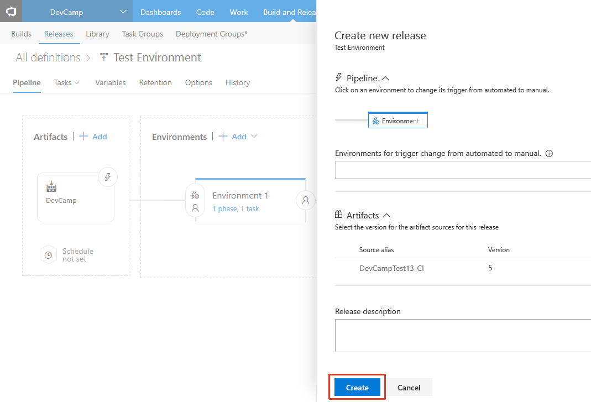

# DevOps with Visual Studio Team Services (NodeJS)

## Overview
In this lab, you will create a Visual Studio Team Services online account, check in your code, create a Continuous Integration pipeline, and test your cloud-based application.

## Objectives
In this hands-on lab, you will learn how to:
* Create a Visual Studio Team Services online account.
* Create a VSTS Git repository.
* Add your code to the VSTS Git repository.
* Create a Continuous Integration pipeline.
* Deploy a built application to an Azure Web App from VSTS.

## Prerequisites

* The source for the starter app is located in the [start](start) folder. 
* There will be no code changes required so the the [end](end) folder will remain empty. 
* Deployed the starter ARM Template [HOL 1](../01-developer-environment).
* Completion of the [HOL 3](../03-azuread-office365).

> **Note**: If you did not complete the previous labs, the project in the [start](start) folder is cumulative. But you need to add the HOL 2 and HOL 3 environment variables.

## Exercises
This hands-on-lab has the following exercises:
* [Exercise 1: Create VSTS online account](#ex1)
* [Exercise 2: Create VSTS Git repository](#ex2)
* [Exercise 3: Add application to VSTS Git](#ex3)
* [Exercise 4: Create a Continuous Integration pipeline](#ex4)
* [Exercise 5: Deploy code to an Azure Web App](#ex5)

---
## Exercise 1: Create VSTS online account<a name="ex1"></a>

1. In your browser, navigate to [https://www.visualstudio.com/](https://www.visualstudio.com/)

    

1. Click `Get started for free` link below `Visual Studio Team Services`.

1. Log in with your Azure AD account.

1. You will be asked to choose an hosting address and if you want to use Git or Team Foundation Version Control. Select `Git` and click `Continue`.

1. A new project called `MyFirstProject` will be automatically created.

---
## Exercise 2: Create VSTS Git repository<a name="ex2"></a>

VSTS gives us the option to use Git or [TFVC](https://www.visualstudio.com/en-us/docs/tfvc/overview) as our project's repository. For this exercise we will use Git, and then clone the repository to our dev machine. 

> Note that if you acquired these lab materials via a `git clone` of the workshop repo then you should select a folder somewhere else on your dev machine. This will minimize conflicts between the two separate repositories.

1. We will ignore the automatically created `MyFirstProject`. Starting at your TFVC account's landing page, click `New Project`.

    

1. Enter a project name such as **DevCamp**, ensure `Version control` is set to `Git` and then click `Create`.

    

1. Wait for the project to be created. This process may take up to 60 seconds. When finished you will be redirected to the project page

1. Click `Dashboards` and explore your pre-built dashboard. Familiarize yourself with the variety of widgets available, and the customization options. 

    

You have now created a project in VSTS with a Git repository. Next we'll clone the repository locally to your developer machine and upload code from our machine to VSTS.

---
## Exercise 3: Add application to VSTS Git<a name="ex3"></a>

1. Click `Code` on the top toolbar to navigate to the Code screen. Then click the `Generate Git Credentials` button to set a user name, alias, and password.

    

1. Next, select the `Copy` icon to copy the HTTPS URL for the repository.

1. In a console window, navigate to a spot on your dev machine and execute a `git clone https://yourrepo.com/DefaultCollection/_git/Repo.git`

    

    Depending on your environment setup you may need to authenticate with VSTS.


1. When we cloned our repository it was empty. Take the code that you have developed in the earlier labs (or the `start` folder bundled with this readme) and paste it into our new directory. This can be done via the command line, or with good old copy/paste in an Explorer or Finder window.

    

    > Depending on how your environment is setup, there may be a hidden folder `.git` in your originating directory. Do **not** copy this folder into the destination directory linked to VSTS.

1. Back in the console, execute a `git status` to ensure the files are picked up by git.

    ```CMD
    git status
    ```

    

1. Execute `git add *` to track the files, then a `git commit -m "initial upload"` to commit the files to the repository. Finally, execute `git push origin master` to push the files up to VSTS.

    ```CMD
    git add *
    git commit -m "initial upload"
    git push origin master
    ```

    

    > You might have to provide information before you can make your first commit. In this case execute these lines with your login data and try again:
    
    ```CMD
    git config --global user.email "your@email.com"
    git config --global user.name "Your name"
    ```

1. In the browser, reload the `Code` page to see the uploaded code:

    

1. Now, any changes you make to the local repository can be pushed up to VSTS. Other team members may also begin interacting with the code base via their own clones and pushes.

    > Note that we did not include the `node_modules` or `.vscode` folders. These components are typically not added to source control, as they bloat the size of the repository. These files should have been excluded from your repository due to settings in the `.gitignore` file.

---
## Exercise 4: Create a Continuous Integration pipeline<a name="ex4"></a>

With application code now uploaded to VSTS, we can begin to create builds via a Build Definition. Navigate to the `Build` tab from the top navigation. We will use the hosted agent within VSTS to process our builds in this exercise.

1. From the `Build & Release` tab, create a new `Build Definition` by clicking the `New Definition` button:

    

1. There are prebuilt definitions for a variety of programming languages and application stacks. For this exercise select `Empty` and click `Apply`:

    

1. The build tasks are created for us as part of the template. 

1. On the `Get sources` step set the `From` value to your VSTS Project and the `Repository` to the repo that was earlier created.

    

1. After the empty Build Definition is created, we need to create a series of Build Steps.

    * Verify NodeJS version installed on the build agent by echoing it to the console.
    * Restore all package dependencies with `npm install`.
    * Package the code assets into a deployable zip file.
    * Publish the zip file as a Publish Artifact that can be consumed by the VSTS Release System.

    Each of these steps will begin by clicking the `Add Task` button.

1.  Add a Build Step for `Command Line`, found under the filter for `Utility`. Click `Add` and then select the newly added task to configure it.

    
    
    * Change the name of the build step to `Echo Node Version`.
    * Change the value `Tool` to `node` and the value `Argument` to `-v`.
    
    

1.  Add a Build Step for `npm`, found under the filter for `Package`. Click `Add` and then select the newly added task to configure it.

    
    
    * Change the name of the build step to `Install Dependencies`.
    * Change the value `Command` to `install`.
    
    

    > If you are using `devDependencies` in your `package.json` and want to control whether or not they are installed, then pass the `--production` flag in the `Argument` field.

1.  Add a Build Step for `Archive`, found under the filter for `Utility`. Click `Add` and then select the newly added task to configure it.

    
    
    In configuration boxes, we can use variables in addition to string literals.
    
    * Configure `Root Folder` to use the directory on the Build Agent that contains our sources files by inserting `$(Build.SourcesDirectory)`. 
    * For `Archive file to create` insert `$(Build.SourcesDirectory)/archive/$(Build.BuildId).zip`. This will dynamically name our zip file of code with the build number.
    * Uncheck the box for `Prefix root folder name to archive paths` to avoid an unnecessary nesting within the .zip file.

    > You can define your own variables to use throughout the Build and Release pipelines by clicking `Variables` in the Build Definition's sub-navigation. Also see [here](https://www.visualstudio.com/docs/build/define/variables) for all pre-defined variables available.
    
    

1. Finally, a Build Step for `Publish Build Artifacts`, found under the filter for `Utility`. Click `Add` and then select the newly added task to configure it. This step outputs a file(s) from our Build Definition as a special "artifact" that can be used in VSTS' Release Definitions.

    
    
    * Change the value `Path to Publish` to `$(Build.SourcesDirectory)/archive/$(Build.BuildId).zip` to target the zip file created in the previous Build Step.
    * Change the value `Artifact Name` to `drop`.
    * Change the value `Artifact Type` to `Server`.

    

1. Click `Save & queue`. Our saved Build Definition is ready to be processed by the Hosted Build Agent..

    
    
    

1. Accept the defaults and click `Queue`. Your build will then be queued until the Hosted Build Agent can pick it up for processing. This typically takes less than 60 seconds to begin.

1. Once your build completes, click each step on the left navigation bar and inspect the output.

    

1. Once your build completes, click each step on the left navigation bar and inspect the output. For `Echo Node Version` we can see the agent's version in the right `Logs` pane.

    

1. Let's inspect the output artifacts that were published. Click the `Build XXX` header in the left pane to view the build's landing page. 

    
    
1. Select `Artifacts` from the horizontal toolbar.

1. A `drop` folder has been created containing the compiled output. Click `Explore` to see them.

1. Expand the `drop` folder and view the build artifacts. Click `Close` when complete.

1. Click `Download` next to the `drop` folder to save the build locally.

1. Unzip `drop.zip` to see the application files created by the build agent (including the restored `node_modules` folder). This artifact will be deployed to an Azure Web App in a later exercise.

    

We now have a Build Definition that will construct our NodeJS application and package it for deployment anytime code is checked into the repository, or a manual build is queued.

---
## Exercise 5: Deploy code to an Azure Web App<a name="ex5"></a>

In the ARM Template that was originally deployed, a web app was created as a development environment to hold a deployed NodeJS application. We will use this web app as a deployment target from VSTS. First, we need to prepare this web app for our application code.

1. Visit the Azure Web App by browsing to the [Azure Portal](http://portal.azure.com), opening the `DevCamp` Resource Group, and select the Azure Web App resource that begins with `nodejsapp` before the random string. 

    

1. Once the blade expands, select `Browse` from the top toolbar:

    

1. A new browser tab will open with a splash screen visible:

    

1. We can deploy our code to this Azure Web App, however it was not configured with our AzureAD details. When trying to authenticate, AzureAD would refuse since it does not know about this domain. 

    To fix this, return to the [Application Registration Portal](https://apps.dev.microsoft.com), login, and open your application settings.

    In the section for `Platforms`, click **Add Url** to add the URL of your Azure Web App from Step 1. Remember to append the `/auth/openid/return` route at the end, since that is the route that will process the return data from AzureAD. Ensure this address is using **https**.

    

    Make sure you click `Save` at the bottom of the screen to add the URL to your AzureAD app.

1. Now that AzureAD is configured, we need to add our AzureAD related environment variables to the Azure Web App. Back in the ***nodejsapp...*** blade where you hit `Browse` earlier, open `Application Settings` from the left navigation.

    Find the `App Settings` section containing a table of settings. In the ARM Template we auto-generated the majority of these settings, however we need to add a few additional environment variables to match the `.vscode/launch.json` file that we have been using locally.

    * `AAD_RETURN_URL` should be set to the same URL that we just configured for our AzureAD application. Should be similar to `https://nodejsapp....azurewebsites.net/auth/openid/return`. Ensure this is using **https**.

    * `AAD_CLIENT_ID` should match the Application ID in the [Application Registration Portal](https://apps.dev.microsoft.com) and similar to `2251bd08-10ff-4ca2-a6a2-ccbf2973c6b6`.

    * `AAD_CLIENT_SECRET` should be the Application Secret generated in the apps portal, and be similar to `JjrKfgDyo5peQ4xJa786e8z`.

    
    
    After you have created the new settings, click `Save`.

1. Now that we have a build being created and a website to deploy into, let's connect them. Back in our VSTS Build Definition, navigate to the `Build & Release` tab.

1. Click on `Releases`.

1. Click the `+ New Definition` button to create a new release definition:

    

1. Select `Empty` and click `Next`.

    

    Next, check the box next to `Continuous deployment` to make sure a new release will be executed whenever a build completes. Click `Create` to complete the process.

    

1. In the release definition screen, click the pencil and rename the release definition to **Cloud Test Release** and change the environment name to **Test Environment**.

    

    Next, click on `Add tasks`.

    In the task catalog, find `Azure App Service Deploy` and click `Add`, and then `Close`.

    

1. Click on the task name `Azure App Service Deploy` to open the attributes for that task. VSTS will need a connection to the Azure subscription that you are deploying the application to.

1. If the drop-down next to `Azure subscription` offers you your subscription, select it, authorize it and continue to select your `nodejsapp...` Azure Web app resource from the `App Service name` drop-down.
 
1. If the drop-down next to `Azure subscription` does not offer you your subscription or the drop-down next to `App Service name` does not offer you your Azure Web app resource (give it a moment after selecting the subscription), click on `Manage` to open a new browser tab holding configuration options.
    
    
    
    1. In the new tab, select `New Service Endpoint` and from the drop-down choose `Azure Resource Manager`.
    
        
    
    1. The modal window should automatically determine your subscription information. Provide a name such as **Azure**, select `OK`, and skip the remaining instructions for this step.

        

    1. However, if your subscription is not in the dropdown list, then VSTS could not automatically configure a Service Principal for your account and you will need to manually create the SP. A Service Principal is similar to a service account, in that it is a separate account within Azure Active Directory that is given permissions to activities in an Azure Subscription (such as the creation or deletion of Azure resources). 

    1. To begin manually creating a Service Principal, click the `here` link at the bottom of the "Add Azure Resource Manager Service Endpoint" modal window.   

        

    1. The window format will change to allow you to enter connection information on your subscription. 

        

    1. For `Connection Name`, enter a value of **Azure**.

    1. The **Subscription ID** is the GUID for your Azure Subscription. This can be found by opening the [Subscriptions Blade](https://portal.azure.com/#blade/Microsoft_Azure_Billing/SubscriptionsBlade) from the Azure Portal, and selecting your subscription. The GUID will be in the Subscription Details blade. Next to the ID is the value for `Subscription Name`. Copy these values back in the Modal Dialog in VSTS.

        

    1. To create a Service Principal, open a terminal window that has the [AzureCLI installed](https://docs.microsoft.com/en-us/azure/xplat-cli-install), and execute `azure ad sp create -n DevCampSP -p Devc@mp2016!`. The returned **Service Principal Name** maps to **Service Principal Client ID** in VSTS.  The password used (`Devc@mp2016!`) maps to the **Service Principal Key** in VSTS. Also take note of the returned **Object ID** value for the next step.

    1. Next, we need to grant the new SP "Contributor" permissions for our Azure subscription. Execute the following command, substituting the content between `<>` for the Object ID returned from the SP creation command, and the Subscription ID returned from the Azure Portal Blade.
    
        ```shell
        azure role assignment create -o Contributor --objectId <Object ID returned in previous step> -c /subscriptions/<Subscription ID GUID retrieved earlier from portal>
        ```

    1. An example command looks like: 

        ```shell
        azure role assignment create -o Contributor --objectId ae5350b5-2346-4509-8184-d83f296d3cac -c /subscriptions/9f4d814b-7085-44ae-0f99-bfh8sf5a3f35
        ```

    1. The **Tenant ID** in VSTS means the GUID of your Azure Active Directory tenant. To find the value, open the [Properties Blade](https://portal.azure.com/#blade/Microsoft_AAD_IAM/ActiveDirectoryMenuBlade/Properties) in the Azure Portal's AAD Blade.

    1. To visualize where each Service Endpoint value is found, please see:
    
        
    
    1. Once each value is filled out, click `Verify Connection` to ensure the values work, then click `OK` to finish creating the Service Endpoint connection to Azure.

        

    > This Service Endpoint pattern is used to connect to a variety of services beyond Azure such as Jenkins, Chef, and Docker.

1. Back on the VSTS Build window, in the Build Step we started earlier, click the `Refresh` icon. The **Azure** connection that we setup should now appear.  Select it. 

    

    Next, for **App Service Name** click the `Refresh` icon, choose the name of the NodeJS Web App. It may take a moment to populate.

    

1. `Save` the Build Definition, supplying a comment if you'd like. Next, click `Release` and `Create Release`:

    

    In the following window, type a description for the release, choose the build that you created earlier, and click `Create`:

    

    You should see a message that your release has been created. Click on the link for `Release-1`.

    
    
    You will see the status for the release:

    
    
    When the release is complete, browse to the deployment website. You should see the same application you tested in the modern-apps lab:

    

    If you make changes to the application and `git push` back to the VSTS server, this will automatically trigger a build and deployment. Try to make a small change to the application and verify that the application is re-deployed to the test environment.

--- 
## Summary

In this hands-on lab, you learned how to:
* Create a Visual Studio Team Services online account that you used for version control of your code, automatic compiling and deploying of your web app.
* Create a VSTS Git repository that you utilized to synchronize your source code on your machine and in the cloud.
* Add your code to the VSTS Git repository.
* Create a Continuous Integration pipeline that you used to automatically compile your application and create packages for deployment anytime code is checked into the repository.
* Deploy a built application to an Azure Web App from VSTS and thus automating the final steps of your deployment process.


After completing this module, you can continue on to Module 5: ARM.

### View instructions for [Module 5 for NodeJS](../05-arm-cd).

---
Copyright 2016 Microsoft Corporation. All rights reserved. Except where otherwise noted, these materials are licensed under the terms of the MIT License. You may use them according to the license as is most appropriate for your project. The terms of this license can be found at https://opensource.org/licenses/MIT.