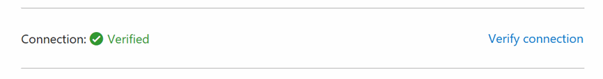
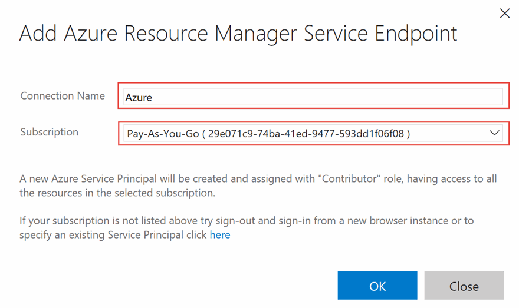

# DevOps with Visual Studio Team Services (NodeJS)

## Overview
In this lab, you will create a Visual Studio Team Services online account, check in your code, create a Continuous Integration pipeline, and test your cloud-based application.

## Objectives
In this hands-on lab, you will learn how to:
* Create a Visual Studio Team Services online account
* Create a VSTS Git repository
* Add your code to the VSTS Git repository
* Create a Continuous Integration pipeline

## Prerequisites

* The source for the starter app is located in the [start](start) folder. 
* There will be no code changes required so the the `end` folder will remain empty. 
* Deployed the starter ARM Template [HOL 1](../01-developer-environment)
* Completion of the [03-azuread-ofice365](../03-azuread-office365)  

## Exercises
This hands-on-lab has the following exercises:
* Exercise 1: Create VSTS online account 
* Exercise 2: Create VSTS Git repository
* Exercise 3: Add application to VSTS Git
* Exercise 4: Create a Continuous Integration pipeline
* Exercise 5: Deploy code to an Azure Web App

---
### Exercise 1: Create VSTS online account

1. In your browser, browser to [https://www.visualstudio.com/team-services/]()

    

1. Log in with your account 

---
## Exercise 2: Create VSTS Git repository

VSTS gives us the option to use Git or [TFVC](https://www.visualstudio.com/en-us/docs/tfvc/overview) as our project's repository.  For this exercise we will use Git, and then clone the repository to our dev machine. 

> Note that if you acquired these lab materials via a `git clone` of the workshop repo then you should select a folder somewhere else on your dev machine. This will minimize conflicts between the two separate repositories 

1. Starting at your account's landing page, locate the section entitle **Recent projects & teams** and click **New**.

    

1. Enter a project name such as **DevCamp**, ensure **Version Control** is set to **Git** and then click **Create Project**.

    

1. Wait for the project to be created. This process may take up to 60 seconds. When finished select the **Navigate to Project** button

    

1. Exit out of the Congratulations window and explore your pre-built dashboard. Familiarize yourself with the variety of widgets available, and the customization options. 

    

1. Click **Code** on the top toolbar to navigate to the Code screen.  Then click the **Generate Git Credentials** button to set a user name, alias, and password.

    

1. Next, select the **Copy** icon to copy the HTTPS URL for the repository.

1. In a console window, navigate to a spot on your dev machine and execute the following (Replace the value for your repo):

    ```CMD
    git clone https://[yourvstsrepo].com/DefaultCollection/_git/Repo.git    
    ```

    

    > Depending on your environment setup you may need to authenticate with VSTS

You have now created a project in VSTS with a Git repository, and cloned the repository locally to your developer machine.  Next we'll upload code from our machine to VSTS.

---
## Exercise 3: Add application to VSTS Git

1. When we cloned our repository it was empty.  Take the code that you have developed in the earlier labs (or the `start` folder bundled with this readme) and paste it into our new directory.  This can be done via the command line, or with good old copy/paste in an Explorer or Finder window.

    

    > Depending on how your environment is setup, there may be a hidden folder `.git` in your originating directory. Do not copy this folder into the destination directory linked to VSTS

1. Back in the console, execute a `git status` to ensure the files are picked up by git.

    ```CMD
    git status    
    ```

    

1. Execute `git add *` to track the files, then a `git commit -m "initial upload"` to commit the files to the repository. Finally, execute `git push origin master` to push the files up to VSTS.

    ```CMD
    git add *
    git commit -m "initial upload"
    git push origin master
    ```

    

1. In the browser, reload the **Code** page to see the uploaded code

    

1. Now, any changes you make to the local repository can be pushed up to VSTS.  Other team members may also begin interacting with the code base via their own clones and pushes.

> Note that we did not include the `node_modules` or `.vscode` folders. These components are typically not added to source control, as they bloat the size of the repository.  These files should have been excluded from your repository due to settings in the `.gitignore` file

---
## Exercise 4: Create a Continuous Integration pipeline

With application code now uploaded to VSTS, we can begin to create builds via a Build Definition.  Navigate to the **Build** tab from he top navigation.  We will use the hosted agent within VSTS to process our builds in this exercise.

1. From the **Build** tab, create a new **Build Definition**

    

1. There are prebuilt definitions for a variety of programming languages and application stacks, however for this exercise select **Empty** and click **Next**

    

1. Confirm the Repository Source is set to your VSTS Project, that the repository is set the repo that was earlier created, and that the Agent Queue is set to **Hosted**.  

1. Check the box next to **Continuous Integration** to automatically run this build anytime code is checked into the repository.

    

1. After the empty Build Definition is created, we need to create a series of Build Steps.

    * Verify NodeJS version installed on the build agent by echoing it to the console
    * Restore all package dependencies with `npm install`
    * Package the code assets into a deployable zip file
    * Publish the zip file as a Publish Artifact that can be consumed by the VSTS Release System

    Each of these steps will begin by clicking the **Add build step** button

    

1.  Add a Build Step for **Command Line**, found under the left-hand filter for **Utility**

    

1. Configure the step **Tool** to `node` and the **Argument** to `-v`

1. Click the pencil icon to name this build step to **Echo Node Version**

    

1. Add a Build Step for **npm**, found under the left-hand filter for **Package**

    

1. Configure **Command** for `install` and name the step **Install Dependencies**

    

    > If you are using `devDependencies` in your `package.json` and want to control whether or not they are installed, then pass the `--production` flag in the **Argument** field  

1. Add a Build Step for **Archive**

    

1. In configuration boxes, we can use variables in addition to string literals.  Configure **Root Folder** to use the directory on the Build Agent that contains our sources files by inserting `$(Build.SourcesDirectory)`. 
    
1. For **Archive file to create** insert `$(Build.SourcesDirectory)/archive/$(Build.BuildId).zip`. This will dynamically name our zip file of code with the build number.

1. Uncheck the box for **Prefix root folder name to archive paths** to avoid an unnecessary nesting within the .zip file.

    

    > You can define your own variables to use throughout the Build and Release pipelines by clicking **Variables** in the Build Definition's sub-navigation. Also see [here](https://www.visualstudio.com/docs/build/define/variables) for all pre-defined variables available 

1. Finally, create a Build Step for **Publish Build Artifacts**.  This step outputs a file(s) from our Build Definition as a special "artifact" that can be used in VSTS' Release Definitions.

    

1. Configure **Path to Publish** as `$(Build.SourcesDirectory)/archive/$(Build.BuildId).zip` to target the zip file created in the previous Build Step.

    > For **Artifact Name** enter `drop`
    >
    > Set **Artifact Type** to `Server`
    >

    

1. Save your Build Definition named **BuildApp**

    

1. Our saved Build Definition is ready to be processed by the Hosted Build Agent.  Click **Queue New Build** to start the build process. 

    

1. Accept the defaults and click **OK**

    

    Your Build will then be queued until the Hosted Build Agent can pick it up for processing.  This typically lasts less than 60 seconds to begin.

1. Once your Build completes, click each step on the left navigation bar and inspect the output.  For **Echo Node Version** we can see the agent's version in the right **Logs** pane

    

1. Let's inspect the output artifacts that were published.  Click the **Build 213** header in the left pane to view the build's landing page.  Then select **Artifacts** from the horizontal toolbar, and **Download** the **drop** artifact.

    

1. Unzip `drop.zip` to see our files (including the restored `node_modules` folder).  This artifact will be deployed to an Azure Web App in a later exercise.

    

We now have a Build Definition that will construct our NodeJS application and package it for deployment anytime code is checked into the repository, or a manual build is queued. 

---
## Exercise 5: Deploy code to an Azure Web App

In the ARM Template that was originally deployed in the lab setup, a web app was created as a development environment to hold a NodeJS application. We will use this web app as a deployment target from VSTS. First, we need to prepare this web app for our application code and then create a Release Definition.

1. Visit the Azure Web App by browsing to the [Azure Portal](http://portal.azure.com), opening the Resource Group, and select the Azure Web App resource that beings **nodejsapp** before the random string. 

    

1. Once the blade expands, select **Browse** from the top toolbar

    

    A new browser tab will open with a splash screen visible

    

1. We can deploy our code to this Azure Web App, however it was not configured with our AzureAD details. When trying to authenticate, AzureAD would refuse since it does not know about this domain. 

    To fix this, return to `https://apps.dev.microsoft.com`, login, and open your application settings. 

    

1. In the section for **Platforms**, click **Add Url** to add the URL of your Azure Web App from Step 1.  Remember to append the `/auth/openid/return` route at the end, since that is the route that will process the return data from AzureAD. Ensure this address is using **https**.

    

1. Make sure you click **Save** at the bottom of the screen to add the URL to your AzureAD app.

1. Now that AzureAD is configured, we need to add our AzureAD related environment variables to the Azure Web App.  Back in the **nodejsapp** blade where you hit **Browse** earlier, open **Application Settings** from the left navigation.

    

1. Find the **App Settings** section containing a table of settings.  In the ARM Template we auto-generated the majority of these settings, however we need to add a few additional environment variables to match the `.vscode/launch.json` file that we have been using locally.

    * **AAD_RETURN_URL** should be set to the same URL that we just configured for our AzureAD application. Should be similar to `https://nodejsappmm6lqhplzxjp2.azurewebsites.net/auth/openid/return`. Ensure this is using **https**.

    * **AAD_CLIENT_ID** should match launch.json and similar to `2251bd08-10ff-4ca2-a6a2-ccbf2973c6b6`

    * **AAD_CLIENT_SECRET** should match launch.json and be similar to `JjrKfgDyo5peQ4xJa786e8z`

    

1. Now that the AzureAD application and the Azure Web App are ready, let's configure VSTS to deploy our built application with a Release Definition. Back in  VSTS, select the **Build & Release** from the top navigation, and click **Releases**. 

    

1. Click the **New definition** button

    

1. Then select the **Empty** template 

    

1. Ensure the **Source** is set to the Build Definition name used in the earlier exercise and that **Queue** is set to the **Hosted** option. Then click **Create** to finish creating the Release Definition

    

1. Click on the Pencil icon next to the Release Definition name and rename it to **ReleaseApp**.  Then click into **Environment 1** and name it **Dev**

    

1. For the newly renamed Dev environment, click **Add tasks** then from the **Deploy** tab on the left navigation choose **Azure App Service Deploy**.

    

    > Make sure to select the step with **RM** in the title, as it uses the newer Azure Resource Manager deployment system

1. VSTS needs a connection to a target Azure Subscription. Click **Manage** to open a new tab holding configuration options.

    

1. In the new tab, select **New Service Endpoint** and from the dropdown choose **Azure Resource Manager**

    

1. The modal window should automatically determine your subscription information.  Provide a name such as **Azure**, select **OK*, and a close the tab.

    

    > If your subscription is not in the dropdown list, click the link at the bottom of the window, and the window 
    > format will change to allow you to enter connection information on your subscription:    

    

1. If you have not created a service principal for the subscription, you will have to follow the 
    [instructions](https://go.microsoft.com/fwlink/?LinkID=623000&clcid=0x409) to do so.  This process will 
    provide the information to enter in this dialog:
1. open [this PowerShell script](https://raw.githubusercontent.com/Microsoft/vso-agent-tasks/master/Tasks/DeployAzureResourceGroup/SPNCreation.ps1) 
    in your browser. Select all the content from the window and copy to the clipboard.
1. open a PowerShell ISE window.  in the text window, paste the PowerShell script from the clipboard.

    

1. Click the green arrow to run the PowerShell script

    

1. The PowerShell script will ask for your **subscription name** and a **password**.  This password is 
    for the service principal only, not the password for your subscription.  So you can use whatever password 
    you would like, just remember it.    

    

1. You will then be asked for your Azure login credentials.  Enter your Azure username and password.  
    The script will print out several values that you will need to enter into the **Add Azure Resource Manager Service Endpoint**
    window.  Copy and paste these values from the PowerShell window:
        Subscription ID
        Subscription Name
        Service Principal Client ID
        Service Principal Key
        Tenant ID

1. Enter a user-friendly name to use when referring to this service endpoint connection.

    

1. Click **Verify connection*, and ensure that the window indicates that the connection was verified. 
    Then Click **OK** and **Close**.

    

    > This pattern is used to connect to a variety of services beyond Azure such as Jenkins, Chef, and Docker

1. Back on the VSTS Build window, in the Build Step we started earlier, click the **Refresh** icon. The **Azure** connection that we setup should now appear.  Select it. 

    

1. Next, for **App Service Name** choose the name of the Node Azure Web App. It may take a moment to populate.

    

1. **Save** the Release Definition, and **Queue a new Build**

    

1. Select the latest completed Build, and then click **Create**

    

1. Click on the **Release 1** link to view details of the release
   
    

1. On the release details screen, click **Logs** from the top toolbar to get details about each release step and following the release progress

    

1. After a successful release you should see the application deployed to your web app

    

---
## Summary

In this hands-on lab, you learned how to:
* Create a Visual Studio Team Services online account
* Create a VSTS Git repository
* Add your code to the VSTS Git repository
* Create a Continuous Integration pipeline
* Deploy a built application to an Azure Web App from VSTS

---
Copyright 2016 Microsoft Corporation. All rights reserved. Except where otherwise noted, these materials are licensed under the terms of the MIT License. You may use them according to the license as is most appropriate for your project. The terms of this license can be found at https://opensource.org/licenses/MIT.