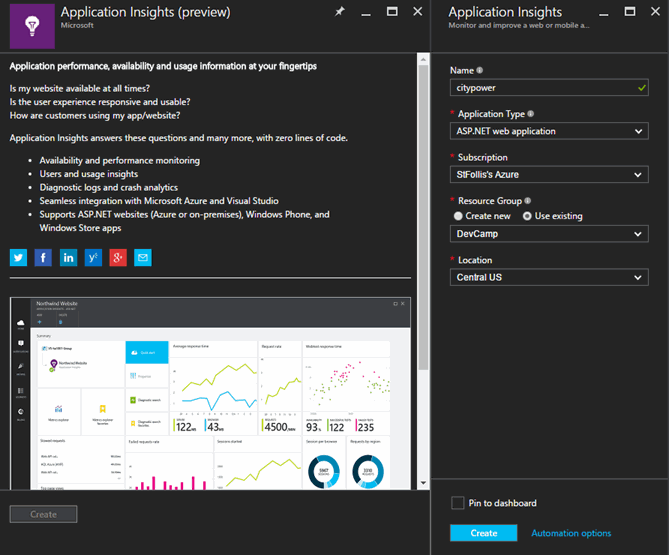
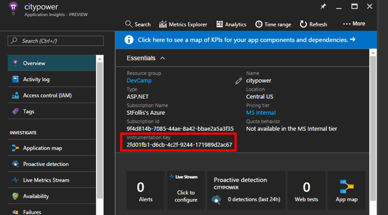
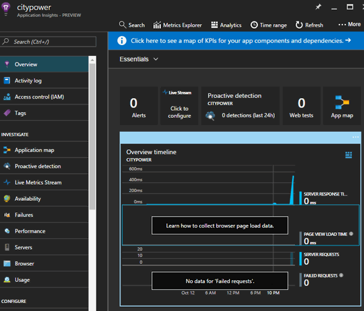
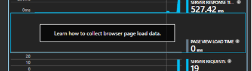
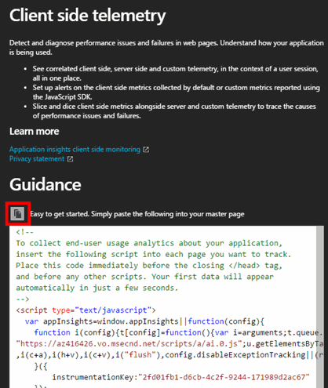
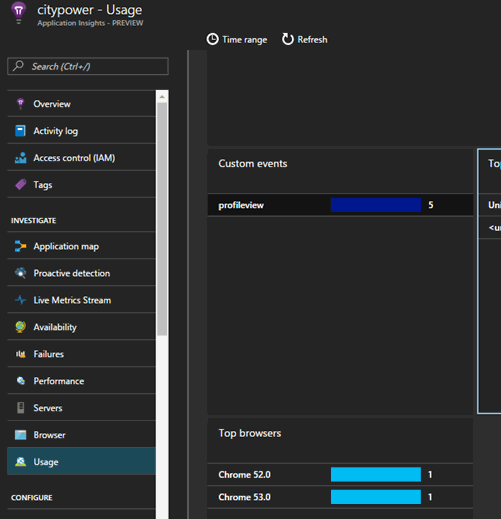
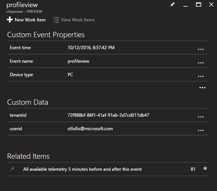

# Monitoring with Application Insights (NodeJS)

## Overview
In this lab, you will create and integrate an instance of Application Insights with your application to provide a 360* view of your app performance. 

## Objectives
In this hands-on lab, you will learn how to:
* Learn to create an Application Insights instance
* Use SDKs to add telemetry to your application
* View performance metrics in the Azure Portal

## Prerequisites

The source for the starter app is located in the [TODO:ADD REF](#) folder. 

## Exercises
This hands-on-lab has the following exercises:
* Exercise 1: Create an Application Insights resource
* Exercise 2: Add server and client side SDK's 
* Exercise 3: Monitor custom events
* Exercise 4: Create a global web test
* Exercise 5: Interact with your telemetry data

### Exercise 1: Create an Application Insights resource

An instance of Application Insights can be created in a variety of ways, including ARM Templates or CLI commands.  For this execise we will use the Azure Portal to create and configure our instance.

1. In a browser, navigate to the [Azure Portal](https://portal.azure.com)

1. Open the Resource Group that was originally deployed.  Click **Add** on the top toolbar to add a new Azure resource to this group.

    

1. Search for `Application Insights` and select the entry from the results list

    

1. In the overview blade that opens, click **Create** to open the creation settings blade. Select a name, configure **Application Type** to `ASP.NET Web Application` and then click the **Create** button. 

    Creation typically takes less than a minute.

    

1. Once provisioning completes, return to your Resource Group and open the resource.

    

1.  In the **Essentials** section, take not of the **Instrumentation Key**.  We will need that in future exercises.

    

We now have an instance of Application Insights created and ready for data.  The Instrumentation Key is important, as it is the link that ties an application to the AI service. 

### Exercise 2: Add server and client side SDK's 

App Insights works with 2 components: 
1. A server side SDK that integrates into the NodeJS processes
2. A snippet of JavaScript sent down to the client's browser to monitor behavior

We will add both components to our application and enable the sending of telemetry into the AppInsights service.

1. Open the application in VSCode. Feel free to use the folder you've been using throughout the hands on labs, or feel free to use the `start` folder. 

1. Microsoft publishes an SDK for AppInsights on NodeJS on [GitHub](https://github.com/Microsoft/ApplicationInsights-node.js).  This SDK can be configured via environment variable, so for consistency let's set a variable for `APPINSIGHTS_INSTRUMENTATIONKEY` equal to the key we noted in Exercise 1.

1. Next, grab the SDK from npm by executing `npm install applicationinsights --save` from the command line. 

1. With the SDK installed we need a utility file to handle its setup. Create a new file in `utilities/appInsights.js` and paste in the following code:

    ```javascript
    var appInsights = require("applicationinsights");
    var client = appInsights.getClient();

    module.export.setup = function (app) {

        console.log('App Insights Key Found. Starting AI');

        // Check if an instrumentation key is configured
        if (process.env.APPINSIGHTS_INSTRUMENTATIONKEY) {

            // Setup the Application Insights client
            // .setup() can be called without an instrumentation key
            // when an environment variable is set
            appInsights.setup().start();

        }

    }

    module.exports.customEvent = function (userid, tenantid) {

        // Use SDK Client to pass custom event    
        client.trackEvent("profileview", { userid: userid, tenantid: tenantid });

    }
    ```

1. Extend `app.js` to use the helper on application initialization by adding a require() statement and by calling `appInsightsHelper.setup()`:

    ```javascript
    // Modules
    var express = require('express');
    var experssHelper = require('./utilities/express');
    var errorHelper = require('./utilities/errors');
    var authHelper = require('./utilities/auth');
    var appInsightsHelper = require('./utilities/appInsights.js');

    // Create Express Application
    var app = express();

    // Configure Application Insights
    appInsightsHelper.setup(app);
    ``` 

1. Run your application and in the navigate around several pages to generate sample telemetry.  

1. Back in the Azure Portal, refresh the browser tab (or click **Refresh** from the top toolbar) until you see data appear.  

    

    > It may take 3-5 minutes for data to appear even when manually refreshing

1. Our server is now sending data, but what about the client side? Let's add the JavaScript library.  

    In the portal, click the tile that says **Learn how to collect browser page load data**    
    
    

1. The next blade with give you a JavaScript snippet pre-loaded with the Instrumentation Key.  This snippet, when place on an HTML page, will download the full Application Insights JavaScript library and configure itself.  Click the clipboard icon to copy the snippet.

    

1. Let's integrate the snippet into our views. Create a new file at `views/appInsights.html` and paste in the snippet.

    ```html
    <!-- 
    To collect end-user usage analytics about your application, 
    insert the following script into each page you want to track.
    Place this code immediately before the closing </head> tag,
    and before any other scripts. Your first data will appear 
    automatically in just a few seconds.
    -->
    <script type="text/javascript">
    var appInsights=window.appInsights||function(config){
        function i(config){t[config]=function(){var i=arguments;t.queue.push(function(){t[config].apply(t,i)})}}var t={config:config},u=document,e=window,o="script",s="AuthenticatedUserContext",h="start",c="stop",l="Track",a=l+"Event",v=l+"Page",y=u.createElement(o),r,f;y.src=config.url||"https://az416426.vo.msecnd.net/scripts/a/ai.0.js";u.getElementsByTagName(o)[0].parentNode.appendChild(y);try{t.cookie=u.cookie}catch(p){}for(t.queue=[],t.version="1.0",r=["Event","Exception","Metric","PageView","Trace","Dependency"];r.length;)i("track"+r.pop());return i("set"+s),i("clear"+s),i(h+a),i(c+a),i(h+v),i(c+v),i("flush"),config.disableExceptionTracking||(r="onerror",i("_"+r),f=e[r],e[r]=function(config,i,u,e,o){var s=f&&f(config,i,u,e,o);return s!==!0&&t["_"+r](config,i,u,e,o),s}),t
        }({
            instrumentationKey:"2fd01fb1-d6cb-4c2f-9244-171989d2ac67"
        });
        
        window.appInsights=appInsights;
        appInsights.trackPageView();
    </script>
    ```

1. Now update `views/layout.pug` with an `include` for the new .html file before the end of the `head` block

    ```pug
    doctype html
    html(lang='en', class={home: home})
    head
        meta(charset='UTF-8')
        meta(http-equiv='X-UA-Compatible', content='IE=edge')
        meta(name='viewport', content='width=device-width, initial-scale=1')

        title= title
        
        // CSS
        block css
        link(rel='stylesheet', href='//ajax.aspnetcdn.com/ajax/bootstrap/3.3.6/css/bootstrap.css')
        link(rel='stylesheet', href='//maxcdn.bootstrapcdn.com/bootswatch/3.3.7/flatly/bootstrap.min.css')
        link(rel='stylesheet', href='/css/main.css')

        // Application Insights
        include appInsights.html

    body

        // Top Navigation
        include navigation.pug

        // Body
        block content

        // JavaScript
        block js
        script(src='//ajax.aspnetcdn.com/ajax/jQuery/jquery-2.2.4.js')
        script(src='//ajax.aspnetcdn.com/ajax/bootstrap/3.3.6/bootstrap.js')

    ```

    > In a real world scenario we may not wish to mix `.html` and `.pug` files in our views, however for a lab it can be difficult to copy/paste/troubleshoot pug snippets

1. Redeploy the application and load several pages to generate more sample telemetry. The Azure Portal should now light up data for **Page View Load Time** 

    

Our application is now providing the Application Insights service telemetry data from both the server and client.

### Exercise 3: Monitor custom events

Up until this point the telemetry provided has been an automatic, out-of-the-box experience.  For custom events we need to use the SDK. Let's create an event where any time a user views their Profile page, we record their name and AzureAD tenant ID.

1. Open `routes/profile.js` and adjust it to use our `appInsightsUtility`

    ```javascript
    var express = require('express');
    var router = express.Router();
    var request = require('request');
    var authUtility = require('../utilities/auth');
    var appInsightsUtility = require('../utilities/appInsights');

    /* GET profile page. */
    router.get('/', authUtility.ensureAuthenticated, function (req, res) {

        // Record User Details with Custom Event
        // Generates the tenant ID and a user ID to send to AppInsights
        appInsightsUtility.customEvent(req.user._json.preferred_username, req.user._json.tid);

        // Create options object configuring the HTTP call
        var options = {
            url: 'https://graph.microsoft.com/v1.0/me',
            method: 'GET',
            json: true,
            headers: {
                authorization: 'Bearer ' + req.user.token
            }
        };

        // Query Graph API
        request(options, function (error, results, body) {

            // Render page with returned attributes
            res.render('profile', {
                title: 'Profile',
                user: req.user,
                attributes: body
            });

        });

    });

    module.exports = router;
    ```

1. Save the file, restart the application, and generate sample telemetry by visiting the profile page, leaving, and returning to the profile page.  In the Azure Portal we can see the data in the **Usage** pane from the left navigation.

     

    Drilling into the metrics explorer we can see our custom data:

    

These custom events (and the related concept of custom metrics) are a powerful way to integrate telemetry into our application and centralize monitoring across multiple application instances.

### Exercise 4: Create a global web test

### Exercise 5: Interact with your telemetry data

## Summary

In this hands-on lab, you learned how to:
* Create a Visual Studio Team Services online account
* Create a VSTS Git repository
* Add your code to the VSTS Git repository
* Create a Continuous Integration pipeline

Copyright 2016 Microsoft Corporation. All rights reserved. Except where otherwise noted, these materials are licensed under the terms of the MIT License. You may use them according to the license as is most appropriate for your project. The terms of this license can be found at https://opensource.org/licenses/MIT.