# Monitoring with Application Insights (NodeJS)

## Overview
In this lab, you will create and integrate an instance of Application Insights with your application to provide a 360° view of your app performance. 

## Objectives
In this hands-on lab, you will learn how to:
* Learn to create an Application Insights instance.
* Use SDKs to add telemetry to your application.
* View performance metrics in the Azure Portal.

## Prerequisites

* The source for the starter app is located in the [start](start) folder. 

## Exercises
This hands-on-lab has the following exercises:
* [Exercise 1: Create an Application Insights resource](#ex1)
* [Exercise 2: Add server and client side SDKs ](#ex2)
* [Exercise 3: Monitor custom events](#ex3)
* [Exercise 4: Create a global web test](#ex4)
* [Exercise 5: Interact with your telemetry data](#ex5)

---
## Exercise 1: Create an Application Insights resource<a name="ex1"></a>

An instance of Application Insights can be created in a variety of ways, including ARM Templates or CLI commands. For this exercise we will use the Azure Portal to create and configure our instance.

1. In a browser, navigate to the [Azure Portal](https://portal.azure.com).

1. Open the Resource Group that was originally deployed. Click `Add` on the top toolbar to add a new Azure resource to this group.

    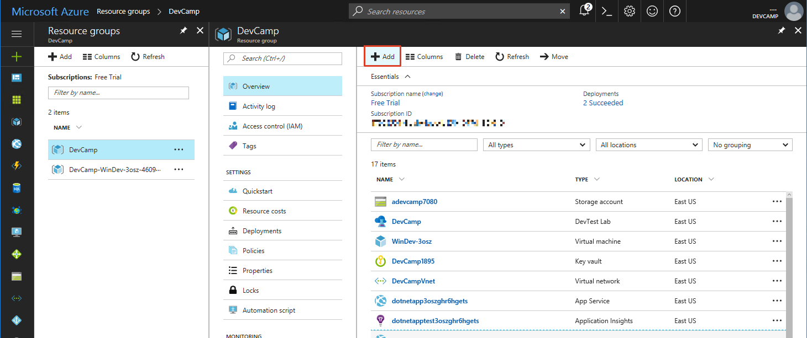

1. Search for `Application Insights` and select the entry from the results list:

    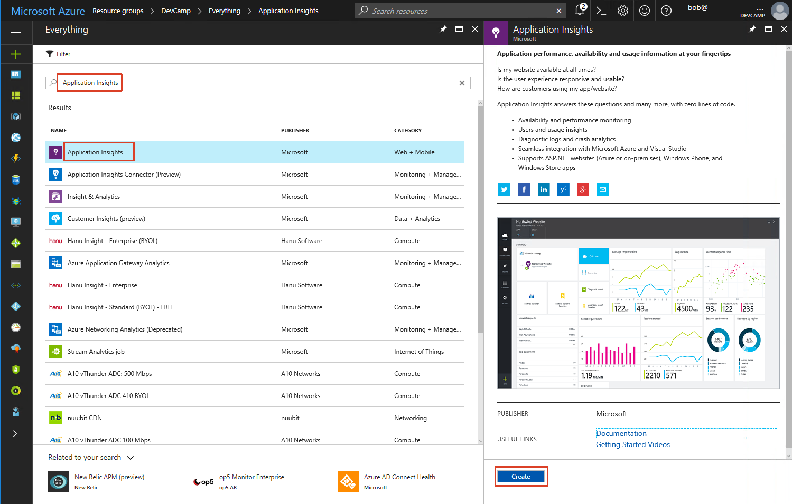

1. In the overview blade that opens, click `Create` to open the creation settings blade. Enter a name, configure `Application Type` to `Java web application` and then click the `Create` button.

    Creation typically takes less than a minute.

    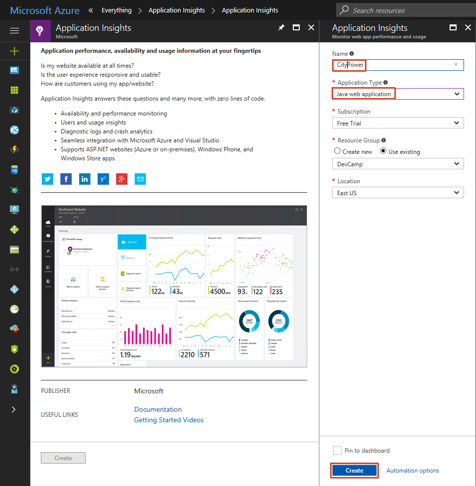

1. Once provisioning completes, return to your Resource Group and open the resource. You may need to hit the refresh button within the resource group blade.

    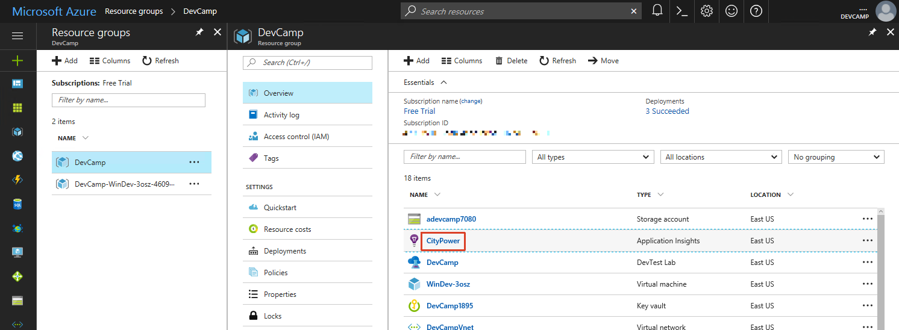

1.  In the `Essentials` section, take note of the `Instrumentation Key`. We will need that in future exercises.

    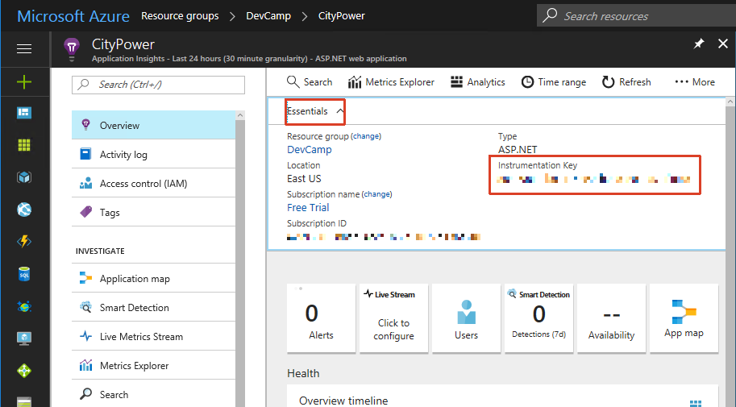

We now have an instance of Application Insights created and ready for data. The Instrumentation Key is important, as it is the link that ties an application to the AI service. 

---
## Exercise 2: Add server and client side SDKs<a name="ex2"></a>

App Insights works with 2 components:
1. A server side SDK that integrates into the NodeJS processes.
2. A snippet of JavaScript sent down to the client's browser to monitor behavior.

We will add both components to our application and enable the sending of telemetry into the AppInsights service.

1. Open the application in VSCode. Feel free to use the folder you've been using throughout the hands on labs, or feel free to use the `start` folder. 

1. Microsoft publishes an SDK for AppInsights on NodeJS on [GitHub](https://github.com/Microsoft/ApplicationInsights-node.js). This SDK can be configured via environment variable, so for consistency let's set a variable for `APPINSIGHTS_INSTRUMENTATIONKEY` equal to the key we noted in Exercise 1. Open 'launch.json' to add the additional variable.

1. Next, grab the SDK from npm by executing `npm install applicationinsights --save` from the command line.

    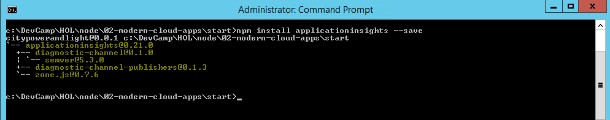

1. With the SDK installed we need a utility file to handle its setup. Create a new file in `utilities/appInsights.js` and paste in the following code:

    ```javascript
    var appInsights = require("applicationinsights");
    var client = appInsights.getClient();

    module.exports.setup = function (app) {

        console.log('App Insights Key Found. Starting AI');

        // Check if an instrumentation key is configured
        if (process.env.APPINSIGHTS_INSTRUMENTATIONKEY) {

            // Setup the Application Insights client
            // .setup() can be called without an instrumentation key
            // when an environment variable is set
            appInsights.setup().start();

        }

    }

    module.exports.customEvent = function (userid, tenantid) {

        // Use SDK Client to pass custom event    
        client.trackEvent("profileview", { userid: userid, tenantid: tenantid });

    }
    ```

1. Extend `app.js` to use the helper on application initialization by adding a require() statement and by calling `appInsightsHelper.setup()`:

    ```javascript
    // Modules
    var express = require('express');
    var experssHelper = require('./utilities/express');
    var errorHelper = require('./utilities/errors');
    var authHelper = require('./utilities/auth');
    var appInsightsHelper = require('./utilities/appInsights.js');

    // Create Express Application
    var app = express();

    // Configure Application Insights
    appInsightsHelper.setup(app);
    ``` 

1. Run your application and in the navigate around several pages to generate sample telemetry.  

1. Back in the Azure Portal, refresh the browser tab (or click `Refresh` from the top toolbar) until you see data appear.

    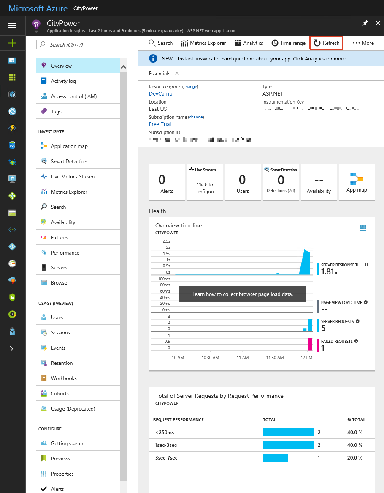

    > It may take 3-5 minutes for data to appear even when manually refreshing.

1. Our server is now sending data, but what about the client side? Let's add the JavaScript library.

    In the portal, click the tile that says `Learn how to collect browser page load data`: 
    
    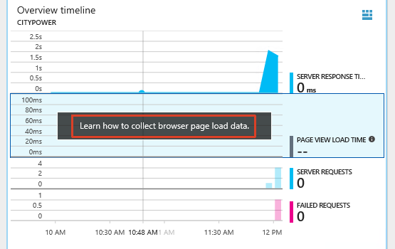

1. The next blade will give you a JavaScript snippet pre-loaded with the Instrumentation Key. This snippet, when placed on an HTML page, will download the full Application Insights JavaScript library and configure itself. Click the clipboard icon to copy the snippet.

    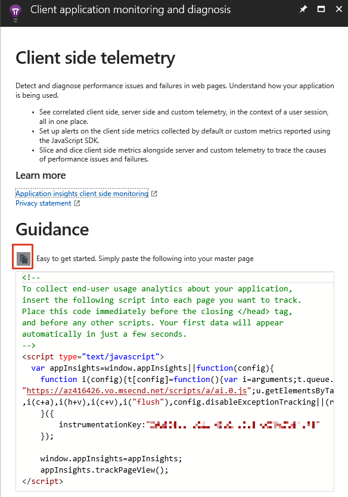

1. Let's integrate the snippet into our web pages. Create a new file at `views/appInsights.html` and paste in the snippet and insert your own instrumentation key.

    ```html
    <!-- 
    To collect end-user usage analytics about your application, 
    insert the following script into each page you want to track.
    Place this code immediately before the closing </head> tag,
    and before any other scripts. Your first data will appear 
    automatically in just a few seconds.
    -->
    <script type="text/javascript">
    var appInsights=window.appInsights||function(config){
        function i(config){t[config]=function(){var i=arguments;t.queue.push(function(){t[config].apply(t,i)})}}var t={config:config},u=document,e=window,o="script",s="AuthenticatedUserContext",h="start",c="stop",l="Track",a=l+"Event",v=l+"Page",y=u.createElement(o),r,f;y.src=config.url||"https://az416426.vo.msecnd.net/scripts/a/ai.0.js";u.getElementsByTagName(o)[0].parentNode.appendChild(y);try{t.cookie=u.cookie}catch(p){}for(t.queue=[],t.version="1.0",r=["Event","Exception","Metric","PageView","Trace","Dependency"];r.length;)i("track"+r.pop());return i("set"+s),i("clear"+s),i(h+a),i(c+a),i(h+v),i(c+v),i("flush"),config.disableExceptionTracking||(r="onerror",i("_"+r),f=e[r],e[r]=function(config,i,u,e,o){var s=f&&f(config,i,u,e,o);return s!==!0&&t["_"+r](config,i,u,e,o),s}),t
        }({
            instrumentationKey:"2fd01fb1-d6cb-4c2f-9244-171989d2ac67"
        });
        
        window.appInsights=appInsights;
        appInsights.trackPageView();
    </script>
    ```

1. Now update `views/layout.pug` with an `include` for the new `appInsights.html` file before the end of the `head` block:

    ```pug
    doctype html
    html(lang='en', class={home: home})
    head
        meta(charset='UTF-8')
        meta(http-equiv='X-UA-Compatible', content='IE=edge')
        meta(name='viewport', content='width=device-width, initial-scale=1')

        title= title
        
        // CSS
        block css
        link(rel='stylesheet', href='//ajax.aspnetcdn.com/ajax/bootstrap/3.3.6/css/bootstrap.css')
        link(rel='stylesheet', href='//maxcdn.bootstrapcdn.com/bootswatch/3.3.7/flatly/bootstrap.min.css')
        link(rel='stylesheet', href='/css/main.css')

        // Application Insights
        include appInsights.html

    body

        // Top Navigation
        include navigation.pug

        // Body
        block content

        // JavaScript
        block js
        script(src='//ajax.aspnetcdn.com/ajax/jQuery/jquery-2.2.4.js')
        script(src='//ajax.aspnetcdn.com/ajax/bootstrap/3.3.6/bootstrap.js')

    ```

    > In a real world scenario we may not wish to mix `.html` and `.pug` files in our views, however for a lab it can be difficult to copy/paste/troubleshoot pug snippets.

1. Redeploy the application and load several pages to generate more sample telemetry. The Azure Portal should now light up data for **Page View Load Time**:

    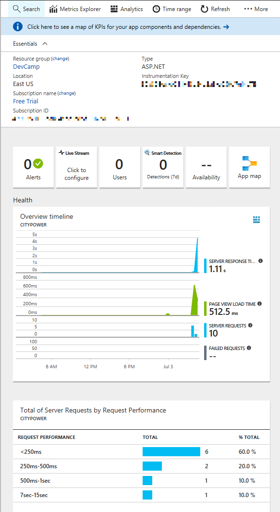

Our application is now providing the Application Insights service telemetry data from both the server and client.

---
## Exercise 3: Monitor custom events<a name="ex3"></a>

Up until this point the telemetry provided has been an automatic, out-of-the-box experience. For custom events we need to use the SDK. Let's create an event where any time a user views their Profile page, we record their name and AzureAD tenant ID.

1. Open `routes/profile.js` and adjust it to use our `appInsightsUtility` by adding the `require` and the `customEvent`:

    ```javascript
    var express = require('express');
    var router = express.Router();
    var request = require('request');
    var authUtility = require('../utilities/auth');
    var appInsightsUtility = require('../utilities/appInsights');

    /* GET profile page. */
    router.get('/', authUtility.ensureAuthenticated, function (req, res) {

        // Record User Details with Custom Event
        // Generates the tenant ID and a user ID to send to AppInsights
        appInsightsUtility.customEvent(req.user._json.preferred_username, req.user._json.tid);

        // Create options object configuring the HTTP call
        var options = {
            url: 'https://graph.microsoft.com/v1.0/me',
            method: 'GET',
            json: true,
            headers: {
                authorization: 'Bearer ' + req.user.token
            }
        };

        // Query Graph API
        request(options, function (error, results, body) {

            // Render page with returned attributes
            res.render('profile', {
                title: 'Profile',
                user: req.user,
                attributes: body
            });

        });

    });

    module.exports = router;
    ```

1. Save the file, restart the application, and generate sample telemetry by visiting the profile page, leaving, and returning to the profile page. In the Azure Portal we can see the data by pressing the `Search` button:

    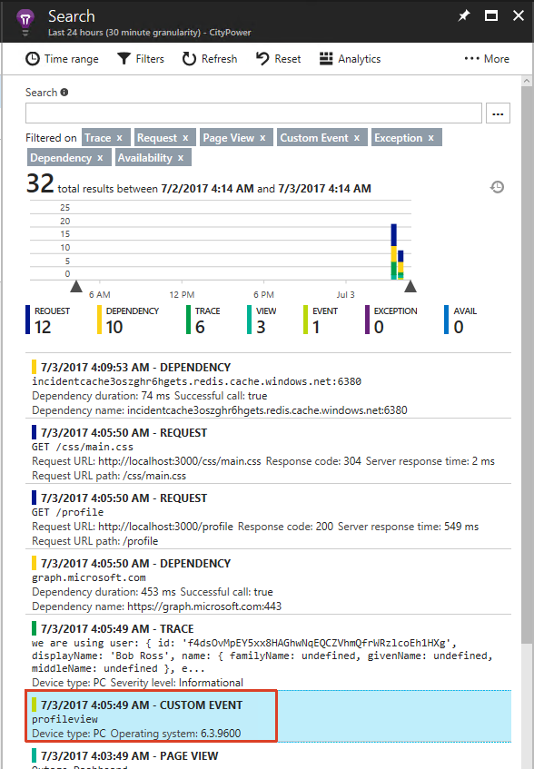 

    Clicking on one of the custom events gives us this:

    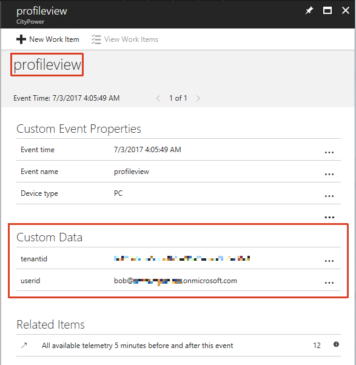

    For exceptions, we get the call stack and more information associated with the event:

    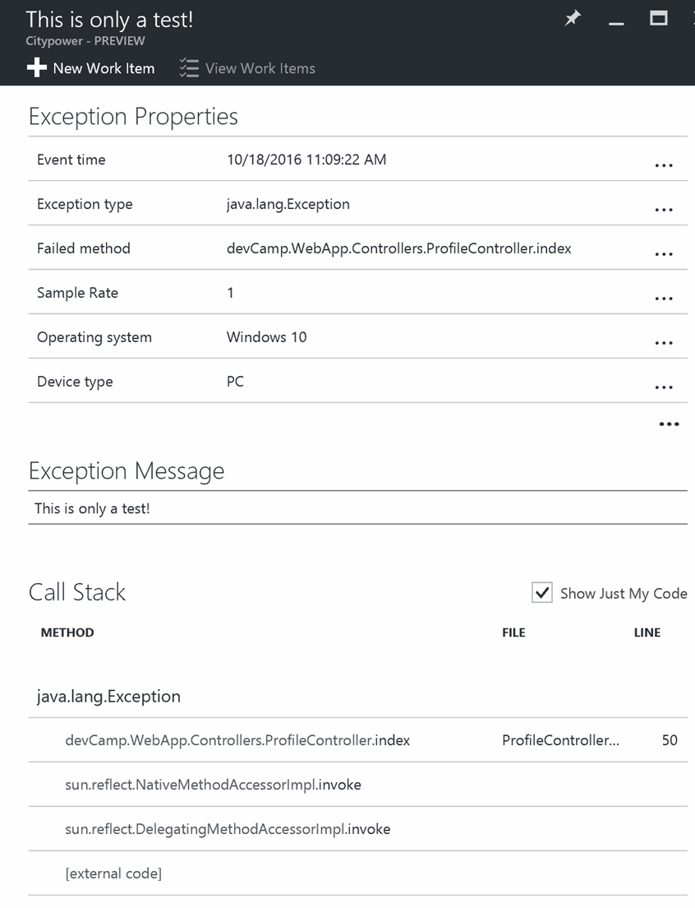

    > ***Note:*** If you do not see your custom events, look at the URL you are redirected to after your sign in. If you are redirected to the Azure hosted instance of your app, update your settings on [https://apps.dev.microsoft.com](https://apps.dev.microsoft.com) to reflect your current debugging environment. Remove the Azure addresses and enter the current port number that Visual Studio uses for debugging.

These custom events (and the related concept of custom metrics) are a powerful way to integrate telemetry into our application and centralize monitoring across multiple application instances.

---
## Exercise 4: Create a global web test<a name="ex4"></a>

Application Insights has the ability to do performance and availability testing of your application from multiple locations around the world, all configured from the Azure portal.  

1. To show the Application Insights availability monitoring capability, we first need to make sure the application is deployed to the Azure App service.  This is done in the [DevOps with Visual Studio Team Services](../04-devops-ci) hands-on-lab. To verify the application is running in the cloud, first go to the Azure portal, open your resource group, and click on the Java app service:

    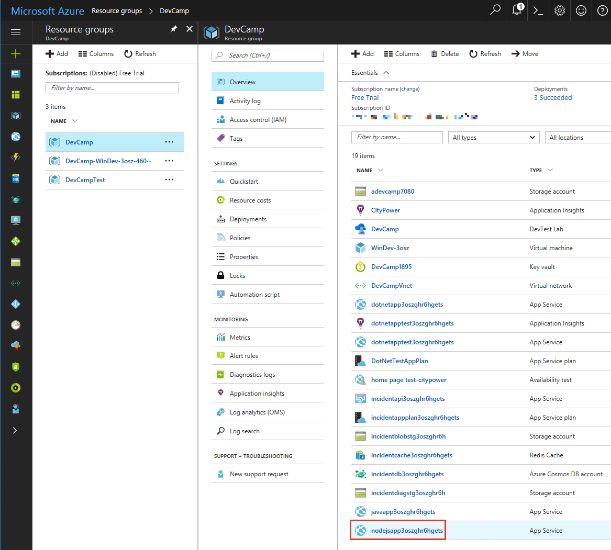

    Then, click the `Browse` link in the App service blade:

    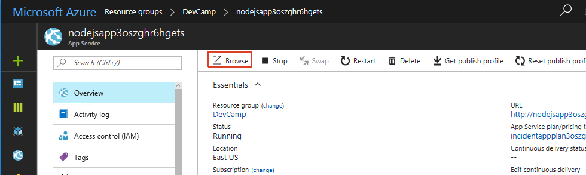

    This should open another window with the City Power and Light application in it. Make note of the URL at the top of the browser.

2. In the Azure portal, click on the City Power Application Insights deployment in your resource group to open its blade. Availability is under `INVESTIGATE` in the scrolling pane - click on it to open the `Availability` tab:

    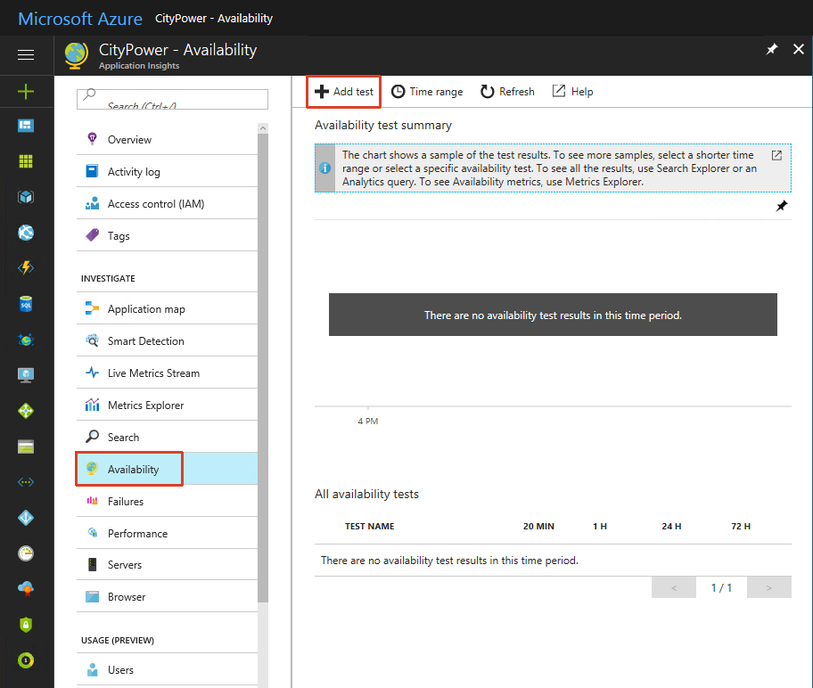

    Click on `Add test`. In the `Create test` blade, give the test a name, put the URL for your application in the URL box, and choose several
    locations to test your application from. You can choose to receive an alert email when the availability test fails by clicking on the `Alerts` box and entering the alert configuration. Click `OK` and `Create`.  

    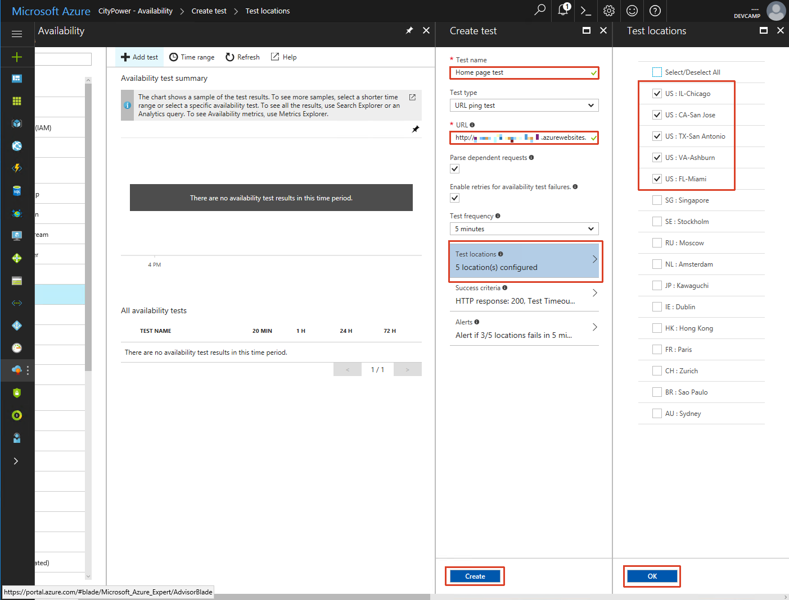

    It may take 5-10 minutes for your web test to start running. When it is executing and collecting data, you should see availability information on the `Availability` tab of the Application Insights blade. You can click on the web test to get more information:

    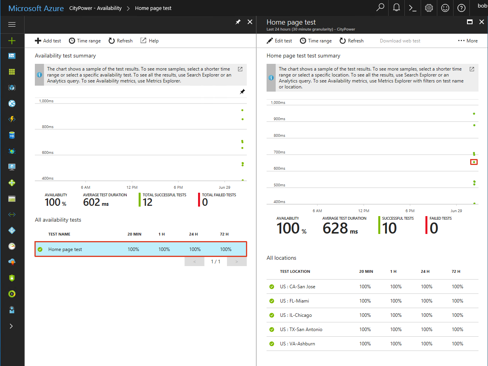

    And clicking on one of the dots on the graph will give you information about that specific test. Clicking on the request will show you the response that was received from your application:

    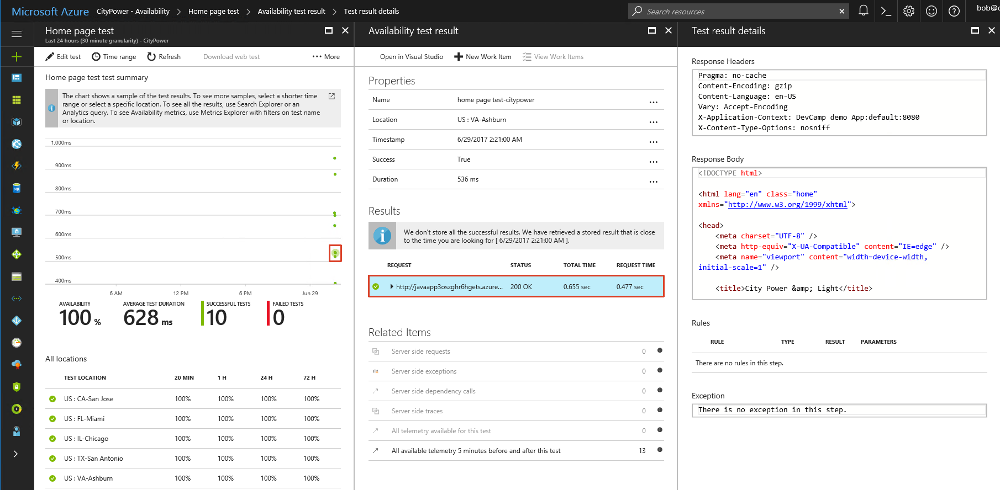

    > With all of this testing, you may exceed the limits of the free service tier for Azure app services. If that occurs, you can click on the App Service, and you'll see a notification that your App Service has been stopped due to it's consumption. All you need to do is change the App service plan to basic, which will start the application again.

---
## Exercise 5: Interact with your telemetry data<a name="ex5"></a>

In the `Metrics Explorer`, you can create charts and grids based on the telemetry data received, and you can relate data points over time. These charts and graphs are very configurable, so you can see the metrics that matter to you.

1. Here is an example of page views vs process CPU and processor time:

    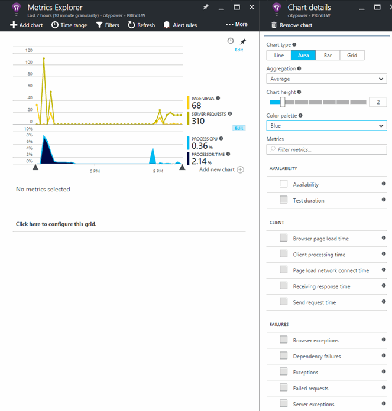

    In `Search` you can see the raw telemetry events, you can filter on the specific events you want to see, and you can drill into more detail on those events. You can also search for properties on the telemetry event. This will be particularly useful when we add logging to the telemetry in Exercise 6. Here is the basic view:

    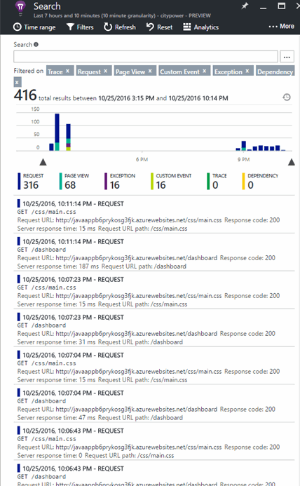
    
    Clicking on one of the events gives you a detail blade for that event:

    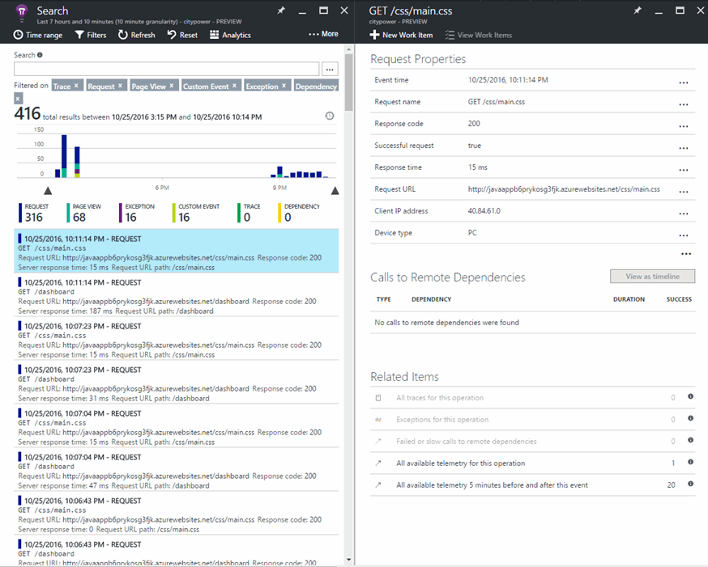

    If there are remote dependencies, such as calls to a database or other resources, those will appear under `Calls to Remote Dependencies`. If there were exceptions, traces or failed calls to dependencies, you could get detail on that under `Related Items`.

1. When we go to `Application map`, we can see a diagram of the monitored items that make up the application:

    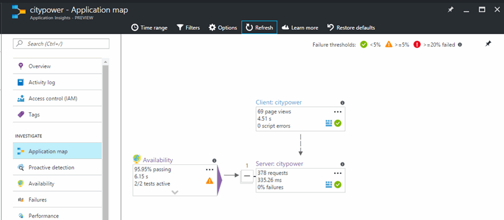

---
## Summary
Azure gives you a complete toolset to monitor the status and performance of your applications. It also allows you to run automated performance tests to easily find weaknesses before you go live with your app.

In this hands-on lab, you learned how to:
* Create an Application Insights instance.
* Use SDKs to add telemetry to your application.
* View performance metrics in the Azure Portal.

---
Copyright 2016 Microsoft Corporation. All rights reserved. Except where otherwise noted, these materials are licensed under the terms of the MIT License. You may use them according to the license as is most appropriate for your project. The terms of this license can be found at https://opensource.org/licenses/MIT.