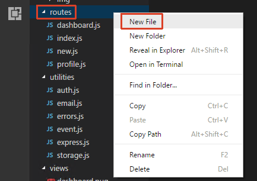
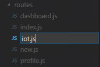
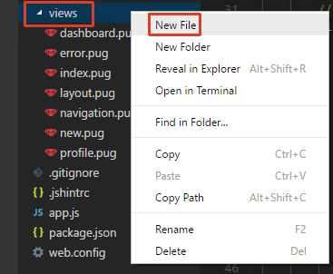
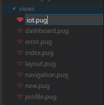
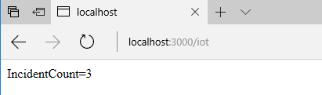

# IoT (NodeJS)

## Overview
City Power & Light is a sample application that allows citizens to report "incidents" that have occurred in their community. It includes a landing screen, a dashboard, and a form for reporting new incidents with an optional photo. The application is implemented with several components:

* Front end web application contains the user interface and business logic. This component has been implemented three times in .NET, NodeJS, and Java.
* WebAPI is shared across the front ends and exposes the backend DocumentDB.
* DocumentDB is used as the data persistence layer.

In this lab, you will combine the web app with an IoT device based on an Arduino board that will query the app for the number of incidents and display the refreshed number every minute.

## Objectives
In this hands-on lab, you will learn how to:
* Set up the developing environment to support the programming of Arduino chips.
* Create your own IoT software from scratch.

## Prerequisites
* The source for the starter app is located in the [start](start) folder. 
* The finished project is located in the [end](end) folder. 
* Deployed the starter ARM Template [HOL 1](../01-developer-environment).
* Completion of the [HOL 5](../05-arm-cd).

## Exercises
This hands-on-lab has the following exercises:
* [Exercise 1: Set up your environment](#ex1)
* [Exercise 2: Create output that will be consumed by the device](#ex2)
* [Exercise 3: Program the device](#ex3)

---
## Exercise 1: Set up your environment<a name="ex1"></a>

To program an Arduino device on your machine you need ..., Visual Studio and ...

1. The easiest way to install ...

You have now installed all the necessary components to start programming an Arduino device on your machine.

---

## Exercise 2: Create output that will be consumed by the device<a name="ex2"></a>

The device will regularly call an URL to fetch the current incident count. We will add a page to our existing web application as an easy way to provide this data.

1. Create a new route. Right-click on `routes` and select `New File`.

    

1. Enter `iot.js` as the new file name.

    

1. The route will just emulate the behavior of the dashboard. Add the following code to the newly created file:

    ```csharp
    var express = require('express');
    var router = express.Router();
    var request = require('request');
    
    // Setup Redis Client
    var redis = require("redis");
    var client = redis.createClient(process.env.REDISCACHE_SSLPORT, process.env.REDISCACHE_HOSTNAME, { auth_pass: process.env.REDISCACHE_PRIMARY_KEY, tls: { servername: process.env.REDISCACHE_HOSTNAME } });
    
    /* GET iot. */
    router.get('/', function (req, res) {
    
        getIncidents().then(function (incidents) {
    
            // Render view
            res.render('iot', {
                title: 'IoT data',
                incidents: incidents,
                user: req.user
            });
    
        });
    
    });
    
    module.exports = router;
    
    function getIncidents() {
    
        return new Promise(function (resolve, reject) {
    
            // Check cache for incidentData key
            client.get('incidentData', function (error, reply) {
    
                if (reply) {
                    // Cached key exists
                    console.log('Cached key found');
    
                    // Parse results
                    var incidents;
                    if (reply === 'undefined') {
                        // No results, return null
                        incidents = null;
                    }
                    else {
                        incidents = JSON.parse(reply);
                    }
    
                    // Resolve Promise with incident data
                    resolve(incidents);
    
                }
                else {
                    // Cached key does not exist
                    console.log('Cached key not found');
    
                    // Define URL to use for the API
                    var apiUrl = `${process.env.INCIDENT_API_URL}/incidents`;
    
                    // Make a GET request with the Request libary
                    request(apiUrl, { json: true }, function (error, results, body) {
    
                        // Store results in cache
                        client.set("incidentData", JSON.stringify(body), 'EX', 60, function (error, reply) {
                            console.log('Stored results in cache');
                        });
    
                        // Resolve Promise with incident data
                        resolve(body);
    
                    });
    
                }
    
            });
    
        });
    
    }

1. Create a new view. Right-click on `views` and select `New File`.

    

1. Enter `iot.pug` as the new file name.

    

1. The view will only display the number of incidents. Add the following code to the newly created file:

    ```code
    |#{incidents.length}

1. Add the route to the new page to the `app.js` file:

    ```csharp
    app.use('/iot', require('./routes/iot'));

1. Start the debugger and add `/iot` to the URL to test the new view. It will contain just the number of incidents.

    

You have now created the data feed for your device.

---
## Exercise 3: Program the device<a name="ex3"></a>

Introduction.
	
1. Exercise.

Summary.

---
## Summary

In this hands-on lab, you learned how to:
* Set up the developing environment to support the programming of Arduino chips.
* Create your own IoT software from scratch.

---
Copyright 2017 Microsoft Corporation. All rights reserved. Except where otherwise noted, these materials are licensed under the terms of the MIT License. You may use them according to the license as is most appropriate for your project. The terms of this license can be found at https://opensource.org/licenses/MIT.