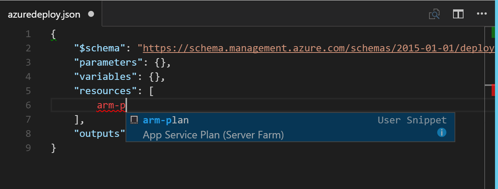
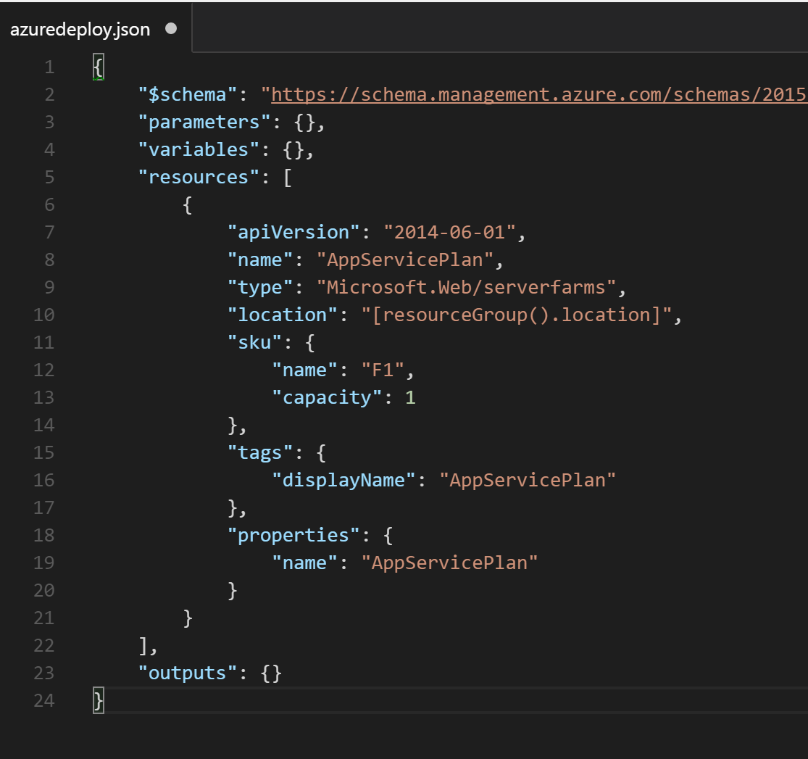
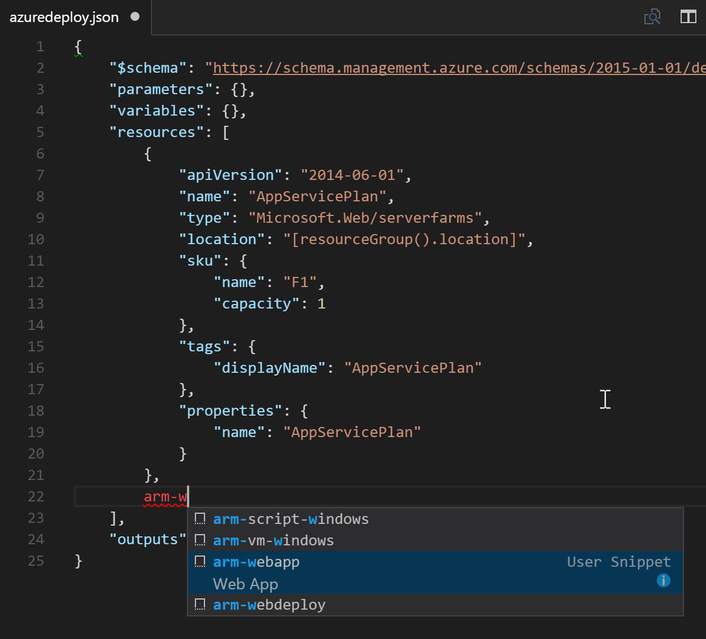
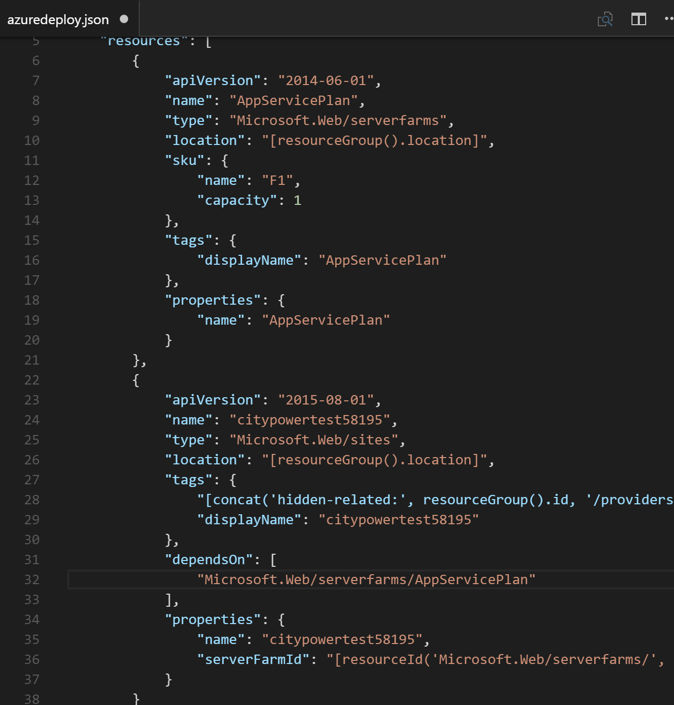

# ARM (NodeJS)

## Overview
In this lab, you will learn to provision and manage resources in Azure with the new Azure Resource Manager.  Then we will deploy our sample application into newly created infrastructure.

## Objectives
In this hands-on lab, you will learn how to:
* Author Azure Resource Manager templates
* Deploy ARM Templates to Azure
* Integrate environments into VSTS Release pipelines

## Prerequisites

The source for the starter app is located in the [TODO:ADD REF](#) folder. 

## Exercises
This hands-on-lab has the following exercises:
* Exercise 1: Create an ARM Template in Visual Studio Code
* Exercise 2: Deploy ARM Template to Azure via the XPlat CLI
* Exercise 3: Integrate new Web App into VSTS
* Exercise 4: Deploy City Power & Light to new Web App

### Exercise 1: Create an ARM Template in Visual Studio Code

Visual Studio Code includes a sizable ecosystem of extensions.  One such extension is the [Azure Resource Manager Tools](https://marketplace.visualstudio.com/items?itemName=msazurermtools.azurerm-vscode-tools).

1. Install the ARM Tools extension in Visual Studio Code by using the [Command Palette](https://code.visualstudio.com/Docs/editor/codebasics#_command-palette).  With VSCode open, press `CTRL` + `P` and enter `ext install azurerm-vscode-tools`.

    

    This extension gives intellisense and schema support for ARM Templates.  
    
1. Next, let's install a pack of code snippets to make creating resources easier. In VS Code, you can open the JSON snippets file by either navigating to **File** -> **Preferences** -> **User Snippets** -> **JSON**, or by selecting F1 and typing `preferences` until you can select **Preferences: Snippets**.

    

    From the options, select **JSON**

    

    The json file that opens can be extended to hold custom snippets.  
    
    
    
    From the [azure-xplat-arm-tooling](https://github.com/Azure/azure-xplat-arm-tooling/) repo, open the [raw snippets file](https://raw.githubusercontent.com/Azure/azure-xplat-arm-tooling/master/VSCode/armsnippets.json) and copy the entire contents to your clipboard.

    Then, paste the contents into VSCode in between the `{}` of the json file. 

    

    Save and close the file. You will now be able to use snippets in the creation of ARM files.

1. Now that we have our tooling setup, open `start/armdeploy.json`. This is a skeleton ARM Template, including the four sections Parameters, Variables, Resources, and Outputs. Click into the brackets next to Resources and create a linebreak.  In the new line, type `arm-p` and select **arm-plan**.  This will create a new App Service Plan, which controls the features and performance of assoicated Azure Web Apps.

    

    Tap the right arrow key, then hit backspace to remove the `1` from the resource name. 

    

    Next to our resource's ending `}` add a `,` and a line break. Then repeat the process above to create a Web App by typing `arm-w` and selecting `arm-webapp`.

     

    This web app name needs to be globally unique, as it will be used for the https://***.azurewebsites.net DNS entry and cannot be the same as an existing webapp.  Use `nodejsapptest` plus 4-5 random characters.

    

### Exercise 2: Deploy ARM Template to Azure via the XPlat CLI

Instructions and screenshots here

Ensure you have [installed](https://azure.microsoft.com/en-us/documentation/articles/xplat-cli-install/#option-1-install-an-npm-package) the Azure XPlat CLI package from NPM and let's deploy a new resource group.

1. From the command line, navigate to the `start` directory containing our ARM Template

    ```
    azure group create -n ExampleResourceGroup -l "West US"
    azure group deployment create -f <PathToTemplate> -e <PathToParameterFile> -g ExampleResourceGroup -n ExampleDeployment
    ```

### Exercise 3: XXX

Instructions and screenshots here

### Exercise 4: XXX

Instructions and screenshots here

## Summary

In this hands-on lab, you learned how to:
* XXX
* XXX
* XXX
* XXX

Copyright 2016 Microsoft Corporation. All rights reserved. Except where otherwise noted, these materials are licensed under the terms of the MIT License. You may use them according to the license as is most appropriate for your project. The terms of this license can be found at https://opensource.org/licenses/MIT.
