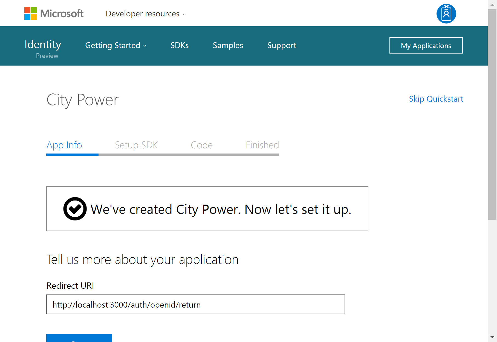
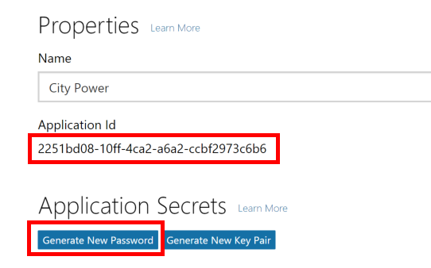

# Hands on Lab - Identity with Azure AD and Office 365 APIs (NodeJS)

## Overview

City Power & Light is a sample application that allows citizens to to report "incidents" that have occured in their community.  It includes a landing screen, a dashboard, and a form for reporting new incidents with an optional photo.  The application is implemented with several components:

* Front end web application contains the user interface and business logic.  This component has been implemented three times in .NET, NodeJS, and Java.
* WebAPI is shared across the front ends and exposes the backend DocumentDB
* DocumentDB is used as the data persistence layer 

In this lab, you will continue enhancing the City Power & Light application by adding authentication for users powered by [Azure Active Direcotry](https://azure.microsoft.com/en-us/services/active-directory/).  Once authenticated, you may then query the [Microsoft Office Graph](https://graph.microsoft.io) to retrieve information pertinent to the aplication.

> This guide use [Visual Studio Code](https://code.visualstudio.com/) for editing, however please feel free to use your editor of choice.  If you are interested in using full Visual Studio + [Node.js Tools for Visual Studio Extension (NTVS)](https://www.visualstudio.com/vs/node-js/), please see [here](https://github.com/Microsoft/nodejstools/wiki/Projects#create-project-from-existing-files) for instructions on wrapping existing code into a VS Project.

## Objectives

In this hands-on lab, you will learn how to:

* Take an anonymous application and add user authentication via AzureAD
* Query data from the Microsoft Graph
* Manipulate data in the Microsoft Graph

## Prerequisites

* The source for the starter app is located in the `HOL\node\modern-cloud-apps\start` folder. 
* The finished project is located in the `HOL\node\modern-cloud-apps\end` folder. 
* Deployed the starter ARM Template

## Exercises

This hands-on-lab has the following exercises:

* Exercise 1: Setup authentication 
* Exercise 2: Create a user profile page
* Exercise 3: Interact with the Microsoft Graph

## Exercise 1: Integrate the API

AzureAD can handle authentication for web applications. First we will create a new application in our AzureAD directory, and then we will extend our application code to work with an authentication flow. 

1. Navigate in a browser to `https://apps.dev.microsoft.com`, click the button to **Register your app**, and login with your Azure credentials.

    

1. There are several types of application that can be registered.  For City Power & Light, select **Web Application**

    

1. Provide an application name and contact email address.

    

1. After AzureAD handles the authentication, it needs a route in our application to redirect the user.  For testing locally, we'll use `http://localhost:3000/auth/openid/return` as the **Redirect URI** and as an environment variable named `AAD_RETURN_URL`.  Click the **Create** button. 

    

1. The page then shows some sample code. Scroll down to the bottom and select **Go to settings**

    

1. On the Registration page, take note of the **Application ID**. This will be used as an environment variable named `AAD_CLIENT_ID` and is used to configure the authentication library.  

    We also need to generate a client secret. Select the **Generate New Password** button.

    

1. A key is generated for you. Save this, as you will not be able to retrieve it in the future. This key will become the `AAD_CLIENT_SECRET` environment variable.

    

1. In VSCode, let's add those environment variables into `.vscode/launch.json`:

    ```json
    "AAD_RETURN_URL": "http://localhost:3000/auth/openid/return",
    "AAD_CLIENT_ID": "2251bd08-10ff-4ca2-a6a2-ccbf2973c6b6",
    "AAD_CLIENT_SECRET": "JjrKfgDyo5peQ4xJa786e8z"
    ```
1. Next, We have two choices of libraries to handle authentication between our Node application and AzureAD. The first is the [Azure Active Directory Library for NodeJS](https://github.com/AzureAD/azure-activedirectory-library-for-nodejs) (ADAL), and the second leverages [Passport.js](http://passportjs.org/) with the [Azure Active Directory Passport.js Plugin](https://github.com/AzureAD/passport-azure-ad).  For this example, we will use the Passport plugin in a utility file.    

    Create `utility/auth.js` and paste in the following:

    ```javascript
    var passport = require('passport');
    var OIDCStrategy = require('passport-azure-ad').OIDCStrategy;

    var config = {
        creds: {
            returnURL: process.env.AAD_RETURN_URL,
            identityMetadata: 'https://login.microsoftonline.com/common/v2.0/.well-known/openid-configuration', // For using Microsoft you should never need to change this.
            validateIssuer: false,
            clientID: process.env.AAD_CLIENT_ID,
            clientSecret: process.env.AAD_CLIENT_SECRET, // if you are doing a responseType of code or id_token code
            skipUserProfile: true, // for AzureAD should be set to true.
            responseType: 'id_token code', // for login only flows use id_token. For accessing resources use `id_token code`
            responseMode: 'form_post', // For login only flows we should have token passed back to us in a POST
            scope: ['User.Read', 'Mail.Send', 'Calendars.ReadWrite'] // additional scopes you may wish to pass
        }
    };

    module.exports.setup = function (app) {

        //   Passport session setup.

        //   To support persistent login sessions, Passport needs to be able to
        //   serialize users into and deserialize users out of the session.  Typically,
        //   this will be as simple as storing the user ID when serializing, and finding
        //   the user by ID when deserializing.
        passport.serializeUser(function (user, done) {
            done(null, user.email);
        });

        passport.deserializeUser(function (id, done) {
            findByEmail(id, function (err, user) {
                done(err, user);
            });
        });

        // array to hold logged in users
        var users = [];

        var findByEmail = function (email, fn) {
            for (var i = 0, len = users.length; i < len; i++) {
                var user = users[i];
                console.log('we are using user: ', user);
                if (user.email === email) {
                    return fn(null, user);
                }
            }
            return fn(null, null);
        };

        //  Use the OIDCStrategy within Passport. 
        // 
        //   Strategies in passport require a `validate` function, which accept
        //   credentials (in this case, an OpenID identifier), and invoke a callback
        //   with a user object.
        passport.use(new OIDCStrategy({
            callbackURL: config.creds.returnURL,
            realm: config.creds.realm,
            clientID: config.creds.clientID,
            clientSecret: config.creds.clientSecret,
            oidcIssuer: config.creds.issuer,
            identityMetadata: config.creds.identityMetadata,
            responseType: config.creds.responseType,
            responseMode: config.creds.responseMode,
            skipUserProfile: config.creds.skipUserProfile,
            scope: config.creds.scope,
            validateIssuer: config.creds.validateIssuer
        },
            function (iss, sub, profile, accessToken, refreshToken, done) {

                console.log(`Email address we received was: ${profile.email}`);
                
                // Add the token to the profile
                // TODO: Add logic for token refreshment
                profile.token = accessToken;
                
                // Asynchronous verification for effect...
                process.nextTick(function () {
                    findByEmail(profile.email, function (err, user) {
                        if (err) {
                            return done(err);
                        }
                        if (!user) {
                            // "Auto-registration"
                            users.push(profile);
                            return done(null, profile);
                        }
                        return done(null, user);
                    });
                });
            
        }

        ));

        //Routes
        app.get('/', function (req, res) {
            res.render('index', { user: req.user });
        });

        app.get('/login',
            passport.authenticate('azuread-openidconnect', { failureRedirect: '/login' }),
            function (req, res) {
                console.log('Login was called in the Sample');
                res.redirect('/');
            });

        //   Our POST routes

        //   POST /auth/openid
        //   Use passport.authenticate() as route middleware to authenticate the
        //   request.  The first step in OpenID authentication will involve redirecting
        //   the user to their OpenID provider.  After authenticating, the OpenID
        //   provider will redirect the user back to this application at
        //   /auth/openid/return
        app.post('/auth/openid',
            passport.authenticate('azuread-openidconnect', { failureRedirect: '/login' }),
            function (req, res) {
                console.log('Authentication was called');
                res.redirect('/');
            });

        // GET /auth/openid/return
        //   Use passport.authenticate() as route middleware to authenticate the
        //   request.  If authentication fails, the user will be redirected back to the
        //   login page.  Otherwise, the primary route function function will be called,
        //   which, in this example, will redirect the user to the home page.
        app.get('/auth/openid/return',
            passport.authenticate('azuread-openidconnect', { failureRedirect: '/login' }),
            function (req, res) {
                res.redirect('/');
            });

        // POST /auth/openid/return
        //   Use passport.authenticate() as route middleware to authenticate the
        //   request.  If authentication fails, the user will be redirected back to the
        //   login page.  Otherwise, the primary route function function will be called,
        //   which, in this example, will redirect the user to the home page.
        app.post('/auth/openid/return',
            passport.authenticate('azuread-openidconnect', { failureRedirect: '/login' }),
            function (req, res) {
                res.redirect('/');
            });

        app.get('/logout', function (req, res) {
            req.logout();
            res.redirect('/');
        });


        // Simple route middleware to ensure user is authenticated.

        //   Use this route middleware on any resource that needs to be protected.  If
        //   the request is authenticated (typically via a persistent login session),
        //   the request will proceed.  Otherwise, the user will be redirected to the
        //   login page.
        function ensureAuthenticated(req, res, next) {
            if (req.isAuthenticated()) { return next(); }
            res.redirect('/login');
        }

    };

    module.exports.ensureAuthenticated = function (req, res, next) {
        if (req.isAuthenticated()) {
            return next();
        }
        res.redirect('/login');
    };
    ```

1. With our authentication utility prepared, open `app.js` and add a require statement for `authHelper` and then call its setup with `authHelper.setup(app)`.  

    > Ensure this call comes after the route declarations, yet before the errors configuration.

    ```javascript
    // Modules
    var express = require('express');
    var experssHelper = require('./utilities/express');
    var errorHelper = require('./utilities/errors');
    var authHelper = require('./utilities/auth');

    // Create Express Application
    var app = express();

    // Configure Locals
    var env = process.env.NODE_ENV || 'development';
    app.locals.moment = require('moment');

    // Configure Express 
    experssHelper.setup(app);

    // Configure Routes
    app.use('/', require('./routes/index'));
    app.use('/dashboard', require('./routes/dashboard'));
    app.use('/new', require('./routes/new'));

    // Configure Authentication
    authHelper.setup(app);

    // Configure Errors
    errorHelper.setup(app);

    // Start Server
    app.set('port', process.env.PORT || 3000);
    var server = app.listen(app.get('port'), function () {
        console.log('Express server listening on port ' + server.address().port);
    });
    ```

1. To install dependencies, run an `npm install passport passport-azure-ad --save` from the command line.

1. Our backend code is taking shape, but we need the user interface to display a **Login** button.  Open up `views/navigation.pug` and remove the commented out blocks of code by deleting the `//-` characters.

## Summary
Our application started as a prototype on our local machine, but now uses a variety of Azure services.  We started by consuming data from an API hosted in Azure, optimized that data call by introducing Azure Redis Cache, and enabled the uploading of image files to the affordable and redundant Azure Storage. 